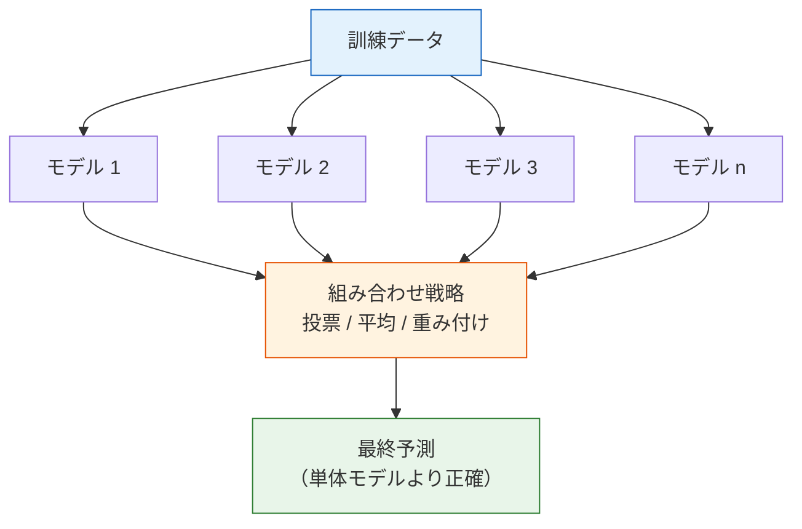
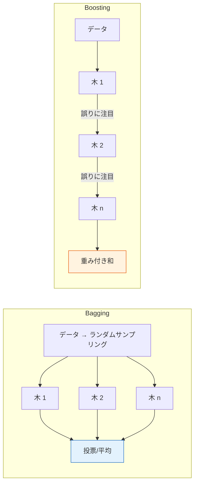
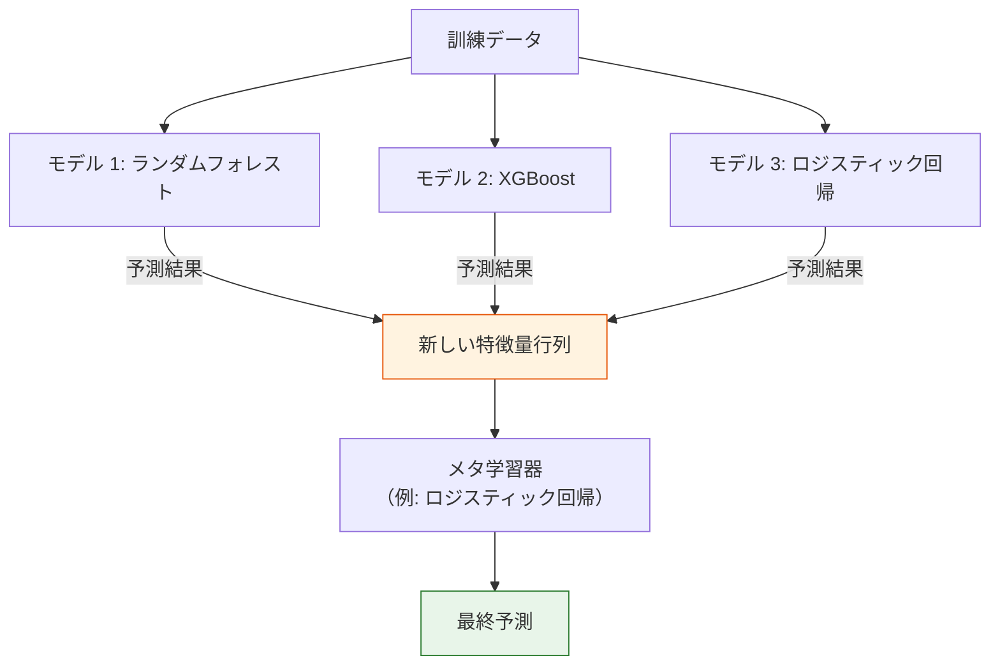
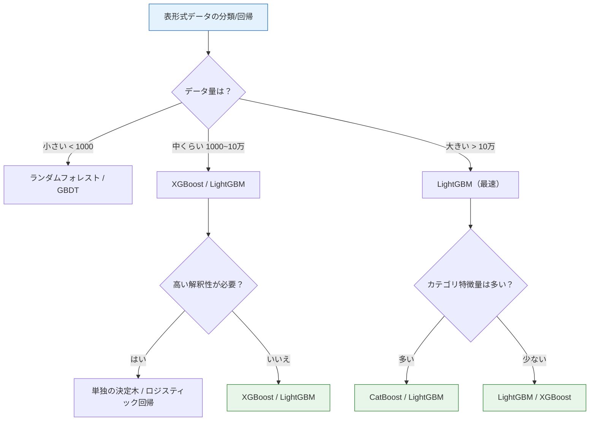

# アンサンブル学習


:::tip この節の位置づけ
アンサンブル学習は、ML コンペや実務で**最もよく使われる**技術のひとつです。考え方はとてもシンプルです。**三人寄れば文殊の知恵**——複数の弱いモデルを組み合わせると、1つの強いモデルより良い結果になります。XGBoost と LightGBM は、今でも表形式データの「まず試す定番」です。
:::

## 学習目標

- Bagging の原理とランダムフォレストを理解する
- Boosting の原理と AdaBoost を理解する
- GBDT と XGBoost を身につける
- LightGBM と CatBoost を知る
- Stacking 戦略を知る

## 先に、とても大事な学習イメージを共有します

この節で初心者がいちばんプレッシャーを感じやすいのは、原理が難しいからではなく、名前が一気に多く出てくるからです。

- ランダムフォレスト
- AdaBoost
- GBDT
- XGBoost
- LightGBM
- CatBoost

最初の1回で全部暗記するより、まずは次の2つを分けて考えるのが大切です。

> **アンサンブル学習は、実は主に2本の流れだけです。並列に投票する Bagging と、順番に誤りを直す Boosting です。**

この2本が先に頭に入ると、あとから出てくるモデル名も、ただのバラバラな知識に見えなくなります。

---

## まずは地図を作りましょう

アンサンブル学習で初心者が混乱しやすいのは、概念が少ないからではなく、名前が多いからです。

- Bagging
- ランダムフォレスト
- AdaBoost
- GBDT
- XGBoost
- LightGBM
- CatBoost

いきなり道具名で覚えると、知識がバラバラになりやすいです。より安定した理解順は次の通りです。


「並列投票」と「順番に誤りを修正する」の2本の流れを先に分けておけば、あとからモデル名が混ざりにくくなります。

---

## 一、アンサンブル学習のコアな考え方

### 1.1 1枚の図で理解するアンサンブル学習



### 1.2 なぜうまくいくのか？

それぞれのモデルは間違えますが、**間違える場所がモデルごとに違う**ことが多いです。複数のモデルで「投票」すると、互いのミスを補えます。

```python
import numpy as np

# シミュレーション: 3つの独立したモデルが、それぞれ 70% の精度を持つ
np.random.seed(42)
n = 10000
true_labels = np.random.randint(0, 2, n)

# 各モデルの独立予測
accs = []
for _ in range(3):
    # 70% の確率で正解
    correct = np.random.random(n) < 0.7
    pred = np.where(correct, true_labels, 1 - true_labels)
    accs.append(pred)

accs = np.array(accs)

# 多数決
ensemble_pred = (accs.sum(axis=0) >= 2).astype(int)

print(f"モデル 1 の正解率: {np.mean(accs[0] == true_labels):.1%}")
print(f"モデル 2 の正解率: {np.mean(accs[1] == true_labels):.1%}")
print(f"モデル 3 の正解率: {np.mean(accs[2] == true_labels):.1%}")
print(f"投票アンサンブルの正解率: {np.mean(ensemble_pred == true_labels):.1%}")
```

### 1.3 2つの大きな流派

| | Bagging | Boosting |
|---|---------|---------|
| 考え方 | 並列学習、投票 | 逐次学習、誤り修正 |
| 多様性の源 | データと特徴のランダムサンプリング | 前のラウンドの誤りに注目 |
| 何を減らすか | 分散（variance） | バイアス（bias） |
| 代表アルゴリズム | ランダムフォレスト | AdaBoost、GBDT、XGBoost |
| 過学習の傾向 | 起きにくい | 起きやすい（early stopping が必要） |



### 1.4 先に覚えるのはモデル名ではなく、2つの違いです

この節で最初に覚えるべきなのは、ライブラリ名ではありません。次の2文です。

- **Bagging** は「複数の人に独立で判断してもらい、最後に投票する」イメージ
- **Boosting** は「前回のミスを次回で重点的に補う」イメージ

この2つだけでも、後の多くのモデルの関係が見えやすくなります。

### 1.5 初心者向けのたとえ

この2本の流れをしっかり覚えたいなら、次のたとえが便利です。

- **Bagging** は会議の投票に似ています。たくさんの人にそれぞれ独立して判断してもらい、最後にまとめます
- **Boosting** は先生の添削に似ています。前回どこが間違っていたかを、次の回で重点的に直します

最初からライブラリ名やパラメータに入るより、この全体像を持っておいた方が理解しやすいです。


この図を見るときは、まず「強くなる2つの方法」を分けて考えましょう。ランダムフォレストはたくさんの木の平均でブレを小さくし、Boosting は後ろのラウンドで前のラウンドの誤りを直しながら表現力を上げていきます。前者は多数決、後者は連続添削です。これを押さえておくと、XGBoost、LightGBM、CatBoost を見たときに、名前だけを覚える状態になりにくいです。

---

## 二、Bagging とランダムフォレスト

### 2.1 Bagging の原理

**Bootstrap Aggregating = ブートストラップサンプリング + 集約**

1. 訓練データから**復元抽出**で複数のデータセットを作る
2. それぞれのデータで決定木を学習する
3. 分類では多数決、回帰では平均を取る

```python
# ブートストラップサンプリングのイメージ
np.random.seed(42)
data = np.arange(1, 11)  # 元データ: [1, 2, ..., 10]

print("元データ:", data)
for i in range(3):
    sample = np.random.choice(data, size=len(data), replace=True)
    print(f"ブートストラップサンプル {i+1}: {sorted(sample)}")
    # 注意: 同じデータが重複し、選ばれないデータもあります
```

### 2.2 ランダムフォレスト（Random Forest）

ランダムフォレスト = Bagging + **特徴量のランダム選択**

各分割のたびに、**ランダムに選んだ一部の特徴量**の中から最適な分割を探します。これにより、木どうしの多様性が高まります。

### 2.2.1 なぜランダムフォレストは単独の木より安定しやすいのか？

理由は、単独の決定木ではできないことを2つやっているからです。

- データをランダムサンプリングする
- 特徴量もランダムに選ぶ

その結果、各木に少しずつ違いが出ます。  
単独の木は、特定のサンプルや特定の特徴に敏感になりやすいです。ランダムフォレストは「少しずつ違うたくさんの木」を平均することで、この不安定さを抑えます。

```python
from sklearn.ensemble import RandomForestClassifier
from sklearn.datasets import make_moons
from sklearn.model_selection import train_test_split
import matplotlib.pyplot as plt
import numpy as np

# データ生成
X, y = make_moons(n_samples=500, noise=0.3, random_state=42)
X_train, X_test, y_train, y_test = train_test_split(X, y, test_size=0.2, random_state=42)

# 単独の木 vs ランダムフォレスト
from sklearn.tree import DecisionTreeClassifier

dt = DecisionTreeClassifier(random_state=42)
dt.fit(X_train, y_train)

rf = RandomForestClassifier(n_estimators=100, random_state=42)
rf.fit(X_train, y_train)

print(f"単独の決定木 | 学習: {dt.score(X_train, y_train):.1%} | テスト: {dt.score(X_test, y_test):.1%}")
print(f"ランダムフォレスト | 学習: {rf.score(X_train, y_train):.1%} | テスト: {rf.score(X_test, y_test):.1%}")

# 決定境界の比較を可視化
fig, axes = plt.subplots(1, 2, figsize=(12, 5))

for ax, model, name in zip(axes, [dt, rf], ['単独の決定木', 'ランダムフォレスト (100本)']):
    x_min, x_max = X[:, 0].min() - 0.5, X[:, 0].max() + 0.5
    y_min, y_max = X[:, 1].min() - 0.5, X[:, 1].max() + 0.5
    xx, yy = np.meshgrid(np.linspace(x_min, x_max, 200),
                          np.linspace(y_min, y_max, 200))
    Z = model.predict(np.c_[xx.ravel(), yy.ravel()]).reshape(xx.shape)
    ax.contourf(xx, yy, Z, alpha=0.3, cmap='coolwarm')
    ax.scatter(X_test[:, 0], X_test[:, 1], c=y_test, cmap='coolwarm', s=20, edgecolors='w', linewidth=0.5)
    test_acc = model.score(X_test, y_test)
    ax.set_title(f'{name}\nテスト正解率: {test_acc:.1%}')
    ax.grid(True, alpha=0.3)

plt.tight_layout()
plt.show()
```

### 2.3 ランダムフォレストの重要なハイパーパラメータ

| パラメータ | 説明 | 推奨 |
|------|------|------|
| `n_estimators` | 木の本数 | 100~500 |
| `max_depth` | 1本の木の最大深さ | None または 10~20 |
| `max_features` | 分割時に考慮する特徴量数 | 'sqrt'（分類）, 'log2' |
| `min_samples_split` | ノード分割に必要な最小サンプル数 | 2~10 |
| `min_samples_leaf` | 葉ノードの最小サンプル数 | 1~5 |

### 2.4 最初にランダムフォレストを調整するとき、どう進めるのが安定か？

おすすめは、次の順番です。

1. まず `n_estimators` を十分大きくする。たとえば `100~300`
2. 次に `max_depth` を見る
3. 次に `min_samples_leaf` を見る
4. 最後に `max_features` を微調整する

理由は次の通りです。

- 木の本数が少ないと、結果がブレやすく判断しづらい
- `max_depth` と `min_samples_leaf` は、過学習に直接影響しやすい
- `max_features` は、より細かい調整向き

### 2.5 最初にランダムフォレストを使うとき、何を覚えるべきか？

最初に覚えるべきなのは、

- 単独の決定木より「すごい」ということ

ではなく、

- 本質は「少しずつ違うたくさんの木でブレを減らす」こと

です。

つまり、ランダムフォレストのデフォルトの強みは次のようになります。

- 安定している
- 単独の木ほど過学習しにくい
- 表形式データでは強い baseline として使いやすい

```python
# 木の本数 vs 正解率
n_trees = [1, 5, 10, 30, 50, 100, 200, 500]
train_scores = []
test_scores = []

for n in n_trees:
    rf = RandomForestClassifier(n_estimators=n, random_state=42)
    rf.fit(X_train, y_train)
    train_scores.append(rf.score(X_train, y_train))
    test_scores.append(rf.score(X_test, y_test))

plt.figure(figsize=(8, 5))
plt.plot(n_trees, train_scores, 'bo-', label='訓練セット')
plt.plot(n_trees, test_scores, 'ro-', label='テストセット')
plt.xlabel('木の本数 (n_estimators)')
plt.ylabel('正解率')
plt.title('木の本数がランダムフォレスト性能に与える影響')
plt.legend()
plt.grid(True, alpha=0.3)
plt.show()
```

---

## 三、Boosting 系列

### 3.1 AdaBoost

**考え方**：毎ラウンドで**前のラウンドが間違えたサンプル**に注目し、その重みを高くします。


```python
from sklearn.ensemble import AdaBoostClassifier
from sklearn.tree import DecisionTreeClassifier

# AdaBoost は通常、浅い決定木（決定木の stump）を使う
ada = AdaBoostClassifier(
    estimator=DecisionTreeClassifier(max_depth=1),
    n_estimators=50,
    learning_rate=1.0,
    random_state=42
)
ada.fit(X_train, y_train)
print(f"AdaBoost | 学習: {ada.score(X_train, y_train):.1%} | テスト: {ada.score(X_test, y_test):.1%}")
```

### 3.2 GBDT（勾配ブースティング決定木）

**考え方**：新しい木は、元のラベルそのものではなく、これまでの木が残した**残差**（予測誤差）を学習します。

> **Fm(x) = Fm-1(x) + η × hm(x)**

ここで `hm(x)` は m 本目の木が学習する残差、`η` は学習率です。

### 3.2.1 GBDT で最初に覚えるべき直感

GBDT をひとことで言うなら、こう覚えると分かりやすいです。

> **前のラウンドでうまく当てられなかったところを、次のラウンドで重点的に補う。**

これはランダムフォレストとはかなり違います。  
ランダムフォレストは「みんなが独立に判断して平均する」方式ですが、GBDT は「1ラウンドずつ穴を埋める」方式です。

```python
from sklearn.ensemble import GradientBoostingClassifier

gbdt = GradientBoostingClassifier(
    n_estimators=100,
    learning_rate=0.1,
    max_depth=3,
    random_state=42
)
gbdt.fit(X_train, y_train)
print(f"GBDT | 学習: {gbdt.score(X_train, y_train):.1%} | テスト: {gbdt.score(X_test, y_test):.1%}")
```

### 3.3 GBDT の回帰を直感で理解する

```python
from sklearn.ensemble import GradientBoostingRegressor
from sklearn.tree import DecisionTreeRegressor

# 回帰問題で「残差を学習する」感覚をつかむ
np.random.seed(42)
X_demo = np.linspace(0, 10, 100).reshape(-1, 1)
y_demo = np.sin(X_demo.ravel()) + np.random.randn(100) * 0.2

fig, axes = plt.subplots(2, 3, figsize=(15, 9))

# GBDT の流れを手動でまねる
current_pred = np.zeros(len(y_demo))
learning_rate = 0.5

for i in range(6):
    ax = axes[i // 3][i % 3]

    # 残差を計算
    residual = y_demo - current_pred

    # 決定木で残差を学習
    tree = DecisionTreeRegressor(max_depth=2, random_state=42)
    tree.fit(X_demo, residual)
    tree_pred = tree.predict(X_demo)

    # 予測を更新
    current_pred += learning_rate * tree_pred

    ax.scatter(X_demo, y_demo, s=10, alpha=0.5, color='steelblue')
    ax.plot(X_demo, current_pred, 'r-', linewidth=2, label=f'現在の予測')
    ax.set_title(f'{i+1} 本目の木の後\nMSE={np.mean((y_demo - current_pred)**2):.4f}')
    ax.legend(fontsize=8)
    ax.grid(True, alpha=0.3)

plt.suptitle('GBDT が残差を順に学習する流れ', fontsize=13)
plt.tight_layout()
plt.show()
```

---

## 四、XGBoost

### 4.1 XGBoost の改良点

XGBoost（eXtreme Gradient Boosting）は、GBDT の**実装・最適化版**です。

| 特性 | GBDT | XGBoost |
|------|------|---------|
| 正則化 | なし | L1 + L2 正則化（過学習を抑える） |
| 欠損値 | 前処理が必要 | 自動処理 |
| 並列化 | 逐次 | 特徴量単位で並列化（高速） |
| 列サンプリング | なし | 対応（ランダムフォレストに近い） |
| 早期停止 | なし | `early_stopping_rounds` に対応 |

### 4.2 インストールと使い方

```bash
pip install xgboost
```

```python
import xgboost as xgb
from sklearn.datasets import load_wine
from sklearn.model_selection import train_test_split
from sklearn.metrics import accuracy_score

# データを読み込む
wine = load_wine()
X, y = wine.data, wine.target
X_train, X_test, y_train, y_test = train_test_split(X, y, test_size=0.2, random_state=42)

# XGBoost を学習
xgb_model = xgb.XGBClassifier(
    n_estimators=100,
    max_depth=4,
    learning_rate=0.1,
    random_state=42,
    use_label_encoder=False,
    eval_metric='mlogloss',
)
xgb_model.fit(X_train, y_train)

print(f"XGBoost | 学習: {xgb_model.score(X_train, y_train):.1%} | テスト: {xgb_model.score(X_test, y_test):.1%}")
```

### 4.3 XGBoost の重要なハイパーパラメータ

| パラメータ | 説明 | 推奨範囲 |
|------|------|---------|
| `n_estimators` | 木の本数 | 100~1000 |
| `max_depth` | 木の最大深さ | 3~8 |
| `learning_rate` | 学習率（縮小率） | 0.01~0.3 |
| `subsample` | 1本の木に使うサンプル比率 | 0.6~1.0 |
| `colsample_bytree` | 1本の木に使う特徴量比率 | 0.6~1.0 |
| `reg_alpha` | L1 正則化係数 | 0~1 |
| `reg_lambda` | L2 正則化係数 | 1~5 |

### 4.3.1 最初に XGBoost を調整するとき、どこから触るべき？

最初から10個以上のパラメータを一気に調整しない方が安全です。おすすめの順番は次の通りです。

1. まず `learning_rate` を決める
2. 次に `n_estimators` を合わせる
3. その後で `max_depth` を見る
4. 最後に `subsample`、`colsample_bytree`、正則化項を調整する

実践的な目安は次の通りです。

- 小さい学習率 + 多めの木 の方が、大きく一気に進むより安定しやすい
- 深さを大きくしすぎると、Boosting 系は訓練データを覚えやすくなります

### 4.4 早期停止（Early Stopping）

```python
# 早期停止: 検証セットで連続 N 回改善しなければ止める
xgb_model = xgb.XGBClassifier(
    n_estimators=1000,   # 十分大きな値を設定する
    max_depth=4,
    learning_rate=0.1,
    random_state=42,
    eval_metric='mlogloss',
    early_stopping_rounds=20,  # 20 回連続で改善しなければ停止
)

xgb_model.fit(
    X_train, y_train,
    eval_set=[(X_test, y_test)],
    verbose=False
)

print(f"最良の反復回数: {xgb_model.best_iteration}")
print(f"テスト正解率: {xgb_model.score(X_test, y_test):.1%}")
```

### 4.5 特徴量重要度

```python
# XGBoost の特徴量重要度
importance = xgb_model.feature_importances_
sorted_idx = np.argsort(importance)

plt.figure(figsize=(8, 6))
plt.barh(range(len(sorted_idx)), importance[sorted_idx], color='coral')
plt.yticks(range(len(sorted_idx)), np.array(wine.feature_names)[sorted_idx])
plt.xlabel('特徴量重要度')
plt.title('XGBoost の特徴量重要度（Wine データセット）')
plt.grid(axis='x', alpha=0.3)
plt.tight_layout()
plt.show()
```

---

## 五、LightGBM と CatBoost

### 5.1 LightGBM

LightGBM は Microsoft が開発した高効率な勾配ブースティングフレームワークで、XGBoost より**高速**です。

| 特性 | 説明 |
|------|------|
| **Leaf-wise 成長** | 葉を伸ばす方式で、階層ごとではないため効率的 |
| **ヒストグラム最適化** | 特徴量をビン分割して、分割点探索を高速化 |
| **カテゴリ特徴量のネイティブ対応** | 手動の One-Hot エンコードが不要 |
| **非常に速い学習速度** | 大規模データでは XGBoost より数倍速いことがある |

```bash
pip install lightgbm
```

```python
import lightgbm as lgb

lgb_model = lgb.LGBMClassifier(
    n_estimators=100,
    max_depth=4,
    learning_rate=0.1,
    random_state=42,
    verbose=-1,
)
lgb_model.fit(X_train, y_train)
print(f"LightGBM | 学習: {lgb_model.score(X_train, y_train):.1%} | テスト: {lgb_model.score(X_test, y_test):.1%}")
```

### 5.2 CatBoost

CatBoost（Categorical Boosting）は Yandex が開発したフレームワークで、**カテゴリ特徴量**の処理が得意です。

| 特性 | 説明 |
|------|------|
| **カテゴリ特徴量の処理** | 自動で処理でき、エンコードが不要 |
| **Ordered Boosting** | 予測のズレを減らす |
| **デフォルトが強い** | そのまま使っても良い結果になりやすい |

```bash
pip install catboost
```

```python
from catboost import CatBoostClassifier

cat_model = CatBoostClassifier(
    iterations=100,
    depth=4,
    learning_rate=0.1,
    random_seed=42,
    verbose=0,
)
cat_model.fit(X_train, y_train)
print(f"CatBoost | 学習: {cat_model.score(X_train, y_train):.1%} | テスト: {cat_model.score(X_test, y_test):.1%}")
```

### 5.3 3つの Boosting フレームワーク比較

| | XGBoost | LightGBM | CatBoost |
|---|---------|----------|----------|
| 開発者 | Chen Tianqi | Microsoft | Yandex |
| 成長戦略 | Level-wise | Leaf-wise | 対称木 |
| 速度 | 中程度 | 最速 | 中程度 |
| カテゴリ特徴量 | エンコードが必要 | ネイティブ対応 | 最も強い対応 |
| デフォルト性能 | 良い | 良い | たいてい最良 |
| Kaggle での利用 | 非常に広い | 非常に広い | 広い |

### 5.4 最初に表形式データのプロジェクトをするなら、どう選ぶのが安定か？

初めて構造化された表形式データを扱うなら、まずは次のように選ぶと安定です。

- 安定性が欲しい、説明もしやすい、学習も速い: まずはランダムフォレスト
- さらに高い上限を狙いたい: XGBoost / LightGBM
- カテゴリ特徴量が特に多い: CatBoost を優先

「今いちばん流行っているものを先に使う」より、この順番の方が安定です。まず baseline を作ってから、少しずつ上限を上げていくイメージです。

### 5.5 アンサンブル学習を最初に学ぶときの、安定した読み順

この節を初めて学ぶなら、次の順で理解するのがおすすめです。

1. まず単独の決定木の長所と短所を整理する
2. 次に Bagging と Boosting を分けて考える
3. ランダムフォレストを「より安定した木」として見る
4. GBDT / XGBoost を「ラウンドごとに誤りを直す木」として見る
5. 最後に LightGBM / CatBoost のような実装最適化版を見る

こうすると、この節が「モデル名の羅列」になりにくいです。

---

## 六、Stacking——モデルの積み重ね

### 6.1 原理

複数の異なるモデルの予測結果を**新しい特徴量**として使い、その上でもう1つモデルを学習して最終予測を行います。



### 6.2 sklearn での実装

```python
from sklearn.ensemble import StackingClassifier, RandomForestClassifier, GradientBoostingClassifier
from sklearn.linear_model import LogisticRegression
from sklearn.svm import SVC

# ベースモデル
estimators = [
    ('rf', RandomForestClassifier(n_estimators=50, random_state=42)),
    ('gbdt', GradientBoostingClassifier(n_estimators=50, random_state=42)),
    ('svm', SVC(probability=True, random_state=42)),
]

# Stacking
stack = StackingClassifier(
    estimators=estimators,
    final_estimator=LogisticRegression(max_iter=1000),
    cv=5  # 5 分割交差検証でメタ特徴量を生成
)

stack.fit(X_train, y_train)
print(f"Stacking | 学習: {stack.score(X_train, y_train):.1%} | テスト: {stack.score(X_test, y_test):.1%}")
```

### 6.3 なぜ Stacking は初心者の最初の一歩ではないのか？

Stacking は強力になりやすい一方で、実験設計の難易度も上がります。

- データリークが起きやすい
- 交差検証への依存が大きい
- なぜ効いたのかを説明しにくい

そのため、より安定した学習順は次の通りです。

- まず単一モデルの baseline を学ぶ
- 次にランダムフォレストと Boosting を学ぶ
- 最後に Stacking を扱う

---

## 七、総合比較の実践

```python
from sklearn.ensemble import (
    RandomForestClassifier, AdaBoostClassifier,
    GradientBoostingClassifier, StackingClassifier
)
from sklearn.tree import DecisionTreeClassifier
from sklearn.linear_model import LogisticRegression
from sklearn.datasets import load_wine
from sklearn.model_selection import train_test_split, cross_val_score
import numpy as np
import matplotlib.pyplot as plt

# データ
wine = load_wine()
X, y = wine.data, wine.target
X_train, X_test, y_train, y_test = train_test_split(X, y, test_size=0.2, random_state=42)

# すべてのモデル
models = {
    "決定木": DecisionTreeClassifier(max_depth=5, random_state=42),
    "ランダムフォレスト": RandomForestClassifier(n_estimators=100, random_state=42),
    "AdaBoost": AdaBoostClassifier(n_estimators=100, random_state=42),
    "GBDT": GradientBoostingClassifier(n_estimators=100, random_state=42),
}

# XGBoost と LightGBM を試しに読み込む
try:
    import xgboost as xgb
    models["XGBoost"] = xgb.XGBClassifier(n_estimators=100, random_state=42,
                                            eval_metric='mlogloss')
except ImportError:
    pass

try:
    import lightgbm as lgb
    models["LightGBM"] = lgb.LGBMClassifier(n_estimators=100, random_state=42, verbose=-1)
except ImportError:
    pass

# 交差検証で評価
results = {}
for name, model in models.items():
    cv_scores = cross_val_score(model, X_train, y_train, cv=5, scoring='accuracy')
    model.fit(X_train, y_train)
    test_score = model.score(X_test, y_test)
    results[name] = {
        'cv_mean': cv_scores.mean(),
        'cv_std': cv_scores.std(),
        'test': test_score
    }
    print(f"{name:12s} | CV: {cv_scores.mean():.1%} ± {cv_scores.std():.1%} | テスト: {test_score:.1%}")

# 可視化
fig, ax = plt.subplots(figsize=(10, 5))
names = list(results.keys())
cv_means = [v['cv_mean'] for v in results.values()]
cv_stds = [v['cv_std'] for v in results.values()]
test_scores = [v['test'] for v in results.values()]

x = np.arange(len(names))
width = 0.35
bars1 = ax.bar(x - width/2, cv_means, width, yerr=cv_stds, label='CV 平均', color='steelblue', capsize=3)
bars2 = ax.bar(x + width/2, test_scores, width, label='テストセット', color='coral')

ax.set_xticks(x)
ax.set_xticklabels(names, rotation=20, ha='right')
ax.set_ylabel('正解率')
ax.set_title('アンサンブル学習手法の比較（Wine データセット）')
ax.set_ylim(0.8, 1.05)
ax.legend()
ax.grid(axis='y', alpha=0.3)

plt.tight_layout()
plt.show()
```

---

## 八、どうやってアルゴリズムを選ぶか？



:::tip 実用アドバイス
1. **最初の選択**: まず LightGBM か XGBoost で baseline を作る
2. **調整の順番**: `n_estimators` → `learning_rate` → `max_depth` → 正則化パラメータ
3. **早期停止**: `early_stopping_rounds` は必ず使う
4. **コンペで上を狙う**: 複数モデルの Stacking
:::

---

## 十、最初にアンサンブル学習をプロジェクトへ入れるときの、安定した順番

最初にアンサンブル学習をプロジェクトへ入れるときは、次の順番が安定です。

1. まず線形モデルか単独の決定木で baseline を作る
2. 単独の木が不安定なら、まずランダムフォレストを試す
3. 評価の枠組みがある程度固まってきたら、GBDT / XGBoost を試す
4. 最後に、より細かいパラメータ調整やモデル融合を考える

この進め方の方が、実際のプロジェクトに近く、最初から複雑なチューニングに入り込みにくいです。

:::info 次につながる内容
- **第 3 章**：教師なし学習——クラスタリング、次元削減、異常検知
- **第 4 章**：モデル評価——交差検証、バイアス・バリアンストレードオフ、ハイパーパラメータ調整
:::

---

## まとめ

| 方法 | 考え方 | 代表例 | 特徴 |
|------|------|------|------|
| **Bagging** | 並列 + 投票 | ランダムフォレスト | 分散を減らし、過学習しにくい |
| **Boosting** | 逐次 + 誤り修正 | XGBoost、LightGBM | バイアスを減らし、性能が高いことが多い |
| **Stacking** | モデルの積み重ね | 複数の組み合わせ | 異なるモデルの強みを活かせる |

## この節で一番持ち帰ってほしいこと

ひとことで言うなら、ぜひ次を覚えてください。

> **アンサンブル学習の本質は「モデルを増やすこと」ではなく、いろいろなやり方で不完全な木を組み合わせ、より安定またはより強いシステムにすることです。**

だから本当に大切なのは次の点です。

- Bagging と Boosting を区別できること
- ランダムフォレストがなぜ安定するか分かること
- GBDT / XGBoost がなぜ強いか分かること
- 最初の表形式データプロジェクトで、どう選ぶか分かること

## 手を動かしてみよう

### 練習 1：ランダムフォレストのチューニング

`make_moons` データを使って、`n_estimators`（10, 50, 100, 200, 500）と `max_depth`（3, 5, 10, None）をいろいろ試し、最適な組み合わせを見つけましょう。ヒートマップを描いてください。

### 練習 2：XGBoost の早期停止

Wine データセットで XGBoost を学習し、`n_estimators=1000`、`early_stopping_rounds=10` を設定して、最良の反復回数を確認しましょう。`learning_rate` を変えて、最良の反復回数がどう変わるかも試してください。

### 練習 3：総合比較

Iris データセットを使って、この節で紹介したすべてのアルゴリズム（決定木、ランダムフォレスト、AdaBoost、GBDT、XGBoost、LightGBM）を比較しましょう。5 分割交差検証で評価し、比較の棒グラフを描いてください。

### 練習 4：Stacking の実験

Stacking モデルを作成し、ベースモデルにランダムフォレスト + XGBoost + KNN、メタ学習器にロジスティック回帰を使いましょう。各ベースモデルを単独で使った場合と比較してください。
