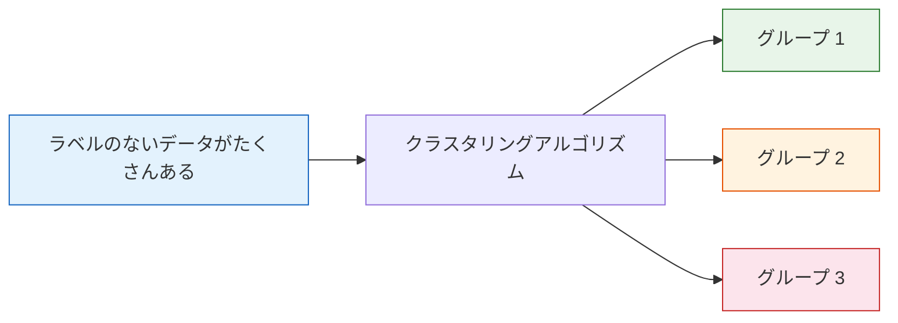
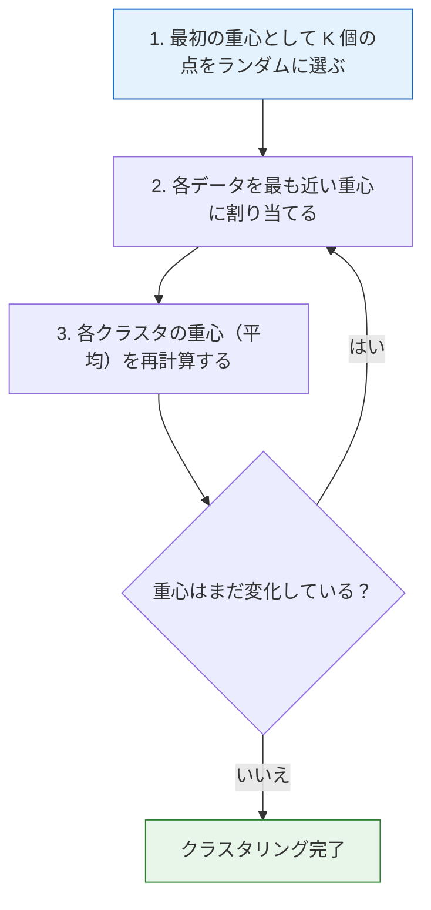
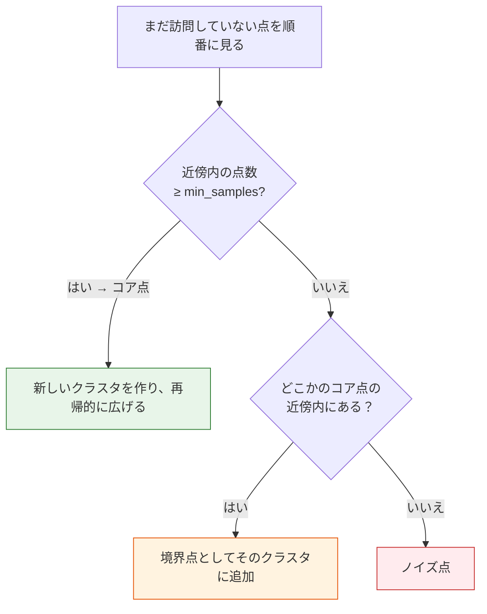

# クラスタリングアルゴリズム


:::tip この節の位置づけ
クラスタリングは、教師なし学習で最もよく使われるタスクのひとつです。**ラベルがない状態で、似ているデータを自動的に同じグループに分ける**ことが目的です。顧客セグメンテーション、文書分類、画像分割など、さまざまな場面で使われます。
:::

## 学習目標

- K-Means クラスタリングの原理と実装を理解する
- K-Means++ の初期化戦略を理解する
- 階層クラスタリング（凝集型と分割型）を理解する
- DBSCAN の密度ベースのクラスタリングを理解する
- K 値の選び方とクラスタリング評価指標を理解する

## まず最初に、大事な学習イメージを持とう

この節は、初心者が最初に少し戸惑いやすい内容です。前の教師あり学習とは違って、

- ラベルがない
- 正解がない
- 「分かれた」ように見えても、それが良い分け方かはすぐには分からない

という特徴があります。

最初の段階で覚えておきたいのは、すべてのクラスタリングアルゴリズムを暗記することではなく、まずこの考え方を受け入れることです。

> **クラスタリングは、ラベルがないときにデータ構造について検証可能な仮説を立てることです。**

この理解ができると、クラスタリングを「自動で唯一の正解を出すもの」と誤解しなくなります。

---

## まず全体像をつかもう

クラスタリングで初心者がつまずきやすいポイントは、次の3つです。

- ラベルがないので、何を学んだのか分かりにくい
- アルゴリズムが多くて、どれから学べばよいか迷う
- 図ではグループに見えても、良い結果かどうか判断しにくい

理解の順番としては、次の流れが安定です。


つまり、クラスタリングは単に「機械にグループ分けさせる」ことではなく、  
**ラベルがないときに、データの構造をどう見つけるか**を考える作業です。

---

## 一、クラスタリングの直感

### 1.1 クラスタリングとは？

**クラスタリング = 「似ているもの」をまとめて、「異なるもの」を分けること。**



| 応用シーン | データ | クラスタリングの目的 |
|---------|------|---------|
| 顧客セグメンテーション | 消費行動データ | 高価値/低頻度/離脱顧客群を見つける |
| 文書分類 | テキストベクトル | テーマごとに自動分類する |
| 画像分割 | ピクセルの色値 | 画像を前景/背景に分ける |
| 遺伝子解析 | 遺伝子発現データ | 機能が似た遺伝子群を見つける |

### 1.2 クラスタリングと分類は何が違うの？

似た言葉ですが、解く問題はまったく違います。

- **分類**：ラベルが分かっている。どう判定するかを学ぶ
- **クラスタリング**：ラベルが分かっていない。どんな समूहがありそうかを見つける

だから、クラスタリングを学ぶときは次の点を受け入れることが大事です。

- 結果は唯一の正解ではない
- ひとつの「データ構造の仮説」と考える
- 指標や業務上の説明で、その仮説が役立つか確認する

### 1.2.1 初心者向けのたとえ

クラスタリングは、次のように考えると分かりやすいです。

- ラベルのないたくさんの荷物を、初めて整理する

そのときは、なんとなく「似ていそう」という感覚で分けます。

- よく使うものをひとまとめ
- あまり使わないものをひとまとめ
- 特にごちゃごちゃしたものは別に置く

ここで探しているのは「唯一の正解」ではなく、

- 分かりやすい
- 次の行動につなげやすい
- 本当に役立つか確認できる

ような分け方です。


この図は、よくある誤解を避けるためのものです。すべてのセグメント化に K-Means が向いているわけではありません。丸い塊で大きさがだいたい同じクラスタには K-Means が向いています。曲がった形やノイズがあるデータには DBSCAN を先に試すとよいです。階層関係を見たいなら階層クラスタリングを考えます。まずデータの形を見て、それからアルゴリズムを選びましょう。

### 1.3 デモ用データを作る

```python
import numpy as np
import matplotlib.pyplot as plt
from sklearn.datasets import make_blobs

# 3 つのクラスタを持つデータを生成
X, y_true = make_blobs(n_samples=300, centers=3, cluster_std=0.8, random_state=42)

plt.figure(figsize=(8, 6))
plt.scatter(X[:, 0], X[:, 1], s=30, alpha=0.7, color='gray')
plt.title('ラベルのないデータ——いくつのグループに見える？')
plt.xlabel('特徴量 1')
plt.ylabel('特徴量 2')
plt.grid(True, alpha=0.3)
plt.show()
```

---

## 二、K-Means クラスタリング

### 2.1 アルゴリズムの原理

K-Means は最も代表的なクラスタリングアルゴリズムで、手順はとてもシンプルです。



### 2.2 K-Means をゼロから実装する

```python
def kmeans_simple(X, k, max_iters=100):
    """簡易版 K-Means の実装"""
    np.random.seed(42)
    # 1. 重心をランダムに初期化
    idx = np.random.choice(len(X), k, replace=False)
    centroids = X[idx].copy()

    for iteration in range(max_iters):
        # 2. 各点を最も近い重心に割り当てる
        distances = np.sqrt(((X[:, np.newaxis] - centroids) ** 2).sum(axis=2))
        labels = distances.argmin(axis=1)

        # 3. 重心を更新する
        new_centroids = np.array([X[labels == i].mean(axis=0) for i in range(k)])

        # 収束チェック
        if np.allclose(centroids, new_centroids):
            print(f"{iteration+1} 回目で収束しました")
            break
        centroids = new_centroids

    return labels, centroids

# 実行
labels, centroids = kmeans_simple(X, k=3)

# 可視化
plt.figure(figsize=(8, 6))
plt.scatter(X[:, 0], X[:, 1], c=labels, cmap='viridis', s=30, alpha=0.7)
plt.scatter(centroids[:, 0], centroids[:, 1], c='red', marker='X', s=200,
            edgecolors='black', linewidth=2, label='重心')
plt.title('K-Means のクラスタリング結果（手動実装）')
plt.legend()
plt.grid(True, alpha=0.3)
plt.show()
```

### 2.3 sklearn で実装する

```python
from sklearn.cluster import KMeans

kmeans = KMeans(n_clusters=3, random_state=42, n_init=10)
kmeans.fit(X)

print(f"クラスタラベル: {np.unique(kmeans.labels_)}")
print(f"重心:\n{kmeans.cluster_centers_}")
print(f"総慣性（SSE）: {kmeans.inertia_:.2f}")

# 可視化
fig, axes = plt.subplots(1, 2, figsize=(14, 5))

# クラスタリング結果
axes[0].scatter(X[:, 0], X[:, 1], c=kmeans.labels_, cmap='viridis', s=30, alpha=0.7)
axes[0].scatter(kmeans.cluster_centers_[:, 0], kmeans.cluster_centers_[:, 1],
                c='red', marker='X', s=200, edgecolors='black', linewidth=2)
axes[0].set_title('K-Means のクラスタリング結果')

# 真のラベルと比較
axes[1].scatter(X[:, 0], X[:, 1], c=y_true, cmap='viridis', s=30, alpha=0.7)
axes[1].set_title('真のラベル（比較用）')

for ax in axes:
    ax.grid(True, alpha=0.3)

plt.tight_layout()
plt.show()
```

### 2.4 K-Means の反復過程を可視化する

```python
fig, axes = plt.subplots(2, 3, figsize=(15, 9))

np.random.seed(42)
idx = np.random.choice(len(X), 3, replace=False)
centroids = X[idx].copy()

for i, ax in enumerate(axes.ravel()):
    # 割り当て
    distances = np.sqrt(((X[:, np.newaxis] - centroids) ** 2).sum(axis=2))
    labels = distances.argmin(axis=1)

    ax.scatter(X[:, 0], X[:, 1], c=labels, cmap='viridis', s=20, alpha=0.6)
    ax.scatter(centroids[:, 0], centroids[:, 1], c='red', marker='X', s=200,
               edgecolors='black', linewidth=2)
    ax.set_title(f'{i+1} 回目の反復')
    ax.grid(True, alpha=0.3)

    # 重心を更新
    centroids = np.array([X[labels == j].mean(axis=0) for j in range(3)])

plt.suptitle('K-Means の反復過程', fontsize=13)
plt.tight_layout()
plt.show()
```

---

## 三、K-Means++ の初期化

### 3.1 なぜより良い初期化が必要なの？

通常の K-Means は、最初の重心をランダムに選びます。そのため、次のような問題が起こることがあります。

- 収束が遅い
- 結果が安定しない
- 局所最適に陥りやすい

### 3.2 K-Means++ の戦略

**考え方の中心**は、初期重心をできるだけ散らすことです。

1. 最初の重心を 1 つランダムに選ぶ
2. 2 つ目以降は、**すでにある重心から遠い点**を選びやすくする（距離の 2 乗に比例）
3. K 個そろうまで繰り返す

```python
# sklearn のデフォルトは K-Means++
kmeans_pp = KMeans(n_clusters=3, init='k-means++', random_state=42, n_init=10)
kmeans_random = KMeans(n_clusters=3, init='random', random_state=0, n_init=1)

kmeans_pp.fit(X)
kmeans_random.fit(X)

print(f"K-Means++ の慣性: {kmeans_pp.inertia_:.2f}")
print(f"ランダム初期化の慣性: {kmeans_random.inertia_:.2f}")
```

:::info sklearn のデフォルト
sklearn の `KMeans` は、デフォルトで `init='k-means++'` を使います。そのため、ふつうは自分で設定しなくても大丈夫です。`n_init=10` は 10 回実行して、最も良い結果を採用するという意味です。
:::

---

## 四、K 値をどう選ぶか？

K-Means の大きな課題は、**事前に K を決める必要がある**ことです。よく使う方法は 2 つあります。

### 4.1 エルボー法（Elbow Method）

異なる K に対する SSE（Sum of Squared Errors、つまり `inertia_`）を計算し、「曲がり角」を探します。

```python
sse = []
K_range = range(1, 11)

for k in K_range:
    km = KMeans(n_clusters=k, random_state=42, n_init=10)
    km.fit(X)
    sse.append(km.inertia_)

plt.figure(figsize=(8, 5))
plt.plot(K_range, sse, 'bo-', markersize=8)
plt.xlabel('K（クラスタ数）')
plt.ylabel('SSE（慣性）')
plt.title('エルボー法——最適な K を選ぶ')
plt.xticks(K_range)
plt.grid(True, alpha=0.3)

# 肘を示す
plt.annotate('肘 → K=3', xy=(3, sse[2]), xytext=(5, sse[2] + 200),
             arrowprops=dict(arrowstyle='->', color='red'),
             fontsize=12, color='red')
plt.show()
```

### 4.1.1 エルボー法でよくある誤用

エルボー法は分かりやすいですが、現実にははっきりした「肘」が見えないことも多いです。  
そのときは、無理にひとつの正解を決めず、次のように使うのがよいです。

- 候補範囲を絞るためのツールとして使う

より安定した進め方は、

- まずエルボー法で `K` の候補を 2〜4 個くらいに絞る
- 次にシルエット係数と業務上の説明しやすさで再評価する

### 4.2 シルエット係数（Silhouette Score）

シルエット係数は、各サンプルのクラスタリング品質を表し、値の範囲は [-1, 1] です。

- **1 に近い**：同じクラスタ内でまとまっており、他クラスタからも十分離れている（良い）
- **0 に近い**：2 つのクラスタの境目にある
- **-1 に近い**：誤って分類されている可能性が高い

```python
from sklearn.metrics import silhouette_score, silhouette_samples

sil_scores = []
for k in range(2, 11):
    km = KMeans(n_clusters=k, random_state=42, n_init=10)
    labels = km.fit_predict(X)
    score = silhouette_score(X, labels)
    sil_scores.append(score)
    print(f"K={k}: シルエット係数 = {score:.4f}")

plt.figure(figsize=(8, 5))
plt.plot(range(2, 11), sil_scores, 'bo-', markersize=8)
plt.xlabel('K（クラスタ数）')
plt.ylabel('シルエット係数')
plt.title('シルエット係数——最適な K を選ぶ')
plt.xticks(range(2, 11))
plt.grid(True, alpha=0.3)
plt.show()
```

### 4.3 シルエット図の可視化

```python
from sklearn.metrics import silhouette_samples

fig, axes = plt.subplots(1, 3, figsize=(18, 5))

for ax, k in zip(axes, [2, 3, 4]):
    km = KMeans(n_clusters=k, random_state=42, n_init=10)
    labels = km.fit_predict(X)
    sil_vals = silhouette_samples(X, labels)
    avg_score = silhouette_score(X, labels)

    y_lower = 10
    for i in range(k):
        cluster_sil = np.sort(sil_vals[labels == i])
        y_upper = y_lower + len(cluster_sil)
        ax.fill_betweenx(np.arange(y_lower, y_upper), 0, cluster_sil, alpha=0.7)
        ax.text(-0.05, y_lower + 0.5 * len(cluster_sil), str(i), fontsize=12)
        y_lower = y_upper + 10

    ax.axvline(x=avg_score, color='red', linestyle='--', label=f'平均={avg_score:.3f}')
    ax.set_title(f'K={k}')
    ax.set_xlabel('シルエット係数')
    ax.set_ylabel('サンプル')
    ax.legend()

plt.suptitle('異なる K 値のシルエット図', fontsize=13)
plt.tight_layout()
plt.show()
```

### 4.4 初めてクラスタリングを使うとき、より安定した順番は？

実際のプロジェクトで初めてクラスタリングを使うなら、次の順番がおすすめです。

1. まず特徴量の標準化を行う
2. 2 次元投影や基本統計で、データにグループらしさがあるか見る
3. まず `K-Means` を baseline として動かす
4. 次にエルボー法とシルエット係数で `K` を絞る
5. クラスタ形状が明らかに不規則、またはノイズが多いなら `DBSCAN` を試す
6. 最後に必ず業務の説明に戻る：各クラスタは何を意味するのか

ここがとても重要です。クラスタリングプロジェクトは、「分かれたけれど、その意味が分からない」という状態に陥りやすいからです。

---

## 五、階層クラスタリング

### 5.1 原理

階層クラスタリングは、K を最初に決める必要がなく、**デンドログラム（Dendrogram）** という木構造を作ります。

**凝集型（下から上へ）**：
1. 各点を 1 つのクラスタとして始める
2. 最も近い 2 つのクラスタを統合する
3. 1 つのクラスタになるまで繰り返す

```python
from sklearn.cluster import AgglomerativeClustering
from scipy.cluster.hierarchy import dendrogram, linkage

# 少量データでデンドログラムを表示
X_small = X[:50]

# 階層構造を計算
linkage_matrix = linkage(X_small, method='ward')

fig, axes = plt.subplots(1, 2, figsize=(15, 5))

# デンドログラム
dendrogram(linkage_matrix, ax=axes[0], truncate_mode='level', p=5)
axes[0].set_title('デンドログラム')
axes[0].set_xlabel('サンプル')
axes[0].set_ylabel('距離')

# クラスタリング結果
agg = AgglomerativeClustering(n_clusters=3)
labels_agg = agg.fit_predict(X)
axes[1].scatter(X[:, 0], X[:, 1], c=labels_agg, cmap='viridis', s=30, alpha=0.7)
axes[1].set_title('階層クラスタリング結果 (K=3)')
axes[1].grid(True, alpha=0.3)

plt.tight_layout()
plt.show()
```

### 5.2 リンク方法

| 方法 | 2 つのクラスタ間の距離の定義 | 特徴 |
|------|-------------------|------|
| `ward` | 統合後の SSE 増加量が最小 | 最もよく使われる。サイズがそろったクラスタになりやすい |
| `complete` | 最も遠い点どうしの距離 | 外れ値の影響を受けやすい |
| `average` | すべての点対の平均距離 | バランスのよい方法 |
| `single` | 最も近い点どうしの距離 | チェーン状に伸びやすい |

---

## 六、DBSCAN の密度クラスタリング

### 6.1 K-Means の限界

K-Means は、クラスタが**球状**であると仮定するため、非球状データではうまくいきません。

```python
from sklearn.datasets import make_moons, make_circles

fig, axes = plt.subplots(1, 2, figsize=(12, 5))

# 半月形データ + K-Means
X_moons, y_moons = make_moons(n_samples=300, noise=0.1, random_state=42)
km_moons = KMeans(n_clusters=2, random_state=42, n_init=10)
labels_km = km_moons.fit_predict(X_moons)
axes[0].scatter(X_moons[:, 0], X_moons[:, 1], c=labels_km, cmap='coolwarm', s=20)
axes[0].set_title('K-Means を半月形データに適用（失敗）')

# 同心円データ + K-Means
X_circles, y_circles = make_circles(n_samples=300, noise=0.05, factor=0.5, random_state=42)
km_circles = KMeans(n_clusters=2, random_state=42, n_init=10)
labels_km2 = km_circles.fit_predict(X_circles)
axes[1].scatter(X_circles[:, 0], X_circles[:, 1], c=labels_km2, cmap='coolwarm', s=20)
axes[1].set_title('K-Means を同心円データに適用（失敗）')

for ax in axes:
    ax.grid(True, alpha=0.3)
    ax.set_aspect('equal')

plt.tight_layout()
plt.show()
```

### 6.2 DBSCAN の原理

DBSCAN（Density-Based Spatial Clustering of Applications with Noise）は、**密度**に基づいてクラスタを作るアルゴリズムです。

| 用語 | 説明 |
|------|------|
| **eps** | 近傍の半径 |
| **min_samples** | コア点に必要な最小近傍数 |
| **コア点** | 近傍内に min_samples 個以上の点がある点 |
| **境界点** | コア点の近傍にあるが、自分はコア点ではない点 |
| **ノイズ点** | コア点でもなく、どのコア点の近傍にもない点 |



### 6.3 DBSCAN の実践

```python
from sklearn.cluster import DBSCAN

fig, axes = plt.subplots(2, 2, figsize=(12, 10))

# 半月形データ
db_moons = DBSCAN(eps=0.2, min_samples=5)
labels_db_moons = db_moons.fit_predict(X_moons)
axes[0][0].scatter(X_moons[:, 0], X_moons[:, 1], c=labels_db_moons, cmap='viridis', s=20)
n_noise = (labels_db_moons == -1).sum()
axes[0][0].set_title(f'DBSCAN 半月形（ノイズ点: {n_noise}）')

# 同心円データ
db_circles = DBSCAN(eps=0.15, min_samples=5)
labels_db_circles = db_circles.fit_predict(X_circles)
axes[0][1].scatter(X_circles[:, 0], X_circles[:, 1], c=labels_db_circles, cmap='viridis', s=20)
n_noise = (labels_db_circles == -1).sum()
axes[0][1].set_title(f'DBSCAN 同心円（ノイズ点: {n_noise}）')

# 通常のデータ
db_blobs = DBSCAN(eps=0.8, min_samples=5)
labels_db_blobs = db_blobs.fit_predict(X)
axes[1][0].scatter(X[:, 0], X[:, 1], c=labels_db_blobs, cmap='viridis', s=20)
n_clusters = len(set(labels_db_blobs)) - (1 if -1 in labels_db_blobs else 0)
axes[1][0].set_title(f'DBSCAN 球状データ（{n_clusters} 個のクラスタを発見）')

# K-Means と DBSCAN の比較
axes[1][1].scatter(X_moons[:, 0], X_moons[:, 1], c=labels_km, cmap='coolwarm', s=20)
axes[1][1].set_title('K-Means 半月形（比較用）')

for ax in axes.ravel():
    ax.grid(True, alpha=0.3)

plt.tight_layout()
plt.show()
```

### 6.4 DBSCAN のパラメータ調整

```python
# eps の影響
fig, axes = plt.subplots(1, 4, figsize=(18, 4))
eps_values = [0.1, 0.2, 0.5, 1.0]

for ax, eps in zip(axes, eps_values):
    db = DBSCAN(eps=eps, min_samples=5)
    labels = db.fit_predict(X_moons)
    n_clusters = len(set(labels)) - (1 if -1 in labels else 0)
    n_noise = (labels == -1).sum()
    ax.scatter(X_moons[:, 0], X_moons[:, 1], c=labels, cmap='viridis', s=20)
    ax.set_title(f'eps={eps}\nクラスタ数: {n_clusters}, ノイズ: {n_noise}')
    ax.grid(True, alpha=0.3)

plt.suptitle('DBSCAN の eps パラメータの影響', fontsize=13)
plt.tight_layout()
plt.show()
```

### 6.5 DBSCAN の長所と短所

| 長所 | 短所 |
|------|------|
| K を事前に決めなくてよい | eps と min_samples の調整が必要 |
| 任意の形のクラスタを見つけられる | 高次元データでは弱い |
| ノイズ点を自動で識別できる | 密度の異なるクラスタの扱いが難しい |
| 外れ値に比較的強い | パラメータに敏感 |

### 6.6 初めてクラスタリングアルゴリズムを選ぶとき、どう判断する？

まずは次の簡単な表で考えるとよいです。

| データの特徴 | まず試しやすいもの |
|---|---|
| だいたい球状、サンプル数が多い | `K-Means` |
| 階層構造を見たい、データ量は多くない | 階層クラスタリング |
| 形が不規則、ノイズが目立つ | `DBSCAN` |

迷ったら、まずは `K-Means` から始めて大丈夫です。  
理由は、必ずしも一番良いからではなく、

- 説明しやすい
- baseline として使いやすい
- 特徴量と `K` の見直しを促してくれる

からです。

---

## 七、クラスタリングアルゴリズムの比較

```python
from sklearn.cluster import KMeans, AgglomerativeClustering, DBSCAN
from sklearn.datasets import make_blobs, make_moons, make_circles

datasets = [
    ("球状クラスタ", make_blobs(n_samples=300, centers=3, cluster_std=0.8, random_state=42)),
    ("半月形", make_moons(n_samples=300, noise=0.1, random_state=42)),
    ("同心円", make_circles(n_samples=300, noise=0.05, factor=0.5, random_state=42)),
]

algorithms = [
    ("K-Means", lambda: KMeans(n_clusters=3 if True else 2, random_state=42, n_init=10)),
    ("階層クラスタリング", lambda: AgglomerativeClustering(n_clusters=3 if True else 2)),
    ("DBSCAN", lambda: DBSCAN(eps=0.5, min_samples=5)),
]

fig, axes = plt.subplots(3, 3, figsize=(15, 14))

for row, (data_name, (X_d, y_d)) in enumerate(datasets):
    n_real = len(set(y_d))
    for col, (algo_name, make_algo) in enumerate(algorithms):
        ax = axes[row][col]

        if algo_name in ['K-Means', '階層クラスタリング']:
            algo = make_algo()
            algo.n_clusters = n_real
            labels = algo.fit_predict(X_d)
        else:
            # DBSCAN の eps を調整
            eps_map = {0: 0.8, 1: 0.2, 2: 0.15}
            algo = DBSCAN(eps=eps_map[row], min_samples=5)
            labels = algo.fit_predict(X_d)

        ax.scatter(X_d[:, 0], X_d[:, 1], c=labels, cmap='viridis', s=15, alpha=0.7)
        if row == 0:
            ax.set_title(algo_name, fontsize=12)
        if col == 0:
            ax.set_ylabel(data_name, fontsize=12)
        ax.grid(True, alpha=0.3)

plt.suptitle('3 種類のクラスタリングアルゴリズムの異なるデータでの表現', fontsize=14)
plt.tight_layout()
plt.show()
```

| | K-Means | 階層クラスタリング | DBSCAN |
|---|---------|---------|--------|
| K を指定する必要がある | はい | はい | いいえ |
| クラスタ形状 | 球状 | 球状/連鎖状 | 任意の形 |
| ノイズ処理 | 苦手 | 苦手 | 得意 |
| 大規模データ | 速い | 遅い | 中程度 |
| 向いている場面 | 球状、大規模データ | 階層構造が必要 | 不規則な形、ノイズあり |

---

## 九、初めてクラスタリングをプロジェクトに入れるときの、最も安定した順番

実際のプロジェクトでクラスタリングを使うときは、次の順番が安定です。

1. まず、なぜグループ分けしたいのかを明確にする
2. 標準化を行う
3. まず `K-Means` で baseline を作る
4. シルエット係数と可視化で確認する
5. クラスタ形状が明らかに不規則なら `DBSCAN` を検討する
6. 最後に業務の説明へ戻る：これらのグループは何を意味するのか

こうすると、最初に作るのは

- 目的
- baseline
- 指標
- 説明

という流れになり、「何となく分けたけれど意味が分からない」という状態を避けやすくなります。

:::info 次の内容へつなぐ
- **次の節**：次元削減アルゴリズム——PCA、t-SNE、UMAP
- **第 4 章の復習**：固有値と PCA（1.3 節）
:::

---

## まとめ

| 要点 | 説明 |
|------|------|
| K-Means | 最も代表的。最も近い重心に割り当て、反復更新する |
| K-Means++ | より良い初期化。sklearn のデフォルト |
| K 値の選び方 | エルボー法（SSE の曲がり角）+ シルエット係数（大きいほど良い） |
| 階層クラスタリング | K を事前に決めなくてよい。デンドログラムを確認できる |
| DBSCAN | 密度ベース。任意の形のクラスタを見つけられ、ノイズも自動で扱える |

## この節で一番大事なこと

ひとことで言うなら、ぜひこれを覚えてください。

> **クラスタリングは「真実を自動で出すもの」ではなく、ラベルがないときにデータ構造について検証可能な仮説を立てるものです。**

だから本当に大事なのは、アルゴリズム名をたくさん覚えることではなく、次の流れを身につけることです。

- まずデータの形を見る
- 次にアルゴリズムを選ぶ
- 次に指標を見る
- 最後に業務の説明へ戻る

## 手を動かして練習しよう

### 練習 1：K 値の選択

`make_blobs(centers=5)` で 5 クラスタのデータを作り、あえて K=5 を知らないものとして扱います。エルボー法とシルエット係数で最適な K を探してください。

### 練習 2：DBSCAN のパラメータ調整

`make_moons(noise=0.15)` のデータを使い、異なる `eps`（0.05〜1.0）と `min_samples`（3〜15）の組み合わせを試し、3×3 のサブプロットを作って最適なパラメータを見つけてください。

### 練習 3：実データのクラスタリング

sklearn の `load_iris()` データセットを使い、ラベルを除いた上で K-Means、階層クラスタリング、DBSCAN を比較してください。真のラベルを使って調整ランド指数（`adjusted_rand_score`）を計算し、品質を評価してください。

### 練習 4：顧客セグメンテーション

模擬顧客データ（購入金額、購入頻度、最終購入からの日数）を作り、標準化したあとで K-Means クラスタリングを行います。そして、各グループの特徴を分析してください（Pandas の groupby を使う）。
