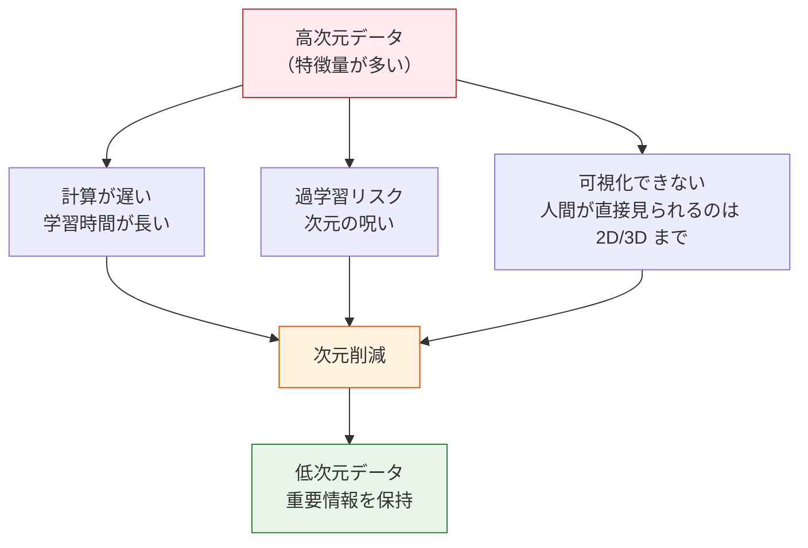
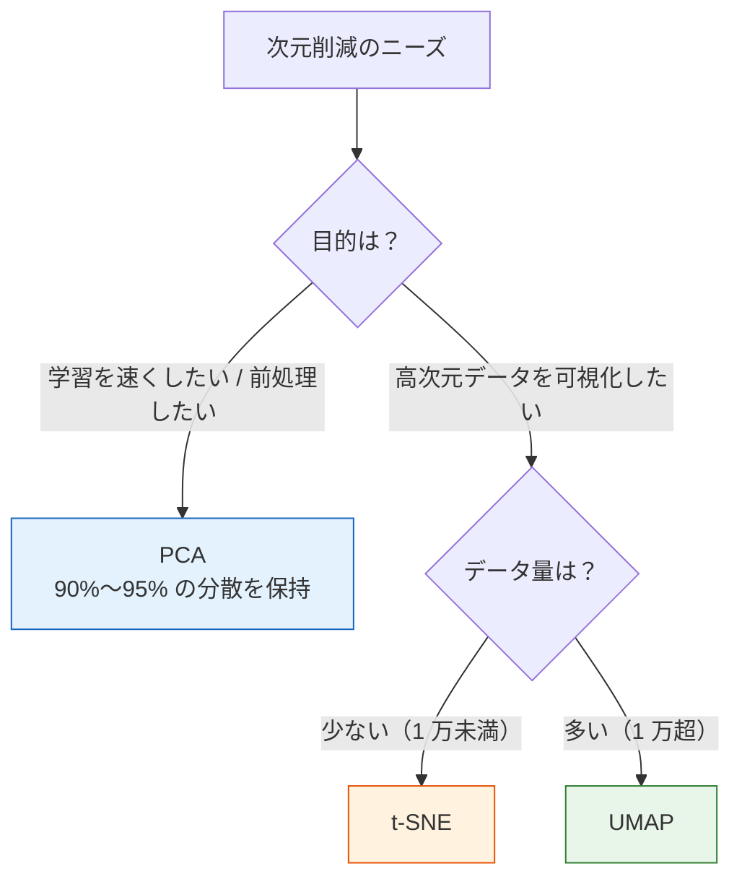

# 次元削減アルゴリズム


:::tip この節の位置づけ
実データには、数十個、場合によっては数千個の特徴量があることがよくあります。次元削減は**特徴量の数を減らしつつ、重要な情報を保つ**方法です。学習を速くできるだけでなく、可視化にも役立ちます。この節では、第 4 章の PCA の基礎を踏まえて、実践的な活用まで深めます。
:::

## 学習目標

- PCA の原理と実践的な使い方を深く理解する（第 4 章とつなげる）
- 分散説明率の分析を身につける
- t-SNE の可視化原理と使い方を理解する
- UMAP による次元削減手法を理解する

## まず、とても大事な学習イメージについて

この節は、最初にツール名で迷いやすいです。

- PCA
- t-SNE
- UMAP

でも、最初の 1 回でいちばん先に覚えるべきなのは、ツールの違いを丸暗記することではありません。まずは次の 2 つを分けて考えましょう。

> **モデル用の前処理として次元削減しているのか、それとも可視化のために次元削減しているのか。**

この目的がはっきりすると、あとの手法選びがぐっと分かりやすくなります。

---

## まずは地図を作ろう

次元削減は「いくつかのツール名を覚える」だけの学習になりがちですが、本当に大事なのは最初に目的を分けることです。  
なぜなら、次元削減で解決したい問題は、実はまったく違うことがあるからです。

- 特徴量を圧縮して学習を速くしたい
- ノイズや相関を減らしたい
- 高次元データを図にして構造を見たい

学び方としては、次の順番が安定しています。


「モデル用」と「可視化用」を分けて考えること。これがこの節でいちばん大事な最初の一歩です。

---

## 一、なぜ次元削減が必要なのか？

### 1.1 高次元データの問題



| 問題 | 説明 |
|------|------|
| **次元の呪い** | 特徴量が多いほどデータは疎になり、モデルが学習しにくくなる |
| **計算コスト** | 特徴量が多い → 学習が遅い、メモリを多く使う |
| **多重共線性** | 多くの特徴量が強く相関していて、冗長になっている |
| **可視化** | 3 次元を超えるデータはそのままでは図にできない |

### 1.2 次元削減の 2 つの考え方

| 考え方 | 手法 | 説明 |
|------|------|------|
| **特徴量選択** | 重要な特徴量を選ぶ | 元の特徴量の一部を残す |
| **特徴量抽出** | 新しい特徴量を作る | 元の特徴量を変換して、より少ない新しい特徴量にする（PCA、t-SNE） |

### 1.3 初めて学ぶときに、いちばん混乱しやすい点

多くの初心者は「次元削減」と「特徴量を消すこと」を同じものだと思いがちです。  
でも、この 2 つは同じではありません。

- 特徴量選択：元の列の中からいくつかの列を残す
- 次元削減：元の列を組み合わせて、より少ない新しい軸に変える

そのため、PCA のあとに得られる主成分は、元の列そのものではなく、それらの線形結合です。

### 1.3.1 初心者向けのたとえ

次元削減は、まずこんなイメージで考えると分かりやすいです。

- バラバラな情報のかたまりを、少ない本筋に圧縮し直す

これは単にいくつかの特徴量を削除することではありません。  
むしろ、たくさんの元の特徴量をまとめ直して、情報がより濃い新しい軸を作る感じです。

だから、次元削減で最初に覚えるべきなのはアルゴリズム名よりも、

- 情報を圧縮し、表現を組み替えること

です。

---

## 二、PCA の実践

### 2.1 原理の復習

:::info 第 4 章とのつながり
第 4 章の 1.3 節「固有値と固有ベクトル」では、PCA の数学的な原理を学びました。

- 共分散行列を計算する
- 固有値と固有ベクトルを求める
- 最大の固有値に対応する方向を主成分として選ぶ

この節では、**実データでどう使うか** に重点を置きます。
:::

**PCA の核心**：データの分散が最大になる方向を見つけて、そこへ射影する。

### 2.2 手書き数字の次元削減

```python
from sklearn.datasets import load_digits
from sklearn.preprocessing import StandardScaler
from sklearn.decomposition import PCA
import numpy as np
import matplotlib.pyplot as plt

# 手書き数字データを読み込む
digits = load_digits()
X, y = digits.data, digits.target
print(f"元データ: {X.shape[0]} サンプル, {X.shape[1]} 特徴量")

# いくつかのサンプルを確認
fig, axes = plt.subplots(2, 10, figsize=(15, 3))
for i, ax in enumerate(axes.ravel()):
    ax.imshow(digits.images[i], cmap='gray')
    ax.set_title(str(y[i]), fontsize=9)
    ax.axis('off')
plt.suptitle('手書き数字のサンプル（8×8 = 64 個の特徴量）')
plt.tight_layout()
plt.show()

# 標準化
scaler = StandardScaler()
X_scaled = scaler.fit_transform(X)

# PCA で 2 次元に削減
pca_2d = PCA(n_components=2)
X_2d = pca_2d.fit_transform(X_scaled)
print(f"次元削減後: {X_2d.shape}")
print(f"保持された分散比: {pca_2d.explained_variance_ratio_.sum():.1%}")

# 可視化
plt.figure(figsize=(10, 8))
scatter = plt.scatter(X_2d[:, 0], X_2d[:, 1], c=y, cmap='tab10', s=10, alpha=0.6)
plt.colorbar(scatter, label='数字')
plt.xlabel(f'PC1（分散比 {pca_2d.explained_variance_ratio_[0]:.1%}）')
plt.ylabel(f'PC2（分散比 {pca_2d.explained_variance_ratio_[1]:.1%}）')
plt.title('PCA による 2D 次元削減（手書き数字）')
plt.grid(True, alpha=0.3)
plt.show()
```

### 2.3 分散説明率の分析

**大事な問い**：主成分は何個残せばよいのか？

```python
# すべての主成分を使う
pca_full = PCA()
pca_full.fit(X_scaled)

# 分散説明率
explained = pca_full.explained_variance_ratio_
cumulative = np.cumsum(explained)

fig, axes = plt.subplots(1, 2, figsize=(14, 5))

# 各主成分の分散比
axes[0].bar(range(1, len(explained)+1), explained, color='steelblue', alpha=0.7)
axes[0].set_xlabel('主成分番号')
axes[0].set_ylabel('分散説明率')
axes[0].set_title('各主成分の分散比')
axes[0].set_xlim(0, 30)

# 累積分散
axes[1].plot(range(1, len(cumulative)+1), cumulative, 'bo-', markersize=3)
axes[1].axhline(y=0.9, color='r', linestyle='--', label='90% 閾値')
axes[1].axhline(y=0.95, color='orange', linestyle='--', label='95% 閾値')

# 90% に達する点を表示
n_90 = np.argmax(cumulative >= 0.9) + 1
n_95 = np.argmax(cumulative >= 0.95) + 1
axes[1].axvline(x=n_90, color='r', linestyle=':', alpha=0.5)
axes[1].axvline(x=n_95, color='orange', linestyle=':', alpha=0.5)

axes[1].set_xlabel('主成分数')
axes[1].set_ylabel('累積分散説明率')
axes[1].set_title('累積分散説明率（Scree Plot）')
axes[1].legend()

for ax in axes:
    ax.grid(True, alpha=0.3)

plt.tight_layout()
plt.show()

print(f"90% の分散を保持するには {n_90} 個の主成分が必要です（元は 64 個）")
print(f"95% の分散を保持するには {n_95} 個の主成分が必要です（元は 64 個）")
```

### 2.3.1 90% と 95%、どちらを選ぶべき？

これに絶対の正解はありません。ですが、初心者が最初に試すなら、次のように考えるとよいです。

- 学習速度や圧縮率を重視するなら、まず 90% を試す
- 情報の損失が気になるなら、まず 95% を試す
- 最後は、下流モデルの性能で確認する。分散説明率だけで決めない

なぜなら、「どれだけ分散を保ったか」と「下流タスクで最も良いか」は同じではないからです。


PCA の図を見るときは、まず「累積分散曲線」の折れ曲がり点を見ます。折れ曲がり点より前は主成分を 1 つ増やす価値が高く、後ろでは効果が小さくなります。90% や 95% はあくまで目安で、最後は下流モデルのスコア、学習速度、説明しやすさをまとめて判断します。

### 2.4 PCA がモデル性能に与える影響

```python
from sklearn.model_selection import train_test_split
from sklearn.linear_model import LogisticRegression
from sklearn.pipeline import make_pipeline
import time

X_train, X_test, y_train, y_test = train_test_split(X, y, test_size=0.2, random_state=42)

# 主成分数ごとの比較
n_components_list = [2, 5, 10, 20, 30, 64]
results = []

for n in n_components_list:
    pipe = make_pipeline(
        StandardScaler(),
        PCA(n_components=n) if n < 64 else PCA(),
        LogisticRegression(max_iter=5000, random_state=42)
    )

    start = time.time()
    pipe.fit(X_train, y_train)
    train_time = time.time() - start

    score = pipe.score(X_test, y_test)
    results.append({'n': n, 'score': score, 'time': train_time})
    print(f"PC={n:3d} | 正解率: {score:.1%} | 学習時間: {train_time:.3f}s")

# 可視化
fig, ax1 = plt.subplots(figsize=(8, 5))
ax2 = ax1.twinx()

ns = [r['n'] for r in results]
scores = [r['score'] for r in results]
times = [r['time'] for r in results]

ax1.plot(ns, scores, 'bo-', label='正解率')
ax2.plot(ns, times, 'rs-', label='学習時間')

ax1.set_xlabel('主成分数')
ax1.set_ylabel('正解率', color='blue')
ax2.set_ylabel('学習時間 (s)', color='red')
ax1.set_title('PCA 次元削減がモデル性能と速度に与える影響')

ax1.legend(loc='lower right')
ax2.legend(loc='center right')
ax1.grid(True, alpha=0.3)
plt.tight_layout()
plt.show()
```

### 2.4.1 PCA の本当の役割は、単なる次元圧縮ではない

プロジェクトで PCA が役立つ場面は、主に次の 3 つです。

- 冗長な相関情報を取り除く
- ノイズを減らしてモデルを安定させる
- その後のアルゴリズムが、よりコンパクトな特徴空間で学習できるようにする

だから、PCA をしたあとに見るべきなのは「次元がどれだけ減ったか」だけではありません。

- モデルは速くなったか
- 汎化性能は安定したか
- 過学習しにくくなったか

も一緒に見ましょう。

---

## 三、t-SNE による可視化

### 3.1 PCA の限界

PCA は**線形**の次元削減です。つまり、線形な方向しか見つけられません。複雑な高次元データでは、異なるクラスが PCA の 2D 図で重なって見えることがあります。

### 3.2 t-SNE の原理

t-SNE（t-distributed Stochastic Neighbor Embedding）は、**可視化**のために設計された非線形次元削減手法です。

**核心的な考え方**：
- 高次元空間で点同士の「似ている度合い」を計算する
- 低次元空間でも「似ている度合い」を計算する
- 低次元の座標を調整して、2 つの空間の類似度分布ができるだけ近くなるようにする

| 特徴 | 説明 |
|------|------|
| 非線形 | 複雑なデータ構造を表せる |
| 可視化向け | 通常は 2D か 3D にする |
| 局所構造を保つ | 近い点は低次元でも近くなる |
| ランダム性 | 実行するたびに結果が変わることがある |

### 3.3 t-SNE の実践

```python
from sklearn.manifold import TSNE

# t-SNE で次元削減
tsne = TSNE(n_components=2, random_state=42, perplexity=30)
X_tsne = tsne.fit_transform(X_scaled)

# PCA と t-SNE の比較
fig, axes = plt.subplots(1, 2, figsize=(16, 6))

axes[0].scatter(X_2d[:, 0], X_2d[:, 1], c=y, cmap='tab10', s=10, alpha=0.6)
axes[0].set_title('PCA による 2D 次元削減')
axes[0].set_xlabel('PC1')
axes[0].set_ylabel('PC2')

axes[1].scatter(X_tsne[:, 0], X_tsne[:, 1], c=y, cmap='tab10', s=10, alpha=0.6)
axes[1].set_title('t-SNE による 2D 次元削減')
axes[1].set_xlabel('t-SNE 1')
axes[1].set_ylabel('t-SNE 2')

for ax in axes:
    ax.grid(True, alpha=0.3)

plt.suptitle('PCA vs t-SNE（手書き数字データ）', fontsize=13)
plt.tight_layout()
plt.show()
```

### 3.4 perplexity パラメータ

`perplexity` は t-SNE が注目する「近傍の数」を調整するパラメータで、可視化結果に影響します。

```python
fig, axes = plt.subplots(1, 4, figsize=(20, 4))
perplexities = [5, 15, 30, 50]

for ax, perp in zip(axes, perplexities):
    tsne = TSNE(n_components=2, perplexity=perp, random_state=42)
    X_t = tsne.fit_transform(X_scaled)
    ax.scatter(X_t[:, 0], X_t[:, 1], c=y, cmap='tab10', s=8, alpha=0.6)
    ax.set_title(f'perplexity = {perp}')
    ax.grid(True, alpha=0.3)

plt.suptitle('t-SNE の perplexity パラメータの影響', fontsize=13)
plt.tight_layout()
plt.show()
```

:::warning t-SNE の注意点
1. **可視化専用**です。t-SNE を特徴量抽出に使って、そのままモデル学習に使うのはおすすめしません
2. **処理が遅い**です。大きいデータセットでは、まず PCA で 50 次元くらいまで落としてから t-SNE を使うことがあります
3. **距離の解釈に注意**してください。異なるクラスタ間の距離の大小を、原空間の意味で比べることはできません
4. **毎回結果が変わる**ことがあります（`random_state` を設定すると固定しやすいです）
:::

### 3.5 t-SNE で誤解しやすいポイント

t-SNE の図は見た目がきれいですが、初心者がよく誤解する点があります。

- クラスタ同士が離れて見えるほど、元の空間でも遠い
- 図がきれいに分かれていれば、モデルも必ず良い

この 2 つは、どちらも必ずしも正しくありません。  
t-SNE で本当に見るべきなのは、

- 近くにあるもの同士の関係が保たれているか
- 同じクラスのサンプルがまとまりやすいか

です。図全体を、厳密な幾何学地図として読むのはやめましょう。

---

## 四、UMAP による次元削減

### 4.1 UMAP の概要

UMAP（Uniform Manifold Approximation and Projection）は、t-SNE より速く、全体構造も比較的保ちやすい次元削減手法です。

| | t-SNE | UMAP |
|---|-------|------|
| 速度 | 遅い | かなり速い |
| 全体構造 | 保ちにくい | 比較的保ちやすい |
| 特徴量抽出に使えるか | おすすめしない | 使える |
| パラメータ | `perplexity` | `n_neighbors`, `min_dist` |

### 4.2 UMAP の実践

```bash
pip install umap-learn
```

```python
# UMAP のインストールが必要: pip install umap-learn
try:
    import umap

    reducer = umap.UMAP(n_components=2, random_state=42)
    X_umap = reducer.fit_transform(X_scaled)

    # 3 つの手法を比較
    fig, axes = plt.subplots(1, 3, figsize=(18, 5))

    axes[0].scatter(X_2d[:, 0], X_2d[:, 1], c=y, cmap='tab10', s=10, alpha=0.6)
    axes[0].set_title('PCA')

    axes[1].scatter(X_tsne[:, 0], X_tsne[:, 1], c=y, cmap='tab10', s=10, alpha=0.6)
    axes[1].set_title('t-SNE')

    axes[2].scatter(X_umap[:, 0], X_umap[:, 1], c=y, cmap='tab10', s=10, alpha=0.6)
    axes[2].set_title('UMAP')

    for ax in axes:
        ax.grid(True, alpha=0.3)

    plt.suptitle('PCA vs t-SNE vs UMAP（手書き数字）', fontsize=13)
    plt.tight_layout()
    plt.show()

except ImportError:
    print("先に umap-learn をインストールしてください: pip install umap-learn")
```

### 4.3 UMAP のパラメータ

| パラメータ | 説明 | 推奨 |
|------|------|------|
| `n_neighbors` | 近傍の数（perplexity に近い考え方） | 15（デフォルト） |
| `min_dist` | 低次元空間での点同士の最小距離 | 0.1（デフォルト） |
| `n_components` | 削減後の次元数 | 2 または 3 |
| `metric` | 距離指標 | 'euclidean'（デフォルト） |

---

## 五、次元削減手法のまとめ

| 手法 | 種類 | 速度 | 適した場面 |
|------|------|------|---------|
| **PCA** | 線形 | 速い | 特徴量抽出、データ圧縮、前処理 |
| **t-SNE** | 非線形 | 遅い | 高次元データの可視化（2D/3D） |
| **UMAP** | 非線形 | 中程度 | 可視化 + 特徴量抽出 |



### 5.1 初めてプロジェクトで使うなら、どう選ぶのが安定？

まずは、次の順番で試すのがよいです。

1. 目的がモデル用の前処理なら、まず `PCA`
2. 目的が 2D 可視化なら、まず `PCA` でベースラインを見てから `t-SNE`
3. データが大きくて、構造も保ちたいなら `UMAP` も試す

この順番が安定しているのは、いちばん説明しやすい方法から始められるからです。

---

## 七、初めて次元削減をプロジェクトに入れるときの、いちばん安定した順番

実際にプロジェクトへ次元削減を入れるときは、次の順番で進めると安心です。

1. まず目的をはっきりさせる：高速化、ノイズ低減、可視化のどれか
2. モデル用の前処理なら、まず PCA を試す
3. 90% と 95% の分散を保つ場合で、下流の結果を比べる
4. 探索的な可視化なら、t-SNE や UMAP を追加で試す
5. 最後は、下流タスクの指標や業務上の説明しやすさで、残す価値があるか判断する

こうすると、次元削減を「どの図がきれいか」だけで学ぶことにならず、実際のプロジェクトでの表現設計として考えられます。

:::info 次につながる内容
- **次の節**：異常検知――データの中の「おかしな値」を見つける
- **第 4 章の復習**：PCA の固有値の原理（1.3 節）
:::

---

## まとめ

| 要点 | 説明 |
|------|------|
| PCA | 線形の次元削減。最大分散方向を保ち、特徴量抽出に使える |
| 分散説明率 | 累積で 90%〜95% くらいを目安に、何個主成分を残すか決める |
| t-SNE | 非線形で、可視化専用。局所構造を保つ |
| UMAP | t-SNE より速く、全体構造も比較的保ちやすい |

## この節で本当に持ち帰ってほしいこと

1 つだけ覚えるなら、私はこれをおすすめします。

> **次元削減は、図をきれいにするためではなく、「情報をどれだけ残し、どれだけコンパクトに表現するか」を目的に選ぶものです。**

だから、本当に大事なのは次の点です。

- まずモデル用の前処理と可視化探索を分ける
- PCA が基本の出発点だと知る
- t-SNE と UMAP は探索・表示に強いと知る
- 最後は下流タスクの結果で判断する

## 実践練習

### 練習 1：Iris の PCA 次元削減

`load_iris()` を使って、PCA で 2D と 3D に削減してみましょう（`mpl_toolkits.mplot3d` を使用）。3 つの品種がどちらでより分かれやすいか比べてください。

### 練習 2：分散説明率

`load_wine()` データで PCA を行い、Scree Plot を描いて、95% の分散説明率を達成するには何個の主成分が必要か調べてください。

### 練習 3：t-SNE vs PCA

`load_digits()` データを使って、PCA と t-SNE の 2D 可視化結果を比較してください。`perplexity` の値を 5, 15, 30, 50, 100 と変えて、どれが見やすいか観察しましょう。

### 練習 4：次元削減 + 分類

`load_digits()` で、まず PCA で 5, 10, 20, 30, 50 次元に削減し、その後にロジスティック回帰で分類してください。「次元数 vs 正解率」の曲線を描き、最適な次元数を見つけましょう。
