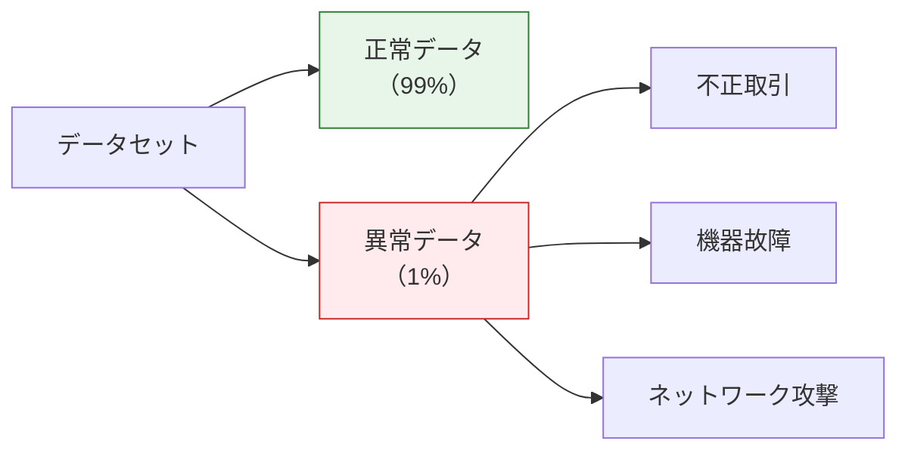
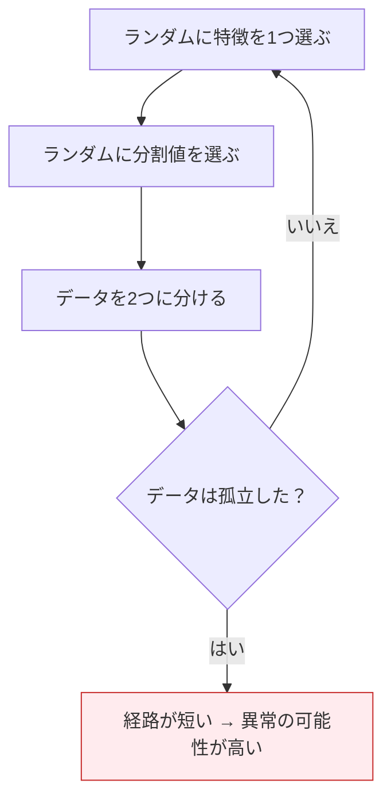
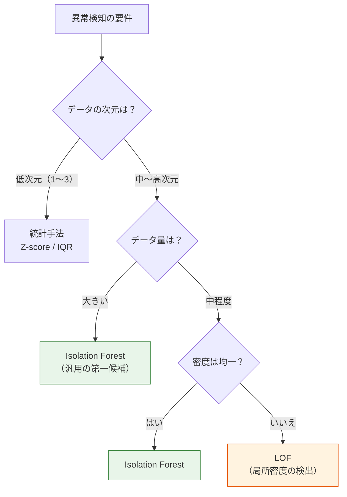

# 5.3.4 異常検知


:::tip この節の位置づけ
異常検知は、データの中から**「いつもと違う」サンプル**を見つけるために使います。たとえば、クレジットカードの不正利用、ネットワーク侵入、機器の故障などです。分類と違って、異常はまれで、十分なラベルがないことが多いため、特別なアルゴリズムが必要になります。
:::

## 学習目標

- 統計手法による異常検知（Z-score、IQR）を理解する
- Isolation Forest を理解する
- One-Class SVM を理解する
- LOF（局所外れ値因子）を理解する
- 適切な方法を比較して選べるようになる

## まず、とても大事な学習イメージを共有します

この節で初心者がいちばんつまずきやすいのは、普通の分類のように分かりやすいラベルや境界がないことです。  
最初の1回で目指すべきなのは、各手法を暗記することではなく、まずこの考え方をつかむことです。

> **異常検知は、多くの場合「正常とはどんな状態か」を先に決めてから、そこから大きく外れたものを見つける。**

この感覚がつかめると、後で出てくる統計手法、Isolation Forest、LOF、しきい値の考え方がかなり分かりやすくなります。

---

## まずは全体の地図を作ろう

異常検知が初心者にとって難しい理由は、  
普通の分類のように「ラベルがはっきりしているからそのまま学べばよい」という問題ではないからです。実際には、次のような状況がよくあります。

- 異常データが非常に少ない
- 異常ラベルが完全ではない
- 新しい異常は、昔の異常と同じ形とは限らない

より安定した理解の順番は次の通りです。


つまり、異常検知でいちばん大事なのは、まずモデル名を覚えることではなく、「自分にとっての異常とは何か」をはっきりさせることです。


このマンガは、この節の大事な注意点を表しています。異常検知は単に「変な点を探す」作業ではありません。その点が、行動を起こすほど重要かどうかを判断する必要があります。だから、しきい値、`contamination`、誤検知、見逃し、業務コストは、最後のおまけではなく、モデル設計そのものの一部です。

### 始める前のキーワード解説

| 用語 | 初心者向けの意味 | この節での役割 |
|---|---|---|
| anomaly / outlier | 正常パターンに合わないサンプル | 同じ点でも、業務によって無害な揺れにも緊急リスクにもなる |
| しきい値 | 「警報を出す」か「無視する」かを決める境界 | 動かすと誤検知と見逃しが変わる |
| 誤検知 false positive | 正常な点を異常と判定してしまうこと | 多すぎると、ユーザーが警報を信じなくなる |
| 見逃し false negative | 本当の異常を見逃してしまうこと | 不正検知、セキュリティ、機器監視では大きな損失になることがある |
| `contamination` | 想定する異常割合 | 多くの sklearn 異常検知モデルで、どのくらいの点を異常扱いするかに関係する |
| `decision_function()` | 異常スコア。多くの sklearn 検知器では大きいほど正常寄り | スコアのヒートマップやしきい値調整に使える |
| `fit_predict()` | 検知器を学習し、そのままラベルを出す処理 | 本節の例では `1` が正常、`-1` が異常 |
| LOF | Local Outlier Factor、局所外れ値因子 | 異常かどうかが局所密度に依存する場合に役立つ |

---

## 一、異常検知の概要

### 異常とは何か？

**異常（Anomaly / Outlier）** = ほとんどのデータと大きく異なるサンプル。



| 応用シーン | 正常データ | 異常データ |
|---------|---------|---------|
| クレジットカード不正利用 | 通常の購入 | 不正な引き落とし |
| 産業監視 | 機器が正常に稼働 | 故障が近い状態 |
| ネットワークセキュリティ | 通常トラフィック | DDoS 攻撃 |
| 医療診断 | 健康指標が正常 | 疾病の兆候 |

### なぜ分類器を使わないのか？

| 問題 | 説明 |
|------|------|
| **データ不均衡** | 異常サンプルが 0.1% しかないこともある |
| **ラベル不足** | 多くの異常は事前にどんな形か分からない |
| **異常の変化** | 新しい不正手法が次々に出てくる |

### 異常検知と分類の本当の違い

分類は一般的に、

- 「A と B をどう分けるか」

を学びます。

一方、異常検知でよくやるのは、

- 「正常サンプルはどんな形か」
- 「どの程度外れたら警戒すべきか」

を学ぶことです。

だからこそ、異常検知ではしきい値、誤検知、見逃し、そして業務上のコストがとても重要になります。

### 初心者向けのたとえ

異常検知は、まず次のように考えると分かりやすいです。

- まず「普通の生活リズム」を理解する

たとえば、

- 正常な機器の温度変化はどのくらいか
- 正常なユーザーのログイン時間や操作頻度はどのくらいか

このとき、異常は必ずしも「一度も見たことがないもの」ではありません。  
むしろ、

- 正常パターンから大きく外れている
- あるいは、ほとんど人がいない場所にある

と考えると理解しやすいです。

### デモ用データを作る

```python
import numpy as np
import matplotlib.pyplot as plt

rng = np.random.default_rng(seed=42)

# 正常データ：2次元ガウス分布
n_normal = 300
X_normal = rng.normal(size=(n_normal, 2)) * 1.5 + [5, 5]

# 異常データ：ランダムに散らばった点
n_anomaly = 15
X_anomaly = rng.uniform(0, 12, (n_anomaly, 2))

# 結合
X_all = np.vstack([X_normal, X_anomaly])
y_true = np.array([1] * n_normal + [-1] * n_anomaly)  # 1=正常, -1=異常

print(f"Total samples: {X_all.shape[0]}")
print(f"Normal samples: {n_normal}")
print(f"Injected anomalies: {n_anomaly}")
print(f"True anomaly ratio: {n_anomaly / len(X_all):.1%}")

plt.figure(figsize=(8, 6))
plt.scatter(X_normal[:, 0], X_normal[:, 1], s=20, alpha=0.6, label='正常', color='steelblue')
plt.scatter(X_anomaly[:, 0], X_anomaly[:, 1], s=80, marker='x', color='red',
            linewidths=2, label='異常')
plt.title('異常検知デモデータ')
plt.xlabel('特徴 1')
plt.ylabel('特徴 2')
plt.legend()
plt.grid(True, alpha=0.3)
plt.show()
```

期待される出力：

```text
Total samples: 315
Normal samples: 300
Injected anomalies: 15
True anomaly ratio: 4.8%
```

実際のプロジェクトでは、本当の異常割合は分からないことが多いです。ここで分かるのは、人工的に作った学習用データだからです。そのため、学習と評価に使いやすくなっています。

---

## 二、統計手法

### Z-score 法

**原理**：データが正規分布に従うと仮定し、平均から N 個の標準偏差以上離れたサンプルを異常とみなします。

> **Z = (x - μ) / σ**

通常は |Z| > 3 を異常とみなします（データの 99.7% は 3σ 以内）。

```python
from scipy import stats

# 1次元の例
rng = np.random.default_rng(seed=42)
data_1d = np.concatenate([rng.normal(size=200) * 2 + 10, [25, -5, 30]])

z_scores = np.abs(stats.zscore(data_1d))
threshold = 3
anomalies = z_scores > threshold
print(f"Z-score anomalies found: {anomalies.sum()}")
print("Z-score anomaly values:", np.round(data_1d[anomalies], 2).tolist())

plt.figure(figsize=(10, 4))
plt.scatter(range(len(data_1d)), data_1d, c=['red' if a else 'steelblue' for a in anomalies],
            s=20, alpha=0.7)
plt.axhline(y=data_1d[~anomalies].mean() + threshold * data_1d[~anomalies].std(),
            color='orange', linestyle='--', label='+3σ')
plt.axhline(y=data_1d[~anomalies].mean() - threshold * data_1d[~anomalies].std(),
            color='orange', linestyle='--', label='-3σ')
plt.title(f'Z-score 異常検知（{anomalies.sum()} 個の異常を検出）')
plt.legend()
plt.grid(True, alpha=0.3)
plt.show()
```

期待される出力：

```text
Z-score anomalies found: 3
Z-score anomaly values: [25.0, -5.0, 30.0]
```

### IQR 法

**原理**：四分位数に基づいて判断し、正規分布の仮定に依存しません。

- IQR = Q3 - Q1（四分位範囲）
- 異常：x < Q1 - 1.5×IQR または x > Q3 + 1.5×IQR

```python
# IQR 法
Q1 = np.percentile(data_1d, 25)
Q3 = np.percentile(data_1d, 75)
IQR = Q3 - Q1
lower = Q1 - 1.5 * IQR
upper = Q3 + 1.5 * IQR
anomalies_iqr = (data_1d < lower) | (data_1d > upper)
print(f"Q1={Q1:.2f}, Q3={Q3:.2f}, IQR={IQR:.2f}")
print(f"Lower={lower:.2f}, Upper={upper:.2f}")
print(f"IQR anomalies found: {anomalies_iqr.sum()}")
print("IQR anomaly values:", np.round(data_1d[anomalies_iqr], 2).tolist())

fig, axes = plt.subplots(1, 2, figsize=(12, 4))

# 箱ひげ図
axes[0].boxplot(data_1d, vert=False)
axes[0].set_title('箱ひげ図（異常値を自動で表示）')

# 散布図
axes[1].scatter(range(len(data_1d)), data_1d,
                c=['red' if a else 'steelblue' for a in anomalies_iqr], s=20, alpha=0.7)
axes[1].axhline(y=upper, color='orange', linestyle='--', label=f'上限={upper:.1f}')
axes[1].axhline(y=lower, color='orange', linestyle='--', label=f'下限={lower:.1f}')
axes[1].set_title(f'IQR 異常検知（{anomalies_iqr.sum()} 個の異常を検出）')
axes[1].legend()
axes[1].grid(True, alpha=0.3)

plt.tight_layout()
plt.show()
```

期待される出力：

```text
Q1=8.68, Q3=11.13, IQR=2.45
Lower=5.01, Upper=14.80
IQR anomalies found: 4
IQR anomaly values: [15.83, 25.0, -5.0, 30.0]
```

ここでは IQR が Z-score より 1 つ多く検出しています。これはバグではありません。2つの方法が「どのくらい離れたら異常か」を違うルールで決めているからです。

### Z-score と IQR の比較

| | Z-score | IQR |
|---|---------|-----|
| 仮定 | 正規分布 | 分布の仮定なし |
| ロバスト性 | 外れ値の影響を受けやすい | よりロバスト |
| 適用対象 | おおむね正規分布のデータ | さまざまな分布 |
| しきい値 | 通常 3σ | 1.5×IQR |

### 統計手法は、どんなときに特に試す価値がある？

次のような場合です。

- 低次元データ
- ルールがシンプル
- まず明らかな外れ値を素早く見つけたい

このような場面では、統計手法は今でも十分に有力です。  
価値があるのは「簡単だから」だけではなく、次の点にもあります。

- すぐに解釈しやすい baseline を作れる
- 異常の割合をざっくりつかめる
- データ分布そのものの問題を早めに見つけられる


この図を見るときは、まず異常がどんな形かを考えましょう。単純な1列の極端値なら Z-score や IQR で十分速いです。高次元空間で少数の孤立点を見つけたいなら Isolation Forest が向いています。局所的な密度差に依存するなら LOF を見ます。正常な境界を学ばせたいなら One-Class SVM を試します。

---

## 三、Isolation Forest

### 原理

Isolation Forest（孤立森林）の考え方はとても巧妙です。

**異常点は「孤立」しやすい** ので、少ない分割回数で切り離せます。



| 概念 | 説明 |
|------|------|
| 経路長 | ルートノードから葉ノードまでのステップ数 |
| 異常スコア | 経路が短い → スコアが高い → 異常の可能性が高い |
| 正常点 | 「正常」データに囲まれているため、孤立させるのにより多くの分割が必要 |

### sklearn での実装

```python
from sklearn.ensemble import IsolationForest

# Isolation Forest を学習
iso = IsolationForest(
    n_estimators=100,
    contamination=0.05,  # 想定される異常割合
    random_state=42
)
y_pred_iso = iso.fit_predict(X_all)  # 1=正常, -1=異常
print(f"Isolation Forest detected: {(y_pred_iso == -1).sum()}")

# 可視化
fig, axes = plt.subplots(1, 2, figsize=(14, 5))

# 予測結果
colors_pred = ['red' if p == -1 else 'steelblue' for p in y_pred_iso]
axes[0].scatter(X_all[:, 0], X_all[:, 1], c=colors_pred, s=20, alpha=0.7)
n_detected = (y_pred_iso == -1).sum()
axes[0].set_title(f'Isolation Forest の検出結果\n（{n_detected} 個の異常を検出）')

# 異常スコアのヒートマップ
xx, yy = np.meshgrid(np.linspace(-2, 14, 200), np.linspace(-2, 14, 200))
Z = iso.decision_function(np.c_[xx.ravel(), yy.ravel()])
Z = Z.reshape(xx.shape)
axes[1].contourf(xx, yy, Z, levels=20, cmap='RdBu')
axes[1].scatter(X_all[:, 0], X_all[:, 1], c=colors_pred, s=20, edgecolors='white', linewidth=0.5)
axes[1].set_title('異常スコアのヒートマップ\n（青=正常、赤=異常）')

for ax in axes:
    ax.grid(True, alpha=0.3)

plt.tight_layout()
plt.show()

# 評価
from sklearn.metrics import classification_report
print("Isolation Forest の評価:")
print(classification_report(y_true, y_pred_iso, target_names=['異常(-1)', '正常(1)']))
```

期待される出力の一部：

```text
Isolation Forest detected: 16
              precision    recall  f1-score   support

      異常(-1)      0.75      0.80      0.77        15
       正常(1)      0.99      0.99      0.99       300
```

15 個の異常を入れましたが、モデルは 16 個を異常として検出しました。この違いこそ、異常検知がしきい値とコストの問題である理由です。不正検知では少し多めの警報が許容されることもありますが、ユーザー向け通知では誤検知が多いと迷惑になります。

### 重要なパラメータ

| パラメータ | 説明 | 推奨 |
|------|------|------|
| `n_estimators` | 木の数 | 100（デフォルト） |
| `contamination` | 異常割合の推定値 | 業務に応じて設定 |
| `max_samples` | 1本の木に使うサンプル数 | 'auto' または 256 |
| `max_features` | 1本の木で使う特徴量の割合 | 1.0（デフォルト） |

### なぜ Isolation Forest は第一候補になりやすいのか？

多くの実務タスクで、ちょうどよいバランスにあるからです。

- 統計手法よりも高次元データを扱いやすい
- One-Class SVM より大規模データに拡張しやすい
- LOF よりも汎用的な baseline として使いやすい

そのため、初めて異常検知プロジェクトに取り組むとき、まだ構造の仮定がはっきりしていなければ、まず Isolation Forest を試すのがいちばん安定です。

---

## 四、One-Class SVM

### 原理

**正常データだけで学習し**、「正常」の境界を学びます。境界の外にあるものを異常とみなします。

```python
from sklearn.svm import OneClassSVM

# One-Class SVM
ocsvm = OneClassSVM(kernel='rbf', gamma='auto', nu=0.05)  # nu ≈ 異常割合
y_pred_svm = ocsvm.fit_predict(X_all)
print(f"One-Class SVM detected: {(y_pred_svm == -1).sum()}")

# 可視化
fig, axes = plt.subplots(1, 2, figsize=(14, 5))

colors_svm = ['red' if p == -1 else 'steelblue' for p in y_pred_svm]
axes[0].scatter(X_all[:, 0], X_all[:, 1], c=colors_svm, s=20, alpha=0.7)
n_detected = (y_pred_svm == -1).sum()
axes[0].set_title(f'One-Class SVM の検出結果\n（{n_detected} 個の異常を検出）')

# 決定境界
Z_svm = ocsvm.decision_function(np.c_[xx.ravel(), yy.ravel()])
Z_svm = Z_svm.reshape(xx.shape)
axes[1].contourf(xx, yy, Z_svm, levels=20, cmap='RdBu')
axes[1].contour(xx, yy, Z_svm, levels=[0], colors='black', linewidths=2)
axes[1].scatter(X_all[:, 0], X_all[:, 1], c=colors_svm, s=20, edgecolors='white', linewidth=0.5)
axes[1].set_title('One-Class SVM の決定境界')

for ax in axes:
    ax.grid(True, alpha=0.3)

plt.tight_layout()
plt.show()
```

期待される出力：

```text
One-Class SVM detected: 60
```

この結果は学習上とても役に立ちます。この玩具データと `gamma='auto'` では、One-Class SVM は Isolation Forest よりかなり積極的に異常を出します。`nu=0.05` は「必ず 5% だけ検出する」という魔法のスイッチではなく、制約に近いパラメータです。

### 重要なパラメータ

| パラメータ | 説明 |
|------|------|
| `kernel` | カーネル関数（'rbf' が最もよく使われる） |
| `nu` | 異常割合の上限（0〜1） |
| `gamma` | RBF カーネルのパラメータ（'auto' または 'scale'） |

---

## 五、LOF（局所外れ値因子）

### 原理

LOF（Local Outlier Factor）は、**ある点とその近傍の密度**を比べて異常かどうかを判断します。

- 正常点：近傍の密度が自分とだいたい同じ
- 異常点：近傍の密度の方がずっと高い（自分が「低密度領域」にいる）

LOF の強みは、**「局所的な異常」** を検出できることです。異なる密度の領域が混ざっていても対応しやすいです。

### sklearn での実装

```python
from sklearn.neighbors import LocalOutlierFactor

# LOF
lof = LocalOutlierFactor(n_neighbors=20, contamination=0.05)
y_pred_lof = lof.fit_predict(X_all)
print(f"LOF detected: {(y_pred_lof == -1).sum()}")

# 可視化
fig, ax = plt.subplots(figsize=(8, 6))
colors_lof = ['red' if p == -1 else 'steelblue' for p in y_pred_lof]

# LOF スコア（絶対値が大きいほど異常）
lof_scores = -lof.negative_outlier_factor_
sizes = 20 + (lof_scores - lof_scores.min()) / (lof_scores.max() - lof_scores.min()) * 200
print(f"LOF score range: {lof_scores.min():.2f} to {lof_scores.max():.2f}")

ax.scatter(X_all[:, 0], X_all[:, 1], c=colors_lof, s=sizes, alpha=0.6,
           edgecolors='white', linewidth=0.5)
n_detected = (y_pred_lof == -1).sum()
ax.set_title(f'LOF の検出結果（円が大きいほど = より異常、{n_detected} 個を検出）')
ax.grid(True, alpha=0.3)
plt.tight_layout()
plt.show()
```

期待される出力：

```text
LOF detected: 16
LOF score range: 0.96 to 3.21
```

LOF スコアは、相対的な信号として見るのが自然です。スコアが大きいほど「その点は周囲の近傍に似ていない」という意味であり、必ずしも全体空間で最も遠い点という意味ではありません。

### 重要なパラメータ

| パラメータ | 説明 | 推奨 |
|------|------|------|
| `n_neighbors` | 近傍として見る点の数 | 20（デフォルト） |
| `contamination` | 異常割合 | 'auto' または手動設定 |

### LOF はどんな問題に向いているのか？

LOF で大事なのは式そのものより、次のようなケースに強いことです。

- 全体としてはそこまで極端ではない
- でも、局所的な近傍では明らかに周囲から浮いている

これが「局所異常」という考え方です。  
データの場所によって密度差が大きいなら、LOF は全体の境界だけを見る方法よりもよく効くことがあります。

---

## 六、各手法の比較

```python
from sklearn.ensemble import IsolationForest
from sklearn.svm import OneClassSVM
from sklearn.neighbors import LocalOutlierFactor

methods = {
    'Isolation Forest': IsolationForest(contamination=0.05, random_state=42),
    'One-Class SVM': OneClassSVM(nu=0.05, kernel='rbf', gamma='auto'),
    'LOF': LocalOutlierFactor(n_neighbors=20, contamination=0.05),
}

fig, axes = plt.subplots(1, 3, figsize=(18, 5))

for ax, (name, model) in zip(axes, methods.items()):
    y_pred = model.fit_predict(X_all)
    colors = ['red' if p == -1 else 'steelblue' for p in y_pred]
    ax.scatter(X_all[:, 0], X_all[:, 1], c=colors, s=20, alpha=0.7)
    n_anomalies = (y_pred == -1).sum()
    print(f"{name}: {n_anomalies} anomalies detected")
    ax.set_title(f'{name}\n{n_anomalies} 個の異常を検出')
    ax.grid(True, alpha=0.3)

plt.suptitle('3つの異常検知手法の比較', fontsize=13)
plt.tight_layout()
plt.show()
```

期待される出力：

```text
Isolation Forest: 16 anomalies detected
One-Class SVM: 60 anomalies detected
LOF: 16 anomalies detected
```

| | 統計手法 | Isolation Forest | One-Class SVM | LOF |
|---|---------|-----------------|---------------|-----|
| 原理 | 平均/四分位からの距離 | ランダム分割で孤立 | 正常境界を学習 | 局所密度の比較 |
| 速度 | 最速 | 速い | 中程度 | 中程度 |
| 高次元データ | 苦手 | 得意 | 得意 | 中程度 |
| 局所異常 | 検出しにくい | 普通 | 普通 | 得意 |
| 大規模データ | 得意 | 得意 | 苦手 | 中程度 |
| 適用場面 | シンプル・低次元 | 汎用の第一候補 | カーネル関数を使いたいとき | 密度が不均一なとき |

---

## 七、実践：クレジットカード不正検知のシミュレーション

```python
from sklearn.datasets import make_classification
from sklearn.ensemble import IsolationForest
from sklearn.metrics import classification_report, confusion_matrix
from sklearn.preprocessing import StandardScaler

# 強い不均衡データをシミュレート
X_cc, y_cc = make_classification(
    n_samples=5000, n_features=10, n_informative=5,
    n_redundant=3, n_classes=2,
    weights=[0.97, 0.03],  # 97% 正常, 3% 異常
    random_state=42
)

print(f"正常サンプル: {(y_cc == 0).sum()}")
print(f"異常サンプル: {(y_cc == 1).sum()}")

# 標準化
scaler = StandardScaler()
X_cc_scaled = scaler.fit_transform(X_cc)

# Isolation Forest で検出
iso = IsolationForest(contamination=0.05, random_state=42)
y_pred = iso.fit_predict(X_cc_scaled)

# ラベル形式を変換（iso: 1=正常,-1=異常 → 0=正常,1=異常）
y_pred_binary = (y_pred == -1).astype(int)

print("\n検出結果:")
print(classification_report(y_cc, y_pred_binary, target_names=['正常', '異常']))

# 混同行列
cm = confusion_matrix(y_cc, y_pred_binary)
fig, ax = plt.subplots(figsize=(6, 5))
im = ax.imshow(cm, cmap='Blues')
ax.set_xticks([0, 1])
ax.set_yticks([0, 1])
ax.set_xticklabels(['正常', '異常'])
ax.set_yticklabels(['正常', '異常'])
ax.set_xlabel('予測')
ax.set_ylabel('実際')
ax.set_title('Isolation Forest 不正検知の混同行列')

for i in range(2):
    for j in range(2):
        color = 'white' if cm[i, j] > cm.max() / 2 else 'black'
        ax.text(j, i, str(cm[i, j]), ha='center', va='center', color=color, fontsize=16)

plt.colorbar(im)
plt.tight_layout()
plt.show()
```

期待される出力の一部：

```text
正常サンプル: 4823
異常サンプル: 177

              precision    recall  f1-score   support

          正常      0.968     0.953     0.960      4823
          異常      0.096     0.136     0.112       177
```

この不正検知のシミュレーションは、あえて難しくしています。正常サンプルが多いため全体の正解率は高く見えますが、異常クラスの precision と recall は弱いです。異常検知では、少数クラスの指標と混同行列を必ず確認しましょう。

---

## 八、どうやって方法を選ぶか？



:::tip 実用的なおすすめ
1. **最初の候補**：Isolation Forest（汎用的、速い、性能がよい）
2. **低次元で単純な場面**：Z-score または IQR で十分
3. **密度が不均一**：LOF
4. **`contamination` の設定**：業務知識から異常割合を見積もる
:::

### 初めて異常検知プロジェクトをやるとき、より安定した順番は？

次の順番がおすすめです。

1. まず統計手法でデータ分布と明らかな外れ値を見る
2. 次に `Isolation Forest` で汎用 baseline を作る
3. 局所密度差が大きいなら `LOF` を追加する
4. かなりはっきりした「正常境界」の考えがあるなら `One-Class SVM` を試す
5. 最後に、誤検知 / 見逃しのコストに合わせてしきい値と contamination を決める

この流れの方が、いきなり高性能モデルを積むより安定します。  
先に分布の感覚と baseline を持てるからです。

---

## 九、最初に異常検知をプロジェクトへ入れるときの、いちばん安定なデフォルト順

実際に異常検知をプロジェクトへ入れるときは、まず次の順番で進めるとよいです。

1. まず「何を異常とするか」を定義する
2. 次に異常割合のおおよその範囲を見積もる
3. 低次元で単純なデータなら統計手法を試す
4. 高次元で汎用的な baseline として Isolation Forest を試す
5. 局所密度差が大きいときは LOF を見る
6. 最後に誤検知と見逃しのコストに合わせてしきい値を決める

この順番が安定なのは、いきなりモデル比較をするのではなく、先に次の3つを整理できるからです。

- 異常の定義
- 異常の割合
- 評価コスト

:::info 次の章とのつながり
- **第 4 章**：モデル評価 —— 異常検知の結果をどう科学的に評価するか
- **第 5 章**：特徴量エンジニアリング —— 異常検知のためによりよい特徴量を準備する
:::

---

## まとめ

| 要点 | 説明 |
|------|------|
| 統計手法 | Z-score（正規分布の仮定）、IQR（仮定なし） |
| Isolation Forest | ランダム分割で孤立させる、汎用の第一候補 |
| One-Class SVM | 正常境界を学習する、カーネルが柔軟 |
| LOF | 局所密度を比較し、局所異常を検出できる |
| contamination | 多くの手法で異常割合の見積もりが必要 |

## この節でいちばん持ち帰ってほしいこと

もし1つだけ覚えるなら、これを覚えてください。

> **異常検知は「変な点を探す」だけではなく、限られた情報の中で「どの程度の異常なら警報を出すべきか」を決める作業でもある。**

だから本当に大切なのは、

- まず異常の業務的な意味を理解する
- 次に方法を選ぶ
- 最後に誤検知と見逃しのコストを踏まえて結果を解釈する

ことです。

## ハンズオン練習

### 練習 1：IQR と Z-score の比較

異常値を含む1次元データ（ガウス分布の混合 + 一様ノイズ）を作り、Z-score と IQR で異常を検出して、結果の違いを比べてください。

### 練習 2：Isolation Forest のパラメータ調整

デモデータを使って、異なる `contamination` の値（0.01, 0.05, 0.1, 0.2）を試し、検出結果の変化を観察してください。4枚のサブプロットで比較しましょう。

### 練習 3：実データセット

sklearn の `fetch_kddcup99`（ネットワーク侵入検知データセットのサブセット。`subset='SA'` が使えます）を使って異常検知を行ってください。Isolation Forest と LOF の結果を比較しましょう。

### 練習 4：複数手法の融合

同じデータに対して Isolation Forest、One-Class SVM、LOF で異常検知を行い、その後「多数決」（少なくとも 2 つの手法が異常と判定したら異常）で結果を融合してください。単独手法と融合手法の性能を比較しましょう。
