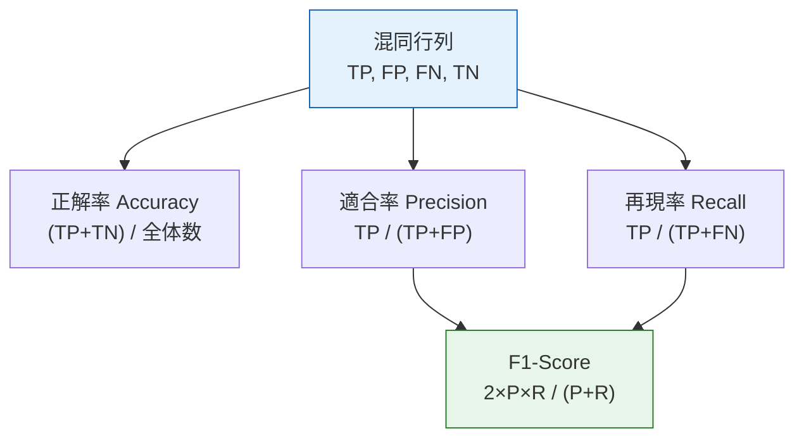
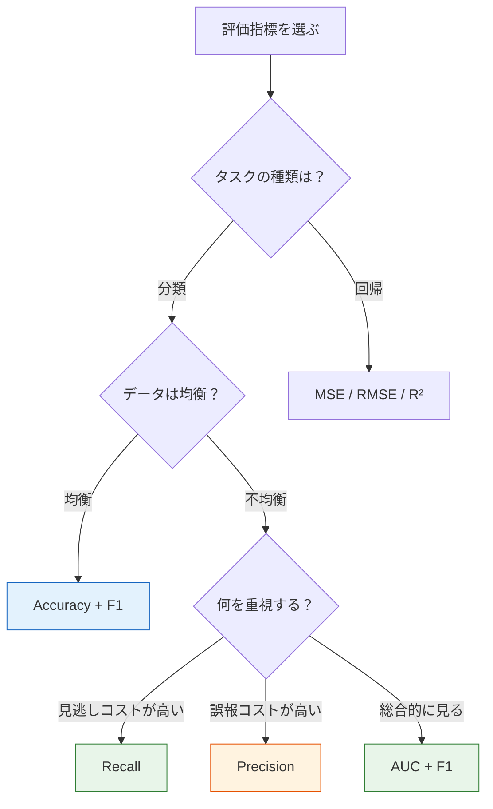

# 5.4.2 評価指標


:::tip この節の位置づけ
モデルの学習が終わったあと、**どうやってモデルの良し悪しを判断するか**？ 正解率 95% なら必ず良いのでしょうか？ いいえ、そうとは限りません！ 指標を間違えると、まったく逆の判断をしてしまうことがあります。この節では、さまざまな場面で何を重視すべきかを身につけます。
:::

## 学習目標

- 分類指標を理解する：正解率、適合率、再現率、F1-score、混同行列
- ROC 曲線と AUC を理解する
- 回帰指標を理解する：MSE、RMSE、MAE、R²
- 多クラス評価（macro、micro、weighted）を理解する

## まず、とても大事な学習の見通し

この節で初心者が一番つまずきやすいのは、公式そのものではなく、次の点です。

- 指標がたくさんある
- どれもそれっぽく見える
- でも、最初のプロジェクトではどれを見ればよいか分からない

なので、この節で最初に目指すべきことは「すべての指標を暗記すること」ではありません。まずは、判断のための枠組みを作ることです。

> **まずタスクの種類を確認し、次に誤りのコストを考え、最後に主指標を選ぶ。**

この軸ができると、Accuracy、Recall、AUC、RMSE といった指標が、ただのバラバラな用語ではなくなります。

---

## まずは全体の地図を作ろう

初心者が評価指標を学ぶとき、よくある問題は「公式が書けない」ことではなく、次の2つです。

- 指標名は知っているが、いつ何を見るべきか分からない
- モデルのスコアの高低は分かるが、それが業務リスクとどう関係するか分からない

より安定した学習順序は、次の図のようになります。


つまり、指標は「学習のあとに、ついでに見る点数」ではなく、モデル設計の一部なのです。

---

## 一、なぜ正解率だけでは足りないのか？

### データ不均衡の落とし穴

```python
import numpy as np

# 仮定：1000 通のメールのうち 10 通がスパムメール
y_true = np.array([0] * 990 + [1] * 10)

# "賢い"モデル：すべて正常と予測する
y_pred = np.zeros(1000)

accuracy = np.mean(y_true == y_pred)
print(f"正解率: {accuracy:.1%}")
# 正解率 99%！ でもスパムメールを 1 通も検出できていない！
```

:::warning 正解率の落とし穴
不均衡データでは、**多数派クラスをずっと予測するだけ**で高い正解率が出てしまいます。ですが、そんなモデルには実用性がありません。もっと細かい指標が必要です。
:::

### まず指標を覚える前に、誤判定のコストを考える

Andrew Ng のような機械学習講義で特に参考になるのは、次の考え方です。  
**まずどんな誤りがどんな結果を生むのかを考え、それからモデルの評価方法を決める。**

たとえば：

- がん検診では、見逃しのほうが誤報より危険なので、まず再現率を見る
- スパムフィルタでは、正常メールを誤ってスパムにするのが困るので、適合率を重視する
- 不正検知では、どちらのコストも高いので、再現率、適合率、しきい値曲線をまとめて見る

つまり、評価指標は抽象的な数学ではなく、次の問いに答えるためのものです。

- モデルはどこで間違っているのか
- その間違いは許容できるのか

---

## 二、混同行列——すべての分類指標の基礎

### 4つの基本量

| | 正例と予測（Positive） | 負例と予測（Negative） |
|---|---------------------|---------------------|
| **実際は正例** | TP（真陽性） | FN（偽陰性 / 見逃し） |
| **実際は負例** | FP（偽陽性 / 誤報） | TN（真陰性） |

```python
from sklearn.metrics import confusion_matrix, ConfusionMatrixDisplay
from sklearn.datasets import load_breast_cancer
from sklearn.model_selection import train_test_split
from sklearn.linear_model import LogisticRegression
import matplotlib.pyplot as plt

# 乳がんデータセット
cancer = load_breast_cancer()
X_train, X_test, y_train, y_test = train_test_split(
    cancer.data, cancer.target, test_size=0.2, random_state=42
)

model = LogisticRegression(max_iter=10000, random_state=42)
model.fit(X_train, y_train)
y_pred = model.predict(X_test)

# 混同行列
cm = confusion_matrix(y_test, y_pred)
print("混同行列:")
print(cm)

fig, ax = plt.subplots(figsize=(6, 5))
disp = ConfusionMatrixDisplay(cm, display_labels=['悪性', '良性'])
disp.plot(ax=ax, cmap='Blues')
ax.set_title('乳がん分類の混同行列')
plt.tight_layout()
plt.show()
```

### 混同行列から指標を導く



### 初心者向けの読み方

初めて混同行列を見ると、暗記する表のように感じるかもしれません。  
でも、もっと簡単な読み方があります。

- まず「実際は正例」の行または列だけを見る
- そのうえで、どれだけ見逃しているかを確認する
- 次に「モデルが正例と予測した」行または列を見る
- その中で、どれだけが誤報かを確認する

すると、自然に次の2つの問いが出てきます。

- どれだけ見逃したか？ → 再現率
- 予測した正例のうち、どれだけ本当に正例か？ → 適合率

---

## 三、分類指標の詳しい説明

### 適合率（Precision）

> **Precision = TP / (TP + FP)**
>
> 「モデルが正例だと言ったもののうち、どれだけ本当に正例か？」

**重視する場面**：**誤報のコストが高い**場合  
例：推薦システム（間違った推薦はユーザー体験を悪くする）、スパム判定（正常メールをスパムにするのは困る）

### 再現率（Recall / Sensitivity）

> **Recall = TP / (TP + FN)**
>
> 「本当の正例のうち、どれだけを見つけられたか？」

**重視する場面**：**見逃しのコストが高い**場合  
例：疾病検診（見逃しは危険）、不正検知（見逃すと損失が大きい）

### F1-Score

> **F1 = 2 × Precision × Recall / (Precision + Recall)**
>
> 適合率と再現率の調和平均です。

```python
from sklearn.metrics import accuracy_score, precision_score, recall_score, f1_score

print(f"正解率 (Accuracy):  {accuracy_score(y_test, y_pred):.4f}")
print(f"適合率 (Precision): {precision_score(y_test, y_pred):.4f}")
print(f"再現率 (Recall):    {recall_score(y_test, y_pred):.4f}")
print(f"F1-Score:           {f1_score(y_test, y_pred):.4f}")
```

### 適合率と再現率のトレードオフ

```python
from sklearn.metrics import precision_recall_curve

# しきい値ごとの適合率と再現率を取得
y_proba = model.predict_proba(X_test)[:, 1]
precisions, recalls, thresholds = precision_recall_curve(y_test, y_proba)

fig, axes = plt.subplots(1, 2, figsize=(14, 5))

# PR 曲線
axes[0].plot(recalls, precisions, 'b-', linewidth=2)
axes[0].set_xlabel('再現率 (Recall)')
axes[0].set_ylabel('適合率 (Precision)')
axes[0].set_title('Precision-Recall 曲線')
axes[0].grid(True, alpha=0.3)

# しきい値の影響
axes[1].plot(thresholds, precisions[:-1], 'b-', label='適合率')
axes[1].plot(thresholds, recalls[:-1], 'r-', label='再現率')
axes[1].set_xlabel('分類しきい値')
axes[1].set_ylabel('スコア')
axes[1].set_title('しきい値が適合率/再現率に与える影響')
axes[1].legend()
axes[1].grid(True, alpha=0.3)

plt.tight_layout()
plt.show()
```

:::info どう選ぶ？
- **どれくらいの誤報はよくて、見逃しは避けたい**（例：疾病検診）→ **再現率**を優先し、しきい値を下げる
- **見逃しより誤報を避けたい**（例：スパムメール）→ **適合率**を優先し、しきい値を上げる
- **どちらも大事** → **F1-Score** を見る
:::


この図は分類評価の読み方の順番として使えます。まず混同行列でどこで間違っているかを知り、次にしきい値曲線で Precision と Recall のバランスを確認し、最後に ROC または PR 曲線を見ます。クラスの不均衡が大きいほど、PR 曲線をしっかり見る価値が高くなります。

### 初めて分類プロジェクトをするとき、指標はどう選ぶ？

まだ慣れていないなら、まずは次の順番が無難です。

1. 混同行列を見る
2. クラスが均衡しているなら、Accuracy + F1 を見る
3. クラスが不均衡なら、Precision / Recall / F1 を重点的に見る
4. モデルが確率を出すなら、ROC-AUC または PR-AUC も確認する
5. 最後に、しきい値を調整するか決める

これは、最初からたくさんの指標を並べるよりも安全です。まず「モデルはどこで間違っているのか」を見やすくしてくれます。

### 初心者向けのひとこと順序

まだ指標の選び方に慣れていないなら、この一文を覚えるとよいです。

> **まず、どの種類の間違いかを見る。次に、その間違いがどれくらい高くつくかを見る。最後に主指標を決める。**

この一文は、たくさんの定義を丸暗記するより大切です。問題を先に整理する習慣がつくからです。

---

## 四、ROC 曲線と AUC

### ROC 曲線

ROC（Receiver Operating Characteristic）曲線は、さまざまなしきい値における **真陽性率 vs 偽陽性率** を表します。

- **TPR（再現率）= TP / (TP + FN)**
- **FPR = FP / (FP + TN)**

```python
from sklearn.metrics import roc_curve, roc_auc_score

fpr, tpr, thresholds_roc = roc_curve(y_test, y_proba)
auc = roc_auc_score(y_test, y_proba)

plt.figure(figsize=(7, 6))
plt.plot(fpr, tpr, 'b-', linewidth=2, label=f'ロジスティック回帰 (AUC = {auc:.4f})')
plt.plot([0, 1], [0, 1], 'k--', alpha=0.5, label='ランダム予測 (AUC = 0.5)')
plt.fill_between(fpr, tpr, alpha=0.1, color='blue')
plt.xlabel('偽陽性率 (FPR)')
plt.ylabel('真陽性率 (TPR)')
plt.title('ROC 曲線')
plt.legend()
plt.grid(True, alpha=0.3)
plt.show()
```

### AUC の意味

**AUC（Area Under Curve）= ROC 曲線の下の面積** です。

| AUC 値 | 意味 |
|--------|------|
| 1.0 | 完璧な分類 |
| 0.9~1.0 | 非常に良い |
| 0.8~0.9 | 良い |
| 0.7~0.8 | ふつう |
| 0.5 | ランダム予測と同じ |
| < 0.5 | ランダムより悪い（モデルに問題あり） |

### 複数モデルの ROC 比較

```python
from sklearn.tree import DecisionTreeClassifier
from sklearn.ensemble import RandomForestClassifier
from sklearn.svm import SVC

models = {
    'ロジスティック回帰': LogisticRegression(max_iter=10000, random_state=42),
    '決定木': DecisionTreeClassifier(max_depth=5, random_state=42),
    'ランダムフォレスト': RandomForestClassifier(n_estimators=100, random_state=42),
}

plt.figure(figsize=(8, 6))
for name, m in models.items():
    m.fit(X_train, y_train)
    if hasattr(m, 'predict_proba'):
        proba = m.predict_proba(X_test)[:, 1]
    else:
        proba = m.decision_function(X_test)
    fpr, tpr, _ = roc_curve(y_test, proba)
    auc = roc_auc_score(y_test, proba)
    plt.plot(fpr, tpr, linewidth=2, label=f'{name} (AUC={auc:.4f})')

plt.plot([0, 1], [0, 1], 'k--', alpha=0.5)
plt.xlabel('FPR')
plt.ylabel('TPR')
plt.title('複数モデルの ROC 曲線比較')
plt.legend()
plt.grid(True, alpha=0.3)
plt.show()
```

---

## 五、回帰指標

### よく使う指標

| 指標 | 公式 | 説明 |
|------|------|------|
| **MSE** | `mean((y - ŷ)²)` | 平均二乗誤差。大きな誤差を強く罰する |
| **RMSE** | `sqrt(MSE)` | y と同じ単位になり、直感的 |
| **MAE** | `mean(\|y - ŷ\|)` | 平均絶対誤差。外れ値に比較的強い |
| **R²** | `1 - SS_res/SS_tot` | 説明できた分散の割合。1 に近いほど良い |

```python
from sklearn.datasets import load_diabetes
from sklearn.linear_model import LinearRegression, Ridge
from sklearn.model_selection import train_test_split
from sklearn.metrics import mean_squared_error, mean_absolute_error, r2_score
import numpy as np

# データの読み込み
diabetes = load_diabetes()
X_train, X_test, y_train, y_test = train_test_split(
    diabetes.data, diabetes.target, test_size=0.2, random_state=42
)

# モデルの学習
model = LinearRegression()
model.fit(X_train, y_train)
y_pred = model.predict(X_test)

# 指標の計算
mse = mean_squared_error(y_test, y_pred)
rmse = np.sqrt(mse)
mae = mean_absolute_error(y_test, y_pred)
r2 = r2_score(y_test, y_pred)

print(f"MSE:  {mse:.2f}")
print(f"RMSE: {rmse:.2f}")
print(f"MAE:  {mae:.2f}")
print(f"R²:   {r2:.4f}")
```

### 回帰問題で R² だけを見ない理由

`R²` はとてもよく使われますが、万能ではありません。  
初めて回帰プロジェクトをするなら、誤差系の指標と一緒に見るほうが安全です。

- `RMSE` は、平均でどれくらい外れるかを示します。単位が目的変数と同じなので直感的です
- `MAE` は外れ値に対して比較的安定です
- `R²` は、単に平均値を予測するだけの場合と比べて、どれだけ改善したかを教えてくれます

回帰では、次のような考え方がより成熟しています。

- 「R² はどれくらいか」だけで終わらない
- 「平均でどれくらい間違えるのか」も確認する
- さらに「誤差に偏りがないか」も見る


この図は回帰評価をひと目でつかめるようにしたものです。MAE は平均的な外れ幅、MSE は大きな誤差をより強く罰する指標、RMSE は目的変数と同じ単位で直感的、残差プロットはまだ学ぶべき規則性が残っていないかを教えてくれます。

### 可視化：残差分析

```python
residuals = y_test - y_pred

fig, axes = plt.subplots(1, 3, figsize=(16, 4))

# 予測 vs 実際
axes[0].scatter(y_test, y_pred, alpha=0.6, s=20, color='steelblue')
axes[0].plot([y_test.min(), y_test.max()], [y_test.min(), y_test.max()], 'r--', linewidth=2)
axes[0].set_xlabel('実測値')
axes[0].set_ylabel('予測値')
axes[0].set_title(f'予測 vs 実測 (R²={r2:.3f})')

# 残差分布
axes[1].hist(residuals, bins=20, color='steelblue', edgecolor='white', alpha=0.7)
axes[1].axvline(x=0, color='red', linestyle='--')
axes[1].set_xlabel('残差')
axes[1].set_ylabel('頻度')
axes[1].set_title('残差分布（正規分布に近いのが望ましい）')

# 残差 vs 予測値
axes[2].scatter(y_pred, residuals, alpha=0.6, s=20, color='steelblue')
axes[2].axhline(y=0, color='red', linestyle='--')
axes[2].set_xlabel('予測値')
axes[2].set_ylabel('残差')
axes[2].set_title('残差 vs 予測値（ランダムに分布するのが望ましい）')

for ax in axes:
    ax.grid(True, alpha=0.3)

plt.tight_layout()
plt.show()
```

---

## 六、多クラス評価

### 3つの平均方法

多クラス問題では、適合率 / 再現率 / F1 の計算に 3 つの方法があります。

| 方式 | 説明 | 適用場面 |
|------|------|---------|
| **macro** | 各クラスを 1 回ずつ計算して平均 | 各クラスを同じくらい重視したい |
| **micro** | 全体の TP/FP/FN をまとめて 1 回計算 | 全体性能を重視したい |
| **weighted** | クラスごとの件数で重み付けして平均 | クラス不均衡のとき |

```python
from sklearn.datasets import load_iris
from sklearn.metrics import classification_report
from sklearn.model_selection import train_test_split
from sklearn.linear_model import LogisticRegression

iris = load_iris()
X_train, X_test, y_train, y_test = train_test_split(
    iris.data, iris.target, test_size=0.2, random_state=42
)

model = LogisticRegression(max_iter=200, random_state=42)
model.fit(X_train, y_train)
y_pred = model.predict(X_test)

print(classification_report(y_test, y_pred, target_names=iris.target_names))
```

### 多クラス混同行列

```python
from sklearn.metrics import confusion_matrix

cm = confusion_matrix(y_test, y_pred)

fig, ax = plt.subplots(figsize=(6, 5))
im = ax.imshow(cm, cmap='Blues')
ax.set_xticks(range(3))
ax.set_yticks(range(3))
ax.set_xticklabels(iris.target_names, rotation=45)
ax.set_yticklabels(iris.target_names)
ax.set_xlabel('予測')
ax.set_ylabel('実際')
ax.set_title('多クラス混同行列（Iris）')

for i in range(3):
    for j in range(3):
        color = 'white' if cm[i, j] > cm.max() / 2 else 'black'
        ax.text(j, i, str(cm[i, j]), ha='center', va='center', color=color, fontsize=16)

plt.colorbar(im)
plt.tight_layout()
plt.show()
```

---

## 七、指標の選び方ガイド



| シーン | 推奨指標 |
|------|---------|
| データが均衡した分類 | Accuracy, F1 |
| 不均衡な分類 | F1, AUC, PR-AUC |
| 疾病検診 | Recall（見逃さない） |
| スパムメールフィルタ | Precision（誤判定しない） |
| 回帰問題 | RMSE, R² |
| モデル比較 | AUC（しきい値の影響を受けにくい） |

### 実際のプロジェクトに近い指標選択の順番

この節を本当にプロジェクトで使うなら、次の順番が役立ちます。

1. タスクが分類か回帰かを決める
2. 最も許容しにくい誤りを明確にする
3. まず主指標を 1 つ決める
4. 補助指標を 1〜2 個追加する
5. 分類なら、しきい値を調整するか決める
6. 回帰なら、残差図で誤差の出方を確認する

この順番は、「すべての指標を計算する」よりもずっと実践的です。まず問題定義をはっきりさせてくれます。

---

## 初めて評価するときの、いちばん無難な順番

最初のモデル評価では、まず次のように進めるのがおすすめです。

1. タスクが分類か回帰かを見る
2. 主指標を 1 つ決める
3. 補助指標を 1〜2 個加える
4. 分類なら、まず混同行列を見てからしきい値を考える
5. 回帰なら、まず誤差の大きさを見てから残差図を確認する

このやり方は、「とりあえず全部計算する」よりも、実務に近い進め方です。

:::info 次につながる内容
- **次の節**：交差検証——モデル性能をより信頼できる形で推定する
- **4.3 節**：バイアス・バリアンストレードオフ——過学習と未学習の本質を理解する
:::

---

## まとめ

| 要点 | 説明 |
|------|------|
| 混同行列 | TP/FP/FN/TN。すべての分類指標の基礎 |
| 適合率 | 予測が正例だったもののうち、本当に正例の割合 |
| 再現率 | 本当の正例のうち、正例と予測できた割合 |
| F1-Score | 適合率と再現率の調和平均 |
| ROC/AUC | しきい値に依存しない総合評価指標 |
| 回帰指標 | MSE、RMSE、MAE、R² |

## この節で本当に持ち帰ってほしいこと

ひとことで言うなら、覚えておいてほしいのはこれです。

> **評価指標はモデルに点数をつけるためのものではなく、モデルの誤りをどう理解するかを決めるためのものです。**

だから本当に大事なのは、たくさんの公式を暗記することではありません。次の 3 つの習慣を身につけることです。

- まず、タスクと誤りのコストを考える
- 次に、主指標を選ぶ
- 最後に、その指標を業務やプロジェクトの文脈で説明する

## 手を動かしてみよう

### 練習 1：不均衡データの実験

`make_classification(weights=[0.95, 0.05])` を使って不均衡データを生成し、ロジスティック回帰を学習しましょう。正解率と F1 のどちらが、実際の性能をよりよく表すか比較してください。

### 練習 2：ROC 曲線の比較

Wine データセット（二値分類：最初の 2 クラスを使う）で、ロジスティック回帰、決定木、ランダムフォレスト、SVM の ROC 曲線と AUC を比較しましょう。

### 練習 3：しきい値の調整

乳がんデータセットでロジスティック回帰を学習し、分類しきい値を手動で調整（0.1〜0.9）して、「しきい値 vs 適合率/再現率/F1」の曲線を描き、F1 が最大になるしきい値を見つけましょう。

### 練習 4：回帰指標の比較

`load_diabetes()` を使って、線形回帰と Ridge の MSE、RMSE、MAE、R² を比較し、残差分布の比較図を描きましょう。
