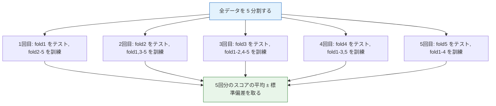

# クロスバリデーション


:::tip この節の位置づけ
1回だけの train/test 分割でモデルを評価すると、結果は**ランダムな分割**の影響を大きく受けます。クロスバリデーションでは、各データが訓練とテストの両方に使われる機会を持つため、より**安定して信頼できる**評価結果を得られます。
:::

## 学習目標

- ホールドアウト法の限界を理解する
- K分割クロスバリデーションを身につける
- 層化K分割クロスバリデーションを身につける
- LOO法と時系列交差検証を知る
- `cross_val_score` と `cross_validate` を使えるようになる

## まず、とても大事な学習イメージについて

この節で初心者がもっとも誤解しやすいのは、クロスバリデーションを次のように理解してしまうことです。

- 「何回か実行して平均を取る」

でも、最初にまず身につけたいのは、実は次の考え方です。

> **クロスバリデーションは、モデルの汎化性能をより安定して推定するための方法です。**

つまり、この節で大事なのは、まずいくつかの split クラス名を暗記することではなく、次を理解することです。

- なぜ1回の分割だけでは不十分なのか
- なぜタスクごとに分け方を変える必要があるのか
- なぜ評価の設計そのものもモデリングの一部なのか

---

## まずは全体像をつかむ

クロスバリデーションは、「いろいろな split クラス名を覚える」よりも、まず何を解決しているのかを見たほうが理解しやすいです。


この節が本当に解決したいことは、次の2つです。

- なぜ1回のランダム分割だけでは信頼しにくいのか
- なぜ評価方法もタスクの種類に合わせる必要があるのか

## 一、ホールドアウト法の問題

### 1.1 1回の分割で十分？

```python
from sklearn.datasets import load_iris
from sklearn.model_selection import train_test_split
from sklearn.tree import DecisionTreeClassifier
import numpy as np

iris = load_iris()
X, y = iris.data, iris.target

# random_state が違うと結果も変わる
scores = []
for seed in range(50):
    X_train, X_test, y_train, y_test = train_test_split(X, y, test_size=0.2, random_state=seed)
    model = DecisionTreeClassifier(max_depth=3, random_state=42)
    model.fit(X_train, y_train)
    scores.append(model.score(X_test, y_test))

import matplotlib.pyplot as plt

plt.figure(figsize=(10, 4))
plt.bar(range(50), scores, color='steelblue', alpha=0.7)
plt.axhline(y=np.mean(scores), color='red', linestyle='--', label=f'平均: {np.mean(scores):.3f}')
plt.xlabel('ランダムシード')
plt.ylabel('正解率')
plt.title(f'50回の異なる分割での正解率（標準偏差: {np.std(scores):.3f}）')
plt.legend()
plt.grid(axis='y', alpha=0.3)
plt.show()

print(f"最小: {min(scores):.3f}, 最大: {max(scores):.3f}, 差: {max(scores)-min(scores):.3f}")
```

:::warning 問題
1回の分割結果は**不安定**です。ランダムシードが違うだけで、大きく結果が変わることがあります。もっと信頼できる評価方法が必要です。
:::

### 1.2 初心者にとって、より大事な判断基準

もし今あなたが次のように考えているなら、

- 「今回はランダム分割のスコアが良かったから、これで十分では？」

この節で身につけたいのは、次の考え方です。

- **1回のスコアより、安定したスコアのほうが大事**

### 1.3 初心者向けのたとえ

クロスバリデーションは、次のように考えるとわかりやすいです。

- 1回だけテストして実力を決めない
- 別の問題セットで何回か試して、平均的な実力を見る

そうすると、得られるのは

- 「今回はたまたまうまくいった」

ではなく、

- 「全体としてだいたいこのくらいの実力」

です。

---

## 二、K分割クロスバリデーション

### 2.1 原理

データを K 個に分け、毎回 1 つをテスト用、残りの K-1 個を訓練用に使います。これを K 回くり返し、平均を取ります。



### 2.2 sklearn での実装

```python
from sklearn.model_selection import cross_val_score, KFold
from sklearn.tree import DecisionTreeClassifier

model = DecisionTreeClassifier(max_depth=3, random_state=42)

# いちばんシンプルな使い方
scores = cross_val_score(model, X, y, cv=5, scoring='accuracy')
print(f"5分割クロスバリデーション:")
print(f"  各分割のスコア: {scores}")
print(f"  平均: {scores.mean():.4f} ± {scores.std():.4f}")
```

### 2.3 KFold を手動で制御する

```python
from sklearn.model_selection import KFold

kf = KFold(n_splits=5, shuffle=True, random_state=42)

# 各 fold の分割を可視化する
fig, axes = plt.subplots(5, 1, figsize=(12, 6), sharex=True)

for fold, (train_idx, test_idx) in enumerate(kf.split(X)):
    ax = axes[fold]
    ax.scatter(train_idx, [0]*len(train_idx), c='steelblue', s=3, label='訓練')
    ax.scatter(test_idx, [0]*len(test_idx), c='red', s=10, label='テスト')
    ax.set_ylabel(f'Fold {fold+1}')
    ax.set_yticks([])
    if fold == 0:
        ax.legend(loc='upper right', ncol=2)

axes[-1].set_xlabel('サンプルのインデックス')
plt.suptitle('5分割クロスバリデーションのデータ分割', fontsize=13)
plt.tight_layout()
plt.show()
```

### 2.4 K の値はどう選ぶ？

| K 値 | メリット | デメリット |
|------|------|------|
| K=3 | 速い | 分散が大きく、安定しにくい |
| **K=5** | **よく使われるデフォルト** | **速度と安定性のバランスがよい** |
| **K=10** | **より安定** | **少し遅い** |
| K=n（LOO法） | 最も安定 | とても遅い |

### 2.5 最初のプロジェクトではどう選ぶと安心？

初心者にとって、まず無理なく使いやすい順番は次のとおりです。

- 入門プロジェクト: まず `cv=5`
- もう少し安定させたい: `cv=10`
- サンプル数がとても少ない: LOO を検討する

つまり、数が大きいほどよいとは限らず、

- まずは十分に安定していて、計算コストも受け入れられる値を選ぶ

のが大切です。

---

## 三、層化K分割クロスバリデーション

### 3.1 なぜ層化が必要？

普通の KFold でランダムに分けると、ある fold のクラス比率が全体とずれることがあります。特に、クラス不均衡データでは起こりやすいです。

**層化KFold は、各 fold のクラス比率を全体とできるだけ同じに保ちます。**

```python
from sklearn.model_selection import StratifiedKFold

# 不均衡データのシミュレーション
from sklearn.datasets import make_classification
X_imb, y_imb = make_classification(n_samples=100, n_features=5,
                                     weights=[0.9, 0.1], random_state=42)

print(f"正例の割合: {y_imb.mean():.1%}")

# KFold と StratifiedKFold を比較
kf = KFold(n_splits=5, shuffle=True, random_state=42)
skf = StratifiedKFold(n_splits=5, shuffle=True, random_state=42)

print("\n通常の KFold の各 fold における正例の割合:")
for fold, (_, test_idx) in enumerate(kf.split(X_imb)):
    print(f"  Fold {fold+1}: {y_imb[test_idx].mean():.1%}")

print("\n層化 StratifiedKFold の各 fold における正例の割合:")
for fold, (_, test_idx) in enumerate(skf.split(X_imb, y_imb)):
    print(f"  Fold {fold+1}: {y_imb[test_idx].mean():.1%}")
```

### 3.2 sklearn でのデフォルト挙動

```python
# 分類タスクでは cross_val_score のデフォルトが StratifiedKFold になる
# 明示的に指定することもできる
from sklearn.model_selection import cross_val_score

scores = cross_val_score(
    DecisionTreeClassifier(max_depth=3, random_state=42),
    X_imb, y_imb,
    cv=StratifiedKFold(n_splits=5, shuffle=True, random_state=42),
    scoring='f1'
)
print(f"層化 5 分割の F1: {scores.mean():.4f} ± {scores.std():.4f}")
```

:::info ベストプラクティス
- **分類タスク**: 常に `StratifiedKFold` を使う（`cross_val_score` のデフォルトでもあります）
- **回帰タスク**: 通常の `KFold` を使う
- **時系列**: `TimeSeriesSplit` を使う
:::

### 3.3 この節でまず覚えたい1文

> **評価の分け方も、モデリング設計の一部です。**

つまり、分割方法が間違っていると、その後のモデルスコアは最初から歪んでしまうことがあります。


この図で特に大事なのは、各 fold で訓練データに対してだけ `fit` した前処理器を使い、同じルールで検証データに `transform` することです。全データに先に標準化、PCA、特徴選択を行ってからクロスバリデーションをすると、検証データの情報が先に訓練側へ漏れてしまいます。

---

## 四、LOO法（Leave-One-Out）

**Leave-One-Out** では、毎回 1 サンプルだけをテスト用に残し、残りの n-1 個を訓練に使います。これを n 回くり返します。

```python
from sklearn.model_selection import LeaveOneOut, cross_val_score

# 小さなデータセットでデモする（LOO は大規模データでは遅すぎる）
from sklearn.datasets import load_iris
X_small, y_small = load_iris(return_X_y=True)

loo = LeaveOneOut()
model = DecisionTreeClassifier(max_depth=3, random_state=42)

scores = cross_val_score(model, X_small, y_small, cv=loo)
print(f"LOO クロスバリデーション:")
print(f"  総回数: {len(scores)}")
print(f"  平均正解率: {scores.mean():.4f}")
```

| メリット | デメリット |
|------|------|
| 訓練データを最大限使える | 計算コストが大きい（n 回学習する） |
| 評価のバイアスが小さい | 分散が大きくなることがある |
| | 大きなデータセットには向かない |

---

## 五、時系列交差検証

### 5.1 なぜランダム分割できないの？

時系列データには**時間の順番**があります。未来のデータで学習して過去を予測するのは、データ漏洩になってしまいます。

### 5.2 TimeSeriesSplit

```python
from sklearn.model_selection import TimeSeriesSplit
import numpy as np

# 時系列データのシミュレーション
n = 100
X_ts = np.arange(n).reshape(-1, 1)
y_ts = np.sin(X_ts.ravel() / 10) + np.random.randn(n) * 0.1

tscv = TimeSeriesSplit(n_splits=5)

fig, axes = plt.subplots(5, 1, figsize=(12, 8), sharex=True)

for fold, (train_idx, test_idx) in enumerate(tscv.split(X_ts)):
    ax = axes[fold]
    ax.scatter(train_idx, y_ts[train_idx], c='steelblue', s=10, label='訓練')
    ax.scatter(test_idx, y_ts[test_idx], c='red', s=20, label='テスト')
    ax.set_ylabel(f'Fold {fold+1}')
    if fold == 0:
        ax.legend(loc='upper left', ncol=2)

axes[-1].set_xlabel('時間ステップ')
plt.suptitle('時系列クロスバリデーション（訓練データが段階的に増える）', fontsize=13)
plt.tight_layout()
plt.show()
```

---

## 六、cross_validate —— より豊富な出力

```python
from sklearn.model_selection import cross_validate
from sklearn.ensemble import RandomForestClassifier

model = RandomForestClassifier(n_estimators=50, random_state=42)

# cross_validate は cross_val_score より多くの情報を返す
results = cross_validate(
    model, X, y, cv=5,
    scoring=['accuracy', 'f1_macro'],
    return_train_score=True
)

print("5分割クロスバリデーションの詳細結果:")
print(f"  訓練正解率: {results['train_accuracy'].mean():.4f} ± {results['train_accuracy'].std():.4f}")
print(f"  テスト正解率: {results['test_accuracy'].mean():.4f} ± {results['test_accuracy'].std():.4f}")
print(f"  テスト F1:    {results['test_f1_macro'].mean():.4f} ± {results['test_f1_macro'].std():.4f}")
print(f"  各 fold の学習時間: {results['fit_time'].mean():.3f}s")
```

### 6.1 なぜ `cross_validate` はプロジェクト向きなの？

プロジェクトでは、たいてい次のような1つの平均値だけが知りたいわけではありません。

- 訓練スコアと検証スコアの差
- 複数の評価指標をまとめて見ること
- 各 fold にかかる時間

こうした情報があると、単に数字を出すだけではなく、より実際のモデル評価に近づきます。

---

## 七、まとめて比較する

```python
from sklearn.model_selection import cross_val_score
from sklearn.tree import DecisionTreeClassifier
from sklearn.linear_model import LogisticRegression
from sklearn.ensemble import RandomForestClassifier
from sklearn.svm import SVC

models = {
    '決定木': DecisionTreeClassifier(max_depth=5, random_state=42),
    'ロジスティック回帰': LogisticRegression(max_iter=1000, random_state=42),
    'ランダムフォレスト': RandomForestClassifier(n_estimators=100, random_state=42),
    'SVM': SVC(random_state=42),
}

results = {}
for name, model in models.items():
    scores = cross_val_score(model, X, y, cv=10, scoring='accuracy')
    results[name] = scores
    print(f"{name:10s} | {scores.mean():.4f} ± {scores.std():.4f}")

# 箱ひげ図で比較
fig, ax = plt.subplots(figsize=(8, 5))
data = [results[name] for name in models]
bp = ax.boxplot(data, labels=models.keys(), patch_artist=True)

colors = ['steelblue', 'coral', 'seagreen', 'gold']
for patch, color in zip(bp['boxes'], colors):
    patch.set_facecolor(color)
    patch.set_alpha(0.7)

ax.set_ylabel('正解率')
ax.set_title('10分割クロスバリデーションの比較（箱ひげ図）')
ax.grid(axis='y', alpha=0.3)
plt.tight_layout()
plt.show()
```

---

## 十、初めてクロスバリデーションをプロジェクトに入れるときの、いちばん安全な順番

クロスバリデーションを実際のプロジェクトに入れるときは、まず次の順番にすると安心です。

1. まず最小限の baseline を作る
2. 次に `cv=5` で平均スコアと標準偏差を見る
3. 分類タスクなら、基本は `StratifiedKFold` を優先する
4. 時系列なら、すぐに `TimeSeriesSplit` に切り替える
5. 最後に、クロスバリデーションをチューニングの流れに組み込む

こうすると、クロスバリデーションを単独の API として覚えるのではなく、

- baseline
- モデル比較
- チューニング

という評価の流れ全体の中で自然に使えるようになります。

---

## まとめ

| 方法 | 説明 | 適用場面 |
|------|------|------|
| **Hold-out** | 1回だけ train/test に分ける | すばやい実験 |
| **K-Fold** | K回分けて平均を取る | 一般的（K=5 または 10） |
| **Stratified K-Fold** | クラス比率を保つ K-Fold | 分類（デフォルト） |
| **LOO** | 毎回 1 サンプルだけ残す | 小規模データ |
| **TimeSeriesSplit** | 時間順に分割する | 時系列 |

:::info 次につながる内容
- **次の節**: バイアス・バリアンストレードオフ——なぜクロスバリデーションと1回評価の結果が違うのか
- **4.4節**: ハイパーパラメータチューニング——クロスバリデーションで最適なパラメータを選ぶ
:::

## この節でいちばん持ち帰ってほしいこと

- クロスバリデーションの本質は「何回も回すこと」ではなく、「モデルの汎化性能をより安定して推定すること」
- 分割方法は、タスクの種類に合わせる必要がある
- 評価設計がよくないと、その後のモデル比較はあまり意味を持たなくなる

## ハンズオン練習

### 練習 1: K の値を比較する

Iris データセットと決定木を使って、K=3, 5, 10, 20 のクロスバリデーション結果（平均正解率と標準偏差）を比較してください。K が大きいほど、標準偏差は小さくなりますか？

### 練習 2: 複数指標で評価する

`cross_validate` を使って、乳がんデータセットで accuracy、precision、recall、f1 を同時に評価し、訓練データとテストデータのスコアを返してください。どのモデルが最も過学習していますか？

### 練習 3: 層化あり vs なし

正例と負例の比率が 9:1 の、非常に不均衡なデータセットを作り、`KFold` と `StratifiedKFold` の評価結果の違いを比較してください。
