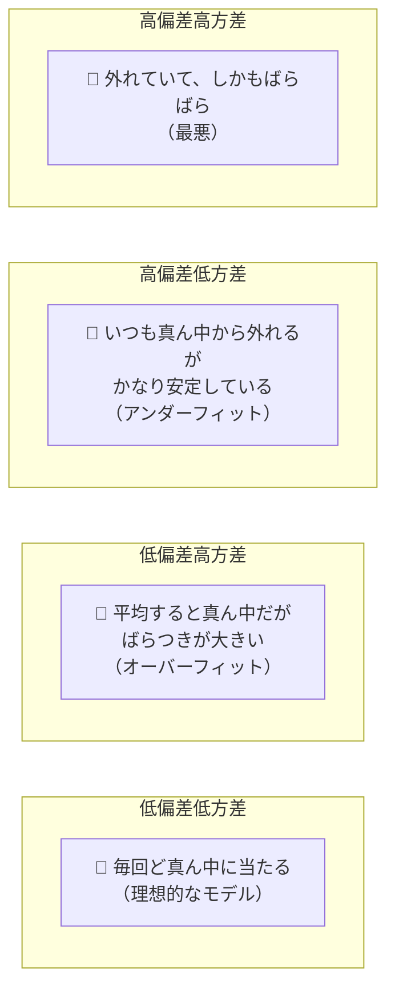
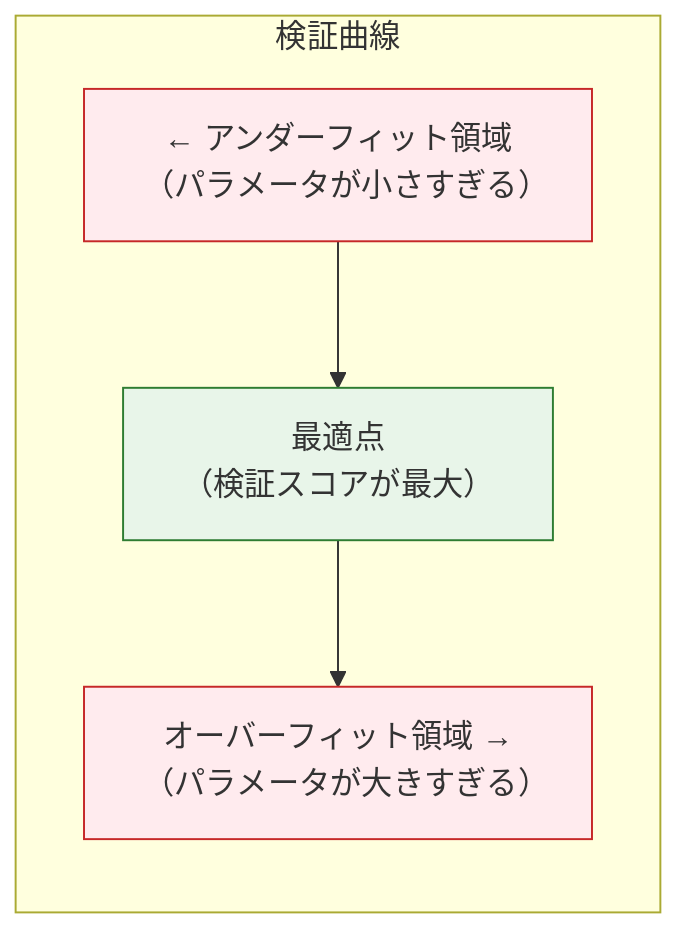
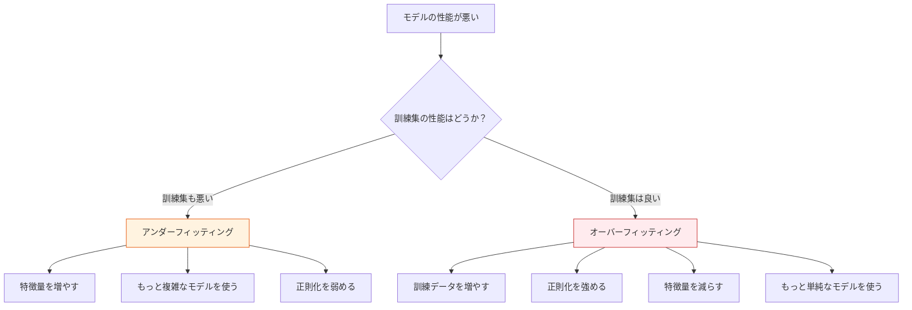

# 偏差-方差トレードオフ


:::tip この節の位置づけ
**偏差-方差トレードオフ（Bias-Variance Tradeoff）** は、機械学習で最も重要な理論フレームワークの一つです。なぜモデルがアンダーフィットやオーバーフィットするのか、そしてその2つの間でどう最適なバランスを見つけるのかを説明します。
:::

## 学習目標

- 偏差（Bias）と方差（Variance）を深く理解する
- アンダーフィッティングとオーバーフィッティングの本質を理解する
- 学習曲線の分析を身につける
- 検証曲線の分析を身につける
- 正則化が偏差-方差にどう影響するかを理解する

## まず、学習するときの大事な期待値をはっきりさせよう

この節は、第 5 ステージの中でも、新人が「概念はわかるけど、問題になると判断できない」となりやすいところです。  
偏差、方差、アンダーフィッティング、オーバーフィッティングは理論用語のように見えますが、実際にはとても実用的です。

> **モデルの性能が悪いとき、次にどこを直すべきかを決める助けになるからです。**

だから最初に身につけるべきなのは、式を暗記することよりも、こうした判断の感覚です。

- 今のモデルは単純すぎるのか、それとも敏感すぎるのか
- 次は複雑さを上げるべきか、データを増やすべきか、正則化を強めるべきか

---

## まずは地図を作ろう

偏差-方差のこの節で、新人にとって最も理解しやすい順序は、「用語の定義を先に読む」ことではなく、機械学習での意思決定における役割を先に見ることです。


この節が本当に解決したいことは、次の2つです。

- なぜモデルの性能が悪いときに、むやみに試行錯誤してはいけないのか
- 「次に何をすべきか」を、根拠に基づいてどう決めるか

## 一、偏差と方差とは？

### 1.1 直感で理解する——的当てのたとえ



| | 偏差（Bias） | 方差（Variance） |
|---|-------------|-----------------|
| 意味 | モデルの予測値が真の値からどれだけ系統的にずれているか | モデルが異なる訓練データにどれだけ敏感か |
| 高 → | アンダーフィッティング（モデルが単純すぎる） | オーバーフィッティング（モデルが複雑すぎる） |
| 対処 | モデルの複雑さを上げる | モデルの複雑さを下げる、データを増やす |

### 1.1.1 新人向けの、もっとわかりやすい言い方

最初から専門用語に入りすぎたくないなら、まずはこう覚えても大丈夫です。

- **高偏差**：モデルがかたくなで、いくら学習してもうまく覚えられない
- **高方差**：モデルが敏感すぎて、データが少し変わるだけで結果も大きく変わる

この2つは厳密な定義そのものではありませんが、最初の方向感をつかむのにとても役立ちます。

### 1.2 総誤差の分解

> **総誤差 = 偏差² + 方差 + 不可約誤差（ノイズ）**

### 1.3 いきなり式を覚える前に、まずは一言で覚えよう

新人にとって、より実用的な覚え方は次のようなものです。

- **高偏差**：モデルが「鈍い」。いくら学んでもうまく学べない
- **高方差**：モデルが「敏感」。データが少し変わるだけで大きく変わる

まずはこの感覚を押さえておくと、あとで学習曲線や検証曲線がかなり読みやすくなります。

```python
import numpy as np
import matplotlib.pyplot as plt

# 偏差-方差トレードオフの可視化
complexity = np.linspace(0.1, 10, 100)
bias_sq = 5 / complexity
variance = 0.5 * complexity
noise = 0.5 * np.ones_like(complexity)
total = bias_sq + variance + noise

plt.figure(figsize=(8, 5))
plt.plot(complexity, bias_sq, 'b-', linewidth=2, label='偏差²')
plt.plot(complexity, variance, 'r-', linewidth=2, label='方差')
plt.plot(complexity, noise, 'g--', linewidth=1, label='ノイズ（不可約）')
plt.plot(complexity, total, 'k-', linewidth=2, label='総誤差')

best_idx = np.argmin(total)
plt.axvline(x=complexity[best_idx], color='orange', linestyle=':', label='最適な複雑さ')

plt.xlabel('モデルの複雑さ')
plt.ylabel('誤差')
plt.title('偏差-方差トレードオフ')
plt.legend()
plt.grid(True, alpha=0.3)
plt.show()
```

---

## 二、偏差と方差を実際に観察する

### 2.1 多項式回帰で見てみよう

```python
from sklearn.preprocessing import PolynomialFeatures
from sklearn.linear_model import LinearRegression
from sklearn.pipeline import make_pipeline

# 非線形データを生成
np.random.seed(42)
n = 30
X = np.sort(np.random.uniform(-3, 3, n))
y_true_func = lambda x: np.sin(x)
y = y_true_func(X) + np.random.randn(n) * 0.3

x_plot = np.linspace(-3.5, 3.5, 200)

fig, axes = plt.subplots(1, 3, figsize=(15, 4))
configs = [
    (1, 'アンダーフィット（degree=1）\n高偏差、低方差'),
    (4, 'ちょうどよい（degree=4）\n偏差と方差のバランス'),
    (15, 'オーバーフィット（degree=15）\n低偏差、高方差'),
]

for ax, (deg, title) in zip(axes, configs):
    # さまざまなデータサブセットで複数回学習し、方差を観察する
    for seed in range(10):
        np.random.seed(seed)
        X_sample = np.sort(np.random.uniform(-3, 3, n))
        y_sample = y_true_func(X_sample) + np.random.randn(n) * 0.3

        model = make_pipeline(PolynomialFeatures(deg, include_bias=False), LinearRegression())
        model.fit(X_sample.reshape(-1, 1), y_sample)
        y_pred = model.predict(x_plot.reshape(-1, 1))
        y_pred = np.clip(y_pred, -3, 3)
        ax.plot(x_plot, y_pred, alpha=0.3, color='steelblue')

    ax.plot(x_plot, y_true_func(x_plot), 'r--', linewidth=2, label='真の関数')
    ax.scatter(X, y, color='black', s=20, zorder=5)
    ax.set_title(title)
    ax.set_ylim(-3, 3)
    ax.legend(fontsize=8)
    ax.grid(True, alpha=0.3)

plt.suptitle('偏差-方差の直感（異なるデータで10回学習）', fontsize=13)
plt.tight_layout()
plt.show()
```

:::note 観察ポイント
- **degree=1**：10 本の線がほぼ重なる（低方差）が、どれも真の関数から外れている（高偏差）
- **degree=15**：10 本の線の差が大きい（高方差）が、平均すると真の関数に近い（低偏差）
- **degree=4**：10 本の線がそこそこ揃っていて（適度な方差）、真の関数にも近い（適度な偏差）
:::

---

## 三、学習曲線

### 3.1 学習曲線とは？

学習曲線は、**訓練データの大きさ**がモデル性能にどう影響するかを示します。これを見ると、次のことがわかります。
- モデルがアンダーフィットしているのか、オーバーフィットしているのか
- データを増やすと役立つのか


学習曲線を見るときは、まず2本の線の距離を見ます。訓練スコアも検証スコアも低いなら、まずアンダーフィットを疑います。訓練スコアが高く、検証スコアが低くて、しかも2本の線の差が大きいなら、まずオーバーフィットを疑います。もし検証スコアがデータ量の増加とともに上がり続けているなら、データ追加が本当に役立つ可能性があります。

```python
from sklearn.model_selection import learning_curve
from sklearn.tree import DecisionTreeClassifier
from sklearn.datasets import load_digits

digits = load_digits()
X, y = digits.data, digits.target

def plot_learning_curve(model, X, y, title, ax):
    train_sizes, train_scores, val_scores = learning_curve(
        model, X, y, cv=5,
        train_sizes=np.linspace(0.1, 1.0, 10),
        scoring='accuracy', n_jobs=-1
    )

    train_mean = train_scores.mean(axis=1)
    train_std = train_scores.std(axis=1)
    val_mean = val_scores.mean(axis=1)
    val_std = val_scores.std(axis=1)

    ax.fill_between(train_sizes, train_mean - train_std, train_mean + train_std, alpha=0.1, color='blue')
    ax.fill_between(train_sizes, val_mean - val_std, val_mean + val_std, alpha=0.1, color='red')
    ax.plot(train_sizes, train_mean, 'bo-', label='訓練集')
    ax.plot(train_sizes, val_mean, 'ro-', label='検証集')
    ax.set_xlabel('訓練サンプル数')
    ax.set_ylabel('正解率')
    ax.set_title(title)
    ax.legend()
    ax.grid(True, alpha=0.3)

fig, axes = plt.subplots(1, 3, figsize=(18, 5))

# アンダーフィットなモデル
plot_learning_curve(
    DecisionTreeClassifier(max_depth=1, random_state=42),
    X, y, 'アンダーフィット（max_depth=1）\n訓練も検証も低い', axes[0]
)

# ちょうどよいモデル
plot_learning_curve(
    DecisionTreeClassifier(max_depth=10, random_state=42),
    X, y, '適度な複雑さ（max_depth=10）', axes[1]
)

# オーバーフィットなモデル
plot_learning_curve(
    DecisionTreeClassifier(max_depth=None, random_state=42),
    X, y, 'オーバーフィット（max_depth=None）\n訓練と検証の差が大きい', axes[2]
)

plt.tight_layout()
plt.show()
```

### 3.2 学習曲線の読み方

| 現象 | 診断 | 対応策 |
|------|------|---------|
| 訓練も検証も低い | **アンダーフィッティング** | モデルの複雑さを上げる |
| 訓練は高く、検証は低い | **オーバーフィッティング** | データを増やす / 正則化する / モデルを簡単にする |
| 2本の線が収束していて、しかも高い | **ちょうどよい** | かなり良いモデル |
| 検証がまだ上がっている | もっとデータが必要 | さらにデータを集める |

### 3.3 Andrew Ng の講義で学習曲線がとても重要な理由

学習曲線は、次のような問いに答えるのにとても向いているからです。

- もっとデータを増やす価値があるか
- 今はアンダーフィットなのか、オーバーフィットなのか

多くの人はこの段階を飛ばして、すぐにモデルを変えたくなります。  
でも学習曲線は本来、「まず診断して、それから次の手を決める」ための重要な証拠です。

---

## 四、検証曲線

### 4.1 検証曲線とは？

検証曲線は、**あるハイパーパラメータ**がモデル性能にどう影響するかを示し、最適な値を見つける助けになります。

```python
from sklearn.model_selection import validation_curve

# max_depth が決定木に与える影響
param_range = range(1, 25)
train_scores, val_scores = validation_curve(
    DecisionTreeClassifier(random_state=42), X, y,
    param_name='max_depth', param_range=param_range,
    cv=5, scoring='accuracy', n_jobs=-1
)

train_mean = train_scores.mean(axis=1)
train_std = train_scores.std(axis=1)
val_mean = val_scores.mean(axis=1)
val_std = val_scores.std(axis=1)

plt.figure(figsize=(8, 5))
plt.fill_between(param_range, train_mean - train_std, train_mean + train_std, alpha=0.1, color='blue')
plt.fill_between(param_range, val_mean - val_std, val_mean + val_std, alpha=0.1, color='red')
plt.plot(param_range, train_mean, 'bo-', label='訓練集')
plt.plot(param_range, val_mean, 'ro-', label='検証集')
plt.xlabel('max_depth')
plt.ylabel('正解率')
plt.title('検証曲線：max_depth の影響')
plt.legend()
plt.grid(True, alpha=0.3)

best_depth = param_range[np.argmax(val_mean)]
plt.axvline(x=best_depth, color='green', linestyle='--', label=f'最適 depth={best_depth}')
plt.legend()
plt.show()
```

### 4.2 検証曲線の読み方



---

## 五、正則化が偏差-方差に与える影響

```python
from sklearn.linear_model import Ridge
from sklearn.preprocessing import PolynomialFeatures, StandardScaler
from sklearn.pipeline import make_pipeline
from sklearn.model_selection import cross_val_score

# 非線形データ
np.random.seed(42)
X_nl = np.sort(np.random.uniform(-3, 3, 100)).reshape(-1, 1)
y_nl = np.sin(X_nl.ravel()) + np.random.randn(100) * 0.3

# 高次多項式 + さまざまな正則化強度
alphas = [0.0001, 0.001, 0.01, 0.1, 1, 10, 100]
train_scores = []
cv_scores = []

for alpha in alphas:
    model = make_pipeline(
        StandardScaler(),
        PolynomialFeatures(degree=10, include_bias=False),
        Ridge(alpha=alpha)
    )
    model.fit(X_nl, y_nl)
    train_scores.append(model.score(X_nl, y_nl))

    cv = cross_val_score(model, X_nl, y_nl, cv=5)
    cv_scores.append(cv.mean())

fig, axes = plt.subplots(1, 2, figsize=(14, 5))

# alpha vs スコア
axes[0].plot(alphas, train_scores, 'bo-', label='訓練集')
axes[0].plot(alphas, cv_scores, 'ro-', label='CV 検証集')
axes[0].set_xscale('log')
axes[0].set_xlabel('正則化強度 α')
axes[0].set_ylabel('R² スコア')
axes[0].set_title('正則化強度 vs モデル性能')
axes[0].legend()
axes[0].grid(True, alpha=0.3)

# フィット曲線の比較
x_plot = np.linspace(-3.5, 3.5, 200).reshape(-1, 1)
for alpha, color, ls in [(0.0001, 'blue', '--'), (0.1, 'green', '-'), (100, 'orange', ':')]:
    model = make_pipeline(
        StandardScaler(),
        PolynomialFeatures(degree=10, include_bias=False),
        Ridge(alpha=alpha)
    )
    model.fit(X_nl, y_nl)
    y_pred = model.predict(x_plot)
    axes[1].plot(x_plot, np.clip(y_pred, -3, 3), color=color, linestyle=ls,
                  linewidth=2, label=f'α={alpha}')

axes[1].scatter(X_nl, y_nl, s=15, alpha=0.5, color='gray')
axes[1].plot(x_plot, np.sin(x_plot), 'r--', linewidth=1, label='真の関数')
axes[1].set_title('異なる正則化強度でのフィット結果')
axes[1].set_ylim(-3, 3)
axes[1].legend()
axes[1].grid(True, alpha=0.3)

plt.tight_layout()
plt.show()
```

| α の値 | 偏差 | 方差 | 状態 |
|------|------|------|------|
| とても小さい（0.0001） | 低い | 高い | オーバーフィット |
| 適度（0.1） | 適度 | 適度 | ちょうどよい |
| とても大きい（100） | 高い | 低い | アンダーフィット |

---

## 六、実用的な診断フロー



### 6.1 この図で一番大事なところは？

この図が教えているのは、次のことです。

> モデルの性能が悪いとき、いきなり方法を変えまくるのではなく、まずそれが偏差の問題なのか、方差の問題なのかを判断する。

これが、第 5 ステージ後半で身につけたい、非常に重要なエンジニアリング感覚の一つです。

### 6.2 初めて診断するときの、いちばん安全なデフォルト手順

はじめて「モデルの性能が悪い」と向き合うなら、次の順で判断すると安定します。

1. まず訓練集のスコアが高いかを見る
2. 次に検証集 / 交差検証のスコアとの差を見る
3. 訓練も検証も悪ければ、まずアンダーフィッティングを疑う
4. 訓練は良いのに検証が悪ければ、まずオーバーフィッティングを疑う
5. 最後に、複雑さを上げるか、データを増やすか、正則化を強めるかを決める

この順番なら、「どの方法でもとにかく試す」よりずっと安定します。なぜなら、先に診断してから対処しているからです。

---

## この節を学んでもまだ抽象的に感じるなら、まず何をつかむべきか

まだこの節が少し抽象的に感じるなら、全部を理解しようとするより、次の3つをまず押さえるのが大事です。

1. 訓練も検証も悪いなら、多くの場合はまずアンダーフィッティングを見る
2. 訓練は良くて検証が悪いなら、多くの場合はまずオーバーフィッティングを見る
3. 診断は調整より先、証拠は試行より先

この3つがしっかり入れば、この節はすでにあなたの役に立っています。

---

## まとめ

| 要点 | 説明 |
|------|------|
| 偏差 | モデルの系統的な誤差。モデルが単純すぎると起きる |
| 方差 | データ変化に対するモデルの敏感さ。モデルが複雑すぎると起きる |
| トレードオフ | 偏差を減らすと方差が増えやすく、その逆も同じ |
| 学習曲線 | 訓練データ量 vs 性能。アンダーフィット / オーバーフィットの診断に使う |
| 検証曲線 | ハイパーパラメータ vs 性能。最適値を探すのに使う |
| 正則化 | α を大きくすると、偏差は増え、方差は減る |

:::info 次につながる内容
- **次の節**：ハイパーパラメータ調整——最適パラメータを体系的に探索する
:::

## この節でいちばん持ち帰るべきこと

- 偏差-方差は理論の飾りではなく、「次に何をするか」を判断するための枠組み
- 学習曲線と検証曲線は、感覚を根拠に変えるための道具
- アンダーフィット / オーバーフィットを診断できれば、機械学習プロジェクトは大きく前進する

## ハンズオン練習

### 練習 1：学習曲線の診断

`load_digits()` を使って、ランダムフォレスト（n_estimators=100）とロジスティック回帰の学習曲線をそれぞれ描いてみましょう。どちらがよりオーバーフィットしやすいでしょうか？

### 練習 2：検証曲線

`load_wine()` を使って、ランダムフォレストの `n_estimators`（10〜500）の検証曲線を描き、最適な木の数を見つけましょう。

### 練習 3：正則化の実験

多項式回帰（degree=15）+ Ridge 回帰を使い、alpha（0.0001 から 1000 まで）の検証曲線を描きましょう。同じ図の中に、アンダーフィット領域とオーバーフィット領域を示してください。
