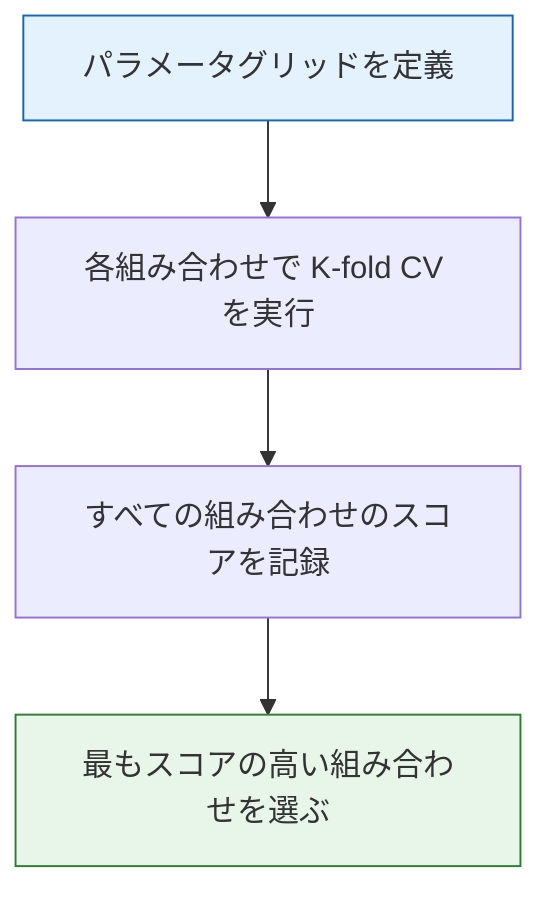
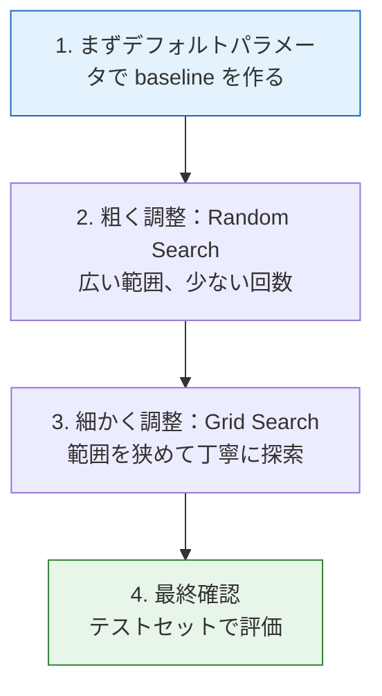

# ハイパーパラメータチューニング


:::tip この節の位置づけ
モデルの**ハイパーパラメータ**（たとえば木の深さ、学習率、正則化の強さ）は手動で設定する必要があり、モデル性能に大きな影響を与えます。この節では、感覚で試すのではなく、**体系的に**最適なハイパーパラメータを探す方法を学びます。
:::

## 学習目標

- パラメータとハイパーパラメータを区別する
- グリッドサーチ（GridSearchCV）を理解する
- ランダムサーチ（RandomizedSearchCV）を理解する
- ベイズ最適化（Optuna）を理解する
- ハイパーパラメータチューニングのベストプラクティスを身につける

## まず、とても大事な学習の前提

この節で新人がつまずきやすいのは、ツールの使い方ではなく、調整を次のように考えてしまうことです。

- 「モデルがよくないなら、もっとたくさんのパラメータを探せばいい」

でも、最初の段階で持っておきたい理解としては、こちらのほうが適切です。

> **調整は、baseline、評価方法、探索空間がすでに適切であるときに初めて意味を持つ改善行動です。**

そのため、この節でまず大事なのは、どの検索ツールをたくさん覚えるかではなく、先に次を学ぶことです。

- いつ調整すべきか
- いつは急いで調整しなくてよいか

---

## まずは全体の地図を作ろう

ハイパーパラメータチューニングを学ぶとき、新人にとって理解しやすい順番は「検索ツールをいくつか覚える」ことではなく、機械学習ワークフローの中でどこにあるかを把握することです。


この節で本当に解決したいのは、次のような疑問です。

- なぜ調整は評価と切り離して考えられないのか
- なぜテストセットを何度も試行に使ってはいけないのか
- なぜ探索空間そのものが設計の問題なのか

### 1.1 新人に合うたとえ

まず、調整はこんなイメージで考えられます。

- 実験中にツマミを調整する

でも、本当に大事なのはツマミをどれだけ頻繁に回すかではなく、次の点です。

- 先に実験台をしっかり組み立てたか
- 何を最適化したいのか
- 変更のたびに何がどう変わったかを記録しているか

つまり、調整は単なるパラメータ探索ではなく、実験設計に近いものです。


この図を見るときは、まず「予算」の線に注目してください。パラメータが多く、範囲が広いほど、組み合わせは爆発的に増えます。新人が最初に調整するときは、すべてのツマミを一度に回さないで、まずは複雑さに最も影響するパラメータから始めましょう。たとえば木モデルなら `max_depth`、`min_samples_leaf` です。その後で、少しずつ探索空間を広げていきます。

## 一、パラメータ vs ハイパーパラメータ

| | パラメータ（Parameter） | ハイパーパラメータ（Hyperparameter） |
|---|-------------------|------------------------|
| 誰が決めるか | モデルがデータから自動で学習する | 人が手動で設定する |
| いつ決まるか | 学習中 | 学習前 |
| 例 | 線形回帰の w, b | 木の max_depth、学習率 |
| 保存場所 | `model.coef_` | `model.get_params()` |

```python
from sklearn.tree import DecisionTreeClassifier

model = DecisionTreeClassifier(max_depth=5, min_samples_split=10)
print("ハイパーパラメータ（学習前に設定）:")
print(model.get_params())
```

---

## 二、グリッドサーチ（Grid Search）

### 2.1 原理

すべてのハイパーパラメータの組み合わせを総当たりし、それぞれを交差検証で評価して、最もよいものを選びます。



### 2.2 GridSearchCV の実践

```python
from sklearn.model_selection import GridSearchCV
from sklearn.ensemble import RandomForestClassifier
from sklearn.datasets import load_wine
from sklearn.model_selection import train_test_split
import numpy as np

wine = load_wine()
X_train, X_test, y_train, y_test = train_test_split(
    wine.data, wine.target, test_size=0.2, random_state=42
)

# パラメータグリッドを定義
param_grid = {
    'n_estimators': [50, 100, 200],
    'max_depth': [3, 5, 10, None],
    'min_samples_split': [2, 5, 10],
}

# 合計 3 × 4 × 3 = 36 通り × 5-fold = 180 回の学習
print(f"総組み合わせ数: {3*4*3}")

# グリッドサーチ
grid = GridSearchCV(
    RandomForestClassifier(random_state=42),
    param_grid,
    cv=5,
    scoring='accuracy',
    n_jobs=-1,
    verbose=1
)

grid.fit(X_train, y_train)

print(f"\n最適なパラメータ: {grid.best_params_}")
print(f"最適な CV スコア: {grid.best_score_:.4f}")
print(f"テストセットのスコア: {grid.best_estimator_.score(X_test, y_test):.4f}")
```

### 2.3 すべての結果を見る

```python
import pandas as pd
import matplotlib.pyplot as plt

# 結果を DataFrame に変換
results = pd.DataFrame(grid.cv_results_)
print(results[['params', 'mean_test_score', 'rank_test_score']].head(10))

# 可視化：異なる n_estimators と max_depth の効果
fig, ax = plt.subplots(figsize=(8, 5))

for depth in [3, 5, 10, None]:
    mask = results['param_max_depth'] == depth
    subset = results[mask & (results['param_min_samples_split'] == 2)]
    label = f'depth={depth}' if depth else 'depth=None'
    ax.plot(subset['param_n_estimators'], subset['mean_test_score'], 'o-', label=label)

ax.set_xlabel('n_estimators')
ax.set_ylabel('CV 正解率')
ax.set_title('GridSearch の結果の可視化')
ax.legend()
ax.grid(True, alpha=0.3)
plt.tight_layout()
plt.show()
```

### 2.4 グリッドサーチの長所と短所

| 長所 | 短所 |
|------|------|
| グリッド内の最適解を見つけられる | 組み合わせ爆発（次元が増えると非常に遅い） |
| 実装が簡単 | グリッドの刻みが粗いと最適値を逃す |
| 結果を再現しやすい | 悪い領域にも計算を使ってしまう |

### 2.5 どんなときにグリッドサーチはまだ有効？

より安定した判断基準は次のとおりです。

- パラメータ数が少ない
- 範囲の見当がすでについている
- わかりやすく、再現可能な実験がほしい

この場合、Grid Search はとても相性がよいです。透明性が高いからです。

---

## 三、ランダムサーチ（Random Search）

### 3.1 原理

すべてを総当たりせず、**ランダムにサンプルした** N 通りの組み合わせを試します。同じ計算予算なら、ランダムサーチのほうが効率的なことが多いです。

### 3.2 RandomizedSearchCV の実践

```python
from sklearn.model_selection import RandomizedSearchCV
from scipy.stats import randint, uniform

# パラメータ分布を定義（固定値ではなく範囲）
param_dist = {
    'n_estimators': randint(50, 500),
    'max_depth': [3, 5, 10, 15, 20, None],
    'min_samples_split': randint(2, 20),
    'min_samples_leaf': randint(1, 10),
    'max_features': ['sqrt', 'log2', None],
}

# 50 通りをランダムに試す
random_search = RandomizedSearchCV(
    RandomForestClassifier(random_state=42),
    param_dist,
    n_iter=50,       # 50 通りだけ試す
    cv=5,
    scoring='accuracy',
    random_state=42,
    n_jobs=-1,
    verbose=1
)

random_search.fit(X_train, y_train)

print(f"\n最適なパラメータ: {random_search.best_params_}")
print(f"最適な CV スコア: {random_search.best_score_:.4f}")
print(f"テストセットのスコア: {random_search.best_estimator_.score(X_test, y_test):.4f}")
```

### 3.3 Grid vs Random の比較

```python
# 可視化で比較
fig, axes = plt.subplots(1, 2, figsize=(14, 5))

# Grid Search の探索空間
grid_n = [50, 100, 200]
grid_d = [3, 5, 10]
grid_points = [(n, d) for n in grid_n for d in grid_d]
axes[0].scatter([p[0] for p in grid_points], [p[1] for p in grid_points],
                s=100, color='steelblue', zorder=5)
axes[0].set_xlabel('n_estimators')
axes[0].set_ylabel('max_depth')
axes[0].set_title(f'Grid Search（{len(grid_points)} 点）\nグリッドの交点だけを探索')
axes[0].grid(True, alpha=0.3)

# Random Search の探索空間
rng = np.random.default_rng(seed=42)
rand_n = rng.integers(50, 500, 20)
rand_d = rng.choice([3, 5, 10, 15, 20], 20)
axes[1].scatter(rand_n, rand_d, s=100, color='coral', zorder=5)
axes[1].set_xlabel('n_estimators')
axes[1].set_ylabel('max_depth')
axes[1].set_title(f'Random Search（20 点）\nより広い探索空間をカバー')
axes[1].grid(True, alpha=0.3)

plt.tight_layout()
plt.show()
```

| | Grid Search | Random Search |
|---|------------|---------------|
| 探索方法 | すべての組み合わせを総当たり | ランダムサンプリング |
| 計算量 | 組み合わせ数 × K-fold | n_iter × K-fold |
| カバー範囲 | グリッドの交点 | より広い |
| 向いている場面 | パラメータが少ない、範囲がわかっている | パラメータが多い、範囲が不明確 |
| 推奨 | 3 個未満のパラメータ | 3 個より多いパラメータ |

### 3.4 なぜ「ランダムに探す」ほうが「細かいグリッド探索」より理にかなっていることが多いのか？

本当に時間を浪費しがちなのは、モデルの性能不足そのものではなく、  
次のようなことです。

- 間違ったパラメータ空間に計算資源を使いすぎること

だから、調整で最も大事なのは検索方法だけではなく、  
次の点です。

- まず適切な探索範囲を定義する
- まず本当に最適化したいものを知る

---

## 四、ベイズ最適化（Optuna）

### 4.1 原理

ベイズ最適化はランダムサーチよりも“賢く”探します。**これまでの試行結果をもとに、次に探す場所を決める**からです。


### 4.2 Optuna の実践

```bash
pip install optuna
```

```python
try:
    import optuna
    from sklearn.model_selection import cross_val_score

    # 最適化の目的関数を定義
    def objective(trial):
        params = {
            'n_estimators': trial.suggest_int('n_estimators', 50, 500),
            'max_depth': trial.suggest_int('max_depth', 3, 20),
            'min_samples_split': trial.suggest_int('min_samples_split', 2, 20),
            'min_samples_leaf': trial.suggest_int('min_samples_leaf', 1, 10),
            'max_features': trial.suggest_categorical('max_features', ['sqrt', 'log2', None]),
        }

        model = RandomForestClassifier(**params, random_state=42)
        score = cross_val_score(model, X_train, y_train, cv=5, scoring='accuracy').mean()
        return score

    # 最適化を実行
    study = optuna.create_study(direction='maximize')
    study.optimize(objective, n_trials=50, show_progress_bar=True)

    print(f"\n最適なパラメータ: {study.best_params}")
    print(f"最適な CV スコア: {study.best_value:.4f}")

    # 最適パラメータで学習
    best_model = RandomForestClassifier(**study.best_params, random_state=42)
    best_model.fit(X_train, y_train)
    print(f"テストセットのスコア: {best_model.score(X_test, y_test):.4f}")

except ImportError:
    print("先に optuna をインストールしてください: pip install optuna")
```

### 4.3 ベイズ最適化はどんなときにより有効？

典型的には、次のようなときです。

- パラメータ空間が大きくなってきた
- 1 回の学習コストが高い
- 明らかに悪い組み合わせに予算を使いたくない

このような場面では、「より賢く試す」ことがだんだん重要になります。

### 4.4 Optuna の可視化

```python
try:
    import optuna
    from optuna.visualization import plot_optimization_history, plot_param_importances

    # 最適化履歴（上のコードを先に実行しておく必要があります）
    fig = optuna.visualization.plot_optimization_history(study)
    fig.show()

    # パラメータ重要度
    fig = optuna.visualization.plot_param_importances(study)
    fig.show()

except (ImportError, NameError):
    print("先に optuna をインストールして最適化を実行する必要があります")
```

### 4.5 3つの方法の比較

| | Grid Search | Random Search | ベイズ最適化 |
|---|------------|--------------|-----------|
| 賢さ | なし（総当たり） | 低い（ランダム） | 高い（履歴から学ぶ） |
| 効率 | 低い | 中 | 高い |
| 実装 | `GridSearchCV` | `RandomizedSearchCV` | `optuna` |
| 向いている場面 | パラメータが少ない、範囲が狭い | 汎用的 | パラメータが多い、計算コストが高い |

---

## 五、ハイパーパラメータチューニングのベストプラクティス

### 5.1 調整の進め方



### 5.2 よくあるモデルの調整優先順位

**ランダムフォレスト / GBDT**：

| 優先順位 | パラメータ | 探索範囲 |
|--------|------|---------|
| 1 | `n_estimators` | 100~1000 |
| 2 | `max_depth` | 3~20 |
| 3 | `learning_rate`（GBDT） | 0.01~0.3 |
| 4 | `min_samples_split` | 2~20 |
| 5 | `subsample`（GBDT） | 0.6~1.0 |

**XGBoost / LightGBM**：

| 優先順位 | パラメータ | 探索範囲 |
|--------|------|---------|
| 1 | `n_estimators` + `learning_rate` | まとめて調整 |
| 2 | `max_depth` | 3~10 |
| 3 | `subsample` / `colsample_bytree` | 0.6~1.0 |
| 4 | `reg_alpha` / `reg_lambda` | 0~5 |

### 5.3 注意点

:::warning 調整の落とし穴
1. **テストセットで調整しない**——テストセットは最終評価のために 1 回だけ使う
2. **交差検証を使う**——1 回の分割ではなく、CV スコアでパラメータを選ぶ
3. **random_state を固定する**——結果を再現できるようにする
4. **まず粗く、あとで細かく**——最初から細かいグリッドにしない
5. **重要なパラメータに注目する**——すべてのパラメータを調整する必要はない
:::

### 5.4 Pipeline + GridSearch

```python
from sklearn.pipeline import Pipeline
from sklearn.preprocessing import StandardScaler
from sklearn.model_selection import GridSearchCV
from sklearn.svm import SVC

# Pipeline の中で調整する
pipe = Pipeline([
    ('scaler', StandardScaler()),
    ('svm', SVC(random_state=42)),
])

# パラメータ名の形式：ステップ名__パラメータ名
param_grid = {
    'svm__C': [0.1, 1, 10, 100],
    'svm__kernel': ['rbf', 'poly'],
    'svm__gamma': ['scale', 'auto', 0.01, 0.1],
}

grid = GridSearchCV(pipe, param_grid, cv=5, scoring='accuracy', n_jobs=-1)
grid.fit(X_train, y_train)

print(f"最適なパラメータ: {grid.best_params_}")
print(f"最適な CV スコア: {grid.best_score_:.4f}")
print(f"テストセットのスコア: {grid.score(X_test, y_test):.4f}")
```

---

## 六、完全なチューニング実践

```python
from sklearn.datasets import load_digits
from sklearn.model_selection import train_test_split, RandomizedSearchCV
from sklearn.ensemble import GradientBoostingClassifier
from scipy.stats import randint, uniform
import time

digits = load_digits()
X_train, X_test, y_train, y_test = train_test_split(
    digits.data, digits.target, test_size=0.2, random_state=42
)

# Step 1: baseline
baseline = GradientBoostingClassifier(random_state=42)
baseline.fit(X_train, y_train)
print(f"Baseline テスト精度: {baseline.score(X_test, y_test):.4f}")

# Step 2: ランダムサーチ
param_dist = {
    'n_estimators': randint(50, 300),
    'max_depth': randint(2, 10),
    'learning_rate': uniform(0.01, 0.3),
    'subsample': uniform(0.6, 0.4),
    'min_samples_split': randint(2, 15),
}

start = time.time()
rs = RandomizedSearchCV(
    GradientBoostingClassifier(random_state=42),
    param_dist,
    n_iter=30,
    cv=5,
    scoring='accuracy',
    random_state=42,
    n_jobs=-1,
)
rs.fit(X_train, y_train)
elapsed = time.time() - start

print(f"\nRandomSearch 最適なパラメータ: {rs.best_params_}")
print(f"RandomSearch CV スコア: {rs.best_score_:.4f}")
print(f"RandomSearch テストスコア: {rs.score(X_test, y_test):.4f}")
print(f"所要時間: {elapsed:.1f}s")

# Step 3: 比較
print(f"\n改善: {rs.score(X_test, y_test) - baseline.score(X_test, y_test):+.4f}")
```

---

## 7. 初めて調整実験をするとき、見落としやすいことは？

もっとも見落とされやすいのは次の点です。

- **テストセットを見ながらパラメータを変更しないこと**

テストセットを使って調整を始めると、  
テストセットはもう「最終的に未知のデータ」ではなくなります。  
その結果、評価に楽観バイアスが入ってしまいます。

## 8. 初めての調整実験で最も安定した順番

本当に初めて調整をするなら、次の順番がおすすめです。

1. まず baseline を固定する
2. まず主な評価指標を固定する
3. まず 1〜2 個の重要なパラメータだけを調整する
4. まずは粗い範囲で試す
5. 方向性が見えてから、範囲を絞って細かく調整する

この順番は、最初から大きな探索空間を広げるより安定していて、改善がどこから来たのかもわかりやすくなります。

## 9. この節を学んでもまだ混乱しやすいなら、何を先に押さえるべき？

もし今でも調整が難しく感じるなら、まず大事なのはすべてのツールの違いではなく、次の 3 つです。

1. baseline がないなら、急いで調整しない
2. 安定した評価がないなら、調整結果を信用しすぎない
3. 適切な探索範囲がないなら、どんな高度な探索方法でもあまり助けにならない

この 3 つがしっかりしてくると、この節は本当の意味で役に立ちます。

---

## まとめ

| 方法 | 説明 | おすすめの場面 |
|------|------|---------|
| **Grid Search** | すべての組み合わせを総当たり | パラメータが少ない（≤3）、範囲がわかっている |
| **Random Search** | 組み合わせをランダムにサンプリング | パラメータが多い、最初の探索 |
| **Optuna** | ベイズ最適化 | 計算コストが高い、パラメータが多い |
| **Pipeline + Search** | 前処理とモデルをまとめて調整 | 本番環境 |

:::info 次につながる内容
- **第 5 章**：特徴量エンジニアリング——より良い特徴量でモデルを向上させる（調整より効果が大きいこともある）
- **第 6 章**：実践プロジェクト——これまでの調整テクニックを総合的に使う
:::

## この節で最も持ち帰ってほしいこと

- 調整は「いくつかのパラメータを試すこと」ではなく、モデル選択プロセスの一部である
- 探索方法、探索空間、評価プロトコルはまとめて設計する必要がある
- 本当に成熟した調整では、「より高いスコアを見つけること」だけでなく、「そのスコアがなぜ信頼できるのかを理解すること」が重要

## 手を動かす練習

### 練習 1：Grid vs Random

Wine データセットで、同じ時間内に GridSearchCV と RandomizedSearchCV が見つける最適スコアを比較しましょう。どちらが効率的ですか？

### 練習 2：XGBoost の調整

`load_digits()` 上で XGBoost を調整しましょう。まず RandomizedSearchCV でおおよその範囲を見つけ、そのあと GridSearchCV で細かく調整します。各ステップの改善を記録してください。

### 練習 3：Optuna の実践

Optuna を使って LightGBM の分類器を最適化しましょう。`optuna.visualization` を使って、最適化履歴とパラメータ重要度の図を描いてください。

### 練習 4：Pipeline の調整

`StandardScaler → PCA → RandomForest` の Pipeline を作成し、GridSearchCV を使って PCA の `n_components` と RandomForest のパラメータを同時に最適化しましょう。
