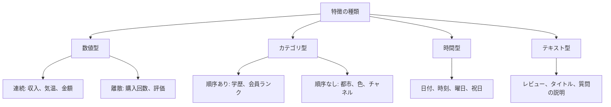

# 5.5.2 特徴の理解と探索


:::tip この節の位置づけ
特徴量エンジニアリングは、機械学習プロジェクトの中でも費用対効果がとても高い工程の1つですが、最初に「新しい列を作る」ことではありません。本当の第一歩はデータを理解することです。各列が何を表すのか、分布に異常がないか、ターゲットと関係があるか、未来の情報が漏れていないかを確認しましょう。
:::

## 学習目標

- 数値・カテゴリ・時間・テキストなど、よくある特徴の種類を理解する
- 分布図と統計要約を使って、異常・偏り・欠損を見つけられるようになる
- 特徴とターゲット変数の関係を分析できるようになる
- 冗長な特徴とターゲット漏洩のリスクを初歩的に見分けられるようになる

---

## まずは地図を作ろう


この段階をしっかり行うほど、後でモデル選びを勢いだけで進めにくくなります。モデルの精度が悪い原因は、必ずしもアルゴリズムが古いからではありません。データの意味、外れ値、ターゲット漏洩、学習データとテストデータの分布差が見えていないことが原因のことが多いです。

## 一、特徴の種類



種類が違えば、その後の扱い方も変わります。数値型はスケーリングやビニングが必要になることがあり、カテゴリ型はエンコードが必要です。時間型は周期的な特徴を取り出すことが多く、テキスト型はベクトル化や embedding が必要になることがあります。

## 二、特徴タイプを素早く見分ける

```python
import pandas as pd
import seaborn as sns

df = sns.load_dataset("titanic")
print(df.head())
print(df.dtypes)

num_cols = df.select_dtypes(include="number").columns.tolist()
cat_cols = df.select_dtypes(include=["object", "category", "bool"]).columns.tolist()

print("数値特徴:", num_cols)
print("カテゴリ特徴:", cat_cols)
```

自動判定はあくまで出発点であって、最終判断ではありません。たとえば郵便番号、ユーザー id、商品 id は数字に見えても、業務上はカテゴリや識別子です。連続的な数値としてそのまま使ってはいけません。

## 三、分布分析

分布分析では、次の3つを確認します。数値の範囲が妥当か、明らかな偏りがあるか、極端な値があるかです。

```python
import matplotlib.pyplot as plt

num_cols = ["age", "fare", "sibsp", "parch"]
fig, axes = plt.subplots(2, 2, figsize=(12, 8))

for ax, col in zip(axes.ravel(), num_cols):
    df[col].hist(bins=30, ax=ax, color="steelblue", edgecolor="white", alpha=0.8)
    ax.axvline(df[col].mean(), color="red", linestyle="--", label="mean")
    ax.axvline(df[col].median(), color="green", linestyle="--", label="median")
    ax.set_title(col)
    ax.legend()

plt.tight_layout()
plt.show()
```

平均値と中央値に大きな差がある場合、分布が偏っていることが多いです。偏りがあるからといって必ず処理が必要なわけではありませんが、存在は把握しておくべきです。たとえば収入、支出額、アクセス回数はロングテール分布になりやすいです。

## 四、カテゴリ特徴の分析

カテゴリ特徴では、値の種類数、ロングテールなカテゴリ、未知カテゴリのリスクを重点的に見ます。

```python
for col in ["sex", "embarked", "class"]:
    print(col)
    print(df[col].value_counts(dropna=False))
```

カテゴリ特徴の値が数千種類ある場合、いきなり one-hot にすると特徴量の次元が一気に増えてしまいます。学習データにない新しいカテゴリがテストや本番で出てくる可能性もあるので、`handle_unknown="ignore"` のような対策を事前に考えておきましょう。

## 五、ターゲット変数との関係

特徴の探索では、1列だけを見るのではなく、ターゲット変数との関係も確認します。

```python
pd.crosstab(df["sex"], df["survived"], normalize="index")
```

数値特徴はターゲットごとにグループ分けして分布を見ることができ、カテゴリ特徴はカテゴリごとのターゲット平均を見ることができます。ただし注意が必要です。相関があることと因果関係があることは別です。ある特徴とターゲットの関係が強く見えても、それは予測に役立つ可能性があるというだけで、結果を引き起こしたとまでは言えません。

## 六、相関と冗長性

```python
corr = df[["survived", "age", "fare", "sibsp", "parch", "pclass"]].corr()
sns.heatmap(corr, annot=True, cmap="coolwarm", center=0)
plt.show()
```

相関が高い特徴が多いと、冗長性が生まれることがあります。線形モデルでは、冗長な特徴が係数の解釈を難しくすることがあります。木モデルでは影響が小さいことも多いですが、それでもノイズや学習コストが増える可能性があります。

## 七、ターゲット漏洩のチェック

ターゲット漏洩は、特徴量エンジニアリングの中でも特に危険な問題の1つです。これは、学習時に予測時点では知り得ない情報を使ってしまうことを指します。たとえば、ユーザーの離脱を予測するのに「離脱後の問い合わせ回数」を使う、ローンの延滞を予測するのに「延滞後の回収ステータス」を使う、といったケースです。

ターゲット漏洩を確認するときは、次の3つを自問してください。その特徴は予測時点ですでに存在しているか。その特徴はターゲット結果の後に生まれたものではないか。その特徴がターゲットとあまりにも完璧に相関していないか。答えがはっきりしないなら、まず baseline から外して比較実験を行うほうが安全です。


この図は、モデル作成の前に毎回確認することをおすすめします。予測後に発生する項目、ターゲット結果から派生した項目、ターゲットとほぼ完璧に関連する項目、オフラインデータにしか存在しない項目は、まず高リスク特徴として扱ってください。スコアが高すぎるほど怪しいので、まず漏洩を疑いましょう。

## 初心者が最も実用的に使える特徴探索チェックリスト

本格的にモデルを作る前に、少なくとも次の点を確認しましょう。どの列が数値・カテゴリ・時間・テキストか。どの列に欠損が多いか。どの数値特徴が強く偏っているか。どのカテゴリ特徴の値の種類が多すぎるか。どの特徴同士が強く相関しているか。どの特徴がターゲットを漏洩している可能性があるか。学習データとテストデータの分布が大きく違っていないか。

## 練習

1. Titanic データセットを使って、すべての数値特徴とカテゴリ特徴を識別し、自動判定で不自然な列は手動で修正しましょう。
2. `age`、`fare` の分布を描き、偏りがあるか判断しましょう。
3. `survived` と関係が特に強そうな 3 つの特徴を見つけ、それらに漏洩の可能性があるか説明しましょう。
4. 自分の表形式データを 1 つ選び、「特徴探索記録」を書いてみましょう。

## 合格基準

この節を学んだ後は、表形式データを受け取ったらいきなりモデルを学習するのではなく、まず体系的に探索できるようになっているはずです。各種類の特徴にどのような処理が向いているか説明でき、明らかな異常・冗長性・漏洩リスクを見つけて、それをプロジェクトの README に書けるようになりましょう。
