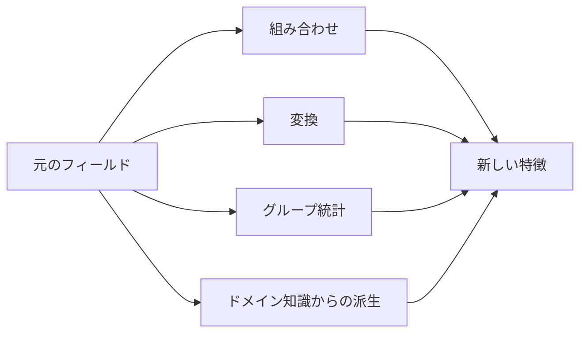

# 特徴構築


:::tip この節の位置づけ
特徴構築とは、すでにあるデータから**新しい特徴を作ること**です。モデルの性能を上げるうえで、非常に効果的な方法です。Kaggle コンペの勝敗は、より良い特徴を作れたかどうかで決まることがよくあります。
:::

## 学習目標

- 多項式特徴と交互特徴を理解する
- 時間特徴の抽出を理解する
- 統計特徴（グループ統計）を理解する
- ドメイン知識に基づく特徴設計を理解する

---

## まずは全体像をつかもう

特徴構築は、「適当に列を増やす」ことではなく、次のようなことです。

> **元のフィールドを、問題の本質により近い表現へ変えること。**



### 初心者向けのわかりやすい比喩

特徴構築は、次のように考えると理解しやすいです。

- 材料を、モデルが使いやすい下ごしらえ済みの形に加工する

元のフィールドは、たとえば：

- まだ切っていない食材

それに対して、構築後の特徴は：

- 用途に合わせて切ってあり、そのまま調理できる食材

つまり、特徴構築で本当に大事なのは「列をたくさん増やすこと」ではなく、

- データを問題の本質に近づけること

## いつ特徴構築をするべきか

- 元のフィールドがそのままでは「生っぽく」、モデルが関係を学びにくいとき
- EDA で、いくつかの組み合わせパターンが見えているとき
- ビジネス上、より自然な派生指標があるとき

## いつむやみに増やさない方がいいか

- 元の特徴をまだよく理解していないとき
- 新しい特徴が「複雑そうに見せるため」だけのとき
- 特徴数がすでに多いのに、選択や検証をしていないとき

## 初心者がそのまま使える特徴構築の順番

安定しやすい順番は、だいたい次の通りです。

1. まずは最も自然な業務上の比率や差分から始める
2. 次に少数の交互特徴を作る
3. その後で時間特徴やグループ統計を見る
4. 最後に、より攻めた自動組み合わせを考える

この順番なら、最初から多項式特徴を大量に増やすより、どこで効果が出たのかを把握しやすくなります。

## 一、多項式特徴と交互特徴

```python
from sklearn.preprocessing import PolynomialFeatures
import numpy as np
import pandas as pd

# 元の特徴
X = np.array([[2, 3], [4, 5]])
feature_names = ['x1', 'x2']

# 2次の多項式（交互項を含む）
poly = PolynomialFeatures(degree=2, include_bias=False)
X_poly = poly.fit_transform(X)
print("元の特徴:", feature_names)
print("多項式特徴:", poly.get_feature_names_out(feature_names))
print(f"特徴数: {X.shape[1]} → {X_poly.shape[1]}")
```

| 元の特徴 | 生成される特徴 | 説明 |
|------|------|------|
| x1, x2 | x1², x2² | 2次項 |
| x1, x2 | x1×x2 | 交互項 |

:::warning 注意
多項式特徴は、特徴数が**爆発的に増える**ことがあります。10 個の特徴の 3 次多項式では 286 個の特徴ができます。通常は `degree=2` を使い、特徴選択も組み合わせましょう。
:::

### 1.1 初めて交互特徴を作るとき、まず何を覚えるべき？

まず覚えるべきなのは数式ではなく、次の考え方です。

- 1 つの列だけでは表せない関係がある

たとえば：

- 住宅価格は面積だけで決まるわけではない
- 「面積 × 立地」のような組み合わせも重要かもしれない

つまり、交互特徴はこう考えるものです。

- 2 つの要素を一緒に見たとき、片方だけより説明力が高くならないか？

---

## 二、時間特徴の抽出

```python
# 日付からいろいろな特徴を抽出する
dates = pd.date_range('2024-01-01', periods=100, freq='D')
df_time = pd.DataFrame({'date': dates})

df_time['year'] = df_time['date'].dt.year
df_time['month'] = df_time['date'].dt.month
df_time['day'] = df_time['date'].dt.day
df_time['dayofweek'] = df_time['date'].dt.dayofweek     # 0=月曜日, 6=日曜日
df_time['is_weekend'] = df_time['dayofweek'].isin([5, 6]).astype(int)
df_time['quarter'] = df_time['date'].dt.quarter
df_time['day_of_year'] = df_time['date'].dt.dayofyear

print(df_time.head(10))
```

| 抽出する特徴 | 使う場面 |
|---------|---------|
| 年/月/日 | トレンドや季節性 |
| 曜日/週末かどうか | 消費行動の違い |
| 時/分 | 1 日の中のパターン |
| 四半期 | 四半期ごとの業務分析 |
| あるイベントからの経過日数 | 祝日効果 |

### 2.1 初心者がまず押さえたい見方

時間フィールドは、ただの「1つの列」ではなく、次のような潜在的な規則を含んでいます。

- 周期
- リズム
- あるイベントからの距離

そのため、時間特徴でよくやるのは、年/月/日を取り出すだけではありません。  
「いつか」を、**周期**と**位置**に分けて考えることが大事です。

---

## 三、統計特徴（グループ統計）

```python
import seaborn as sns

df = sns.load_dataset('tips')

# グループに基づく統計特徴
df['avg_tip_by_day'] = df.groupby('day')['tip'].transform('mean')
df['max_bill_by_time'] = df.groupby('time')['total_bill'].transform('max')
df['tip_pct'] = df['tip'] / df['total_bill']
df['bill_rank_in_day'] = df.groupby('day')['total_bill'].rank(pct=True)

print(df[['day', 'total_bill', 'tip', 'avg_tip_by_day', 'tip_pct', 'bill_rank_in_day']].head(10))
```

| 統計の種類 | 例 | 場面 |
|---------|------|------|
| グループ平均 | 曜日ごとの平均消費額 | 同じグループ内で比較する |
| グループ件数 | ユーザーごとの注文数 | 活性度を見る |
| 順位/パーセンタイル | 同じグループ内での順位 | 相対位置を見る |
| 差分/比率 | チップ/会計額の割合 | 派生指標を作る |

### 3.1 「同じグループ内での相対位置」の最小例

```python
df_small = pd.DataFrame({
    "city": ["A", "A", "A", "B", "B"],
    "income": [10, 20, 30, 5, 15],
})

df_small["city_mean_income"] = df_small.groupby("city")["income"].transform("mean")
df_small["income_minus_city_mean"] = df_small["income"] - df_small["city_mean_income"]

print(df_small)
```

この例は初心者にとても向いています。なぜなら、次のことが見えやすいからです。

- 絶対値だけでは足りないことがある
- 「自分のグループの中で高いのか低いのか」の方が重要なことがある

---

## 四、ドメイン知識に基づく特徴設計

**良い特徴は、ビジネス理解から生まれることが多いです。**

| 分野 | 元の特徴 | 構築する特徴 |
|------|---------|---------|
| EC | 総消費額、注文数 | 顧客単価 = 総消費額/注文数 |
| 不動産 | 面積、部屋数 | 1部屋あたり面積 = 面積/部屋数 |
| 金融 | 収入、負債 | 負債比率 = 負債/収入 |
| ユーザー | 登録時刻、最終ログイン | 非アクティブ日数 = 今日 - 最終ログイン |

```python
# 住宅価格データのドメイン特徴の例
np.random.seed(42)
house = pd.DataFrame({
    'area': np.random.uniform(50, 200, 100),
    'rooms': np.random.randint(1, 6, 100),
    'floor': np.random.randint(1, 30, 100),
    'age': np.random.randint(0, 30, 100),
})

# ドメイン特徴
house['area_per_room'] = house['area'] / house['rooms']
house['is_new'] = (house['age'] <= 5).astype(int)
house['is_high_floor'] = (house['floor'] >= 15).astype(int)

print(house.head())
```

### 4.1 なぜドメイン知識の特徴は価値が高いのか？

それは、ビジネスが本当に見たい指標に最も近いからです。  
たとえば：

- 不動産なら「1部屋あたり面積」
- EC なら「顧客単価」
- 金融なら「負債比率」

こうした特徴は、元の列そのものよりも、意思決定に使いやすいことがよくあります。

---

## 六、特徴を作った後に忘れてはいけない 3 つのこと

1. 次元数が増えすぎていないか確認する
2. 交差検証のスコアが本当に上がったか確認する
3. 新しい特徴が、モデルの解釈を難しくしたり、データ漏洩を起こしやすくしたりしていないか確認する

## 初心者がそのまま使える特徴構築チェックリスト

初めて特徴構築をするときは、次のチェックリストが安全です。

1. この新しい特徴には、はっきりした業務上の意味があるか？
2. 目的変数と近すぎて、データ漏洩の危険はないか？
3. 追加したあと、交差検証は本当に改善したか？
4. 改善したなら、なぜ良くなったのか説明できるか？

この 4 つに答えられないなら、  
その特徴はまだ急いで残す段階ではありません。

## 七、この節をプロジェクトに入れるなら、何を見せるべきか

- 元の特徴と新しい特徴の比較
- 新しい特徴にどんな業務上の意味があるか
- baseline と特徴追加後のスコア比較
- 「この新しい特徴が役立った」と言える具体例を 1〜2 個

---

## まとめ

| 方法 | 説明 | ポイント |
|------|------|------|
| 多項式/交互 | 高次特徴や組み合わせ特徴を自動生成する | 特徴の増えすぎに注意 |
| 時間特徴 | 日付から周期情報を取り出す | 曜日、月、祝日かどうか |
| 統計特徴 | グループ集計で相対的な指標を作る | `transform` で行数を保つ |
| ドメイン知識 | ビジネス理解に基づいて作る | 最も効果的だが経験が必要 |

## 実践練習

### 練習 1：Titanic の特徴構築

Titanic データセットで、次の特徴を作ってみましょう。家族の人数（sibsp+parch+1）、ひとり旅かどうか、運賃の区分、名前に含まれる称号。モデルの改善を確認してください。

### 練習 2：時系列特徴

1 年分の日付データを生成し、すべての時間特徴（月、週、四半期、平日かどうか）を抽出して、棒グラフでそれぞれの分布を表示しましょう。
