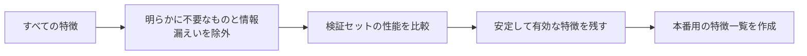

# 特徴選択


:::tip この節の位置づけ
特徴選択の目的は、特徴をできるだけ削ることではなく、性能・安定性・説明しやすさ・コストのバランスを取ることです。本当の目標は、タスクに有用で、本番で取得できて、情報漏えいを起こさない特徴を残すことです。
:::

## 学習目標

- なぜ特徴は多ければ多いほどよいわけではないのかを理解する
- フィルタ法、ラッパー法、埋め込み法という3つの基本的な考え方を身につける
- 検証セットを使って、特徴選択が本当に有効か判断できる
- 特徴選択と業務での説明しやすさ、本番導入コストの関係を理解する

---

## なぜ特徴選択が必要なのか

特徴が多すぎると、いくつかの問題が起こります。ノイズが増える、学習が遅くなる、モデルが過学習しやすくなる、説明コストが上がる、本番でのデータ依存関係が複雑になる、などです。特に実際の業務では、1つの特徴が追加のデータソース、1つのAPI、1つの権限、あるいは1つの保守ロジックを意味することがあります。



## 一、まずモデルに入れるべきでない特徴を削除する

最初のステップは、高度なアルゴリズムではなく、人手でのチェックです。通常は、次のものを優先して取り除きます。ユニークID、目的変数の結果が出た後にしか現れない項目、欠損率が非常に高く業務上の意味がない項目、学習時と本番で安定して取得できない項目、明らかに重複している項目。

```python
cols_to_drop = ["user_id", "order_id"]
X = df.drop(columns=cols_to_drop + ["target"])
y = df["target"]
```

ID が常に無用とは限りませんが、学習初期では慎重に扱うべきです。多くの ID は、モデルに訓練サンプルを覚え込ませるだけになり、汎化できる規則を学ばせません。

## 二、フィルタ法：まず単一特徴の統計的な関係を見る

フィルタ法は、特定のモデルに依存せず、まず統計指標で特徴を選びます。たとえば、数値特徴は相関係数、カテゴリ特徴はカイ二乗検定、テキストや高次元特徴は分散を見ることがあります。

```python
from sklearn.feature_selection import SelectKBest, f_classif

selector = SelectKBest(score_func=f_classif, k=10)
X_selected = selector.fit_transform(X_train, y_train)
selected_cols = X_train.columns[selector.get_support()]
print(selected_cols)
```

フィルタ法は高速なので、一次選別に向いています。ただし、特徴同士の組み合わせ効果を見落としやすいのが欠点です。

## 三、ラッパー法：モデルの性能で何度も試す

ラッパー法は、モデルの学習性能を選択基準にします。たとえば、再帰的特徴削減 RFE などです。最終目標に近い方法ですが、計算コストは高くなります。

```python
from sklearn.feature_selection import RFE
from sklearn.linear_model import LogisticRegression

estimator = LogisticRegression(max_iter=1000)
selector = RFE(estimator, n_features_to_select=8)
selector.fit(X_train_scaled, y_train)
print(selector.support_)
```

ラッパー法は、特徴数がそれほど多くなく、計算コストを払ってでもモデル性能に近い形で選びたい場面に向いています。

## 四、埋め込み法：モデル自身に重要度を出させる

いくつかのモデルは、学習の過程で特徴重要度を出せます。たとえば、L1 正則化の線形モデル、ランダムフォレスト、GBDT、XGBoost、LightGBM です。

```python
from sklearn.ensemble import RandomForestClassifier

model = RandomForestClassifier(random_state=42)
model.fit(X_train, y_train)
importance = model.feature_importances_
```

注意してください。特徴重要度は絶対的な真実ではありません。モデルが違えば、乱数シードが違えば、データ分割が違えば、順位も変わることがあります。できれば、検証セットの性能と業務知識を合わせて判断しましょう。

## 五、検証セットで本当に改善したか確認する

特徴選択で最も起こりやすいミスは、「選んだ特徴がそれらしく見える」ことだけを見て、モデルが本当に安定して良くなったかを検証しないことです。正しいやり方は、baseline と特徴選択後のモデルを比較することです。

```python
from sklearn.metrics import roc_auc_score

baseline_model.fit(X_train, y_train)
baseline_auc = roc_auc_score(y_val, baseline_model.predict_proba(X_val)[:, 1])

selected_model.fit(X_train_selected, y_train)
selected_auc = roc_auc_score(y_val, selected_model.predict_proba(X_val_selected)[:, 1])

print("baseline", baseline_auc)
print("selected", selected_auc)
```

特徴が少なくなっても性能がほぼ同じで、学習が速くなり、説明しやすくなり、本番での依存も減るなら、それはより良い案である可能性があります。

## 六、実際のプロジェクトでの判断基準

実際のプロジェクトでは、特徴選択はスコアだけでなく、安定性があるか、説明できるか、本番で使えるか、コンプライアンス上のリスクがないか、追加コストが発生しないかも見ます。AUC が 0.001 上がるだけで、しかも高価な外部データソースの接続が必要な特徴は、本番に載せる価値がないかもしれません。

## よくある誤解

1つ目の誤解は、全データで特徴選択をしてから訓練・テストに分割することです。これは情報漏えいになります。2つ目の誤解は、特徴重要度の順位を盲目的に信じることです。3つ目の誤解は、特徴数をとにかく最小にしようとして、モデルを過小適合にすることです。4つ目の誤解は、本番で取得できるかどうかを無視することです。学習時に使えた項目が、本番でリアルタイムに取れるとは限りません。

## 練習

1. ある分類データセットで、SelectKBest を使って上位 10 個の特徴を選び、baseline と比較してください。
2. ランダムフォレストで特徴重要度を出し、順位が直感に合うか観察してください。
3. 「学習時にはあるかもしれないが、本番では必ずしもない」特徴を 3 つ手で挙げてください。
4. なぜ特徴選択は交差検証フローの内部で行う必要があるのか説明してください。

## 合格基準

この節を学び終えたら、3 種類の特徴選択方法の違いを説明でき、検証セットで選択が有効かどうか判断でき、データ漏えいのリスクを見分けられ、さらに性能・説明しやすさ・コスト・本番での取得可能性の 4 つの観点から、ある特徴を残すべきかどうか決められるようになっているはずです。
