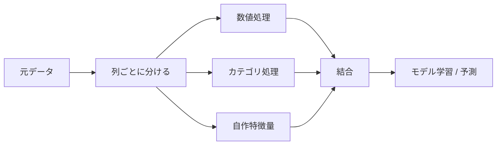
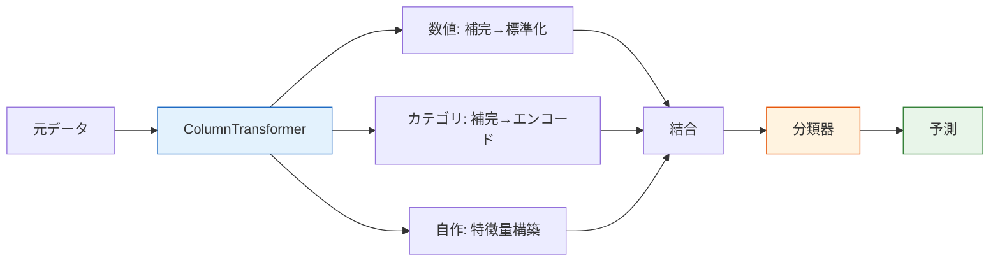

# 5.5.6 Pipeline とワークフロー


:::tip この節の位置づけ
実際のプロジェクトでは、数値特徴量とカテゴリ特徴量で**異なる前処理**が必要です。この節では `ColumnTransformer` + `Pipeline` を使って**完全な特徴量エンジニアリングのパイプライン**を作る方法を学びます。1つのオブジェクトで全部まとめて扱えます。
:::

## 学習目標

- ColumnTransformer で混合型データを処理できるようになる
- 自作 Transformer を作れるようになる
- 完全な特徴量エンジニアリングのパイプラインを構築できるようになる

---

## まずは全体像をつかもう

多くの初心者は、前半の各手順は単独でできても、実際のプロジェクトになると混乱しがちです。Pipeline が解決するのは次のことです。

> **「データ処理 -> 特徴量エンジニアリング -> モデル学習」を、安定して再現でき、しかもデータ漏洩のない1本のワークフローとして固定すること。**



### 初心者向けのわかりやすい比喩

Pipeline は次のように考えるとわかりやすいです。

- ばらばらの手作業を、1本の自動化されたラインにまとめるもの

Pipeline がないと、次のようなことを毎回手でやることになります。

- 欠損値を手動で埋める
- エンコードを手動で行う
- スケーリングを手動で行う
- その結果を手動でモデルに渡す

これはまるで、

- 毎回紙に手順を書いて作業するようなもので、手順を忘れやすい

一方で Pipeline の価値は、

- この流れを固定して、学習と予測の両方で同じルールを使えること

## なぜ実務では Pipeline が必須なのか

- 学習データとテストデータで処理方法がズレるのを防げる
- データ漏洩を防げる
- 交差検証やチューニングがしやすい
- 新しいデータにも同じ処理を再利用しやすい

### どんなときに失敗しやすい？

一番よくある落とし穴は、次のパターンです。

- 学習データには手作業で1つの処理をする
- テストデータには別の手作業の処理をする

すると、モデルが見ているデータはそもそも同じ種類ではなくなります。  
Pipeline の最も大事な役割は、こうした「流れが崩れているのに気づかない」問題を防ぐことです。

## 一、ColumnTransformer —— 列ごとに処理する

```python
import pandas as pd
import numpy as np
import seaborn as sns
from sklearn.compose import ColumnTransformer
from sklearn.preprocessing import StandardScaler, OneHotEncoder
from sklearn.impute import SimpleImputer
from sklearn.pipeline import Pipeline

df = sns.load_dataset('titanic').dropna(subset=['embarked'])

# 特徴量を定義
num_features = ['age', 'fare']
cat_features = ['sex', 'embarked', 'class']

# 数値処理のパイプライン
num_pipeline = Pipeline([
    ('imputer', SimpleImputer(strategy='median')),
    ('scaler', StandardScaler()),
])

# カテゴリ処理のパイプライン
cat_pipeline = Pipeline([
    ('imputer', SimpleImputer(strategy='most_frequent')),
    ('encoder', OneHotEncoder(drop='first', sparse_output=False)),
])

# 組み合わせる
preprocessor = ColumnTransformer([
    ('num', num_pipeline, num_features),
    ('cat', cat_pipeline, cat_features),
])

X = df[num_features + cat_features]
y = df['survived']
X_transformed = preprocessor.fit_transform(X)
print(f"元の形: {X.shape} → 処理後: {X_transformed.shape}")
```

### この例でまず押さえるべきポイントは？

まず一番大事なのは、

- 列ごとに違う処理をする

ということです。

つまり、

- 数値列をカテゴリエンコードの方法で処理しない
- カテゴリ列をそのまま標準化しない

初心者が表形式データで最初につまずく原因は、モデル選びよりも、  
列ごとの処理の仕方が最初から混ざっていることが多いです。

---

## 二、完全な Pipeline：前処理 + モデル

```python
from sklearn.ensemble import RandomForestClassifier
from sklearn.model_selection import cross_val_score

# 前処理 + モデルを1本にまとめる
full_pipeline = Pipeline([
    ('preprocessor', preprocessor),
    ('classifier', RandomForestClassifier(n_estimators=100, random_state=42)),
])

scores = cross_val_score(full_pipeline, X, y, cv=5, scoring='accuracy')
print(f"5分割CVの正解率: {scores.mean():.4f} ± {scores.std():.4f}")
```

### なぜ Pipeline と交差検証は相性がいいのか？

交差検証の本質は、

- 各分割ごとに学習をやり直すこと

です。

前処理を Pipeline の中に入れておくと、  
各分割で自動的に次のように動きます。

- 学習分割だけで fit する
- その同じルールを検証分割に適用する

これが、データ漏洩を防ぐための重要なポイントです。


この図では、実際の表形式プロジェクトを3本の流れに分けています。数値列はまず欠損値を補完してから標準化し、カテゴリ列はまず欠損値を補完してからエンコードし、自作特徴量も同じ Pipeline に入れます。最後に全体を交差検証や GridSearch に渡すことで、学習・検証・予測のすべてが同じ再現可能な流れになります。

---

## 三、自作 Transformer

```python
from sklearn.base import BaseEstimator, TransformerMixin

class FamilySizeTransformer(BaseEstimator, TransformerMixin):
    """sibsp と parch から家族サイズ特徴量を作る"""
    def fit(self, X, y=None):
        return self

    def transform(self, X):
        X = X.copy()
        X['family_size'] = X['sibsp'] + X['parch'] + 1
        X['is_alone'] = (X['family_size'] == 1).astype(int)
        return X[['family_size', 'is_alone']]

# 使用
custom_features = ['sibsp', 'parch']
full_preprocessor = ColumnTransformer([
    ('num', num_pipeline, num_features),
    ('cat', cat_pipeline, cat_features),
    ('custom', FamilySizeTransformer(), custom_features),
])

pipe = Pipeline([
    ('preprocessor', full_preprocessor),
    ('classifier', RandomForestClassifier(n_estimators=100, random_state=42)),
])

scores = cross_val_score(pipe, df[num_features + cat_features + custom_features], y, cv=5)
print(f"自作特徴量あり: {scores.mean():.4f} ± {scores.std():.4f}")
```

### 自作 Transformer はどんなときに使う？

こういうときに特に向いています。

- ある特徴量の作り方が有効だと、すでにわかっている
- その処理を学習時と予測時の両方で安定して再利用したい

たとえば、

- 家族サイズ
- 1人で乗っているかどうか
- 部屋あたりの面積

こうした特徴量は、Transformer にしておくと、場当たり的にコードをコピーするよりずっと安全です。

---

## 四、Pipeline + GridSearch

```python
from sklearn.model_selection import GridSearchCV

param_grid = {
    'classifier__n_estimators': [50, 100, 200],
    'classifier__max_depth': [5, 10, None],
}

grid = GridSearchCV(pipe, param_grid, cv=5, scoring='accuracy', n_jobs=-1)
grid.fit(df[num_features + cat_features + custom_features], y)

print(f"最良パラメータ: {grid.best_params_}")
print(f"最良CV: {grid.best_score_:.4f}")
```

---

## 初心者がまず覚えるべき最小限のパイプライン

ML プロジェクトを始めたばかりなら、まずは次の流れをきちんと書けるようにしましょう。

1. 欠損値の補完
2. 数値のスケーリング
3. カテゴリのエンコード
4. モデル学習
5. 交差検証

この流れが書けるようになると、その後に複雑な特徴量やチューニングを追加しても、かなり楽になります。



## 初心者がそのまま真似できるワークフローチェックリスト

初めて表形式のプロジェクトを作るときは、次のチェックリストが一番安全です。

1. 欠損値処理が Pipeline に入っているか
2. 数値列とカテゴリ列が明確に分かれているか
3. 交差検証が完全な Pipeline 上で実行されているか
4. 自作特徴量が学習と予測の両方で使われているか

この4つを満たしていれば、  
あなたのプロジェクトは「動くけれど再現できない」ものより、ずっと安定します。

---

## まとめ

| コンポーネント | 説明 |
|------|------|
| `Pipeline` | 複数の手順をつなげる |
| `ColumnTransformer` | 列ごとに異なる処理を行う |
| 自作 Transformer | `BaseEstimator` + `TransformerMixin` を継承する |
| Pipeline + GridSearch | 前処理とモデルをまとめてチューニングする |

## ハンズオン練習

### 練習 1: 完全な Titanic Pipeline

完全な Pipeline（数値処理、カテゴリエンコード、自作特徴量を含む）を作り、ランダムフォレストとロジスティック回帰の結果を比較してください。

### 練習 2: Pipeline のチューニング

練習 1 の Pipeline に対して GridSearchCV を使い、前処理パラメータ（たとえば PCA の n_components）とモデルパラメータを同時に調整してください。
