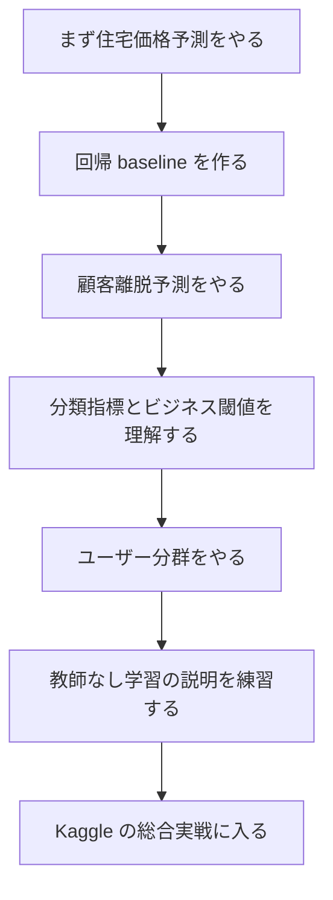

# 学習ガイド：プロジェクト実践のこの章はどう学べばいいのか

この章は新しいアルゴリズムの授業ではなく、前の5章を本当にプロジェクトとしてつなげるための章です。前半では、タスクの種類、教師あり学習、教師なし学習、モデル評価、特徴量エンジニアリングを学びました。プロジェクト章で鍛えるのは、ある問題を受け取ったときに、それをどうやってモデリング可能で、評価可能で、説明可能で、納品可能な機械学習作品に変えるか、という力です。

## この章がコース全体でどこにあるのか

機械学習プロジェクト章は、第5ステップの出口です。ここでは、`sklearn` を呼び出せるだけでも、アルゴリズム名を暗記しているだけでもなく、ビジネス課題、データ、モデル、指標、結論を同じ流れの中に置けることを示します。

コース全体の流れで見ると、この章は後の深層学習、大規模モデルの応用、Agent の土台にもなります。どんなにモデルが複雑でも、プロジェクト思考は似ています。まず問題を定義し、次に baseline を作り、それから評価、改善、説明、納品へ進みます。

## この章が本当に解決したい問題

この章では、次の5つの問いに答えます。現実の問題をどうやって回帰、分類、クラスタリングのタスクに落とし込むのか。最初から複雑なモデルを追わずに、どうやって最小限の baseline を作るのか。主指標と補助指標をどう選ぶのか。特徴量エンジニアリング、調整、モデル比較を通して、どうやって説明可能な改善を行うのか。モデル結果をどうやってビジネス言語やプロジェクトレポートに翻訳するのか。

初心者が最もやりがちな間違いは、プロジェクト章を「コードをそのまま動かす章」と思ってしまうことです。本当のプロジェクトは、モデルが動いたかどうかではなく、なぜそのように問題を定義したのか、なぜその指標を選んだのか、なぜ今回の改善が効いたのか、モデルはどこで間違えたのか、次に何をすべきかを説明できることです。

## 初心者におすすめの学習順序

まずは住宅価格予測から始めるのがおすすめです。回帰タスクは「連続した数値を予測する」という感覚をつかみやすいからです。次に顧客離脱予測を行い、分類指標、不均衡データ、ビジネス上の閾値を学びます。続いてユーザー分群分析に進み、教師なし学習の結果をどう説明するかを理解します。最後に Kaggle 競技に挑戦し、データ処理、モデリング、評価、提出を実際の採点環境に置いてみます。

## この章を学ぶときに押さえるべき主線

この章の主線は、機械学習プロジェクトは一度の学習ではなく、記録可能で、比較可能で、説明可能な実験の集まりだ、ということです。

この線が見えるようになると、なぜ各プロジェクトで実験記録を残すべきなのかが分かります。baseline がなければ、改善が本当に効いたのか分かりません。誤り分析がなければ、モデルがどんな条件で失敗するのか分かりません。納品の表現がなければ、プロジェクトを作品集にしづらくなります。

## 4つのプロジェクトでそれぞれ何を練習するのか

| プロジェクト | タスクの種類 | 本当に鍛えること |
|---|---|---|
| 住宅価格予測 | 回帰 | baseline から調整までの回帰の一連の流れ |
| 顧客離脱予測 | 分類 | 不均衡データ、ビジネス指標、分類評価 |
| ユーザー分群分析 | クラスタリング | 教師なしプロジェクトの説明と業務への落とし込み |
| Kaggle 競技実戦 | 総合 | 一連の ML 流れを本物の採点環境に載せること |

## この章とその先の段階の関係

機械学習プロジェクトは、「実験する意識」を後の深層学習や大規模モデルのプロジェクトにも持ち込んでくれます。深層学習プロジェクトにも baseline、学習記録、誤り分析が必要です。RAG プロジェクトにも評価用データセットと失敗例が必要です。Agent プロジェクトにも処理ログと結果評価が必要です。

この章が安定していないと、後で起こりやすいのは、モデルを動かすことはできても実験設計ができない、スコアだけ見て指標の妥当性が分からない、モデル結果を説明できない、プロジェクトをきれいな作品集として表現できない、という問題です。

## 初心者と上級学習者はどう読むか

初心者がこの章を初めて学ぶときは、まず主線と最小限の動く例をつかみましょう。すべての細部を一度で理解する必要はありません。この章が何を解決するのか、入力と出力は何か、最小プロジェクトはどうやって動き出すのか、を説明できれば先に進めます。

経験のある学習者は、この章を抜け漏れの確認とエンジニアリング練習として使えます。境界条件、失敗ケース、評価方法、コードの再現性、そして前後の段階とのつながりに注目しましょう。読み終えたら、本章の内容を自分の作品 README や実験記録に残すのがおすすめです。

## 学習時間と難易度の目安

| 学習方法 | おすすめの投入時間 | 目標 |
|---|---|---|
| ざっと読む | 20～30 分 | この章が何を解決するのかを理解し、後でどこに使うかを知る |
| 最小クリア | 1～2 時間 | 最小例を動かし、本章のミニプロジェクト出口を完成させる |
| じっくり練習 | 半日～1 日 | 誤り分析、比較実験、プロジェクト README の記録を補う |

## 本章のセルフチェック問題

| セルフチェック問題 | 合格基準 |
|---|---|
| この章は何を解決するのか？ | コース全体の中での位置を一文で説明できる |
| 最小の入力と出力は何か？ | 例に何が必要で、どんな結果が出るかを説明できる |
| よくある失敗ポイントはどこか？ | 少なくとも1つ、エラー、精度低下、理解のずれの原因を挙げられる |
| 学んだ後に何を残せるか？ | 本章の成果をプロジェクト README、実験記録、作品集に書ける |

## 本章の小プロジェクト出口

この章を学び終えたら、少なくとも1つ「振り返り可能な機械学習プロジェクトレポート」を完成させるのがおすすめです。レポートには、問題定義、データ説明、baseline、評価指標、少なくとも2回の改善、誤り分析、最終結論、次の計画を含めましょう。

各プロジェクトには、実験記録表を1枚残すことをおすすめします。項目は、バージョン、何を変えたか、主指標、補助指標、私の判断、次の一手です。こうすることで、あなたは「コードを動かす」段階から「実験をする」段階へ少しずつ移れます。

## Debug 探偵事件

| 事件 | 内容 |
|---|---|
| 事件名 | 異常に高すぎるモデルスコア |
| 現場 | モデル指標は異常に良いのに、テストセットを変えると性能がはっきり下がる。 |
| 捜査手順 | train/test 分割、重複サンプル、目的変数リーク、Dummy baseline を確認する。 |
| 結審の証拠 | リーク確認記録、baseline 指標、誤りサンプル。 |

プロジェクト練習では、成功した画面だけを残さないようにしましょう。少なくとも1つ、実際の失敗サンプルを選び、「現象、手がかり、疑わしい原因、捜査手順、修復アクション、回帰確認」の形で `reports/failure_cases.md` に書いておくと、プロジェクトがより本物のエンジニアリング成果物らしくなります。

## プロジェクト納品物の標準

各総合プロジェクトは、コードを動かすだけでなく、同じ作品集基準で納品するのがおすすめです。最小の納品物には、README、再現可能な実行コマンド、サンプルの入力出力、重要なフローチャート、失敗サンプル分析、次の改善計画を含めましょう。

| 納品物 | 最低要件 | 発展要件 |
|---|---|---|
| README | プロジェクトの目的、実行方法、依存関係、例を明記する | アーキテクチャ図、設計上のトレードオフ、振り返りを追加する |
| サンプル入力出力 | 少なくとも1つの完全なケースを残す | 成功例、失敗例、境界例を残す |
| 評価記録 | どの指標で効果を判断するかを明記する | baseline、比較実験、誤り分析を入れる |
| エンジニアリング記録 | 環境問題やインターフェース問題を1回記録する | ログ、コスト、所要時間、トラブルシュートの過程を記録する |
| デモ素材 | 画面キャプチャや短い GIF で動作を示す | 説明しやすい作品集ページにまとめる |

プロジェクトで一番大事なのは、機能をたくさん積むことではなく、何を解決したのか、システムがどう動くのか、効果をどう判断するのか、失敗したときにどう原因を特定するのか、次の版でどう直すのかを、きちんと説明できることです。

この図はプロジェクトレポートのテンプレートとして使えます。まず問題とデータを説明し、次に baseline、指標、モデル比較、誤りサンプル、次の計画を見せましょう。作品集で人の心を動かすのは、「たくさんのモデルを動かしたこと」ではなく、「なぜモデルがそのように間違えたのか分かっていて、次の改善で何を変えるのかを知っていること」です。

## 合格基準

この章を終えるときには、典型的な ML 問題を分かりやすいモデリングの流れに分解でき、タスクの種類に応じて指標と baseline を選べ、1回の説明可能な改善ができ、誤り分析でモデルの限界を説明でき、結果を他の人に分かるプロジェクトレポートに書けるようになっているはずです。

「どう問題を定義したか、なぜその評価にしたか、モデルはどこで間違えたか、次にどう直すか」をはっきり言えるなら、機械学習段階の作品集出口基準に達しています。

## バージョン別の進め方のおすすめ

| バージョン | 目標 | 納品の重点 |
|---|---|---|
| ベーシック版 | 最小の閉ループを動かす | 入力できる、処理できる、出力できる、そしてサンプルを1組残す |
| スタンダード版 | 見せられるプロジェクトにする | 設定、ログ、エラー処理、README、画面キャプチャを追加する |
| チャレンジ版 | 作品集品質に近づける | 評価、比較実験、失敗サンプル分析、次のロードマップを追加する |

まずはベーシック版を完成させましょう。最初から大きく完璧を目指す必要はありません。バージョンを1つ上げるごとに、「何の能力が増えたか、どう検証したか、まだ何が問題か」を README に書き足していきましょう。
