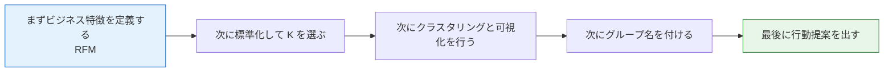

# プロジェクト3：ユーザーセグメンテーション分析（クラスタリング問題）


:::tip プロジェクトの位置づけ
ユーザーセグメンテーションは**教師なし学習で最もよく使われるビジネス応用の一つ**です。このプロジェクトでは RFM モデルで顧客特徴を作成し、クラスタリングによって異なる価値を持つ顧客群を見つけ、マーケティング提案を行います。
:::

## プロジェクト概要

| 情報 | 説明 |
|------|------|
| タスク種類 | クラスタリング（教師なし） |
| 手法 | RFM モデル + K-Means |
| 評価指標 | シルエット係数 |
| 関連スキル | 特徴量設計、標準化、次元削減、クラスタリング、ビジネス解釈 |

## まず、とても重要な学習の期待値をはっきりさせよう

この問題で新人がつまずきやすいポイントは、クラスタリングが動かないことではなく、プロジェクトが次のようになってしまいやすいことです。

- グラフはきれい
- グループ名も付けた
- でも、ビジネス上どう使うのかがわからない

最初の一回でまず身につけるべきなのは、クラスタリング図をもっときれいに描くことではなく、

> **「グループ構造」を本当に「行動できるユーザー像と戦略」に翻訳する方法**

です。

この線を先に作れれば、この問題は単なる可視化練習ではなく、実際のプロジェクトにかなり近づきます。

---

## まずは全体の地図を作ろう

この問題は「図はきれいだけど、説明が薄い」になりやすいです。  
なので、いきなりクラスタリングを回すよりも、「どんな群を価値ありとみなすのか」を先に考えるのが一番安定しています。



教師なしプロジェクトで大事なのは、「アルゴリズムを最後まで動かしたか」ではなく、クラスタリング結果を行動可能なユーザー像のストーリーとして説明できるかどうかです。

## この問題で本当に練習すること

このプロジェクトの本当に難しいところは、クラスタリングラベルを出すことではなく、次の3つです。

1. ビジネス用語で特徴を定義する
2. K の値が妥当か判断する
3. クラスタリング結果を「行動できるユーザー群」として説明する

## 最初の版でまず確認すべきこと

初めてこの問題に取り組むとき、最初に確認すべきなのは次の点です。

- 選んだ特徴量にビジネス上の意味が本当にあるか
- 各特徴量の方向性が説明できるか
- 最終的にどんな基準でグループ名を付けるのか

クラスタリングプロジェクトでは、後半の「説明の質」の上限は、特徴量の定義の段階でほぼ決まってしまうことがよくあります。

## 新人向けのわかりやすい例え

この問題は、次のように考えると理解しやすいです。

- たくさんのユーザーに対して「実行可能な層分けリスト」を作る

大事なのは、

- 機械が人を無理やり何分類かに分けること

ではなく、

- その層分けが、運営・マーケティング・プロダクトチームの行動に本当に役立つか

です。

つまり、この問題で一番価値があるのはクラスタリングそのものではなく、

- 命名
- 解釈
- 行動提案

です。

## おすすめの進め方

1. まず RFM の意味をはっきり説明する
2. 次に標準化と K の選定を行う
3. 次に PCA で可視化する
4. 最後にグループ名とビジネス提案を書く

教師なしプロジェクトで一番怖いのは、「図は作れたけど、説明できない」ことです。

## 初めてこの問題に取り組むときの、いちばん安定したデフォルト順序

初めてユーザーセグメンテーションをやるなら、この順番がおすすめです。

1. まずビジネス目標を明確にする
2. 画像化したい特徴量がなぜ RFM なのかを決める
3. 標準化と K の選定を行う
4. 各グループの統計的な特徴を出す
5. PCA 図で見やすく示す
6. 最後にグループ名とビジネス提案を書く

こうすると、先に作るのは次の要素になるので安定します。

- 特徴量の意味
- クラスタリングの根拠
- グループ像
- ビジネス行動

図に引っ張られるのではなく、この一連の流れを先に作れます。

## Step 1：RFM データを生成する

```python
import pandas as pd
import numpy as np
import matplotlib.pyplot as plt

np.random.seed(42)
n_customers = 1000

df = pd.DataFrame({
    'customer_id': range(1, n_customers + 1),
    'recency': np.random.exponential(30, n_customers).astype(int) + 1,       # 最後の購入からの日数
    'frequency': np.random.poisson(5, n_customers) + 1,                       # 購入頻度
    'monetary': np.random.exponential(200, n_customers).round(2) + 10,        # 総消費額
})

print(df.describe())
```

### RFM の概要

| 指標 | 意味 | 値が大きいとどういう意味か |
|------|------|--------------------------|
| **R**ecency | 最後の購入からの日数 | 小さいほど良い（最近購入している） |
| **F**requency | 購入頻度 | 大きいほど良い（常連） |
| **M**onetary | 総消費額 | 大きいほど良い（高消費） |

### Step 1.1 なぜ RFM は最初のクラスタリングプロジェクトに特に向いているのか

RFM には、新人にとってとても扱いやすい 2 つの良さがあります。

- ビジネス上の意味がとてもわかりやすい
- その後のグループ解釈が自然にしやすい

つまり、抽象的な数値をクラスタリングするのではなく、

- 最近購入したか
- 頻繁に来ているか
- たくさん使っているか

という、直感的な行動で分けられます。

---

## Step 2：特徴量の標準化とクラスタリング

```python
from sklearn.preprocessing import StandardScaler
from sklearn.cluster import KMeans

features = ['recency', 'frequency', 'monetary']
scaler = StandardScaler()
X_scaled = scaler.fit_transform(df[features])

# エルボー法で K を選ぶ
inertias = []
sil_scores = []
K_range = range(2, 9)

from sklearn.metrics import silhouette_score
for k in K_range:
    km = KMeans(n_clusters=k, random_state=42, n_init=10)
    labels = km.fit_predict(X_scaled)
    inertias.append(km.inertia_)
    sil_scores.append(silhouette_score(X_scaled, labels))

fig, axes = plt.subplots(1, 2, figsize=(12, 4))
axes[0].plot(K_range, inertias, 'bo-')
axes[0].set_xlabel('K')
axes[0].set_ylabel('Inertia')
axes[0].set_title('エルボー法')

axes[1].plot(K_range, sil_scores, 'ro-')
axes[1].set_xlabel('K')
axes[1].set_ylabel('シルエット係数')
axes[1].set_title('シルエット係数法')

plt.tight_layout()
plt.show()
```

---

## Step 3：クラスタリングと可視化

```python
from sklearn.decomposition import PCA

# 最適な K を選ぶ
best_k = K_range[np.argmax(sil_scores)]
print(f"最適な K: {best_k}, シルエット係数: {max(sil_scores):.4f}")

km = KMeans(n_clusters=best_k, random_state=42, n_init=10)
df['cluster'] = km.fit_predict(X_scaled)

# PCA による次元削減と可視化
pca = PCA(n_components=2)
X_2d = pca.fit_transform(X_scaled)

plt.figure(figsize=(8, 6))
scatter = plt.scatter(X_2d[:, 0], X_2d[:, 1], c=df['cluster'], cmap='Set2', s=15, alpha=0.6)
plt.colorbar(scatter, label='クラスタ')
plt.xlabel(f'PC1 ({pca.explained_variance_ratio_[0]:.1%})')
plt.ylabel(f'PC2 ({pca.explained_variance_ratio_[1]:.1%})')
plt.title('ユーザーセグメンテーション（PCA 投影）')
plt.show()
```

### Step 3.1 PCA 図はどう解釈するべきか

この図の役割は主に次の通りです。

- グループがある程度分かれているかを見る
- 目立つ外れ群があるかを見る
- 結果の見せ方を補助する

ただし、これが最終的な証拠ではありません。  
プロジェクトの質を本当に決めるのは、次の要素です。

- グループごとの統計的特徴
- 命名が妥当かどうか
- ビジネス提案が実行可能かどうか

---

## Step 4：クラスタリング結果の解釈

```python
# 各グループの RFM 統計
cluster_summary = df.groupby('cluster')[features].mean().round(1)
cluster_summary['顧客数'] = df.groupby('cluster').size()
print(cluster_summary)

# レーダーチャート
fig, axes = plt.subplots(1, best_k, figsize=(4*best_k, 4), subplot_kw=dict(polar=True))
if best_k == 1:
    axes = [axes]

angles = np.linspace(0, 2*np.pi, len(features), endpoint=False).tolist()
angles += angles[:1]

# 比較しやすいように [0, 1] に正規化
from sklearn.preprocessing import MinMaxScaler
mms = MinMaxScaler()
radar_data = mms.fit_transform(cluster_summary[features])
# recency は小さいほど良いので反転
radar_data[:, 0] = 1 - radar_data[:, 0]

for i, ax in enumerate(axes):
    values = radar_data[i].tolist() + [radar_data[i][0]]
    ax.fill(angles, values, alpha=0.25)
    ax.plot(angles, values, linewidth=2)
    ax.set_xticks(angles[:-1])
    ax.set_xticklabels(['最近の活発さ', '購入頻度', '消費額'])
    ax.set_title(f'グループ {i}', pad=15)

plt.suptitle('各グループの RFM レーダーチャート', y=1.02, fontsize=13)
plt.tight_layout()
plt.show()
```

---

## Step 5：ビジネス提案

```python
# クラスタの特徴に応じてラベルと提案を付ける
print("\n=== ビジネス提案 ===")
for i in range(best_k):
    row = cluster_summary.loc[i]
    label = ""
    suggestion = ""
    if row['recency'] < cluster_summary['recency'].median() and row['monetary'] > cluster_summary['monetary'].median():
        label = "高価値アクティブ顧客"
        suggestion = "VIP サービス、専用特典でロイヤルティを維持"
    elif row['recency'] > cluster_summary['recency'].median() and row['monetary'] > cluster_summary['monetary'].median():
        label = "高価値離脱リスク顧客"
        suggestion = "再来訪促進マーケティング、パーソナライズ推薦"
    elif row['frequency'] > cluster_summary['frequency'].median():
        label = "高頻度・低単価顧客"
        suggestion = "客単価向上、クロスセル"
    else:
        label = "低アクティブ顧客"
        suggestion = "低コスト接触、クーポンで活性化"

    print(f"  グループ {i} ({int(row['顧客数'])} 人): {label}")
    print(f"    提案: {suggestion}")
```

### Step 5.1 グループ名を付けるときの、実用的なテンプレート

次の順番で名前を付けると便利です。

- まずアクティブ度を見る
- 次に価値を見る
- 最後にリスクを見る

たとえば次のようにできます。

- 高価値アクティブ顧客
- 高価値離脱リスク顧客
- 高頻度・低単価顧客
- 低アクティブ・要活性化顧客

この命名の良いところは、あとでビジネス担当者が見たときに、どう動けばよいかすぐわかることです。

---

## 提出時にできれば追加したい内容

- K を選ぶための曲線図
- PCA によるクラスタリング可視化
- グループ像の表
- 「なぜこのようなグループ名にしたのか」の説明文

## より完成度の高いプロジェクト構成

1. なぜ RFM を使って画像化するのか
2. どうやって K を選ぶのか
3. 各グループの特徴は何か
4. なぜその名前を付けたのか
5. 各グループにどんな戦略を取るのか
6. 続けて改善するなら、次にどんな特徴量を追加したいか

## ポートフォリオとして見せるなら、特に何を見せるべきか

- K を選んだ根拠
- 各グループの RFM 画像化表
- クラスタリングの可視化図
- グループ名と戦略の 1 ページ表
- 「このクラスタリングに本当にビジネス価値があるか」の自分なりの判断

---

## プロジェクト確認チェックリスト

- [ ] RFM 特徴量を作成する
- [ ] 標準化 + エルボー法/シルエット係数で K を選ぶ
- [ ] PCA によってクラスタリング結果を可視化する
- [ ] 各グループの RFM 特徴を分析する
- [ ] 実行可能なビジネス提案を出す

## バージョンの進め方のおすすめ

| バージョン | 目標 | 提出の重点 |
|---|---|---|
| 基本版 | 最小限の閉ループを動かす | 入力・処理・出力ができ、サンプルを 1 つ残す |
| 標準版 | 見せられるプロジェクトにする | 設定、ログ、エラー処理、README、スクリーンショットを追加する |
| 発展版 | ポートフォリオ品質に近づける | 評価、比較実験、失敗サンプル分析、次の改善方針を追加する |

まずは基本版を完成させるのがおすすめです。最初から何でも盛り込もうとしないでください。バージョンを一つ上げるたびに、「何を追加したのか」「どう検証したのか」「まだ何が課題か」を README に書きましょう。
