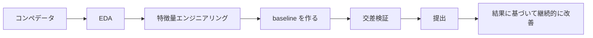
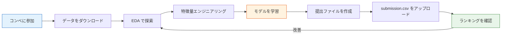

# Kaggle コンペ実戦（選修）


:::tip この節の位置づけ
Kaggle は世界最大のデータサイエンスコンペプラットフォームです。入門コンペに参加することで、これまでに学んだすべてのスキルを**つなぎ合わせて**、実際の採点システムで確かめることができます。
:::

## 学習目標

- Kaggle プラットフォームとコンペの流れを理解する
- 入門レベルのコンペ（Titanic）への参加方法を学ぶ
- 優れた Notebook のコツを学ぶ

---

## まず地図を作ろう

Kaggle で初心者が一番つまずきやすいのは、ランキングだけを見てしまい、自分が何を練習しているのか分からなくなることです。

よりよい理解の仕方は、次の通りです。



この節でいちばん大切なのは「どれだけ高得点を取るか」ではなく、前に学んだ ML ワークフロー全体を、実際の評価環境に入れてみることです。

## この節で本当に練習すること

Kaggle で初心者にとって本当に価値が高いのは、「自分は何位だったか」ではなく、次のような点です。

- 実データと実際の評価ルールのもとで、初めて一連のプロジェクトを完了する
- baseline、交差検証、特徴量エンジニアリング、提出記録をひとつの流れとしてつなげる
- 「ローカル検証が良い」と「ランキングのスコアが良い」が同じ意味かどうかを見分ける

## 一、Kaggle プラットフォーム入門

### 1.1 主要機能

| 機能 | 説明 |
|------|------|
| **Competitions** | コンペ（入門/基礎/賞金付き） |
| **Datasets** | 大量の無料データセット |
| **Notebooks** | オンライン Jupyter 環境（GPU 無料） |
| **Discussion** | 掲示板（他人の考え方を学ぶ） |
| **Learn** | 公式の無料講座 |

### 1.2 コンペの流れ



---

## 二、入門コンペ：Titanic 生存予測

### 2.1 完全な解答フロー

```python
import pandas as pd
import numpy as np
from sklearn.ensemble import RandomForestClassifier, GradientBoostingClassifier
from sklearn.model_selection import cross_val_score
from sklearn.pipeline import Pipeline
from sklearn.compose import ColumnTransformer
from sklearn.preprocessing import StandardScaler, OneHotEncoder
from sklearn.impute import SimpleImputer

# 1. データを読み込む（Kaggle からダウンロード、または seaborn を使用）
import seaborn as sns
df = sns.load_dataset('titanic').dropna(subset=['embarked'])

# 2. 特徴量エンジニアリング
df['family_size'] = df['sibsp'] + df['parch'] + 1
df['is_alone'] = (df['family_size'] == 1).astype(int)

# 3. 特徴量を定義する
num_features = ['age', 'fare', 'family_size']
cat_features = ['sex', 'embarked', 'class']
all_features = num_features + cat_features

X = df[all_features]
y = df['survived']

# 4. Pipeline を構築する
preprocessor = ColumnTransformer([
    ('num', Pipeline([
        ('imputer', SimpleImputer(strategy='median')),
        ('scaler', StandardScaler()),
    ]), num_features),
    ('cat', Pipeline([
        ('imputer', SimpleImputer(strategy='most_frequent')),
        ('encoder', OneHotEncoder(drop='first', sparse_output=False)),
    ]), cat_features),
])

# 5. モデル比較
models = {
    'ランダムフォレスト': RandomForestClassifier(n_estimators=200, random_state=42),
    'GBDT': GradientBoostingClassifier(n_estimators=200, random_state=42),
}

for name, model in models.items():
    pipe = Pipeline([
        ('preprocessor', preprocessor),
        ('classifier', model),
    ])
    scores = cross_val_score(pipe, X, y, cv=5, scoring='accuracy')
    print(f"{name}: {scores.mean():.4f} ± {scores.std():.4f}")
```

### 2.1.1 初めて Kaggle に参加するなら、いちばん堅実な目標は何か

初めて Kaggle をやるときは、「ランキング上位を狙う」ことを目標にしないほうがいいです。より堅実な目標は次の通りです。

1. 最初の正しい提出をする
2. 分かりやすい baseline を作る
3. 改善を少なくとも 2 回、記録付きで行う
4. 毎回、なぜ良くなったのか、あるいはなぜ良くならなかったのかを説明できる

この 4 つができれば、最も大切なことは学べています。

### 2.2 提出ファイルを作成する

```python
# Kaggle コンペでの標準的な提出形式
# test_df がテストセットだと仮定する
# pipe.fit(X_train, y_train)
# predictions = pipe.predict(test_df[all_features])
#
# submission = pd.DataFrame({
#     'PassengerId': test_df['PassengerId'],
#     'Survived': predictions
# })
# submission.to_csv('submission.csv', index=False)
# print(f"提出ファイル: {submission.shape}")
```

---

## 三、コンペで得点を上げるコツ

### 3.1 スコア改善の道のり

| 段階 | 重点 | 期待できる改善 |
|------|------|---------|
| ベースライン | シンプルなモデル + デフォルトパラメータ | — |
| 特徴量エンジニアリング | 新しい特徴量の作成、エンコードの改善 | 大きい |
| モデル選択 | いろいろなモデルを試す | 中程度 |
| ハイパーパラメータ調整 | GridSearch / Optuna | 小さめ |
| モデル融合 | Stacking / Blending | 小さめだが安定 |

### 3.2 Kaggle で初心者が特にハマりやすい落とし穴

- 公開リーダーボードで何度も試し、結果としてランキングに過学習してしまう
- ローカルでの交差検証をせず、オンラインのスコアだけを見る
- 一度にたくさん変更してしまい、どこが効いたのか分からなくなる
- 高得点の Notebook をそのまま真似して、自分が何を学んだのか説明できない

より堅実なやり方は次の通りです。

- まずローカル検証の流れを安定させる
- 毎回、主な変更点は 1 つに絞る
- 各提出を実験記録として残す

### 3.3 優れた Notebook を学ぶ

| 見るもの | 理由 |
|--------|--------|
| いちばん投票の多い Notebook | コミュニティに支持された考え方を学べる |
| EDA 型 Notebook | データ探索のコツを学べる |
| 高得点者の共有 | 特徴量エンジニアリングや融合戦略を学べる |
| Discussion 欄 | データリークや採点の落とし穴などを知れる |

---

## 四、おすすめの入門コンペ

| コンペ | 種類 | 難易度 | 説明 |
|------|------|------|------|
| **Titanic** | 分類 | 入門 | 定番の入門題材。コミュニティ資源が豊富 |
| **House Prices** | 回帰 | 入門 | 住宅価格予測。特徴量エンジニアリングの練習に最適 |
| **Digit Recognizer** | 画像分類 | 入門 | MNIST。シンプルな CNN を試せる |
| **Spaceship Titanic** | 分類 | 入門 | Titanic のアップグレード版 |

---

## 初心者が Kaggle に参加するときの、いちばん堅実な方法

1. 入門問題だけを選ぶ
2. まず baseline を作り、複雑な融合は追わない
3. 毎回、変えるのは 1 つだけにする
4. 何を変えたか、なぜスコアが変わったかを毎回記録する

こうすることで、学べるのは「やり方」であって、「高得点 Notebook の模倣」だけではなくなります。

## Kaggle を授業の練習場として使うなら、どう使うべきか

とてもおすすめの使い方は次の通りです。

1. Kaggle で実際の問題を見つける
2. このコースの方法で baseline を組む
3. このコースで学んだ評価方法と特徴量エンジニアリングの考え方で改善する
4. 最後に結果を自分のプロジェクト復習としてまとめる

こうすると、Kaggle に「ランキングだけを追う」方向へ引っ張られず、5 つ目のステップとして、実践力を大きく伸ばす場になります。

---


## バージョンアップの提案

| バージョン | 目標 | 仕上げの重点 |
|---|---|---|
| 基礎版 | 最小限の流れを通す | 入力できる、処理できる、出力できる、さらに 1 組の例を残す |
| 標準版 | 見せられるプロジェクトにする | 設定、ログ、エラー処理、README、スクリーンショットを追加する |
| 挑戦版 | 作品集レベルに近づける | 評価、比較実験、失敗サンプル分析、次の方針を追加する |

まずは基礎版を完成させるのがおすすめです。最初から全部入りを目指す必要はありません。1 つ上の版に進むたびに、「何が新しくできるようになったか、どう検証したか、まだ何が問題か」を README に書きましょう。

## まとめ

| 要点 | 説明 |
|------|------|
| 入門コンペから始める | Titanic / House Prices |
| まず baseline を作ってから改善する | 最初から複雑なモデルにしない |
| 優れた Notebook をたくさん見る | 巨人の肩の上に乗る |
| 特徴量エンジニアリングが最重要 | パラメータ調整より効果が大きい |
| 提出と改善を続ける | 毎回改善して提出し、効果を確認する |

## ハンズオン挑戦

### チャレンジ 1：Titanic で 0.80+ を目指す

Kaggle にアカウントを登録し、Titanic コンペに参加して、このコースで学んだすべてのスキル（特徴量エンジニアリング + Pipeline + モデルチューニング）を使い、0.80+ のスコアを目指してみましょう。

### チャレンジ 2：House Prices 実戦

Kaggle の House Prices コンペに参加し、より大きなデータセットで回帰タスクを練習しましょう。特に、欠損値処理と高次元のカテゴリ特徴量エンコードを重点的に練習します。
