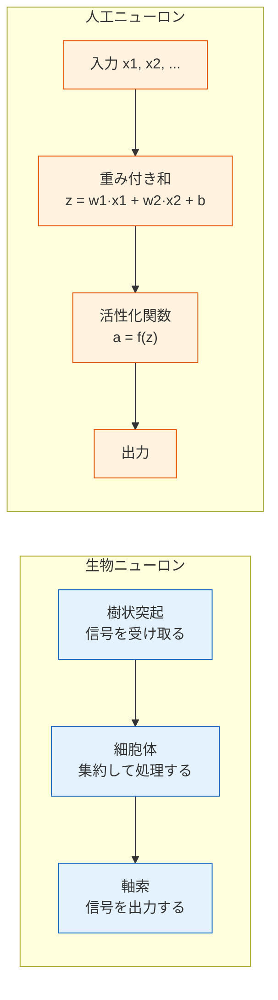
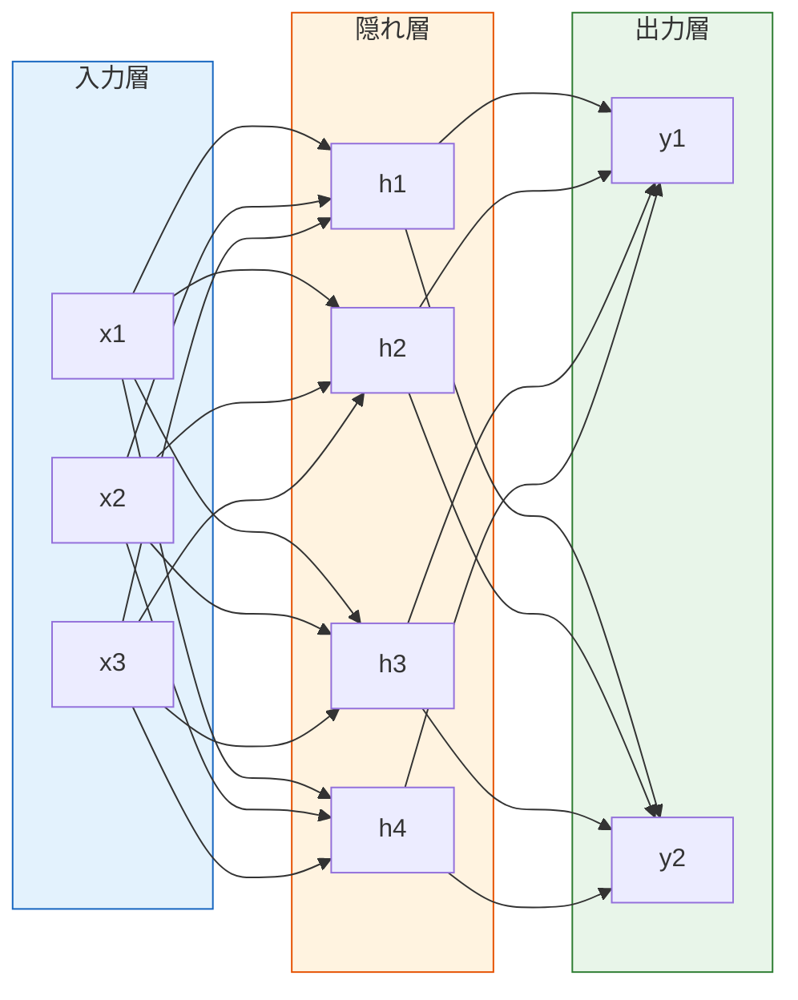
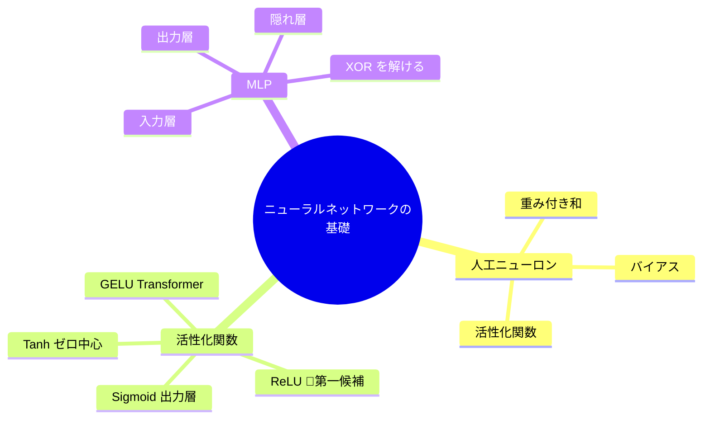

# 6.1.3 ニューロンから多層パーセプトロンへ


:::tip この節の位置づけ
ディープラーニングのすべては**人工ニューロン**から始まります。この節では、いちばんシンプルなパーセプトロンから出発し、さまざまな活性化関数を学び、それを多層パーセプトロン（MLP）へと組み立てます。これはすべてのニューラルネットワークの土台です。
:::

## 学習目標

- 生物のニューロンから人工ニューロンへの対応を理解する
- パーセプトロンモデルを身につける
- よく使う活性化関数：ReLU、Sigmoid、Tanh などを身につける
- 多層パーセプトロン（MLP）の構造を理解する

## 歴史的背景：ニューラルネットワークの流れは、最初どう育ってきたのか？

この節で特に重要な歴史的ポイントは次のとおりです。

| 年 | 重要な出来事 | 主な研究者 | 何をいちばん解決したか |
|---|---|---|---|
| 1943 | McCulloch-Pitts Neuron | McCulloch, Pitts | 人工ニューロンの最初の計算上の抽象化を示した |
| 1958 | Perceptron | Frank Rosenblatt | 学習可能な単層ニューラルネットワーク分類器の代表例を提案した |
| 1969 | Perceptrons | Minsky, Papert | 単層パーセプトロンの XOR など非線形分離問題への限界を体系的に示した |
| 1980 | Neocognitron | Fukushima | 畳み込み、局所受容野、階層的特徴の核心となる考え方を先取りした |

初学者がまず覚えるべきなのは、ここです。

> **パーセプトロンは「古いモデル」なのではなく、ニューラルネットワークの歴史の中で、単層モデルで何ができて、何ができないのかを初めてはっきり示したモデルです。**

だから、この節で出てくる `XOR` は、ただの練習問題ではありません。  
ニューラルネットワークの歴史における、とても重要な分かれ道のひとつです。

### なぜ XOR という、たった 4 点の問題がそんなに有名なの？

それは、単層パーセプトロンの限界を、かなりはっきり見せてしまうからです。

見た目はとても小さい問題です。

- 入力点は 4 個しかない

でも、その意味はとても大きいです。

- もしモデルがこんな小さな非線形パターンさえ扱えないなら
- それは「少し弱い」だけではなく、構造的に限界があるということ

だから XOR は教材で何度も登場します。  
複雑だからではなく、非常に鋭いテスト問題だからです。

> **とても小さな例で、「単層では足りない」ことを避けようがない形で示してくれる。**

### なぜパーセプトロンは最初は期待され、あとでがっかりされたの？

パーセプトロンが登場したとき、多くの人が初めて見たのは、

- 機械が本当に「学習」できるかもしれない
- すべてのルールを人が手書きしなくてもいいかもしれない

という可能性でした。  
当時としては、これはとても魅力的な発想でした。

> **知能は、書き込むものだけでなく、訓練して作るものかもしれない。**

しかし、その後 `XOR` のような問題が、いわば冷や水を浴びせました。

それが示したのは、

- 単層モデルの表現力には本当には限界がある
- 「学習できる」ことと「何でも学習できる」ことは違う

という事実です。

この歴史が面白いのは、

- まず大きな期待が生まれ
- そのあとで、モデル能力の限界を見直さざるを得なくなった

という流れにあります。

---

## まず全体の地図をつくろう

この節を学ぶとき、初心者にとって自然な順番は、用語を暗記することではなく、この流れを見ることです。


まず見るべきなのは次の点です。

- ニューロンが最初に行う線形計算
- なぜ活性化関数が必要なのか
- 1 層と多層はどうやって生まれるのか

## この節と第 5 ステーションのつながりは何か

第 5 ステーションを学び終えたなら、まず 1 つのニューロンをこう理解できます。

- 線形回帰 / ロジスティック回帰の「重み付き和」を少し拡張したもの

つまり、ニューロンはまったく新しい存在として現れるわけではありません。第 5 ステーションで慣れた線形モデルの骨組みに、もう 1 段階加えたものです。


この節で新しく出てくる中心は、実はたった 2 つです。

- 活性化関数
- 多層化


:::tip 図の読み方
この図を見るときは、まずニューロンを 2 段階に分けて考えてみてください。1 段階目は `z = x·w + b` の線形スコア、2 段階目は活性化関数がその信号をどう通すかです。すると、ニューロンは神秘的なものではなく、「線形モデル + 非線形ゲート」だと分かります。
:::

## 一、生物から人工へ



対応関係の要点は次のとおりです。

| 生物 | 人工 |
|------|------|
| 樹状突起（信号を受け取る） | 入力 x |
| シナプス強度 | 重み w |
| 細胞体（集約する） | 重み付き和 z = Σ(wi·xi) + b |
| 興奮 / 抑制 | 活性化関数 f(z) |
| 軸索（出力） | 出力 a = f(z) |

### 最小の「人工ニューロン」計算例

初学者が一番つまずきやすいのは、式は分かっても「この 1 歩で何を計算しているのか」がイメージできないことです。

まずは最小例を見てみましょう。

```python
import numpy as np

# 1 つのサンプルの 3 つの特徴量
x = np.array([0.8, 0.3, 0.5])

# 1 つのニューロンの 3 つの重み
w = np.array([0.2, -0.4, 0.6])
b = 0.1

# 1 歩目: 線形結合
z = np.dot(x, w) + b
print("z =", round(z, 4))

# 2 歩目: 活性化関数を通す
relu_out = max(0, z)
print("ReLU(z) =", round(relu_out, 4))
```

この計算は、次のように理解できます。

- 重みは「各入力がどれくらい重要か」を表す
- バイアスは「全体のしきい値をどちらに少し動かすか」を表す
- 活性化関数は「このニューロンを本当に発火させるか」を決める

### ディープラーニングをまだ考えなくても、ニューロンは何として捉えればいい？

初学者には、次の見方が分かりやすいです。

- ニューロンをまず「ゲート付きの線形モデル」として見る

まず計算するのは、

- `z = x·w + b`

そのあとで決めるのは、

- この結果をそのまま通すのか
- `0~1` に押し込むのか
- 0 未満を切り捨てるのか

この「ゲート」が活性化関数です。  
つまりニューロンは、線形スコアに非線形の選択を 1 枚重ねたものです。

---

## 二、パーセプトロン——いちばんシンプルな人工ニューロン

### モデル

パーセプトロンは、**二値分類**を行うシンプルなモデルです。

> **z = w1·x1 + w2·x2 + ... + wn·xn + b**
>
> **z > 0 なら出力 = 1、それ以外は = 0**

```python
import numpy as np
import matplotlib.pyplot as plt

class Perceptron:
    """最もシンプルなパーセプトロン"""
    def __init__(self, n_features, lr=0.1):
        self.w = np.zeros(n_features)
        self.b = 0
        self.lr = lr

    def predict(self, x):
        z = np.dot(x, self.w) + self.b
        return 1 if z > 0 else 0

    def train(self, X, y, epochs=20):
        for epoch in range(epochs):
            errors = 0
            for xi, yi in zip(X, y):
                pred = self.predict(xi)
                error = yi - pred
                if error != 0:
                    self.w += self.lr * error * xi
                    self.b += self.lr * error
                    errors += 1
            if errors == 0:
                print(f"{epoch+1} エポック目で収束しました！")
                break

# AND ゲート
X = np.array([[0,0], [0,1], [1,0], [1,1]])
y = np.array([0, 0, 0, 1])

p = Perceptron(2)
p.train(X, y)
print(f"重み: {p.w}, バイアス: {p.b}")
for xi, yi in zip(X, y):
    print(f"  入力 {xi} → 予測 {p.predict(xi)}, 正解 {yi}")
```

### パーセプトロンの限界

パーセプトロンは、**線形分離可能**な問題しか解けません。XOR 問題は解けないため、そこから多層ネットワークが必要になります。

```python
# XOR 問題 — パーセプトロンでは解けない
X_xor = np.array([[0,0], [0,1], [1,0], [1,1]])
y_xor = np.array([0, 1, 1, 0])

p_xor = Perceptron(2)
p_xor.train(X_xor, y_xor, epochs=100)

print("\nXOR の予測結果:")
for xi, yi in zip(X_xor, y_xor):
    print(f"  入力 {xi} → 予測 {p_xor.predict(xi)}, 正解 {yi}")
```

### パーセプトロンのこの部分で、いちばん持ち帰るべきことは？

「パーセプトロンはもう使わない」ということではありません。大事なのは、次のとても重要な事実をはっきり見せてくれることです。

> **線形スコアだけだと、モデルの表現力はすぐに限界にぶつかる。**

これが、あとで次のものが必要になる理由です。

- 活性化関数
- 多層ネットワーク

つまりパーセプトロンの最大の学習価値は、「なぜ単層では足りないのか」を最初に実感させてくれることです。


:::tip 図の読み方
XOR の図でいちばん大事なのは、4 つの点を 1 本の直線で分けられないことです。単層パーセプトロンは線形境界しか作れませんが、多層ネットワークなら、まず空間を折り曲げたり組み替えたりしてから、非線形分類ができます。
:::

---

## 三、活性化関数

### なぜ活性化関数が必要なのか？

活性化関数がなければ、多層ネットワークは 1 つの線形モデルに退化します。何層積んでも、結局は単層と同じです。活性化関数は**非線形性**を導入し、ネットワークがより複雑な関数を近似できるようにします。

### なぜこの一文がそんなに大事なの？

「深い」ことが、ただ層を積むだけではないと分かるからです。

もし各層がただの線形変換なら、何層重ねても本質的には 1 つの大きな線形変換と同じです。  
多層ネットワークを意味のあるものにしているのは、層数そのものではなく、

- 各層のあいだに非線形が入っていること

です。

最初に覚えるべき大事な判断はこれです。

- 非線形がなければ、深いネットワークでも複雑な形は学べない

### よく使う活性化関数

```python
import numpy as np
import matplotlib.pyplot as plt

x = np.linspace(-5, 5, 200)

# いろいろな活性化関数
activations = {
    'Sigmoid': (1 / (1 + np.exp(-x)), 'σ(x) = 1/(1+e⁻ˣ)'),
    'Tanh': (np.tanh(x), 'tanh(x)'),
    'ReLU': (np.maximum(0, x), 'max(0, x)'),
    'Leaky ReLU': (np.where(x > 0, x, 0.01 * x), 'max(0.01x, x)'),
}

fig, axes = plt.subplots(2, 2, figsize=(12, 8))
colors = ['#e74c3c', '#3498db', '#2ecc71', '#9b59b6']

for ax, (name, (y, formula)), color in zip(axes.ravel(), activations.items(), colors):
    ax.plot(x, y, linewidth=2, color=color)
    ax.axhline(0, color='gray', linewidth=0.5)
    ax.axvline(0, color='gray', linewidth=0.5)
    ax.set_title(f'{name}: {formula}', fontsize=12)
    ax.set_xlim(-5, 5)
    ax.grid(True, alpha=0.3)

plt.suptitle('よく使う活性化関数', fontsize=14)
plt.tight_layout()
plt.show()
```

### 比較と選び方

| 活性化関数 | 出力範囲 | 長所 | 短所 | 使用場面 |
|---------|---------|------|------|---------|
| **ReLU** | [0, +∞) | 計算が速い、勾配消失を抑えやすい | ニューロンの「死」 | **隠れ層の第一候補** |
| **Sigmoid** | (0, 1) | 出力を確率として解釈しやすい | 勾配消失、ゼロ中心ではない | 二値分類の出力層 |
| **Tanh** | (-1, 1) | ゼロ中心 | 勾配消失 | RNN（現在はあまり使わない） |
| **Leaky ReLU** | (-∞, +∞) | ニューロンの死を避けやすい | ハイパーパラメータが 1 つ増える | ReLU の改良版 |
| **GELU** | 約 (-0.17, +∞) | なめらかで性能がよい | 計算が少し遅い | Transformer |
| **Swish** | 約 (-0.28, +∞) | なめらかで自己ゲート的 | 計算が少し遅い | 新しいアーキテクチャ |

:::info ReLU の「ニューロンの死」
入力がずっと負のままだと、ReLU の出力は常に 0 になり、勾配も 0 になるため、パラメータが更新されなくなります。Leaky ReLU は、負の値にも小さな傾き（0.01）を与えることで、これを和らげます。
:::

### 学び始めの段階では、どう選ぶのがいちばん混乱しにくい？

まずは、次の覚え方で十分です。

- 隠れ層はまず `ReLU`
- 二値分類の出力層は `Sigmoid` がよく使われる
- 多クラス分類の出力層は `Softmax` がよく使われる
- Transformer では `GELU` をよく見かける

まずこの 4 つを覚えれば、今後の多くの章を進む土台になります。

### 活性化関数の図を初めて見るとき、どこを先に見るべき？

最初から曲線の厳密な式にこだわらなくて大丈夫です。まずは次の 3 点だけ見ましょう。

1. 出力範囲は何か
2. 0 未満の部分をどう扱うか
3. 曲線はなめらかか、勾配が小さくなりやすいか

この 3 つが、次のことを直接左右します。

- 出力を確率として解釈できるか
- 勾配消失が起きるか
- 学習が安定しやすいか

---

## 四、多層パーセプトロン（MLP）

### 構造

複数のニューロンを**層として並べ**、前の層の出力を次の層の入力にします。



### 多層の強みはどこにあるの？

初学者に分かりやすく言うと、こうです。

- 1 層目は、まず基本的なパターンを学ぶ
- 次の層は、それらのパターンを組み合わせる
- 後ろの層に行くほど、表現は抽象的になる

最もシンプルな MLP でも、次のように理解できます。

- 前半の層は「中間表現」を学ぶ
- 最後の層は、その表現を使って出力を決める

ここで初めて、「表現を自動で学ぶ」ことが始まります。

### NumPy で MLP を実装して XOR を解く

```python
np.random.seed(42)

# XOR データ
X = np.array([[0,0], [0,1], [1,0], [1,1]])
y = np.array([[0], [1], [1], [0]])

# ネットワーク: 2 → 4 → 1
W1 = np.random.randn(2, 4) * 0.5
b1 = np.zeros((1, 4))
W2 = np.random.randn(4, 1) * 0.5
b2 = np.zeros((1, 1))

def sigmoid(z):
    return 1 / (1 + np.exp(-z))

def sigmoid_deriv(a):
    return a * (1 - a)

lr = 1.0
losses = []

for epoch in range(5000):
    # 順伝播
    z1 = X @ W1 + b1
    a1 = sigmoid(z1)
    z2 = a1 @ W2 + b2
    a2 = sigmoid(z2)

    # 損失
    loss = np.mean((y - a2) ** 2)
    losses.append(loss)

    # 逆伝播
    dz2 = (a2 - y) * sigmoid_deriv(a2)
    dW2 = a1.T @ dz2 / 4
    db2 = np.mean(dz2, axis=0, keepdims=True)

    dz1 = (dz2 @ W2.T) * sigmoid_deriv(a1)
    dW1 = X.T @ dz1 / 4
    db1 = np.mean(dz1, axis=0, keepdims=True)

    # 更新
    W2 -= lr * dW2
    b2 -= lr * db2
    W1 -= lr * dW1
    b1 -= lr * db1

print(f"最終損失: {losses[-1]:.6f}")
print("XOR の予測:")
for xi, yi, pred in zip(X, y, a2):
    print(f"  {xi} → {pred[0]:.4f}, 正解 {yi[0]}")

plt.plot(losses)
plt.xlabel('Epoch')
plt.ylabel('Loss')
plt.title('MLP で XOR を解く')
plt.grid(True, alpha=0.3)
plt.show()
```

---

## まとめ

| 概念 | 要点 |
|------|------|
| 人工ニューロン | 重み付き和 + 活性化関数 |
| パーセプトロン | いちばんシンプルなニューロン。線形分類しかできない |
| 活性化関数 | 非線形性を入れる。隠れ層では ReLU が基本 |
| MLP | 多層に積み重ねることで、任意の関数を近似できる |

## この節でいちばん持ち帰るべきこと

1 つだけ持って帰るなら、これを覚えてください。

> **ニューラルネットワークの出発点は「たくさんの層」ではなく、「線形計算のあとに非線形を入れ、それを何度も積み重ねること」です。**

この節で大事なのは次の点です。

- ニューロンは、まず線形計算をしてから活性化を通す
- パーセプトロンの限界が、多層ネットワークの必要性を生んだ
- 活性化関数が、ネットワークの本当の非線形表現力を決める
- MLP は、後で出てくる多くの複雑な構造の最小原型である



---

## 手を動かしてみよう

### 練習 1: OR ゲートのパーセプトロンを実装する

AND ゲートの学習データを OR ゲート（0|0→0, 0|1→1, 1|0→1, 1|1→1）に変えて、パーセプトロンを学習させ、決定境界を描いてみましょう。

### 練習 2: MLP で月牙データを分類する

`sklearn.datasets.make_moons` を使って月牙データを生成し、NumPy で MLP（2→8→1）を手書き実装して学習し、学習後に決定境界を描いてみましょう。
