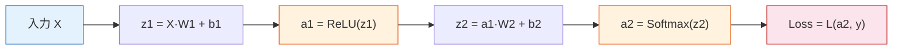
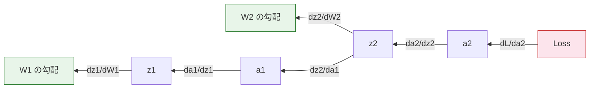
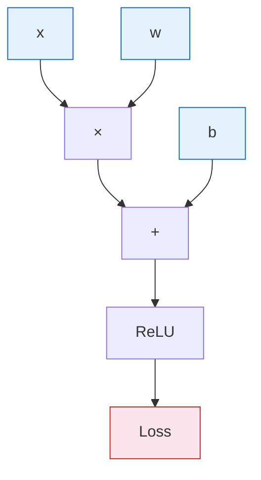

# 6.1.4 順伝播と逆伝播


:::tip 🔧 コアスキル
逆伝播は深層学習の**中核アルゴリズム**です。2層ネットワークの逆伝播を、必ず手で導出できるようになってください。この節では、第4ステーション「連鎖律と逆伝播の予習」をもとに、完全な導出と実装を示します。
:::

## 学習目標

- 順伝播の完全な計算過程を理解する
- よく使う損失関数（MSE、交差エントロピー）を身につける
- 🔧 2層ネットワークの逆伝播を手で導出できるようになる
- 計算グラフの考え方を理解する

---

## まず地図を作ろう

この節で、初心者がいちばん不安になりやすいのは「急に式が増える」ことです。おすすめの理解順は次の通りです。


この節は、ひと言で言うと次のように理解できます。

> **順伝播は結果を計算し、逆伝播は「どう直すか」を計算する。**

## この節と第5ステーション、前の節はどうつながるのか

前の節を学んだばかりなら、まずはこう考えると分かりやすいです。

- 前の節で解決したのは「1つのニューロン / 1層ネットワークが何を計算しているか」
- この節で解決するのは「それが間違ったとき、パラメータをどう直すか」

第5ステーションを学んだ直後なら、次のようにも対応づけられます。

- 第5ステーションでは、すでに loss と勾配降下法を見ている
- この節では「勾配がどこから来るのか」を、分解してはっきり見せる

つまり、この節で新しく出てくる本質は「突然たくさんの式」ではなく、

- 学習中の責任が、どうやって層ごとに戻っていくのか

です。

## 一、順伝播

順伝播とは、**入力から出力までの計算過程**のことです。



### 順伝播で、まず注目すべき4つの対象は？

初めてネットワークの順伝播コードを読むときは、まず次の4種類の変数だけを見てみましょう。

- `x / X`：入力
- `z`：線形変換後の中間量
- `a`：活性化後の出力
- `loss`：最終的な誤差

こうすると、どの行のコードを見ても、それが次のどれに当たるのか分かりやすくなります。

- 入力
- 中間計算
- 出力
- 誤差の定義

### 手計算の例

```python
import numpy as np

# 2層の超シンプルなネットワーク: 2→3→2
np.random.seed(0)

# 入力と重み
X = np.array([[1.0, 2.0]])     # サンプル1個, 特徴量2個
W1 = np.array([[0.1, 0.3, -0.2],
               [0.4, -0.1, 0.5]])  # 2×3
b1 = np.array([[0.0, 0.0, 0.0]])
W2 = np.array([[0.2, -0.3],
               [0.1, 0.4],
               [-0.5, 0.2]])       # 3×2
b2 = np.array([[0.0, 0.0]])
y_true = np.array([[1, 0]])        # 正解ラベル（one-hot）

# 順伝播
z1 = X @ W1 + b1
print(f"z1 = {z1}")

a1 = np.maximum(0, z1)  # ReLU
print(f"a1 (ReLU) = {a1}")

z2 = a1 @ W2 + b2
print(f"z2 = {z2}")

# Softmax
exp_z2 = np.exp(z2 - z2.max())
a2 = exp_z2 / exp_z2.sum(axis=1, keepdims=True)
print(f"a2 (Softmax) = {a2}")
```

### 順伝播で、特に見るべき3つのポイント

ネットワークの順伝播を初めて見るときは、各ステップで次の3つだけを確認するのがおすすめです。

1. 今のテンソルの shape は何か
2. この層は線形変換か、それとも非線形変換か
3. この出力は次の層に渡されるのか

多くの人は式を見ると混乱しますが、まずこの3つを押さえれば十分です。

### 初心者向けの比喩：順伝播は「層ごとの加工」

順伝播は、工場のライン作業のように考えると分かりやすいです。

- 入力の材料が最初の層に入る
- 最初の層で加工され、次の層へ渡る
- 次の層でさらに加工される
- 最後に完成品として出力される

つまり、順伝播で大事なのは「式が多いこと」ではなく、

- データが層ごとに流れていくこと
- 各層が、次の層が使いやすい形に表現を変えていること

です。

---

## 二、損失関数

### MSE（回帰）

> **MSE = (1/n) × Σ(yi - ŷi)²**

```python
# MSE
y_true_reg = np.array([3.0, 5.0, 2.0])
y_pred_reg = np.array([2.8, 5.2, 2.1])
mse = np.mean((y_true_reg - y_pred_reg) ** 2)
print(f"MSE = {mse:.4f}")
```

### 交差エントロピー（分類）

> **Cross-Entropy = -Σ(yi × log(ŷi))**

```python
# 交差エントロピー
loss = -np.sum(y_true * np.log(a2 + 1e-8))
print(f"交差エントロピー損失 = {loss:.4f}")
```

### 二値交差エントロピー（二値分類）

> **BCE = -(y × log(ŷ) + (1-y) × log(1-ŷ))**

```python
# 二値交差エントロピー
y_bin = np.array([1, 0, 1, 1])
y_pred_bin = np.array([0.9, 0.1, 0.8, 0.7])
bce = -np.mean(y_bin * np.log(y_pred_bin) + (1 - y_bin) * np.log(1 - y_pred_bin))
print(f"BCE = {bce:.4f}")
```

### 損失関数の選び方

| タスク | 出力層の活性化関数 | 損失関数 |
|------|-----------|---------|
| 回帰 | なし（線形） | MSE |
| 二値分類 | Sigmoid | BCE |
| 多クラス分類 | Softmax | 交差エントロピー |

### なぜ出力層と損失関数はいつも一緒に語られるのか？

もともと、この2つは「セットで設計する」ものだからです。

たとえば：

- 回帰は連続値を出すので、`MSE` をよく使う
- 二値分類は確率を出すので、`Sigmoid + BCE` をよく使う
- 多クラス分類はクラス分布を出すので、`Softmax + CrossEntropy` をよく使う

なので、初めてタスクに取り組むときは、次の習慣を持つと安定します。

- モデルの最後の層だけを見るのではなく
- 損失関数までセットで考える

---

## 三、逆伝播——🔧 手動導出

### 核心の考え方

逆伝播とは、**連鎖律を体系的に使うこと**です。損失から出発して、各パラメータの勾配を層ごとに逆向きに計算していきます。



### 逆伝播を、初心者向けにひと言でいうと

完全な導出を今すぐ暗記しなくても大丈夫です。まずは次の3つだけ覚えましょう。

- 出力がどれくらい間違ったか
- その間違いが、どの層にどう分配されるか
- 各層が、それをもとにどれくらい修正されるか

これが分かれば、逆伝播の最初の本質はつかめています。

### もっと分かりやすく言うと：誤差の責任を前へ分配する

「勾配」がまだ抽象的に感じるなら、逆伝播を次のように考えてみてください。

- 最後の結果が間違っている
- その間違いを、前の層へさかのぼって追跡する
- 各層が「自分はこの誤差のどれだけを担当するか」を受け取る
- その責任量を使って、パラメータをどう直すか決める

だから逆伝播は、「後ろから前へメッセージを送っている」ように見えるのです。


:::tip 読み方のヒント
この図は右から左へ読むのがおすすめです。まず `loss` を見て、どれだけ間違ったかを確認し、それから計算グラフに沿って、出力層・隠れ層・より前のパラメータへ責任を分配します。逆伝播は魔法の式ではなく、「各パラメータが今回の誤りにどれだけ寄与したか、次にどう直すか」を答える仕組みです。
:::

### 完全な導出（2層ネットワーク）

```python
# 上の例を続けて、手動で逆伝播する

# --- 出力層の勾配 ---
# Softmax + 交差エントロピーでは、勾配は簡単になって: dz2 = a2 - y_true
dz2 = a2 - y_true
print(f"dz2 = {dz2}")

# W2 の勾配: dW2 = a1.T @ dz2
dW2 = a1.T @ dz2
db2 = dz2.copy()
print(f"dW2 = \n{dW2}")

# --- 隠れ層の勾配 ---
# da1 = dz2 @ W2.T
da1 = dz2 @ W2.T
print(f"da1 = {da1}")

# ReLU の導関数: z1 > 0 なら 1、それ以外は 0
relu_mask = (z1 > 0).astype(float)
dz1 = da1 * relu_mask
print(f"dz1 = {dz1}")

# W1 の勾配: dW1 = X.T @ dz1
dW1 = X.T @ dz1
db1 = dz1.copy()
print(f"dW1 = \n{dW1}")

# --- パラメータ更新 ---
lr = 0.1
W2 -= lr * dW2
b2 -= lr * db2
W1 -= lr * dW1
b1 -= lr * db1
print("\nパラメータを更新しました！")
```

### 勾配計算の公式まとめ

| 変数 | 勾配 |
|------|------|
| `dz2` | `a2 - y`（Softmax+交差エントロピーの簡略形） |
| `dW2` | `a1.T @ dz2` |
| `db2` | `dz2` |
| `da1` | `dz2 @ W2.T` |
| `dz1` | `da1 * relu_mask` |
| `dW1` | `X.T @ dz1` |
| `db1` | `dz1` |

### 初めて自分で導出するとき、間違えやすいのはどこ？

よくあるミスは、次の3つです。

1. shape が合わない  
   たとえば転置を忘れて、`a1.T @ dz2` を間違えてしまう。

2. `z` と `a` を混同する  
   特に活性化関数の微分では、どちらに対して微分しているのか分からなくなりやすい。

3. 連鎖律を忘れる  
   局所的な式だけを見て、「前の層の勾配 × 今の層の導関数」をつなげて考えられない。

なので、最初は各ステップごとに次をメモするのがおすすめです。

- 今の変数の shape
- 今の勾配がどの項から来ているか

---

## 四、計算グラフ

### 計算グラフとは？

計算グラフは、計算の各ステップをノードに分けて、**何が何に依存しているか**を記録したものです。逆伝播では、このグラフを逆向きにたどって勾配を伝えます。



**PyTorch は、この計算グラフを自動で作成し、自動でたどっています**。これが `autograd` の本質です。

### 初心者がこの節でつまずきやすい点は？

- `z`、`a`、`loss` の違いがはっきりしない
- なぜ勾配は後ろから前へ伝えるのか分からない
- 局所的な公式だけ覚えて、全体の流れが見えない

もし今あなたが次のことを言葉で説明できるなら、この節はかなり理解できています。

- 順伝播は何を計算しているか
- 損失は何を測っているか
- 逆伝播は「誤差の責任」をどう前へ伝えているか

### 数値検証

小さな摂動を使って、勾配が正しいか確認します。

```python
def numerical_gradient(f, x, eps=1e-5):
    """数値勾配（有限差分法）"""
    grad = np.zeros_like(x)
    for i in range(x.size):
        old_val = x.flat[i]
        x.flat[i] = old_val + eps
        fx_plus = f(x)
        x.flat[i] = old_val - eps
        fx_minus = f(x)
        grad.flat[i] = (fx_plus - fx_minus) / (2 * eps)
        x.flat[i] = old_val
    return grad

# 検証: y = x^2, dy/dx = 2x
x = np.array([3.0])
f = lambda x: x[0]**2
print(f"解析勾配: 2×3 = 6")
print(f"数値勾配: {numerical_gradient(f, x)[0]:.6f}")
```

---

## 五、完全な学習ループ

```python
# 完全な 2 層ネットワークの学習（月牙データの分類）
from sklearn.datasets import make_moons

X, y = make_moons(200, noise=0.2, random_state=42)
y_onehot = np.eye(2)[y]  # one-hot

# 初期化
np.random.seed(42)
W1 = np.random.randn(2, 16) * 0.5
b1 = np.zeros((1, 16))
W2 = np.random.randn(16, 2) * 0.5
b2 = np.zeros((1, 2))

lr = 0.5
losses = []

for epoch in range(1000):
    # 順伝播
    z1 = X @ W1 + b1
    a1 = np.maximum(0, z1)
    z2 = a1 @ W2 + b2
    exp_z = np.exp(z2 - z2.max(axis=1, keepdims=True))
    a2 = exp_z / exp_z.sum(axis=1, keepdims=True)

    # 損失
    loss = -np.mean(np.sum(y_onehot * np.log(a2 + 1e-8), axis=1))
    losses.append(loss)

    # 逆伝播
    dz2 = (a2 - y_onehot) / len(X)
    dW2 = a1.T @ dz2
    db2 = dz2.sum(axis=0, keepdims=True)
    da1 = dz2 @ W2.T
    dz1 = da1 * (z1 > 0)
    dW1 = X.T @ dz1
    db1 = dz1.sum(axis=0, keepdims=True)

    # 更新
    W2 -= lr * dW2
    b2 -= lr * db2
    W1 -= lr * dW1
    b1 -= lr * db1

# 結果
preds = np.argmax(a2, axis=1)
acc = (preds == y).mean()
print(f"最終損失: {losses[-1]:.4f}, 正解率: {acc:.1%}")

import matplotlib.pyplot as plt
fig, axes = plt.subplots(1, 2, figsize=(12, 4))
axes[0].plot(losses)
axes[0].set_xlabel('Epoch')
axes[0].set_ylabel('Loss')
axes[0].set_title('学習損失')

axes[1].scatter(X[:, 0], X[:, 1], c=preds, cmap='coolwarm', s=10, alpha=0.7)
axes[1].set_title(f'分類結果（正解率 {acc:.1%}）')
plt.tight_layout()
plt.show()
```

### この NumPy の学習ループを何度も見る価値があるのはなぜ？

これは、後で出てくる PyTorch の学習ループの「生の形」だからです。

- 順伝播
- loss を計算
- 逆伝播
- 更新

この流れをここで理解しておけば、あとで

- `loss.backward()`
- `optimizer.step()`

を見たときに、「急に何かが起こった」ようには感じません。


:::tip 読み方のヒント
この図を読むときは、NumPy の4つの作業を PyTorch API に1つずつ対応させてみてください。順伝播は `model(x)`、手計算の勾配は `loss.backward()`、手動のパラメータ更新は `optimizer.step()`、古い勾配を消すのは `optimizer.zero_grad()` に対応します。
:::

---

## まとめ

| 概念 | 要点 |
|------|------|
| 順伝播 | 入力→重み付き和→活性化→出力→損失 |
| 損失関数 | 回帰は MSE、分類は交差エントロピー |
| 逆伝播 | 連鎖律で後ろから前へ勾配を求める |
| 計算グラフ | 計算の依存関係を記録し、PyTorch が自動構築する |

## この節でいちばん持ち帰ってほしいこと

ひと言だけ覚えるなら、これです。

> **逆伝播は、神秘的な式を作るものではなく、「モデルが間違えたとき、各パラメータをどれだけ直すべきか」を体系的に答える仕組みである。**

だから、この節でしっかり押さえるべきなのは次の4つです。

- 順伝播は結果を計算する
- 損失は「どれだけ間違えたか」を定義する
- 逆伝播は誤差の責任を分配する
- 勾配は最終的にパラメータ更新のために使う

---

## 手を動かして練習しよう

### 練習 1：手計算で導出する（紙とペン）

1→2→1 のネットワーク（Sigmoid 活性化）について、入力 x=0.5、目標 y=1 のとき、1回分の順伝播と逆伝播を手で計算し、パラメータを更新してください。

### 練習 2：数値勾配の検証

完全な学習ループを修正して、最初の1回目に数値勾配を使い、dW1 の解析的な勾配が正しいか確認してください（誤差は 1e-5 未満になるはずです）。
