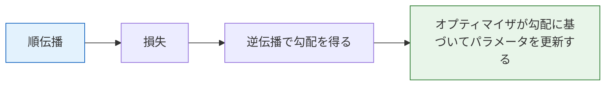

# 勾配降下法とオプティマイザ


:::tip この節の位置づけ
第 4 ステップでは、基本的な勾配降下法を学びました。ここでは、深層学習で使われるさまざまなオプティマイザをさらに深く見ていきます。**Adam はいちばんよく使う**ものですが、その背後にある進化の流れを理解することが大切です。
:::

## 学習目標

- バッチ勾配降下法、小バッチ勾配降下法、確率的勾配降下法の違いを理解する
- Momentum の直感を理解する
- 🔧 Adam / AdamW の使い方を身につける
- 学習率スケジューリング戦略を知る

---

## まずは地図を作ろう

このオプティマイザの章は、名前がたくさん出てくるので初心者が混乱しやすいです。理解する順番としては、次の流れがよいです。


つまり、この章で本当に解決したいのは「オプティマイザの家系図を暗記すること」ではなく、次のような点です。

- パラメータはどうやって更新されるのか
- なぜオプティマイザによって学習の結果が変わるのか
- 最初のプロジェクトでは、何を選べばよいのか

### 初心者向けの、よりわかりやすい全体イメージ

オプティマイザは、次のように考えると理解しやすいです。

- みんなゴールの方向は知っているが、下り方が違う

ある人は：

- 一歩ずつ、着実に進む

ある人は：

- 慣性を保って、細かい凹凸に振り回されにくい

ある人は：

- 今の傾きに応じて、一歩の大きさを自動で調整する

だからオプティマイザで大事なのは、「名前がすごいこと」ではなく、

- 勾配を、どのように更新動作に変えるのか

です。

## この章は前の2章とどうつながるのか

「順伝播と逆伝播」を学び終えたら、まず次のように考えるとつながりやすいです。

- 前の章で「勾配がどうやって得られるか」は解決した
- この章では「勾配が得られたあと、パラメータをどう変えるか」を解決する

つまり、オプティマイザは追加の機能ではなく、学習ループの最後の一部です。




:::tip 図の見方
この図はとてもシンプルです。勾配は「どちら側が急か」しか教えてくれません。実際にどう動くかを決めるのはオプティマイザです。SGD は今の傾きだけで進み、Momentum は慣性を少し持ち、Adam は過去の勾配に基づいて各方向の歩幅を自動調整します。
:::

## 1. 3つの勾配降下法

### 1.1 比較

| 方式 | 毎回使うデータ量 | 長所 | 短所 |
|------|-------------|------|------|
| **バッチ勾配降下法（BGD）** | 全データ | 安定している | 遅い、メモリを多く使う |
| **確率的勾配降下法（SGD）** | 1 サンプル | 速い、局所最適から抜けやすい | ノイズが大きく、不安定 |
| **小バッチ勾配降下法（Mini-batch）** | 1 バッチ（32/64/128） | **速さと安定性のバランスがよい** | batch_size を選ぶ必要がある |

### 1.0.1 初めてこの3つを見るとき、まず何を覚えるべき？

最初から用語の定義を覚えようとしなくて大丈夫です。まずは、この一文をつかみましょう。

> **この3つの本質的な違いは、「パラメータを更新するたびに、どれくらいのデータで勾配を見積もるか」だけです。**

この一文がわかると、次のようなことも説明しやすくなります。

- なぜ SGD は揺れやすいのか
- なぜ BGD は安定だが遅いのか
- なぜ深層学習では mini-batch がもっともよく使われるのか

### 1.0.2 初学者がまず覚えるのに向いた選び方の表

| 方式 | まず覚えるとよい感覚 |
|------|------|
| BGD | 安定しているが遅い |
| SGD | 速いが揺れやすい |
| Mini-batch | いちばんよく使う折衷案 |

この表は初心者にとても向いています。3つの勾配降下法を、まず使える判断にまとめてくれるからです。定義の羅列よりずっと覚えやすいでしょう。

```python
import numpy as np
import matplotlib.pyplot as plt

np.random.seed(42)
# データを生成: y = 3x + 2 + noise
X = np.random.randn(200, 1)
y = 3 * X + 2 + np.random.randn(200, 1) * 0.5

def compute_loss(X, y, w, b):
    return np.mean((X * w + b - y) ** 2)

# 3つの方式を比較
methods = {}
for name, batch_size in [('BGD (全量)', len(X)), ('SGD (単一サンプル)', 1), ('Mini-batch (32)', 32)]:
    w, b = 0.0, 0.0
    lr = 0.05
    losses = []
    for epoch in range(50):
        indices = np.random.permutation(len(X))
        for start in range(0, len(X), batch_size):
            idx = indices[start:start+batch_size]
            X_batch, y_batch = X[idx], y[idx]
            pred = X_batch * w + b
            grad_w = 2 * np.mean(X_batch * (pred - y_batch))
            grad_b = 2 * np.mean(pred - y_batch)
            w -= lr * grad_w
            b -= lr * grad_b
        losses.append(compute_loss(X, y, w, b))
    methods[name] = losses

for name, losses in methods.items():
    plt.plot(losses, label=name, linewidth=2)
plt.xlabel('Epoch')
plt.ylabel('Loss')
plt.title('3つの勾配降下法の比較')
plt.legend()
plt.grid(True, alpha=0.3)
plt.show()
```

---

## 2. Momentum — 慣性つきの下降

### 2.1 直感

山の斜面を転がるボールを想像してください。普通の SGD は毎回、その時点の勾配の方向だけを見て進みます。Momentum はボールに**慣性**を持たせます。小さな凹みに入っても、そのまま進みやすくなります。

> **v = β × v + (1-β) × gradient**
>
> **w = w - lr × v**

### 2.1.1 Momentum は、SGD のどこを補っているのか？

まず覚えたいのは公式よりも、Momentum が何を補っているかです。

- SGD は毎回、現在の勾配だけを見るので、左右に揺れやすい
- Momentum は、前の数ステップの方向も取り込む

つまり、次のように考えるとわかりやすいです。

- SGD：目の前の一歩だけを見る
- Momentum：目の前を見つつ、前に進む勢いも残す

```python
# SGD と Momentum を比較
def optimize_2d(optimizer_fn, steps=100):
    """f(x,y) = x² + 10y² を最適化する"""
    x, y = np.array(5.0), np.array(5.0)
    path = [(x, y)]
    state = {}
    for _ in range(steps):
        gx, gy = 2*x, 20*y  # 勾配
        x, y, state = optimizer_fn(x, y, gx, gy, state)
        path.append((x, y))
    return np.array(path)

def sgd(x, y, gx, gy, state, lr=0.05):
    return x - lr*gx, y - lr*gy, state

def momentum(x, y, gx, gy, state, lr=0.05, beta=0.9):
    vx = state.get('vx', 0)
    vy = state.get('vy', 0)
    vx = beta * vx + gx
    vy = beta * vy + gy
    state['vx'], state['vy'] = vx, vy
    return x - lr*vx, y - lr*vy, state

fig, axes = plt.subplots(1, 2, figsize=(12, 5))
for ax, (name, fn) in zip(axes, [('SGD', sgd), ('Momentum', momentum)]):
    path = optimize_2d(fn, 50)
    # 等高線
    xx, yy = np.meshgrid(np.linspace(-6, 6, 100), np.linspace(-6, 6, 100))
    zz = xx**2 + 10*yy**2
    ax.contour(xx, yy, zz, levels=20, cmap='Blues', alpha=0.5)
    ax.plot(path[:, 0], path[:, 1], 'ro-', markersize=3, linewidth=1)
    ax.set_title(name)
    ax.set_xlim(-6, 6)
    ax.set_ylim(-6, 6)
plt.suptitle('SGD vs Momentum の最適化経路', fontsize=13)
plt.tight_layout()
plt.show()
```

---

## 3. Adam — もっともよく使われるオプティマイザ

### 3.1 核となる考え方

Adam は Momentum（一階モーメント）と RMSProp（二階モーメント）を組み合わせたものです。
- **一階モーメント m**：勾配の移動平均（方向）
- **二階モーメント v**：勾配の二乗の移動平均（自適応学習率）

### 3.2 PyTorch での使い方

```python
import torch
import torch.nn as nn

# PyTorch で異なるオプティマイザを比較
model_configs = {
    'SGD': lambda params: torch.optim.SGD(params, lr=0.01),
    'SGD+Momentum': lambda params: torch.optim.SGD(params, lr=0.01, momentum=0.9),
    'Adam': lambda params: torch.optim.Adam(params, lr=0.01),
    'AdamW': lambda params: torch.optim.AdamW(params, lr=0.01, weight_decay=0.01),
}

# 簡単な課題: y = sin(x) を近似する
torch.manual_seed(42)
X = torch.linspace(-3, 3, 200).unsqueeze(1)
y = torch.sin(X)

results = {}
for name, opt_fn in model_configs.items():
    model = nn.Sequential(nn.Linear(1, 32), nn.ReLU(), nn.Linear(32, 1))
    optimizer = opt_fn(model.parameters())
    criterion = nn.MSELoss()
    losses = []

    for epoch in range(300):
        pred = model(X)
        loss = criterion(pred, y)
        optimizer.zero_grad()
        loss.backward()
        optimizer.step()
        losses.append(loss.item())

    results[name] = losses

plt.figure(figsize=(10, 5))
for name, losses in results.items():
    plt.plot(losses, label=name, linewidth=2)
plt.xlabel('Epoch')
plt.ylabel('Loss')
plt.title('異なるオプティマイザの収束速度比較')
plt.legend()
plt.yscale('log')
plt.grid(True, alpha=0.3)
plt.show()
```

### 3.3 オプティマイザの選び方ガイド

| オプティマイザ | 特徴 | 使用場面 |
|--------|------|---------|
| **SGD** | シンプル、学習率の調整が必要 | 研究実験 |
| **SGD+Momentum** | 収束を速める | CV の定番モデル |
| **Adam** | 自適応学習率、収束が速い | **まずはこれを選ぶ** |
| **AdamW** | Adam + 分離された weight decay | **Transformer、大規模モデル** |
| **RMSProp** | 自適応学習率 | RNN |

:::info Adam vs AdamW
Adam は L2 正則化を勾配の中に混ぜて扱います。AdamW は weight decay を別で扱うので、より良い結果になりやすいです。**今は多くの場合、AdamW を使います。**
:::

### 3.4 初心者が最初にプロジェクトをするとき、どう選べばよい？

まだ慣れていないなら、もっとも安定した始め方はたいてい次の通りです。

- MLP / CNN の入門実験：まず `Adam`
- Transformer / より現代的なモデル：まず `AdamW`
- もっと伝統的な最適化の挙動を研究したい：`SGD + Momentum` を見る

最初は、オプティマイザ選びを難しく考えすぎなくて大丈夫です。最初の 1 回で大事なのは、次の 3 点です。

1. モデルが安定して学習できる
2. loss がきちんと下がる
3. 検証データの性能が大きく崩れない

### 3.5 なぜ「学習率のほうがオプティマイザ名より大事」なのか？

初心者は、つい次のように考えがちです。

- 「Adam をもっと高級なオプティマイザに変えたほうがいいのかな？」

でも、実際の学習でよくあるのは、

- オプティマイザ自体はそれほど悪くない
- 本当に問題なのは、学習率が大きすぎる、または小さすぎること

です。なので、学習が不安定なときの確認順は、たいてい次のほうがよいです。

1. まず学習率を見る
2. 次に batch size を見る
3. それからオプティマイザを見る

### 3.6 初心者がまず覚えるとよいオプティマイザの既定順序

最初のプロジェクトでは、次の順番が安定しやすいです。

1. まず `Adam`
2. Transformer やより現代的な大規模モデルなら、まず `AdamW`
3. もっと古典的な最適化の動きを研究したいなら、`SGD + Momentum`

こうすると、最初からたくさんのオプティマイザ名で迷うより、学習を安定して進めやすくなります。

---

## 4. 学習率スケジューリング

### 4.1 なぜ必要なのか？

固定の学習率には問題があります。大きすぎると収束しないし、小さすぎると遅すぎます。**学習率スケジューリング**は、学習の進行に応じて学習率を動的に変えます。

### 4.2 よく使う戦略

```python
import torch.optim.lr_scheduler as lr_scheduler

model = nn.Linear(10, 1)
optimizer = torch.optim.Adam(model.parameters(), lr=0.01)

schedulers = {
    'StepLR (30 step ごとに ×0.1)': lr_scheduler.StepLR(optimizer, step_size=30, gamma=0.1),
    'CosineAnnealing': lr_scheduler.CosineAnnealingLR(optimizer, T_max=100),
}

fig, axes = plt.subplots(1, 2, figsize=(12, 4))
for ax, (name, scheduler) in zip(axes, schedulers.items()):
    optimizer = torch.optim.Adam(model.parameters(), lr=0.01)
    if 'Step' in name:
        scheduler = lr_scheduler.StepLR(optimizer, step_size=30, gamma=0.1)
    else:
        scheduler = lr_scheduler.CosineAnnealingLR(optimizer, T_max=100)

    lrs = []
    for epoch in range(100):
        lrs.append(optimizer.param_groups[0]['lr'])
        optimizer.step()
        scheduler.step()

    ax.plot(lrs, linewidth=2, color='steelblue')
    ax.set_xlabel('Epoch')
    ax.set_ylabel('Learning Rate')
    ax.set_title(name)
    ax.grid(True, alpha=0.3)

plt.tight_layout()
plt.show()
```

### 4.3 Warmup

最初は小さな学習率で何ステップか慣らし、その後で普通の値まで上げ、最後にゆっくり下げます。**Transformer 学習の定番**です。

| 戦略 | 説明 | よく使う場面 |
|------|------|---------|
| **StepLR** | N ステップごとに γ 倍する | シンプルな課題 |
| **CosineAnnealing** | コサイン曲線で減衰する | CNN の学習 |
| **Warmup + Cosine** | まず上げて、その後下げる | **Transformer** |
| **ReduceLROnPlateau** | 検証データが改善しないときに下げる | 自動調整 |

### 4.4 初心者がそのまま使いやすいオプティマイザ選びの順番

新しいタスクを最初に学習させるときは、まず次のように試すとよいです。

1. まず `Adam(lr=1e-3)` または `AdamW(lr=1e-3)` を使う
2. 学習が揺れるなら、まず学習率を下げる
3. 後半の収束が遅いなら、スケジューラを追加する
4. もっと丁寧に比較したいなら、`SGD + Momentum` を試す

この順番のほうが、最初から多くのオプティマイザを行き来するより、ずっと安定しやすいです。

## これをプロジェクトや実験記録にするなら、何を見せるとよいか

よく見せるべきなのは、次のようなものです。

- 5 個のオプティマイザを試したこと
ではなく、

1. どこを初期設定にしたか
2. 学習率をどう調整したか
3. オプティマイザごとの loss カーブの比較
4. 最終的にそのオプティマイザを残した理由

こうすると、見る人には次のことが伝わりやすくなります。

- 単にオプティマイザ名を機械的に変えただけではなく
- 学習の判断を理解している

ということです。

---

## まとめ

| 概念 | 要点 |
|------|------|
| Mini-batch SGD | 実際の学習でいちばんよく使われる勾配計算方法 |
| Momentum | 勾配に慣性を加えて、収束を速める |
| Adam / AdamW | 自適応学習率、**まず選ぶべきオプティマイザ** |
| 学習率スケジューリング | 学習中に学習率を動的に調整する |

## この節でいちばん持ち帰るべきこと

- オプティマイザは本質的に「パラメータをどう変えるか」を決めるもの
- 「どのオプティマイザか」より、学習率のほうが重要なことが多い
- 最初のプロジェクトでは、まず安定した既定値で動かすことが、最適化を追いかけるより大事

これを一文にまとめると、次のようになります。

> **勾配は「どちらに直すか」を教え、オプティマイザは「どう直すか、どれくらい速く直すか、安定して直せるか」を決める。**

---

## 手を動かしてみよう

### 練習 1：オプティマイザ・レース

`make_moons` データセットを使って MLP（PyTorch）を学習し、SGD、SGD+Momentum、Adam、AdamW の収束速度と最終的な正解率を比較してください。

### 練習 2：学習率への感度

Adam で同じモデルを学習し、学習率 0.1, 0.01, 0.001, 0.0001 の効果を試して、学習曲線を比較してみましょう。
