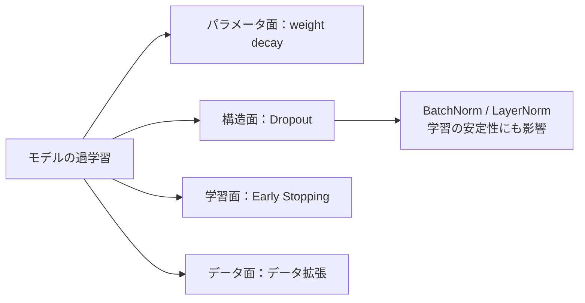
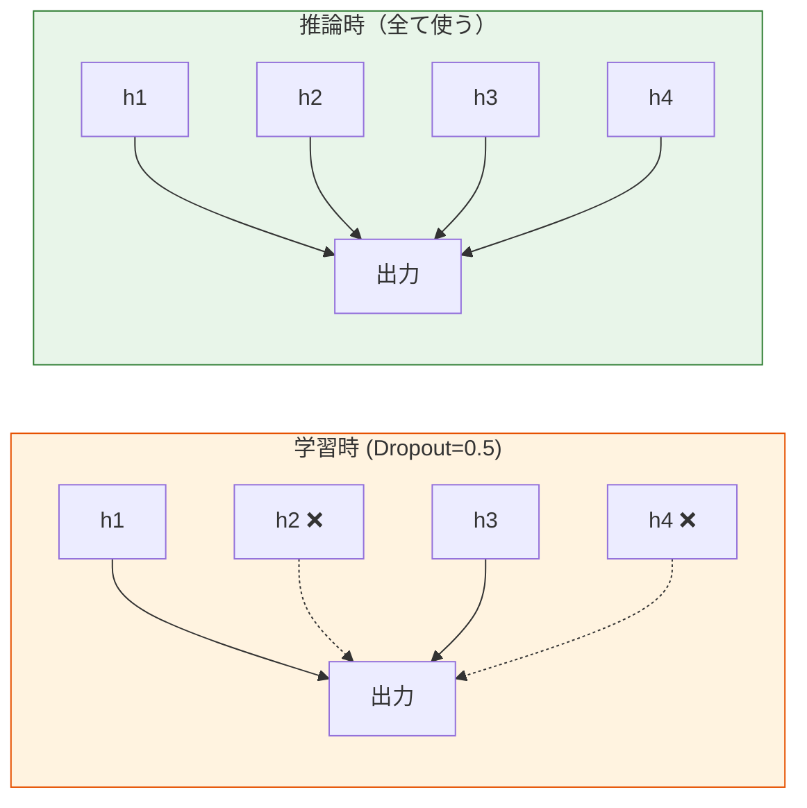

# 深層学習における正則化


:::tip この節の位置づけ
深いネットワークはパラメータ数が非常に多く、過学習しやすいです。この節では、深層学習ならではの正則化技術を紹介します。**Dropout と BatchNorm は、必ず押さえておきたい 2 つです。**
:::

## 学習目標

- 🔧 Dropout の原理と使い方を理解する
- 🔧 Batch Normalization（BN）を理解する
- Layer Normalization（LN）を理解する
- 🔧 データ拡張と早期終了法を理解する

---

## まずは全体の地図をつくろう

正則化の節を、方法名だけ丸暗記すると「ツール一覧」になりがちです。初心者には、次のように考えるのがおすすめです。



この節で本当に解決したいのは、次のことです。

- なぜモデルは過学習するのか
- それぞれの正則化手法は、どの層に効くのか
- 初めて過学習に出会ったとき、まず何を試せばよいのか

## この節は、第 5 ステージやこれまでの学習の流れとどうつながるのか

第 5 ステージまで学んできた人なら、すでに次の内容を見ています。

- 過少適合 / 過学習
- 正則化
- 交差検証と汎化

この節では、それらの「汎化をうまくコントロールする」考え方を深層学習に持ち込み、さらに深層学習らしい手法を追加していきます。

- Dropout
- BatchNorm / LayerNorm
- データ拡張
- Early Stopping

## 1. L1/L2 正則化の復習

第 5 ステージで学んだように、L2 正則化（weight decay）は、深層学習では最適化器の `weight_decay` パラメータでそのまま使えます。

```python
import torch
import torch.nn as nn

# AdamW には weight decay が標準で入っている
optimizer = torch.optim.AdamW(model.parameters(), lr=0.001, weight_decay=0.01)
```

### 1.1 なぜ深層学習でも、まず `weight_decay` を覚えるのか？

なぜなら、これは最もシンプルで、安定していて、最初に試すべきことが多い正則化手段だからです。

つまり、深層学習の正則化は「新しい概念に全部置き換える」のではなく、次のように考えるのが自然です。

- まず第 5 ステージで学んだものを活かす
- その上に、深層学習の構造的な工夫や学習テクニックを重ねる

---

## 2. Dropout ーーランダムに一部を落とす

### 2.1 原理

学習時に、**一部のニューロンをランダムに働かせない**ようにします（出力を 0 にする）。これにより、ネットワークが特定のニューロンに依存しにくくなり、ロバスト性が高まります。



### 2.2 PyTorch での使い方

```python
import torch
import torch.nn as nn
import matplotlib.pyplot as plt
from sklearn.datasets import make_moons
from sklearn.model_selection import train_test_split

# データ
X, y = make_moons(500, noise=0.3, random_state=42)
X_train, X_test, y_train, y_test = train_test_split(X, y, test_size=0.3, random_state=42)
X_train_t = torch.FloatTensor(X_train)
y_train_t = torch.LongTensor(y_train)
X_test_t = torch.FloatTensor(X_test)
y_test_t = torch.LongTensor(y_test)

# Dropout の有無を比較
class MLP(nn.Module):
    def __init__(self, dropout_rate=0.0):
        super().__init__()
        self.net = nn.Sequential(
            nn.Linear(2, 64),
            nn.ReLU(),
            nn.Dropout(dropout_rate),
            nn.Linear(64, 64),
            nn.ReLU(),
            nn.Dropout(dropout_rate),
            nn.Linear(64, 2),
        )

    def forward(self, x):
        return self.net(x)

results = {}
for name, drop in [('Dropoutなし', 0.0), ('Dropout=0.3', 0.3), ('Dropout=0.5', 0.5)]:
    model = MLP(drop)
    optimizer = torch.optim.Adam(model.parameters(), lr=0.01)
    criterion = nn.CrossEntropyLoss()
    train_losses, test_losses = [], []

    for epoch in range(200):
        model.train()
        loss = criterion(model(X_train_t), y_train_t)
        optimizer.zero_grad()
        loss.backward()
        optimizer.step()
        train_losses.append(loss.item())

        model.eval()
        with torch.no_grad():
            test_loss = criterion(model(X_test_t), y_test_t)
            test_losses.append(test_loss.item())

    results[name] = (train_losses, test_losses)

fig, axes = plt.subplots(1, 3, figsize=(15, 4))
for ax, (name, (tr, te)) in zip(axes, results.items()):
    ax.plot(tr, label='学習', linewidth=2)
    ax.plot(te, label='テスト', linewidth=2)
    ax.set_title(name)
    ax.set_xlabel('Epoch')
    ax.set_ylabel('Loss')
    ax.legend()
    ax.grid(True, alpha=0.3)
plt.suptitle('Dropout が過学習に与える影響', fontsize=13)
plt.tight_layout()
plt.show()
```

:::info 重要
- `model.train()` で Dropout を有効にする
- `model.eval()` で Dropout を無効にする
- **推論時は必ず `model.eval()` にすること！**
:::

### 2.3 Dropout は、どんなモデルにも向いている？

いいえ、そうではありません。

実用的には、次のように覚えるとよいです。

- MLP：よく使われ、効果も出やすい
- CNN：使うことはあるが、最優先とは限らない
- Transformer：通常、Dropout だけで全部を解決するわけではない

つまり、Dropout を「過学習したら必ず入れる万能スイッチ」と考えないことが大切です。

### 2.4 初めて過学習に出会ったとき、なぜ Dropout だけを思い浮かべないほうがいいのか？

過学習の原因は 1 つではないからです。  
たとえば、次のような原因があります。

- データが少ない
- モデルが大きすぎる
- 学習しすぎている
- 特徴やサンプルの多様性が足りない

なので、まずは次のように考えるのが安定です。

- 問題がどこで起きているかを大まかに見る
- そのうえで、データ、構造、パラメータ、学習過程のどこを直すか決める


:::tip 読み方のヒント
この図は、対応の順番をつかむためのものです。まずデータ分割と検証曲線を確認し、その後でデータ拡張、weight decay、early stopping、Dropout を考えましょう。Dropout は便利ですが、すべての過学習に対する最初の一手ではありません。
:::

---

## 3. Batch Normalization（BN）

### 3.1 原理

各層の出力を**正規化**し、平均を 0、標準偏差を 1 にそろえます。その後、学習可能なパラメータでスケールと平行移動を行います。

**効果：**
- 収束を速くする
- 初期値への敏感さを下げる
- 軽い正則化効果がある

### 3.2 PyTorch での使い方

```python
class MLP_BN(nn.Module):
    def __init__(self):
        super().__init__()
        self.net = nn.Sequential(
            nn.Linear(2, 64),
            nn.BatchNorm1d(64),   # BN は活性化関数の前に置く
            nn.ReLU(),
            nn.Linear(64, 64),
            nn.BatchNorm1d(64),
            nn.ReLU(),
            nn.Linear(64, 2),
        )

    def forward(self, x):
        return self.net(x)

# BN の有無を比較
for name, ModelClass in [('BNなし', MLP), ('BNあり', MLP_BN)]:
    model = ModelClass() if name == 'BNあり' else ModelClass(0.0)
    optimizer = torch.optim.SGD(model.parameters(), lr=0.1)  # SGD のほうが違いが見えやすい
    criterion = nn.CrossEntropyLoss()

    for epoch in range(100):
        model.train()
        loss = criterion(model(X_train_t), y_train_t)
        optimizer.zero_grad()
        loss.backward()
        optimizer.step()

    model.eval()
    with torch.no_grad():
        acc = (model(X_test_t).argmax(1) == y_test_t).float().mean()
    print(f"{name}: テスト精度 = {acc:.4f}")
```

---

## 4. Layer Normalization（LN）

### BN と LN の違い

| 特性 | Batch Normalization | Layer Normalization |
|------|-------------------|-------------------|
| 正規化する次元 | サンプルをまたぐ（batch 次元） | 特徴をまたぐ（layer 次元） |
| batch size に依存するか | はい | いいえ |
| 主な用途 | **CNN** | **Transformer、RNN** |

```python
# BN と LN の使い方
bn = nn.BatchNorm1d(64)    # 入力: (batch, 64)
ln = nn.LayerNorm(64)      # 入力: (batch, 64)

x = torch.randn(32, 64)
print(f"BN の出力形状: {bn(x).shape}")
print(f"LN の出力形状: {ln(x).shape}")
```

:::info
覚えておきたいのは、**CNN では BN、Transformer では LN** ということです。実務でもよく使われる標準的な選び方です。
:::

### 4.1 どうして BN と LN を混同しやすいのか？

どちらも「正規化」なので似ていますが、見ている次元が違います。

- BN は batch の統計量に強く依存する
- LN は 1 つのサンプル内の特徴に注目する

細かい数式は、最初は全部覚えなくても大丈夫です。まずは次だけ押さえましょう。

- 画像の CNN では、まず BN を考える
- Transformer では、まず LN を考える

### 4.2 BN / LN で最初に覚えるべきなのは、数式より「どこに置くか」

初心者にとっては、次のように覚えるほうが役立ちます。

- BN は CNN 学習を安定させる定番の手法
- LN は Transformer を安定させる定番の手法

まずは使いどころを覚えるほうが、正規化の式を細かく追うより大切です。

---

## 5. データ拡張

### 5.1 画像データの拡張

```python
from torchvision import transforms

# よく使う画像拡張の組み合わせ
train_transform = transforms.Compose([
    transforms.RandomHorizontalFlip(p=0.5),     # ランダムに左右反転
    transforms.RandomRotation(15),               # ±15° のランダム回転
    transforms.ColorJitter(brightness=0.2, contrast=0.2),  # 色の揺らぎ
    transforms.RandomResizedCrop(224, scale=(0.8, 1.0)),   # ランダムクロップ
    transforms.ToTensor(),
    transforms.Normalize([0.485, 0.456, 0.406], [0.229, 0.224, 0.225]),
])

# テスト集には拡張を使わない
test_transform = transforms.Compose([
    transforms.Resize(256),
    transforms.CenterCrop(224),
    transforms.ToTensor(),
    transforms.Normalize([0.485, 0.456, 0.406], [0.229, 0.224, 0.225]),
])
```

---

## 6. 早期終了法（Early Stopping）

### 6.1 原理

**検証集の損失**を監視し、N 回連続で改善しなければ学習を止めます。

```python
class EarlyStopping:
    def __init__(self, patience=10, min_delta=0.001):
        self.patience = patience
        self.min_delta = min_delta
        self.counter = 0
        self.best_loss = float('inf')
        self.should_stop = False

    def step(self, val_loss):
        if val_loss < self.best_loss - self.min_delta:
            self.best_loss = val_loss
            self.counter = 0
        else:
            self.counter += 1
            if self.counter >= self.patience:
                self.should_stop = True
        return self.should_stop

# 使用例
early_stop = EarlyStopping(patience=10)
# for epoch in range(max_epochs):
#     train(...)
#     val_loss = validate(...)
#     if early_stop.step(val_loss):
#         print(f"早期終了! Epoch {epoch}")
#         break
```

### 6.2 なぜ Early Stopping は、初心者がまず覚えるのに向いているのか？

理由は、実装しやすく、壊しにくく、効果もわかりやすいからです。

モデルの構造を完全に理解していなくても、次のことだけでかなり改善できます。

- 検証集を用意する
- 検証損失を監視する
- 最良の重みを保存する

これだけでも、プロジェクトの品質はかなり上がります。

## 初心者が最初に過学習へ対処するときの、いちばん安定した順番

もし `train_loss` は下がり続けるのに `val_loss` が悪化し始めたら、次の順で試すのがおすすめです。

1. データ量とデータ拡張を確認する
2. 早期終了を入れる
3. weight decay を試す
4. Dropout を試す
5. 最後にモデル構造を大きく見直す

この順番のほうが、「過学習したら、とりあえず正則化を足す」より、ずっと整理されています。

---

## まとめ

| 技術 | 種類 | ポイント |
|------|------|------|
| **Dropout** | 過学習防止 | 学習時にランダムに落とし、推論時は無効 |
| **Batch Norm** | 高速化 + 正則化 | CNN の定番、活性化の前に置く |
| **Layer Norm** | 高速化 + 正則化 | Transformer の定番 |
| **データ拡張** | 多様性を増やす | 学習データにだけ使う |
| **早期終了法** | 過学習防止 | 検証集の loss を監視する |
| **weight decay** | L2 正則化 | optimizer の `weight_decay` を使う |

## この節で一番大事なこと

- 正則化は 1 つの方法ではなく、汎化をコントロールするための一連の手段
- 各手法は、パラメータ・構造・データ・学習過程の異なる層に効く
- 初めて過学習に対処するときは、順番に確認するほうが、やみくもにテクニックを足すより効果的

一言でまとめるなら、次の通りです。

> **正則化は「テクニックを 1 つ足す」ことではなく、いくつかの層でモデルが訓練データを覚え込みすぎないようにする工夫です。**

---

## ハンズオン課題

### 練習 1：正則化の組み合わせ

MNIST データセットで MLP を学習し、Dropout、BatchNorm、データ拡張を順に追加して、テスト精度の変化を観察してください。

### 練習 2：Early Stopping の実践

早期終了を含む完全な学習ループを実装し、最良のモデル重みを保存してください。学習後に最良の重みを読み込み、評価してください。
