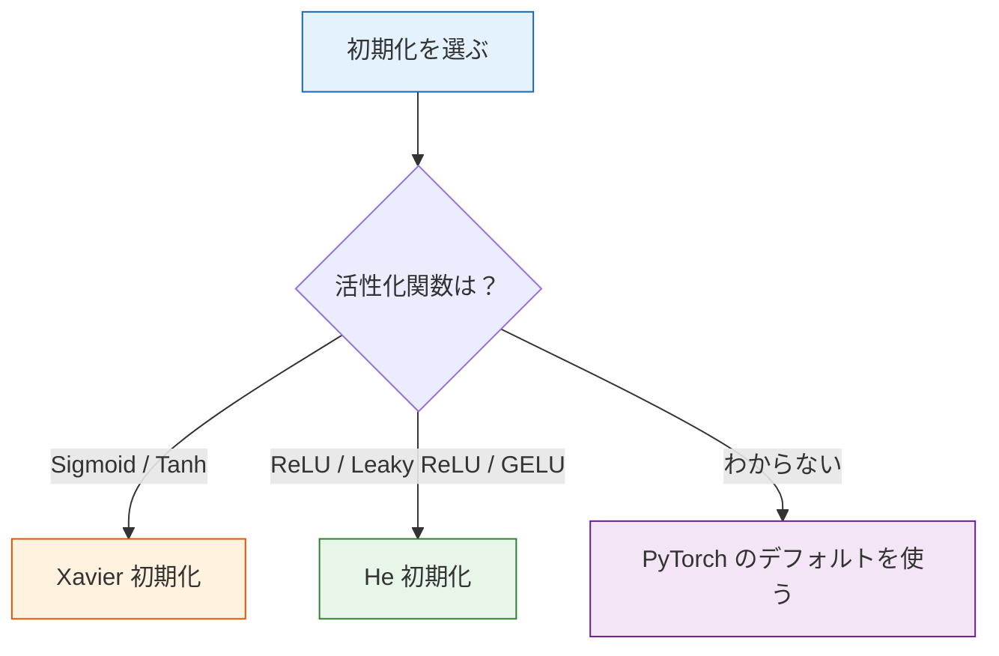

# 重みの初期化

:::tip この節の位置づけ
深いネットワークの学習がうまくいくかどうかを左右する重要な要素の1つが、**重みの初期化**です。よくない初期化は勾配消失や勾配爆発を引き起こし、学習を完全に失敗させることがあります。うれしいことに、PyTorch ではデフォルトで適切な初期化が選ばれています。
:::

## 学習目標

- なぜ全ゼロ初期化がだめなのかを理解する
- Xavier / Glorot 初期化を理解する
- He / Kaiming 初期化を理解する
- 初期化が学習に与える影響を確認する

---

## まずは全体の地図を作ろう

初期化の節は、新しく学ぶ人にとって「おまけの細かい話」に見えやすいですが、実はモデルがスムーズに学習を始められるかに直結しています。


この節で本当に解決したいのは、次のようなことです。

- なぜ重みを適当に決めてはいけないのか
- なぜ活性化関数によって、組み合わせる初期化が違うのか
- 最初にネットワークを書くとき、いつ PyTorch のデフォルト値を安心して使えるのか

## この節は前の節とどうつながるのか

前の節までをつなげて考えると、この節はとても自然な問いに答えています。

- ニューロンは順伝播する
- 逆伝播は勾配を返す
- 最適化手法はパラメータを更新する

でも、その前提として大事なのは次です。

- ネットワークを最初に動かすときの信号や勾配が、極端すぎないこと

つまり初期化は、こういう問いへの答えです。

> **モデルの学習を始める前に、最初の一手をどう置けば、あとで崩れにくいのか。**

## 1. なぜ初期化は大事なのか？

### 1.1 全ゼロ初期化の問題

もし重みがすべて 0 なら、すべてのニューロンの計算結果はまったく同じになり、勾配も同じになります。すると、**永遠に違いが生まれません**。つまり、1つのニューロンしかないのと同じです。

### 1.2 ランダム初期化にも落とし穴がある

- **大きすぎる**: 活性値が飽和する → 勾配消失（Sigmoid/Tanh）や勾配爆発
- **小さすぎる**: 信号が層ごとに弱くなる → 勾配も弱くなる → 学習がとても遅い

### 1.2.1 新人向けの直感: 各層を「静かすぎず、興奮しすぎず」にする

初期化は、各層に「スタート姿勢」を与えるものだと考えるとわかりやすいです。

- 小さすぎる: 最初から元気がなく、信号が層を通るたびに消えていく
- 大きすぎる: 最初から力みすぎて、出力も勾配も暴れやすい

だから、よい初期化の目的はとてもシンプルです。

- 順伝播の信号が急に弱くなったり、爆発したりしないようにする
- 逆伝播の勾配も、ちゃんと安定して戻ってくるようにする

```python
import torch
import torch.nn as nn
import matplotlib.pyplot as plt

# いろいろな初期化で活性値分布を観察する
torch.manual_seed(42)

def observe_activations(init_fn, title, activation=nn.Tanh()):
    """10層ネットワークで各層の活性値分布を観察する"""
    layers = []
    for i in range(10):
        linear = nn.Linear(256, 256, bias=False)
        init_fn(linear.weight)
        layers.append(linear)
        layers.append(activation)

    model = nn.Sequential(*layers)

    # 各層の出力を記録
    x = torch.randn(200, 256)
    activations = []
    for i in range(0, len(layers), 2):
        x = layers[i](x)       # Linear
        x = layers[i+1](x)     # Activation
        activations.append(x.detach().numpy().flatten())

    fig, axes = plt.subplots(2, 5, figsize=(15, 5))
    for i, (ax, act) in enumerate(zip(axes.ravel(), activations)):
        ax.hist(act, bins=50, color='steelblue', alpha=0.7)
        ax.set_title(f'Layer {i+1}')
        ax.set_xlim(-1.5, 1.5)
    plt.suptitle(title, fontsize=13)
    plt.tight_layout()
    plt.show()

# 小さすぎる初期化
observe_activations(
    lambda w: nn.init.normal_(w, 0, 0.01),
    '小さすぎる初期化 (std=0.01) + Tanh → 信号が弱くなる'
)

# 大きすぎる初期化
observe_activations(
    lambda w: nn.init.normal_(w, 0, 1.0),
    '大きすぎる初期化 (std=1.0) + Tanh → 飽和する'
)
```

---

## 2. Xavier / Glorot 初期化

### 2.1 核となる考え方

各層の**入力と出力の分散をそろえる**ことで、信号が層ごとに大きくなりすぎたり、小さくなりすぎたりするのを防ぎます。

> **重みは N(0, 2/(fan_in + fan_out)) からサンプリングする**
>
> fan_in = 入力次元, fan_out = 出力次元

### 2.1.1 Xavier で最初に覚えるべきことは、式ではなく何か？

まず覚えるべきなのは、次の目的です。

- 各層の入力と出力のスケールが、できるだけ大きく変わらないようにする

この式は、その目的を実現するための1つの方法です。  
なので、最初は分母の形を丸暗記するよりも、この直感をつかむほうが大事です。

### 2.2 適用先: Sigmoid / Tanh

```python
observe_activations(
    lambda w: nn.init.xavier_normal_(w),
    'Xavier 初期化 + Tanh → 信号が安定する'
)
```

---

## 3. He / Kaiming 初期化

### 3.1 核となる考え方

Xavier は活性化関数が線形に近いことを前提にしています。  
でも ReLU はニューロンの半分ほどを 0 にするので、それを補うために**より大きい分散**が必要です。

> **重みは N(0, 2/fan_in) からサンプリングする**

### 3.1.1 He 初期化はなぜ ReLU に向いているのか？

ReLU は入力の一部をそのまま 0 に切り捨てます。  
もし保守的な初期化のままだと、信号はさらに弱くなりやすいです。

そのため He 初期化は、まず次のように考えるとわかりやすいです。

- ReLU の「切り捨て特性」に合わせて、最初の分散を少し大きめにする

### 3.2 適用先: ReLU とその派生

```python
observe_activations(
    lambda w: nn.init.kaiming_normal_(w, mode='fan_in', nonlinearity='relu'),
    'He 初期化 + ReLU → 信号が安定する',
    activation=nn.ReLU()
)
```

---

## 4. 選び方のガイド

| 活性化関数 | 推奨初期化 | PyTorch 関数 |
|---------|-----------|-------------|
| **Sigmoid / Tanh** | Xavier | `nn.init.xavier_normal_` |
| **ReLU / Leaky ReLU** | He (Kaiming) | `nn.init.kaiming_normal_` |
| **GELU / Swish** | He | `nn.init.kaiming_normal_` |

### PyTorch のデフォルト動作

```python
# PyTorch の nn.Linear はデフォルトで Kaiming Uniform を使う
linear = nn.Linear(256, 128)
print(f"デフォルト初期化の範囲: [{linear.weight.min():.4f}, {linear.weight.max():.4f}]")

# 初期化を手動で指定する
nn.init.kaiming_normal_(linear.weight, mode='fan_in', nonlinearity='relu')
nn.init.zeros_(linear.bias)
```

:::info うれしいポイント
PyTorch の `nn.Linear` はデフォルトで Kaiming Uniform 初期化を使い、`nn.Conv2d` も同じです。ほとんどの場合、**自分で初期化を書く必要はありません**。ただし、原理を理解しておくと学習の異常を診断しやすくなります。
:::

### 4.1 初めてプロジェクトを作るとき、手動で初期化すべき？

多くの場合は、次のとおりです。

- 最初から自分で初期化を書く必要はない
- まずは PyTorch のデフォルト値で十分なことが多い

手動初期化を考えたほうがよいのは、たとえば次のような場合です。

- より深いネットワークの実験をしている
- 学習がかなり不安定だと疑っている
- いろいろな初期化戦略を体系的に比較したい

この節で大切なのは、「今日すぐに初期化コードをたくさん書けるようになること」よりも、まず次を知ることです。

- なぜデフォルト値でたいていうまくいくのか
- いつ初期化を疑うべきなのか

### 4.2 より安定した最初の判断順

プロジェクトを始めたばかりなら、次の順で考えるとよいです。

1. まず PyTorch のデフォルト初期化を使う
2. それでも学習が明らかに不安定なら、学習率や最適化手法を確認する
3. まだおかしければ、初期化と活性化関数の組み合わせを疑う

この順番は、「問題が起きたらまず初期化を変える」よりも安定しています。  
初期化は重要ですが、いつも最初の容疑者とは限らないからです。

---

## 5. 初期化が学習に与える影響

```python
# いろいろな初期化の学習効果を比較する
from sklearn.datasets import make_moons

X, y = make_moons(500, noise=0.2, random_state=42)
X_t = torch.FloatTensor(X)
y_t = torch.LongTensor(y)

init_methods = {
    '全ゼロ': lambda w: nn.init.zeros_(w),
    'N(0, 0.01)': lambda w: nn.init.normal_(w, 0, 0.01),
    'N(0, 1.0)': lambda w: nn.init.normal_(w, 0, 1.0),
    'Xavier': lambda w: nn.init.xavier_normal_(w),
    'He (Kaiming)': lambda w: nn.init.kaiming_normal_(w),
}

plt.figure(figsize=(10, 5))
for name, init_fn in init_methods.items():
    model = nn.Sequential(
        nn.Linear(2, 64), nn.ReLU(),
        nn.Linear(64, 64), nn.ReLU(),
        nn.Linear(64, 2),
    )
    # 初期化
    for m in model:
        if isinstance(m, nn.Linear):
            init_fn(m.weight)
            nn.init.zeros_(m.bias)

    optimizer = torch.optim.Adam(model.parameters(), lr=0.01)
    criterion = nn.CrossEntropyLoss()
    losses = []

    for epoch in range(200):
        loss = criterion(model(X_t), y_t)
        optimizer.zero_grad()
        loss.backward()
        optimizer.step()
        losses.append(loss.item())

    plt.plot(losses, label=name, linewidth=2)

plt.xlabel('Epoch')
plt.ylabel('Loss')
plt.title('初期化方法ごとの学習曲線')
plt.legend()
plt.grid(True, alpha=0.3)
plt.show()
```

### 5.1 学習の最初からおかしいなら、初期化を疑う価値がある

典型的なサインは次のとおりです。

- loss が最初から非常に大きい
- 多くの層の出力がほぼすべて 0 か、極端に飽和している
- 勾配がすぐに消える、または爆発する

もちろん、原因は初期化だけではありません。  
それでも、まず確認する価値が高い項目の1つです。

---

## まとめ

| 初期化 | 原理 | 適用 |
|--------|------|------|
| **全ゼロ** | すべてのニューロンが同じになる | ❌ 絶対に使わない |
| **小さいランダム** | 信号が弱くなる | ❌ 深いネットワークには不向き |
| **大きいランダム** | 勾配爆発 / 飽和 | ❌ 不向き |
| **Xavier** | 入出力の分散を保つ | Sigmoid / Tanh |
| **He (Kaiming)** | ReLU 用に補正する | **ReLU 系（最もよく使う）** |



## この節で一番持ち帰ってほしいこと

- 初期化は飾りではなく、ネットワークが最初に健全に信号を流せるかを決めるもの
- Xavier は Sigmoid / Tanh 向け、He は ReLU 系向け
- 初めてプロジェクトを作るときは PyTorch のデフォルト値でまったく問題ないが、原理は知っておくべき

一言でまとめるなら、こうです。

> **初期化が決めるのは「学習がちゃんと走り出せるか」であって、最終的にどこまで伸びるかではありません。**

---

## 手を動かしてみよう

### 練習 1: 深いネットワークの比較

20 層の MLP（ReLU 活性化）を作り、全ゼロ、Xavier、He 初期化をそれぞれ使って、順伝播後の各層の活性値分布を観察してください（平均と標準偏差を表示する）。

### 練習 2: 深い MNIST の学習

10 層の MLP で MNIST を学習し、He 初期化とデフォルト初期化の学習速度と最終精度を比較してください。
