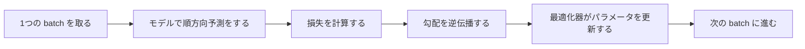
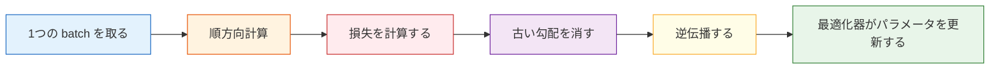

# 訓練フロー


## 学習目標

- 標準的な PyTorch の訓練ループを読めるようになる
- `train()`、`eval()`、`zero_grad()`、`backward()`、`step()` の順番を理解する
- 小さなタスクで訓練、検証、予測を実行できるようになる
- 再利用しやすい訓練テンプレートを身につける

---

## まずは全体像をつかもう

訓練ループの章で初心者にいちばん合う理解方法は、「テンプレートを暗記する」ことではなく、訓練で何が繰り返されているのかを先に見ることです。



この5つのステップを何度も繰り返すのが、深層学習の訓練の基本リズムです。

## この章と第5章、そして PyTorch 前半のつながり

第5章から学んできた人は、まず次のように理解するとよいです。

- 第5章では、`fit()` が訓練全体をまとめてくれていました
- この章では、その訓練処理を自分で分解して書いていきます

PyTorch 前半からつながっている人は、次のように見ると整理しやすいです。

- `Tensor` は「データをどこに置くか」を担当する
- `Autograd` は「勾配はどうやって生まれるか」を担当する
- `nn.Module` は「ネットワークをどう構成するか」を担当する
- `DataLoader` は「データをどう batch に分けて入力するか」を担当する
- そしてこの章は、それらを実際に動く訓練プロセスとしてつなげる役割を持ちます

## 1. 訓練ループはなぜ重要なのか？

深層学習コードで何度も練習すべきなのは、ある1つの層ではなく、**訓練ループ**です。

なぜなら、次のどんなタスクでも、訓練の主な流れはこの線から逃れられないからです。

- 画像分類
- テキスト分類
- 物体検出
- 大規模モデルの微調整

訓練の主流れはいつもほぼ同じです。



### 1.1 なぜネットワーク構造を暗記するより、訓練ループを先に練習すべきなのか？

ネットワーク構造は変わるからです。

- CNN も変わる
- RNN も変わる
- Transformer も変わる

でも、訓練ループの骨組みは長いあいだかなり安定しています。  
だからこの章はとても大事です。深層学習の中で、あまり古くならない部分をつかむ練習になるからです。

---

## 2. まず標準テンプレートを覚えよう

いきなり暗記しようとせず、まずは何度か眺めてみましょう。

```python
for batch_x, batch_y in train_loader:
    pred = model(batch_x)
    loss = loss_fn(pred, batch_y)

    optimizer.zero_grad()
    loss.backward()
    optimizer.step()
```

このコードがやっていることは、実は3つだけです。

1. 予測する
2. 誤差を計算する
3. 誤差に基づいてパラメータを更新する

### 2.1 初心者がまず覚えるべき最短の合言葉

訓練ループを書くたびに混乱するなら、次の最短フレーズを覚えてください。

`前向き計算 -> loss を計算 -> 勾配を消す -> 逆伝播 -> 更新`

これがスムーズになれば、あとから検証、ログ、早期終了を足すのはそれほど難しくありません。

### 2.2 なぜこの順番を崩してはいけないのか？

それぞれのステップは、前のステップの結果に依存しているからです。

- 前向き計算がなければ、予測がありません
- 予測がなければ、loss を計算できません
- loss がなければ、backward できません
- 古い勾配を消さないと、新しい勾配と混ざってしまいます

つまり訓練ループは、「いくつかの API を並べただけ」ではなく、厳密な順番を持つ因果の流れです。


:::tip 読み方のヒント
この図は、訓練ループを書くたびに照らし合わせるのがおすすめです。`model.train()`、batch を取る、forward、loss、`zero_grad()`、`backward()`、`step()` の順番を確認してください。検証フェーズでは `model.eval()` と `torch.no_grad()` に切り替えて、検証で勾配を記録しないようにします。
:::

---

## 3. 完全に動く例

:::info 実行環境
次のコードはそのまま実行できます。

```bash
pip install torch
```
:::

ここでは、2次元の回帰タスクを作ります。  
2つの特徴量を入力し、目標値はおおよそ次の関係になります。

> `y ≈ 3*x1 + 2*x2 + 5`

```python
import torch
from torch import nn
from torch.utils.data import TensorDataset, DataLoader, random_split

torch.manual_seed(42)

# 1. そのまま実行できる模擬データを作る
X = torch.randn(200, 2)
noise = torch.randn(200, 1) * 0.3
y = 3 * X[:, [0]] + 2 * X[:, [1]] + 5 + noise

dataset = TensorDataset(X, y)
train_dataset, val_dataset = random_split(
    dataset,
    [160, 40],
    generator=torch.Generator().manual_seed(42)
)

train_loader = DataLoader(train_dataset, batch_size=32, shuffle=True)
val_loader = DataLoader(val_dataset, batch_size=40, shuffle=False)

# 2. モデルを定義する
model = nn.Sequential(
    nn.Linear(2, 8),
    nn.ReLU(),
    nn.Linear(8, 1)
)

# 3. 損失関数と最適化器を定義する
loss_fn = nn.MSELoss()
optimizer = torch.optim.Adam(model.parameters(), lr=0.05)

# 4. 訓練する
for epoch in range(1, 101):
    model.train()
    train_loss_sum = 0.0

    for batch_x, batch_y in train_loader:
        pred = model(batch_x)
        loss = loss_fn(pred, batch_y)

        optimizer.zero_grad()
        loss.backward()
        optimizer.step()

        train_loss_sum += loss.item() * len(batch_x)

    train_loss = train_loss_sum / len(train_dataset)

    # 5. 検証する
    model.eval()
    with torch.no_grad():
        val_loss_sum = 0.0
        for batch_x, batch_y in val_loader:
            pred = model(batch_x)
            loss = loss_fn(pred, batch_y)
            val_loss_sum += loss.item() * len(batch_x)
        val_loss = val_loss_sum / len(val_dataset)

    if epoch % 20 == 0 or epoch == 1:
        print(f"epoch={epoch:3d}, train_loss={train_loss:.4f}, val_loss={val_loss:.4f}")

# 6. 予測を試す
test_x = torch.tensor([[1.0, 2.0], [-1.0, 0.5], [0.0, 0.0]])
with torch.no_grad():
    test_pred = model(test_x)

print("\nテストサンプルの予測:")
for x_row, y_row in zip(test_x, test_pred):
    print(f"x={x_row.tolist()} -> pred={round(y_row.item(), 2)}")
```

---

## 4. このコードを1行ずつ分解しよう

### 1. `model.train()`

モデルを訓練モードに切り替えます。  
`Dropout` や `BatchNorm` のような層がある場合、訓練時の動作に変わります。

### 2. `pred = model(batch_x)`

順方向計算です。  
つまり、「今のパラメータで予測してみる」ということです。

### 3. `loss = loss_fn(pred, batch_y)`

モデルに対して、「今回の予測は正解とどれくらい違うか」を計算します。

### 4. `optimizer.zero_grad()`

古い勾配を消します。  
PyTorch では、勾配が自動でたまっていくからです。

### 5. `loss.backward()`

逆伝播を行います。  
loss が各パラメータに対してどんな勾配を持つかを計算します。

### 6. `optimizer.step()`

勾配に基づいて、実際にパラメータを更新します。

### 4.1 初心者が最初に書くとき、いちばん抜けやすいのはどこ？

よくあるのは次の2つです。

- `optimizer.zero_grad()` を忘れる
- 検証時に `model.eval()` と `torch.no_grad()` を忘れる

どちらも、エラーは出ないのに結果が「なんだか変」に見える原因になります。

### 4.2 初心者向けの「毎エポック確認表」

毎回、心の中でこの小さな表を確認するとよいです。

| ステップ | 確認すること |
|---|---|
| 前向き計算 | 入力の shape は合っているか？ 出力の shape は合っているか？ |
| loss | 出力とラベルは対応しているか？ |
| zero_grad | 古い勾配は消えているか？ |
| backward | 勾配は本当に計算されたか？ |
| step | パラメータは実際に更新されたか？ |

この表はデバッグにとても役立ちます。訓練バグの多くは、この5つのどこかで起きるからです。

---

## 5. なぜ検証では `eval()` と `no_grad()` を使うのか？

検証フェーズの目的は学習ではなく、モデルの性能を確認することです。

そのため、通常は次のように書きます。

```text
model.eval()
with torch.no_grad():
    # validation / inference code goes here
```

理由は2つあります。

- `eval()`：一部の層を推論モードに切り替えるため
- `no_grad()`：勾配を記録せず、メモリと時間を節約するため

### 5.1 学習モードと検証モードを分けることは、なぜそんなに大事なのか？

これはとても見落とされやすいです。小さな例では、目立った問題が出ないことも多いからです。  
でも、この章からは、次の習慣をしっかり持つのがおすすめです。

- 訓練前：`model.train()`
- 検証前：`model.eval()`
- 検証中：`with torch.no_grad():`

後で次のようなものが出てくると、モードを分けていないとミスが起きやすくなります。

- Dropout
- BatchNorm
- より大きなモデル

---

## 6. 覚えやすい「レストラン版」のたとえ

訓練をレストラン営業にたとえると、かなり覚えやすくなります。

| 深層学習のステップ | レストランのたとえ |
|---|---|
| `batch_x` | その回の注文のかたまり |
| `model(batch_x)` | シェフが今のやり方で料理する |
| `loss_fn` | お客さんの評価点 |
| `backward()` | どこがまずかったかを見つける |
| `step()` | 次回に向けてやり方を直す |

訓練とは、営業を繰り返しながら少しずつ改善していくことです。

---

## 7. よくある変形

### 1. 分類タスク

回帰では `MSELoss()` をよく使いますが、分類では次がよく使われます。

```python
loss_fn = nn.CrossEntropyLoss()
```

### 2. 違う最適化器を使う

よく使うものは次の2つです。

- `SGD`
- `Adam`

初心者には、まず `Adam` のほうが扱いやすいことが多いです。

### 3. 評価指標を追加する

訓練では loss だけでなく、次のような指標もよく見ます。

- 正解率 `accuracy`
- 適合率 `precision`
- 再現率 `recall`
- F1

---

## 8. いちばんミスしやすいところ

### 1. `zero_grad()` を忘れる

結果として勾配がどんどんたまり、訓練結果が信用できなくなります。

### 2. 検証時に `model.eval()` を忘れる

訓練時と検証時で動きが違う層があるので、結果に影響します。

### 3. 検証時も勾配を計算してしまう

動くことはありますが、メモリと計算資源が無駄になります。

### 4. `loss.item()` と `loss` を混同する

- `loss` は Tensor なので、逆伝播に使えます
- `loss.item()` は普通の Python 数値なので、表示や集計に向いています

### 5. loss だけ見て、訓練と検証の関係を見ない

初心者にありがちなもう1つの問題はこれです。

- 訓練 loss が下がっているから、すべて順調だと思ってしまう

でも、より安定した見方は次の通りです。

- 訓練 loss は下がっているか？
- 検証 loss も一緒によくなっているか？
- 2つはずれ始めていないか？

これは、後の過学習の診断に向けた準備にもなります。

---

## 9. 保存しておける汎用骨組み

```python
for epoch in range(num_epochs):
    model.train()
    for batch_x, batch_y in train_loader:
        pred = model(batch_x)
        loss = loss_fn(pred, batch_y)

        optimizer.zero_grad()
        loss.backward()
        optimizer.step()

    model.eval()
    with torch.no_grad():
        for batch_x, batch_y in val_loader:
            pred = model(batch_x)
            val_loss = loss_fn(pred, batch_y)
```

今後 PyTorch のプロジェクトを見たとき、この主な流れをだいたい見分けられるようになります。

---

## まとめ

この章で1つだけ覚えるなら、次の言葉です。

> **訓練ループとは、「1回前向きに計算し、1回逆向きに直し、それを何度も繰り返す」ことです。**

この流れをしっかり練習しておくと、CNN、Transformer、大規模モデルの微調整を学ぶときに、フレームワークのコードに怖がりにくくなります。

## この章でいちばん持ち帰ってほしいこと

もう1つ付け加えるなら、次を覚えてください。

> **訓練ループはテンプレート暗記ではなく、「予測 -> 誤差を測る -> 誤差に応じてパラメータを直す」という閉じた流れです。**

なので、この章で本当に押さえるべきことは次の3つです。

- 順番を崩さない
- 訓練モードと検証モードを分ける
- デバッグ時は shape、loss、勾配、パラメータ更新の順に確認する

---

## 練習

1. 上の例の最適化器を `Adam` から `SGD` に変えて、収束速度の違いを見てみましょう。
2. 隠れ層を `8` から `16` に変えて、訓練損失と検証損失の変化を観察しましょう。
3. データ中のノイズ `0.3` を `1.0` に変えて、モデルの学習難易度がどう変わるか見てみましょう。
