# CNN の基本構造


:::tip この節の位置づけ
前の節では、カーネルが画像上を「スライドして局所パターンを探す」ことを学びました。  
この節では、それらの部品を組み合わせて、もっと全体的な問いに答えます。

> **CNN 全体は、いったいどう動いているのか？**

ここで分かるのは、CNN は畳み込み層だけではなく、「特徴抽出 -> 圧縮 -> 判断」という流れのモジュールの集まりだということです。
:::

## 学習目標

- 典型的な CNN がどのようなモジュールで構成されるかを理解する
- `畳み込み -> 活性化 -> プーリング -> 分類ヘッド` という主な流れをつかむ
- なぜチャネル数が増え、空間サイズが小さくなるのかを理解する
- PyTorch で最小限の CNN の順伝播を読めるようになる
- `Flatten` と `Global Average Pooling` の2つの分類ヘッドの考え方を区別できるようになる

---

## 一、まず全体の地図を見てみよう

### 1.1 いちばん典型的な CNN はどんな形？

もっとも基本的な CNN は、ざっくり次のように描けます。

```mermaid
flowchart LR
    A["入力画像"] --> B["畳み込み層"]
    B --> C["活性化関数 ReLU"]
    C --> D["プーリング層"]
    D --> E["畳み込み層"]
    E --> F["活性化関数 ReLU"]
    F --> G["プーリング層"]
    G --> H["Flatten / Global Pooling"]
    H --> I["全結合層"]
    I --> J["クラス出力"]

    style A fill:#e3f2fd,stroke:#1565c0,color:#333
    style B fill:#fff3e0,stroke:#e65100,color:#333
    style C fill:#fff3e0,stroke:#e65100,color:#333
    style D fill:#f3e5f5,stroke:#6a1b9a,color:#333
    style E fill:#fff3e0,stroke:#e65100,color:#333
    style F fill:#fff3e0,stroke:#e65100,color:#333
    style G fill:#f3e5f5,stroke:#6a1b9a,color:#333
    style H fill:#fffde7,stroke:#f9a825,color:#333
    style I fill:#e8f5e9,stroke:#2e7d32,color:#333
    style J fill:#ffebee,stroke:#c62828,color:#333
```



これをやさしく言い換えると、次の流れです。

1. まず畳み込みで局所特徴を見つける
2. 次に活性化関数で非線形性を加える
3. 次にプーリングでサイズを圧縮し、重要な情報を残す
4. これを何段か繰り返して、より抽象的な特徴を作る
5. 最後に分類ヘッドへ渡して判定する

### 1.2 覚えやすい比喩

CNN は「何段階もの検査システム」と考えると分かりやすいです。

- 最初の層は輪郭や模様を見る
- 次の層は局所的な形を見る
- その次の層は部品の組み合わせを見る
- 最後の層で「これは猫っぽいか、犬っぽいか」を判断する

つまり、CNN は最初から「猫」という概念を直接理解するわけではありません。  
まず「毛の境目、耳の輪郭、目のあたり、体の形」を少しずつ組み合わせていきます。

---

## 二、なぜ CNN のチャネル数は増えていくのか？

### 2.1 チャネル数は「特徴の種類数」と考えられる

入力層では、

- グレースケール画像は通常 1 チャネル
- RGB 画像は通常 3 チャネル

です。

ただし CNN に入ると、チャネルの意味は変わります。  
もはや「色のチャネル」ではなく、

> **それぞれの畳み込みカーネルが取り出した、異なる特徴マップの数**

を表します。

たとえば、

- 1つ目のカーネルは縦線に強い
- 2つ目のカーネルは横線に強い
- 3つ目のカーネルは斜めの角に強い

ということがあります。

だから、次のように書くと：

```python
nn.Conv2d(in_channels=3, out_channels=16, kernel_size=3)
```

意味はこうなります。

- 入力は 3 チャネル
- 出力は 16 種類の特徴マップ

### 2.2 なぜ後ろの層で 32、64、128 と増えるのか？

後ろの層ほど、モデルはより多く、より抽象的なパターンを学びたいからです。  
前半は基本的な模様を見つければよく、後半はそれらを組み合わせた複雑な構造を表現する必要があります。  
そのため、チャネル数はだんだん増えていくのが一般的です。

---

## 三、なぜ空間サイズは小さくなっていくのか？

### 3.1 モデルが「細部」から「要約」へ進むから

前半の層は、主に局所的な細部に注目します。

- どこに輪郭があるか
- どこに模様があるか

後半の層は、より全体的な意味を見ます。

- 耳があるか
- 車輪があるか
- 猫らしい形か

そのため、よくある変化は次の通りです。

- 高さ・幅は少しずつ小さくなる
- チャネル数は少しずつ多くなる

これは次のように言い換えられます。

> 空間分解能は下がるが、意味の濃さは上がる。


:::tip 図の読み方
この図は、CNN でよくある形の変化を示しています。後ろの層に行くほど、高さと幅は小さくなることが多いです。これは、モデルがすべての画素の細部を残す必要がなくなるためです。一方でチャネル数は増えることが多く、より多くの、より抽象的な特徴の種類を記録します。
:::

### 3.2 プーリング層は何をしているのか？

もっともよく使われるのは `MaxPool` で、小さな窓の中の最大値を取ります。

たとえば：

```python
import numpy as np

feature_map = np.array([
    [1, 3, 2, 0],
    [4, 6, 1, 2],
    [0, 1, 5, 3],
    [2, 4, 1, 7]
], dtype=np.float32)

pooled = np.array([
    [feature_map[0:2, 0:2].max(), feature_map[0:2, 2:4].max()],
    [feature_map[2:4, 0:2].max(), feature_map[2:4, 2:4].max()]
])

print("feature_map =\n", feature_map)
print("pooled =\n", pooled)
```

出力では、`4x4` が `2x2` に圧縮されます。

### 3.3 MaxPool は「情報を捨てている」のでは？

はい、細かい情報の一部は確かに失われます。  
ただし、各局所領域の中でいちばん強い反応を残すので、分類タスクではむしろ役立つことが多いです。

イメージとしては、

> すべての画素を覚えるのではなく、「この部分でいちばん強い特徴が出たか」を残す

という感じです。

---

## 四、CNN の基本単位は畳み込みブロック

### 4.1 畳み込みブロックとは？

現代の深層学習では、1つの畳み込み層を単独で見るよりも、次の組み合わせを 1 つの基本ブロックとして扱うことが多いです。

```text
畳み込み -> 活性化 -> （必要なら）プーリング
```

または、

```text
畳み込み -> BN -> ReLU
```

### 4.2 最小の畳み込みブロック例

```python
import torch
from torch import nn

block = nn.Sequential(
    nn.Conv2d(3, 8, kernel_size=3, padding=1),
    nn.ReLU(),
    nn.MaxPool2d(kernel_size=2)
)

x = torch.randn(2, 3, 32, 32)
y = block(x)

print("input shape :", x.shape)
print("output shape:", y.shape)
```

このブロックは 3 つのことをしています。

1. 3 チャネル画像を 8 チャネルの特徴へ変換する
2. ReLU で非線形性を入れる
3. プーリングで `32x32` を `16x16` に圧縮する

---

## 五、小さな CNN の順伝播を見てみよう

### 5.1 実行できる例

```python
import torch
from torch import nn

class TinyCNN(nn.Module):
    def __init__(self, num_classes=10):
        super().__init__()

        self.features = nn.Sequential(
            nn.Conv2d(1, 8, kernel_size=3, padding=1),   # [B, 1, 28, 28] -> [B, 8, 28, 28]
            nn.ReLU(),
            nn.MaxPool2d(2),                             # -> [B, 8, 14, 14]

            nn.Conv2d(8, 16, kernel_size=3, padding=1),  # -> [B, 16, 14, 14]
            nn.ReLU(),
            nn.MaxPool2d(2)                              # -> [B, 16, 7, 7]
        )

        self.classifier = nn.Sequential(
            nn.Flatten(),                                # -> [B, 16*7*7]
            nn.Linear(16 * 7 * 7, 64),
            nn.ReLU(),
            nn.Linear(64, num_classes)
        )

    def forward(self, x):
        x = self.features(x)
        x = self.classifier(x)
        return x

model = TinyCNN(num_classes=10)
x = torch.randn(4, 1, 28, 28)
y = model(x)

print("output shape:", y.shape)
```

### 5.2 なぜ最後の出力は `[4, 10]` なのか？

理由は次の通りです。

- バッチには 4 枚の画像がある
- それぞれの画像について 10 個のクラススコアを出す

つまり、このモデルはすでに画像分類器として一通りの形になっています。

---

## 六、このネットワーク構造を本当に理解する

### 6.1 前半の `features`

この部分の役割は次の通りです。

- 局所パターンを抽出する
- 空間サイズを圧縮する
- 少しずつ抽象的な特徴を作る

### 6.2 後半の `classifier`

この部分の役割は次の通りです。

- 高次元の特徴マップをクラススコアに変える

ひと言でまとめると、

> 前半は「画像を見て特徴を取り出す」、後半は「特徴をもとに判断する」

ということです。

---

## 七、Flatten と Global Average Pooling の違いは？

### 7.1 Flatten: そのまま平らにする

上の例では、

- `16 x 7 x 7`
- これを `784` に展開します

利点：

- シンプルで分かりやすい

欠点：

- パラメータ数が多くなりやすい

### 7.2 Global Average Pooling: 各チャネルを 1 つの平均値にする

たとえば、

- `16 x 7 x 7`
- これを `16` にします

これにより、必要なパラメータをかなり減らせます。

### 7.3 小さな実行例

```python
import torch

x = torch.randn(2, 16, 7, 7)

flat = torch.flatten(x, start_dim=1)
gap = x.mean(dim=(2, 3))

print("flatten shape:", flat.shape)
print("gap shape    :", gap.shape)
```

そのため、現代の CNN ではよく次のような構成が使われます。

- CNN の本体
- Global Average Pooling
- 最後の線形層

---

## 八、なぜ CNN は低層から高層へと画像を理解できるのか？

次のように考えると分かりやすいです。

- 第 1 層で見るもの: 辺
- 第 2 層で見るもの: 角、局所的な模様
- 第 3 層で見るもの: 部品の組み合わせ
- より深い層で見るもの: 物体の意味

猫の画像を見るときも同じです。

1. まず線や色の変化に気づく
2. 次に耳、目、ひげのあたりを見る
3. 最後に全体をまとめて「猫だ」と判断する

CNN の階層構造は、この「局所から全体へ」という認識の流れを表しています。

---

## 九、PyTorch で中間の shape を表示するには？

これはとても便利なデバッグ方法です。

```python
import torch
from torch import nn

class DebugCNN(nn.Module):
    def __init__(self):
        super().__init__()
        self.conv1 = nn.Conv2d(1, 8, 3, padding=1)
        self.pool = nn.MaxPool2d(2)
        self.conv2 = nn.Conv2d(8, 16, 3, padding=1)

    def forward(self, x):
        print("input :", x.shape)
        x = self.conv1(x)
        print("conv1 :", x.shape)
        x = torch.relu(x)
        x = self.pool(x)
        print("pool1 :", x.shape)
        x = self.conv2(x)
        print("conv2 :", x.shape)
        return x

model = DebugCNN()
x = torch.randn(1, 1, 28, 28)
_ = model(x)
```

CNN のエラーの多くは、実は畳み込みが分からないからではありません。  
よくある原因は次の通りです。

- shape の計算ミス
- Flatten 後のサイズの書き間違い
- 全結合層の入力次元が合っていない

---

## 十、初心者がよくつまずくポイント

### 10.1 「畳み込みが重要」とだけ覚えて、CNN 全体は複数層の組み合わせだと気づかない

CNN の本当の力は、1 層の畳み込みそのものではなく、構造全体にあります。

### 10.2 shape を追えない

これは画像モデルで最もよくあるバグの原因の 1 つです。

### 10.3 プーリングを「ただ小さくするだけ」と思ってしまう

プーリングは、特徴を残しつつ空間を圧縮するためのバランス調整です。

---

## まとめ

この節で大事なのは、「CNN = 畳み込みニューラルネットワーク」と暗記することではなく、動きの流れをつかむことです。

> **CNN は、元の画像を層ごとにより抽象的な特徴へ変え、最後にその特徴をもとに分類を行う。**

そのため、完成した CNN はだいたい次のような形になります。

- 畳み込みブロックを重ねる
- 空間サイズを少しずつ小さくする
- チャネル数を少しずつ増やす
- 最後に分類ヘッドをつける

この考え方が分かると、後で LeNet、VGG、ResNet を見るときも、ただ構造図を覚えるだけではなくなります。

---

## 練習

1. `TinyCNN` の 2 つ目の畳み込み層の出力チャネル数を 16 から 32 に変えて、shape がどう変わるか確認してみましょう。
2. 分類ヘッドを `Global Average Pooling + Linear` の形に変えてみましょう。
3. `28x28` の入力が 2 回の `MaxPool2d(2)` を通ると、なぜ `7x7` になるのかを手計算してみましょう。
4. 考えてみましょう。なぜ CNN の前半では畳み込みブロックをよく使い、後半で分類ヘッドにつなぐのでしょうか。
