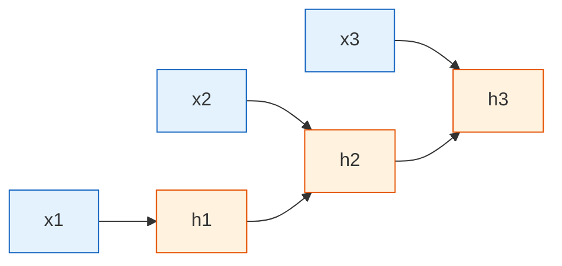

# RNNの基礎


:::tip この節の位置づけ
前の MLP や CNN は「静的な入力」を扱うのが得意でしたが、RNN が解決したいのは別の種類の問題です。

> **入力はただの静的な特徴のかたまりではなく、順序を持ったデータ列である。**

たとえば、1つの文、時系列データ、ログの並び、ユーザー行動の列などです。
:::

## 学習目標

- なぜ系列タスクは普通の MLP だけでは解けないのかを理解する
- RNN の隠れ状態（hidden state）を直感的に理解する
- RNN が時間方向に展開される仕組みを読み取れるようになる
- 最小限の RNN 計算を手で追えるようになる
- PyTorch の `nn.RNN` の入力・出力の形を理解する
- RNN の強みと限界を理解し、次の LSTM / GRU の準備をする

---

## この節と前の MLP / CNN はどうつながるのか

もし前の章から来たなら、まずはこう理解するとよいです。

- MLP と CNN は、どちらかというと「今この入力」を処理する
- RNN は「今の入力 + これまでの状態」を明示的に扱い始める

つまり、RNN のいちばん重要な新しさは「循環構造がかっこいい」ことではなく、

- モデルが最も基本的な「記憶」を持つようになる

という点です。

## 1. なぜ系列タスクはもっと難しいのか？

### 1.1 順序そのものが情報になる

次の2つの文を見てください。

- 「私はこの授業が好きではない」
- 「私はこの授業が好きで、難しくない」

単語の出現だけを数えるなら、どちらにも次のような語が出てきます。

- 私は
- 好き
- この授業

でも、意味を決めるのは順序と文脈です。

時系列データでも同じです。

- 1日目の売上は低い、2日目に上がる、3日目に急増する

ここでも、ただの独立した数字の集まりではなく、変化の過程になっています。

つまり系列タスクの難しさは「データが多いこと」ではなく、

> **前の情報が後の理解に影響すること**

にあります。

### 1.3 RNN を初めて学ぶとき、まずつかむべきもの

最初に覚えるべきなのは公式ではなく、この一文です。

> **系列タスクでは、位置と順序そのものが情報である。**

この感覚が安定すると、後でなぜ以下が必要になるのかも自然に見えてきます。

- hidden state
- 時間展開
- LSTM / GRU

### 1.2 なぜ MLP はこの問題が苦手なのか？

MLP は固定長ベクトルを出力に変換できますが、自然に次のことを覚えるわけではありません。

- 1個目の単語と8個目の単語の関係
- 現在の値と過去の傾向の関係
- 以前に何を見たか、今何を残すべきか

これは、文を読むたびに強制的に「忘却」してしまうようなものなので、長い系列を理解するのは難しくなります。

---

## 2. RNN の核心アイデア：1歩読むたびに少しずつ「記憶」を持つ

### 2.1 隠れ状態とは何か？

RNN の中心となる設計は隠れ状態 `h_t` です。

これは次のように理解できます。

> **モデルが今のステップを読んだときに、頭の中に一時的に残している情報**

新しい入力 `x_t` が来るたびに、モデルは以下を組み合わせます。

- 現在の入力 `x_t`
- 1つ前の時刻の記憶 `h_{t-1}`

そして、新しい記憶 `h_t` を計算します。

### 2.2 覚えやすい例え

RNN は、誰かの話を聞きながらメモを取る様子に似ています。

- 今聞いた新しい内容 = `x_t`
- すでに書いてある重要点 = `h_{t-1}`
- 更新後のメモ = `h_t`

この「読みながら更新する」流れが、RNN の本質です。

### 2.3 隠れ状態をどう誤解しやすいか？

初心者は `h_t` を「正確な記憶」と考えがちです。  
でも、より適切な理解は次の通りです。

- 過去を一字一句そのまま保存するものではない
- 過去情報を圧縮した要約に近い

だからこそ、普通の RNN は問題を抱えやすいのです。

- 系列が長くなると、かなり前の重要情報をうまく保持できない

---

## 3. RNN は時間上でどう展開されるのか？

### 3.1 同じパラメータを、各時間ステップで繰り返し使う

RNN は、時間ごとに別々のパラメータを作るわけではありません。  
やることは次のとおりです。

> 同じパラメータを使って、系列の各位置を何度も処理する。



### 3.2 なぜ「パラメータ共有」が重要なのか？

文が5語でも50語でも、モデルは同じやり方で処理できます。  
これが、RNN が長さの違う系列を扱える重要な理由の1つです。

### 3.3 時間展開で最初に理解すべきこと

最初から難しい図として見る必要はありません。  
まずは次の1点だけ押さえれば十分です。

- 見た目はたくさんの箱が並んでいる
- 本質は、時間ステップごとに同じパラメータを繰り返し使っていること

これが、RNN が変長系列を扱えるのに、位置が増えるたびに新しいパラメータセットを増やさなくてよい理由です。


:::tip 図の読み方
この図は左から右へ読めます。各時間ステップで、現在の入力 `x_t` と古い記憶 `h_{t-1}` から新しい記憶 `h_t` を作ります。RNN の本質は「循環が複雑」なのではなく、1歩読むたびに圧縮要約を更新していることです。
:::

---

## 4. 最小の手計算例：隠れ状態を1歩ずつ計算する

### 4.1 まずは最も簡単な式

最もシンプルな RNN は次のように書けます。

> `h_t = tanh(W_x * x_t + W_h * h_{t-1} + b)`

ここで：

- `x_t`：現在の入力
- `h_{t-1}`：1つ前の記憶
- `h_t`：現在の新しい記憶

### 4.2 実行できる例

```python
import numpy as np

# 長さ 4 の入力系列
x_seq = [1.0, 0.5, -1.0, 2.0]

W_x = 0.8
W_h = 0.5
b = 0.1

h = 0.0  # 初期隠れ状態

for t, x_t in enumerate(x_seq, start=1):
    h = np.tanh(W_x * x_t + W_h * h + b)
    print(f"step={t}, x_t={x_t:.1f}, h_t={h:.4f}")
```

### 4.3 このコードは何を教えているのか？

これは本物の大規模モデルを再現するためではなく、次のことを理解するためのものです。

- RNN は毎ステップ、前のステップに依存する
- 隠れ状態は更新され続ける
- 現在の出力は、現在の入力だけでなく「現在の入力 + 過去の要約」に依存する

この3点がわかれば、RNN の核心はつかめています。

### 4.4 まず手で追うとき、何を見ればよいか？

最初は次の3つだけを追うのがおすすめです。

- 現在の入力 `x_t`
- 1つ前の隠れ状態 `h_{t-1}`
- 新しい隠れ状態 `h_t`

つまり、「入力 + 古い記憶 -> 新しい記憶」という流れを先に感覚でつかむほうが、記号をたくさん覚えるより大切です。

---

## 5. RNN の入力と出力にはどんな種類があるのか？

### 5.1 Many-to-one: 系列全体から1つの結果を出す

代表的なタスク：

- 感情分類
- スパム判定
- 行動予測

入力：

- 単語の列 / 1つの系列

出力：

- 1つのクラス

### 5.2 Many-to-many: 各ステップごとに出力する

代表的なタスク：

- 系列ラベリング
- 品詞タグ付け
- 名前付き実体認識

入力：

- 単語の列

出力：

- 各単語に1つずつラベル

### 5.3 Sequence-to-sequence: 1つの系列を別の系列に変換する

代表的なタスク：

- 機械翻訳
- 要約生成

これは後の Seq2Seq の章で詳しく説明します。

---

## 6. PyTorch で RNN はどう使うのか？

### 6.1 最小の実行例

```python
import torch

torch.manual_seed(42)

# batch=2, seq_len=5, input_size=4
x = torch.randn(2, 5, 4)

rnn = torch.nn.RNN(
    input_size=4,
    hidden_size=6,
    batch_first=True
)

out, h = rnn(x)

print("x shape   :", x.shape)
print("out shape :", out.shape)
print("h shape   :", h.shape)
```

### 6.2 それぞれの shape は何を意味するのか？

入力：

- `x.shape = [2, 5, 4]`
- 2個のサンプルがある
- 各サンプルの長さは5
- 各時間ステップの特徴量は4次元

出力：

- `out.shape = [2, 5, 6]`
- 各時間ステップごとに6次元の隠れ表現が出る

最終隠れ状態：

- `h.shape = [1, 2, 6]`
- 先頭の `1` は層数を表す（ここでは1層）
- 2つ目の次元 `2` は batch
- 3つ目の次元 `6` は隠れ状態の次元

### 6.3 `out` と `h` の違いは？

- `out`：各時間ステップの出力をすべて保持する
- `h`：最後の時間ステップの隠れ状態

many-to-one の分類タスクでは、最後の `h` あるいは `out[:, -1, :]` をそのまま分類に使うことが多いです。

---

## 7. タスクに少し近い例：系列分類

次は、小さなタスクをシミュレーションしてみます。

- 数字の列を入力する
- 全体の傾向が「正寄り」か「負寄り」かを判定する

```python
import torch
from torch import nn

torch.manual_seed(42)

# 4つの系列、それぞれ長さ5、各ステップ1次元
X = torch.tensor([
    [[1.0], [1.2], [1.3], [1.1], [1.0]],
    [[-1.0], [-1.1], [-1.3], [-0.9], [-1.2]],
    [[0.8], [0.7], [1.0], [0.9], [1.1]],
    [[-0.6], [-0.7], [-0.9], [-1.0], [-0.8]]
])

y = torch.tensor([1, 0, 1, 0])

class SimpleRNNClassifier(nn.Module):
    def __init__(self):
        super().__init__()
        self.rnn = nn.RNN(input_size=1, hidden_size=8, batch_first=True)
        self.fc = nn.Linear(8, 2)

    def forward(self, x):
        out, h = self.rnn(x)
        last_hidden = out[:, -1, :]
        return self.fc(last_hidden)

model = SimpleRNNClassifier()
loss_fn = nn.CrossEntropyLoss()
optimizer = torch.optim.Adam(model.parameters(), lr=0.05)

for epoch in range(100):
    pred = model(X)
    loss = loss_fn(pred, y)

    optimizer.zero_grad()
    loss.backward()
    optimizer.step()

    if epoch % 20 == 0:
        print(f"epoch={epoch:3d}, loss={loss.item():.4f}")

with torch.no_grad():
    result = model(X).argmax(dim=1)
    print("予測:", result.tolist())
    print("正解:", y.tolist())
```

この例はとても小さいですが、次のことを教えてくれます。

> RNN は1ステップごとに分類するのではなく、系列全体から少しずつ情報をためて、最後に判断する。

---

## 8. なぜ RNN は後に LSTM / GRU や Transformer に押されていったのか？

### 8.1 主な問題：長距離依存が難しい

理論上、RNN は長く記憶できます。  
でも実際の学習では、次の問題がよく起こります。

- 勾配消失
- 勾配爆発
- 前の情報がすぐに薄まる

たとえば、とても長い文では、最初の情報が最後までうまく保てないことがあります。

### 8.2 学習の並列化もしづらい

RNN は順番に計算する必要があります。

- 5ステップ目は4ステップ目を待つ
- 4ステップ目は3ステップ目を待つ

そのため、長い系列では効率があまりよくありません。

だからこそ、

- まず LSTM / GRU が改良として登場し
- その後 Transformer が根本的に別の考え方を持ち込みました


:::tip 図の読み方
この図では、2本の減衰線に注目してください。1本は、早い時点の情報が隠れ状態の中でだんだん薄くなることを表し、もう1本は、逆伝播した勾配が早い時間ステップに届くほど弱くなることを表しています。LSTM/GRU と Transformer は、どちらもこの2つの問題に応えるための方法です。
:::

それでも RNN を学ぶ価値はあります。  
なぜなら、系列モデリングの底にある直感をきちんと理解できるからです。

---

## 9. 初学者がよくつまずくポイント

### 9.1 入力の shape がどうなるのか分からない

PyTorch で最もよくあるのは、次を混同することです。

- `batch_first=True`
- `batch_first=False`

`batch_first=True` の場合、入力は通常次の形です。

- `[batch, seq_len, input_size]`

### 9.2 `out` と `h` の違いが分からない

覚え方はシンプルです。

- `out` は各ステップを見る
- `h` は最後のまとめを見る

### 9.3 RNN は自然に長い履歴を覚えられると思ってしまう

理論上は可能でも、実際にはうまくいかないことが多いです。  
これが後で LSTM / GRU を学ぶ理由です。

---

## まとめ

この節で本当に持ち帰ってほしいのは API ではなく、次の3つの安定した直感です。

1. RNN は系列問題のために設計されている。順序そのものが情報だから
2. 隠れ状態とは、モデルが「読みながら覚えている」もの
3. RNN の本質は、同じパラメータを時間方向に何度も使いながら状態を更新すること

この3つを理解できれば、次に LSTM、Seq2Seq、注意機構を学ぶときも、ずっとスムーズになります。

---

## 練習

1. 手計算の RNN 例で `W_x` と `W_h` を変えて、隠れ状態がどう変わるか観察してみましょう。
2. PyTorch の例で `hidden_size` を 6 から 12 に変えて、shape がどう変わるか見てみましょう。
3. 分類例の系列を自分で作ったデータに置き換えて、簡単な傾向分類を作ってみましょう。
4. 考えてみましょう：なぜとても長い文では、RNN は「読めば読むほど最初を忘れやすい」のか？
