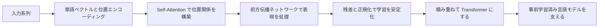

# 学習ガイド：Transformer という章で何を学ぶのか

この章で解決するのは、とても重要な問題です。なぜ現代の NLP、大規模モデル、そして多くのマルチモーダルシステムが、Transformer を避けて通れないのか、ということです。

前の章でニューラルネットワーク、CNN、RNN を学んで、「深層学習モデルはさまざまな種類のデータを扱える」ことが分かったなら、この章で理解したいのは、データがテキストのような系列のとき、なぜモデルに全体の関係を捉えやすい構造が必要になるのか、という点です。

## この章がコース全体の中でどこにあるのか

あなたはすでにニューラルネットワークの基礎、PyTorch、CNN、RNN を学んできました。Transformer の章に入ると、このコースは従来の深層学習モデルから、大規模モデル時代の中核となる構造へと進みます。

RNN の直感は「読みながら覚える」です。系列処理の基本的な考え方を説明するのに向いていますが、長文、並列学習、長距離依存でははっきりとした限界があります。Transformer の大きな変化は、情報を順番にだけ渡すのではなく、各位置が関連性に応じて他の位置を直接参照できるようにしたことです。

## この章が本当に解決したい問題

この章では、いきなり数式を追うのではなく、まず構造の直感を作ります。RNN がなぜ不十分なのか、Attention 機構がなぜ現在位置から他の位置を「見る」ことを可能にするのか、Q/K/V がそれぞれどんな役割を持つのか、Self-Attention がなぜテキストに向いているのか、Transformer がなぜ多頭注意力、前方伝播ネットワーク、残差接続、LayerNorm、位置エンコーディングなどのモジュールを組み合わせる必要があるのかを理解しましょう。

最初は概念が多く見えますが、どれも同じ目的のために働いています。それは、系列を処理するときに、モデルが局所情報を見られるだけでなく、全体の関連も作れ、しかもより効率的に並列学習できるようにすることです。

## 初学者におすすめの学習順序

最初は RNN の弱点から見るのがおすすめです。いきなり Transformer の構造図に飛び込まないようにしましょう。まず問いかけてみてください。文が長いとき、前の単語は後ろの単語にどう影響するのか。もし毎回、前のステップの計算が終わるのを待たなければならないなら、学習はとても遅くならないか。こうした疑問が分かると、Attention はずっと自然に理解できます。

次に、Q/K/V の直感を重点的に押さえましょう。Query は「何を探したいか」、Key は「どんな特徴がマッチできるか」、Value は「実際に渡したい情報」と考えると理解しやすいです。最後に Transformer 全体の構造を見ると、なぜ 1 つの Attention 層だけでなく、モジュールを積み重ねる必要があるのかが分かりやすくなります。

## この章で押さえるべき主線

この章の主線は、一言で言えば「系列モデリングが“順番に渡す”方式から“全体の関連を捉える”方式へ進化した」ということです。

この流れが分かると、後で BERT、GPT、事前学習、Prompt、微調整、RAG、Agent を学ぶときに、土台となるモデル能力は突然生まれるものではなく、Transformer の表現力とコンテキスト関係のモデリング能力の上に成り立っていることが分かります。

## この章と後続章の関係

Transformer は第 6 章と第 7 章のあいだをつなぐ橋です。第 6 章では深層学習の構造として扱い、第 7 章では大規模モデルの原理を支える土台になります。後で事前学習済み言語モデルを学ぶとき、BERT と GPT の違いは、本質的には Transformer の Encoder、Decoder、学習目標、使い方の違いに戻っていきます。

この章をしっかり学ばないと、後でよくあるつまずきは次のようになります。GPT が強いのは知っていても、コンテキストがどうモデル化されるのかが分からない。Attention という言葉は知っていても、それがなぜ RNN の制約を解決するのかが分からない。モデル API は使えても、token、コンテキスト長、Embedding、推論コストの関係を理解しにくい、という状態です。

## 初学者と上級者はどう読むべきか

初学者がこの章を学ぶときは、まず主線と最小実行例をつかむことに集中しましょう。すべての細部を一度に理解する必要はありません。この章が何を解決するのか、入力と出力は何か、最小プロジェクトをどう動かすのかを説明できれば、先に進んで大丈夫です。

経験のある学習者は、この章を抜け漏れの確認と実践的な練習の場として使えます。境界条件、失敗例、評価方法、コードの再現性、そして前後の章とのつながりに注目しましょう。読み終えたら、この章の内容を自分の作品の README や実験記録にまとめておくとよいです。

## 学習時間と難易度の目安

| 学習方法 | おすすめの投入時間 | 目標 |
|---|---|---|
| ざっと読む | 20～30 分 | この章が何を解決するのかを理解し、後でどこに使うのかを知る |
| 最小突破 | 1～2 時間 | 最小例を動かし、この章の小さな到達点を終える |
| じっくり練習 | 半日～1 日 | エラー分析、比較実験、またはプロジェクト README の記録を補強する |

## 本章の自己チェック問題

| 自己チェック問題 | 合格基準 |
|---|---|
| この章は何を解決するのか？ | コース全体の中での位置を 1 文で説明できる |
| 最小の入力と出力は何か？ | 例に何を入力し、どんな結果が出るかを説明できる |
| よくある失敗点はどこか？ | エラー、精度低下、理解のずれの原因を少なくとも 1 つ挙げられる |
| 学習後に何を残せるか？ | 本章の成果を README、実験記録、または作品集に書ける |

## 本章の小さな到達点

この章を学び終えたら、「手書き Attention の直感デモ」または「小規模なテキスト分類実験」をやってみるのがおすすめです。前者は、簡単な行列を使って 1 つの単語が他の単語にどのように Attention 重みを配るかを示せます。後者は、既存のフレームワークを使って Transformer/BERT のテキスト分類例を動かし、入力 token、attention mask、モデル出力、評価結果を重点的に記録します。

プロジェクトの目的は、大規模モデルをゼロから学習することではありません。Transformer の中核となる情報の流れを、きちんと説明できるようになることです。

## 合格基準

この章の終わりには、RNN と Transformer の主な違いを説明でき、Attention と Self-Attention が何をしているのかを平易な言葉で説明でき、Q/K/V の役割分担を説明でき、さらに Transformer とその後の BERT、GPT、大規模モデルの主線をつなげられるようになっているはずです。

「入力 token → embedding → attention → transformer block → 出力表現」の流れを描けて、それぞれの段階が大まかに何を解決しているかを説明できれば、大規模モデルの原理段階へ進むための基礎条件は満たしています。
