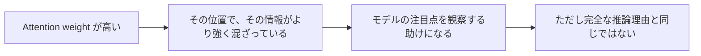

# Attention機構


:::tip この節の位置づけ
RNN が「順番に読みながら覚える」ものだとしたら、Attention機構は別の考え方です：

> **今読んでいる語が、文全体のどこを一番参考にすべきかを、すぐに見にいく。**

これが Transformer が台頭した根本理由のひとつです。
:::

## 学習目標

- シーケンスモデリングに Attention 機構が必要な理由を理解する
- Query / Key / Value を直感的に理解する
- 最小の Attention 例を手計算できる
- Self-Attention、Multi-Head、Mask の役割を理解する
- PyTorch の `MultiheadAttention` を読めるようになる

## 初心者はまずここ / 上級者はここから深掘り

初心者なら、この節ではまず一言をつかんでください。Attention は、今の語が自分を理解するために、文全体の中でどの語が関連しているかを見にいく仕組みです。Q/K/V の式をすぐに暗記しようとせず、まずは「関連度スコア -> softmax の重み -> 重み付き集約」という流れを理解しましょう。

すでに経験があるなら、さらに次の点に注目するとよいです。Q/K/V の行列形状、なぜ `sqrt(d_k)` で割るのか、Mask が未来を見ないためにどう働くか、Multi-Head Attention がなぜ複数の部分空間から関係を見られるのか、です。

---

## 歴史的背景：Transformer はどの論文から来たのか？

この節でぜひ知っておきたい歴史的ポイントは次のとおりです。

| 年 | 論文 | 主要著者 | 最も重要な解決点 |
|---|---|---|---|
| 2017 | *Attention Is All You Need* | Vaswani ら | Self-Attention を RNN の主流構成に置き換え、並列学習能力を大きく改善し、長距離依存の情報経路を短くした |

初心者にとって、まず覚えるべきなのは著者名ではなく、この一文です：

> **Transformer が重要なのは、ただ「強い」からではなく、系列モデリングを「順番に伝える」から「直接グローバルに結びつける」へ変えたからです。**

この節で見る Attention は、単なる小さなテクニックではなく、  
Transformer 路線そのものの心臓部です。

---

## この節は RNN の流れとどうつながるのか

### まずは物語で考える：読解では最後の一文だけを覚えているわけではない

読解問題で「文中の『彼』は誰を指しますか？」と聞かれたとき、最後の単語だけを見ることはありません。文全体、場合によっては段落全体に戻って手がかりを探します。どの名前、どの動作がその「彼」と一番関係しているかを見て、そこに注意を向けます。

RNN は情報を順番に一歩ずつ伝えるので、長距離の情報は弱くなりがちです。Attention機構は、今の位置からすべての位置を直接見て、それぞれに違う重みを与えることを許します。こうすることで、モデルは文全体を固定長の記憶に押し込む必要がなくなります。

RNN を学び終えたばかりなら、この節は次のように捉えるとよいです。

- RNN は「順番に読みながら覚える」
- Attention は「今の位置が、全体の中で最も関連する部分を見る」

この節で新しく重要になるのは、式そのものよりも次の点です。

- 今の位置は、もう一歩ずつ伝わってきた hidden state だけに依存しない
- 代わりに、遠い位置との関係を直接作れる

## 一、なぜ Attention 機構が必要なのか？

### 1.1 まず Seq2Seq の弱点を見る

初期の Encoder-Decoder 構造は、よく次のように動きます。

1. Encoder が入力文全体を固定長ベクトルに圧縮する
2. Decoder がそのベクトルをもとに出力を生成する

問題は次の通りです。

> 文全体の情報を 1 つの固定ベクトルに押し込むと、長い文では情報がとても失われやすい。

たとえばこの文を翻訳する場面を考えてみましょう。

> 「このレストランは場所はかなり不便だけど、店主がとても親切で、量も多く、値段も妥当なので、私はまた行きたいと思っている。」

モデルが後半を生成するときに、前半の「店主がとても親切」を思い出す必要があるなら、固定ベクトルでは柔軟さが足りないことが多いです。

### 1.2 Attention の核心的な改善

Attention機構はこう言います。

> 文全体を 1 点に圧縮しないでください。あるステップを処理するとき、その時点に関連する部分を文全体から直接見にいきましょう。

これは読解問題で答えるときに、文章を丸暗記してから答えるのではなく、

- 問題を読む
- 元の文章に戻る
- 一番関係のある文を探す

という流れに似ています。これが Attention の直感です。

### 1.3 この節で最初に掴むべきことは QKV ではなく「なぜ変えるのか」

つまり、まず Q / K / V を覚えようとしないでください。  
先に次の問題をはっきりさせます。

- 固定長ベクトルだと情報が失われる
- 長距離依存は一歩ずつの伝達だけでは難しい

だから、モデルにはもっと柔軟な「いつでも振り返る」仕組みが必要です。

この問題意識ができていれば、その後の QKV も単なる暗記問題にはなりません。

---

## 二、Query / Key / Value とは何か？

ここは多くの人が最初に混乱するところです。

### 2.1 資料検索の比喩

資料庫で情報を探すところを想像してください。

- **Query（クエリ）**：今あなたが探しているもの
- **Key（索引）**：各資料が「自分はどんな内容と関係があるか」を示す目印
- **Value（値）**：実際に取り出して使う内容

Attention の流れはこう理解できます。

1. Query を使ってすべての Key と照合する
2. 照合が強いほど、関連性が高い
3. 関連度に応じて対応する Value を重み付きで集約する

### 2.2 一言でいうと

> **Q は質問、K は照合される側、V は中身を提供する側。**

### 2.3 初学者が最初につまずきやすい点は何か？

多くの場合、英語を覚えられないことではなく、

- なぜ 3 つに分ける必要があるのか

が分からないことです。

より安定した理解は次の通りです。

- `Q` は「今、何を気にしているか」を決める
- `K` は「自分はどんな内容か」を表す
- `V` は「実際に取り出されて混ざる内容」を表す

まずこの役割分担を理解してから、あとで行列形式を見るとずっと楽になります。


:::tip 図の読み方
この図は資料検索として読むと分かりやすいです。`Q` は今あなたが尋ねたい質問、`K` は各資料に貼られた索引ラベル、`V` は実際に取り出す内容です。Attention はまず `Q` とすべての `K` を使ってスコアを出し、その重みで `V` を混ぜます。
:::

---

## 三、最小の動く例：Attention を手計算してみる

### 3.1 まずコードを見よう

```python
import numpy as np

# token が 3 個あるとする
X = np.array([
    [1.0, 0.0],   # token1
    [0.0, 1.0],   # token2
    [1.0, 1.0]    # token3
])

# 教育用に単純化して、Q K V をすべて X とする
Q = X
K = X
V = X

scores = Q @ K.T
scaled_scores = scores / np.sqrt(K.shape[1])

def softmax(row):
    e = np.exp(row - row.max())
    return e / e.sum()

weights = np.apply_along_axis(softmax, 1, scaled_scores)
output = weights @ V

print("scores =\n", np.round(scores, 3))
print("weights =\n", np.round(weights, 3))
print("output =\n", np.round(output, 3))
```

### 3.2 最初の重要ポイント：`Q @ K.T`

これは次を計算しています。

> 今の token と他の token はどれくらい関連しているか

2 つのベクトルの向きが近いほど、dot product は大きくなりやすいです。

### 3.3 次のステップ：softmax

softmax はこの関連スコアを確率分布に変えます。

- 合計は 1 になる
- 「どれくらい注目するか」の重みとして使える

### 3.4 3 番目のステップ：`weights @ V`

これは次の意味です。

> 今の token だけを見るのではなく、関連度に応じてすべての token の情報を重み付きで混ぜる。

これによって新しい表現が得られます。

### 3.5 なぜこれが Transformer 台頭の根本能力の 1 つなのか？

Transformer が初めて自然に実現したのは、まさに次のことです。

- 今の位置の表現は、自分自身だけで決まらない
- 「自分 + 他の位置との関連度」によって決まる

つまりモデルは、次のような関係をより柔軟に作れます。

- 長距離依存
- 複数位置の相互作用
- グローバルな文脈

---

## 四、なぜ「スケーリング」するのか？

### 4.1 スケールド・ドット積 Attention の式

Transformer でよく使われる式は次です。

> `Attention(Q, K, V) = softmax(QK^T / sqrt(d_k)) V`

ここでの `sqrt(d_k)` がスケーリング項です。

### 4.2 なぜこの数で割るのか？

次元が大きくなると、dot product の値が大きくなりやすく、softmax が尖りすぎることがあります。

- ある位置の重みだけが非常に大きい
- 他の位置はほとんど 0 に近い

すると学習が不安定になりやすいです。

そこでスケーリングして、スコアを少し穏やかにします。

つまり、

> ベクトルの次元が大きいほど dot product は自然に“興奮”しやすいので、先に少し温度を下げる

と考えるとよいです。

---

## 五、Self-Attention とは何か？

### 5.1 Self-Attention の要点

Query / Key / Value がすべて同じ入力から来るとき、それを self-attention と呼びます。

つまり、

> シーケンスの各位置が、同じシーケンス内の他の位置を見にいける

ということです。

たとえばこの文を見てください。

> 「小王はボールを小李に渡した。なぜなら彼は受け取りがとても上手だったからだ。」

この「彼」が誰を指すかを判断するには、前の語を見る必要があります。

Self-Attention は、こうした関係を直接作れます。

### 5.2 RNN との違い

RNN:

- 時間に沿って一歩ずつ伝える

Self-Attention:

- 今の位置が全体を直接見る

これが Transformer が長距離依存に強い理由の 1 つです。

### 5.3 Self-Attention で最初に覚えるべきなのは名前ではなく能力の境界

まず覚えるべきことは次です。

- 各位置が、系列全体を直接見られる

この一文はとても重要です。なぜなら RNN の弱点ときれいに対応しているからです。

- RNN はメッセージを一歩ずつ送る
- Self-Attention は全体の関連を一度に作る

---

## 六、Mask は何のためにあるのか？

### 6.1 なぜ生成タスクでは mask が必要なのか？

言語生成では、現在の位置を予測するときに未来の語を見てはいけません。

たとえば次を予測する場面を考えます。

> 「私は ___ が好きだ」

もしモデルがすでに後ろの正解を見ていたら、学習は不正確になります。

そのため decoder の self-attention では、しばしば **causal mask** を使います。

### 6.2 最小の mask 例

```python
import numpy as np

scores = np.array([
    [2.0, 1.0, 0.5],
    [1.2, 2.1, 0.7],
    [0.8, 1.3, 2.2]
])

# 下三角は見える、上三角は隠す
mask = np.array([
    [1, 0, 0],
    [1, 1, 0],
    [1, 1, 1]
])

masked_scores = np.where(mask == 1, scores, -1e9)

def softmax(row):
    e = np.exp(row - row.max())
    return e / e.sum()

weights = np.apply_along_axis(softmax, 1, masked_scores)

print("masked weights =\n", np.round(weights, 3))
```

これを見ると次のことが分かります。

- 1 番目の位置は自分だけを見る
- 2 番目の位置は最初の 2 つだけを見る
- 3 番目の位置は最初の 3 つを見る

### 6.3 なぜ mask は最初に理解すべきなのか？

生成タスクに入ると、mask を理解していないと次の点が分からなくなりやすいからです。

- なぜ学習時に未来を見てはいけないのか
- なぜ decoder と encoder で Attention の振る舞いが違うのか

つまり mask は細かい話ではなく、**生成タスクがルール通りに学習されているか** に直結します。


:::tip 図の読み方
この図では下三角行列に注目してください。1 番目の位置は自分だけを見られ、2 番目の位置は自分と過去だけを見られ、以降も同じです。生成タスクで causal mask を付けないと、試験中に後ろの答えを先に見てしまうのと同じです。
:::

---

## 七、なぜ Multi-Head Attention なのか？

### 7.1 1 つの head で足りないのは、計算力ではなく見え方

単一の Attention head だと、1 種類の関係しか学べないことがあります。  
Multi-Head Attention の考え方は次の通りです。

> モデルに複数の部分空間、複数の角度から関係を見させる。

たとえば各 head がそれぞれ次のことを強く見るかもしれません。

- 文法関係
- 位置関係
- 主語・述語・目的語の関係
- 長距離依存

### 7.2 直感的な比喩

Multi-Head Attention は、会議にいろいろな役割の人を呼ぶようなものです。

- 文法を見る人
- 意味を見る人
- 構造を見る人

最後にそれらを合わせると、より全体像がはっきりします。

---

## 八、PyTorch の `MultiheadAttention`

### 8.1 最小の動く例

```python
import torch
from torch import nn

torch.manual_seed(42)

# seq_len=4, batch=2, embed_dim=8
x = torch.randn(4, 2, 8)

attn = nn.MultiheadAttention(
    embed_dim=8,
    num_heads=2,
    batch_first=False
)

out, weights = attn(x, x, x)

print("input shape :", x.shape)
print("output shape:", out.shape)
print("weights shape:", weights.shape)
```

### 8.2 出力の shape の見方

- `out.shape = [4, 2, 8]`
  - 各位置に対して新しい 8 次元表現が出る

- `weights.shape = [2, 4, 4]`
  - 2 つの batch
  - 各 batch に `4x4` の Attention 行列がある

つまり、

> 各位置が、系列中のすべての位置に注意重みを配っている

ということです。

---

## 九、Attention 機構は何を本当に解決したのか？

まとめると、次の 3 つです。

1. 情報を 1 本の経路で順番に伝える必要がなくなった
2. 今の位置が全体の文脈を直接使えるようになった
3. 並列計算しやすくなった

この 3 つが合わさって、Transformer は非常に強力になりました。

---

## 十、よくある誤解：Attention 重みをそのまま「最終的な説明」とみなすこと

Attention 重みは分かりやすいので、初心者はつい「重みが高い = モデルが本当にその理由で理解した」と考えがちです。ただし、これは慎重に扱うべきです。

Attention 重みが示しているのは、その層、その head、その位置での計算において、どの token により高い重みが与えられたか、ということです。情報の混ざり方を理解する助けにはなりますが、完全な因果的説明と同一視してはいけません。



そのため、最初に Attention の可視化を見るときは、「この head はこの層でこれらの位置をより強く見ている」と言うのが一番安全です。  
「だからモデルはこの単語を理由に結論を出した」と直接断定するのは避けましょう。

---

## 十一、この節の学習サイクル

この節を終えたら、次の表で自己チェックできます。

| レベル | できるようになること |
|---|---|
| 直感 | なぜ Attention が固定ベクトルより長い文に向いているか説明できる |
| コード | `Q @ K.T`、softmax、`weights @ V` の役割を読める |
| 構造 | self-attention、mask、multi-head がそれぞれ何を解決するか分かる |
| 次への接続 | なぜ Transformer、大規模モデル、マルチモーダルモデルが Attention を必要とするか説明できる |

---

## 十二、初心者がよくハマる落とし穴

### 12.1 Q / K / V を謎の変数だと思ってしまう

まずは「質問 / 索引 / 内容」と理解すれば十分です。

### 12.2 数式だけ見て shape を見ない

Attention の章で一番つまずきやすいのは shape です。  
次の 3 つを必ず意識してください。

- シーケンス長
- embedding 次元
- head 数

### 12.3 Attention は何でも理解できる魔法だと思う

Attention 機構は強力ですが、自動的に推論してくれる魔法ではありません。  
本質はあくまで次です。

- 関連度のスコア付け
- softmax
- 重み付き和

この点を理解しておくと、後で Transformer を学ぶときにずっと安心です。

---

## まとめ

この節で最も大事なのは、式を丸暗記することではなく、次の直感をつかむことです。

> **Attention 機構は、モデルが今この瞬間に、入力全体の中で最も関連する部分を選んで見にいけるようにする。**

これこそが、Transformer、大規模モデル、マルチモーダルモデルが文脈モデリング能力を大きく高められる核心です。

---

## 十三、練習問題

1. 最小の Attention 例の `Q / K / V` を変えて、重みがどう変わるか観察してください。
2. mask の例をもっと長いシーケンスに変えて、未来の位置がどのように隠されるか見てみてください。
3. 自分の言葉で説明してみましょう。なぜ self-attention は単純な RNN より長距離依存を扱いやすいのですか？
4. ある token への Attention が全位置でほぼ同じだったら、普通は何を意味するでしょうか？
