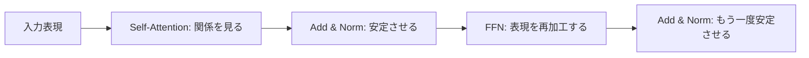
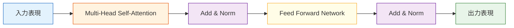

# Transformer アーキテクチャ


:::tip この節の位置づけ
前の節で、注意機構が Transformer の中心だと学びました。  
この節では、その中心とほかの要素をつなぎ合わせて、全体の仕組みを見ていきます。

> **1つの Transformer Block は、いったいどんな部品でできていて、なぜその順番で並んでいるのでしょうか？**

この節を理解すると、GPT、BERT、T5 などのモデルを見たときに、ただ名前を覚えるだけで終わらなくなります。
:::

## 学習目標

- Transformer Block の標準的な構造を理解する
- 残差接続、LayerNorm、フィードフォワードネットワークの役割を理解する
- encoder-only、decoder-only、encoder-decoder の3つの主な系統を区別する
- 位置エンコーディングがなぜ必要かを理解する
- 最小限の Transformer エンコーダーの例を読めるようになる

---

## まずは全体の地図を作ろう

Transformer のアーキテクチャは、「1つの block の中で誰が何を担当しているか」で考えると理解しやすくなります。



この節で本当に理解したいのは次の点です。

- 注意機構以外に、Transformer の残りのモジュールは何を補っているのか
- なぜ GPT、BERT、T5 は見た目が完全に同じではないのに、骨組みはよく似ているのか

---

## 一、Transformer は「注意機構」だけではない

### 1.1 よくある誤解

Transformer と聞くと、多くの人は次のものだけを思い浮かべます。

- self-attention
- Q/K/V
- multi-head

でも、実際の Transformer Block は「注意機構だけ」でできているわけではありません。

典型的な block には、少なくとも次の要素も含まれます。

- 残差接続（Residual）
- 層正規化（LayerNorm）
- フィードフォワードネットワーク（Feed Forward Network, FFN）

### 1.2 なぜこんなに多くの要素が必要なのか？

注意機構は「関係を作る」のが得意ですが、安定して学習できる大規模モデルにするには、次のような性質も必要です。

- 勾配が流れやすいこと
- 数値分布が安定していること
- より強い非線形変換ができること

そこで、ざっくり言うと次のように覚えるとよいです。

> 注意機構は「どこを見るか」を担当し、FFN は「どうさらに加工するか」を担当し、残差と正規化は「全体を安定させる」役割を持ちます。

### 1.3 初学者向けのたとえ

1つの Transformer Block は、次のような仕事チームだと考えるとわかりやすいです。

- まず会議して情報を共有し
- 次にメモを整理し
- さらに深く加工して
- 最後にもう一度整える

この中で：

- Attention は、みんなで情報をやり取りする部分
- FFN は、受け取った情報を各自で加工する部分
- 残差と正規化は、流れが崩れすぎないようにする部分

こう考えると、Transformer は

- ただ神秘的な層が積み重なったもの

ではなくなります。


:::tip 図の読み方
この図は、役割で読むのがおすすめです。Attention は文脈を混ぜる役割、Residual は元の情報を保つ役割、LayerNorm は数値を安定させる役割、FFN は各位置を再加工する役割です。Transformer は注意機構だけでなく、それを深く積めて学習しやすくするための仕組み全体です。
:::

---

## 二、Encoder Block はどんな形をしているのか？

### 2.1 構造図



### 2.2 わかりやすく言うと

各 block では、次の順番で処理が進みます。

1. self-attention で全体の関係を見る
2. 入力を足し戻して正規化する
3. 位置ごとの FFN に通す
4. その結果をまた足し戻して正規化する

これが Transformer エンコーダー block の基本的な流れです。

### 2.3 初学者がまず覚えるとよい役割表

| モジュール | まず覚えるべき役割 |
|---|---|
| Self-Attention | シーケンスの中で、どれとどれが関連しているかを見る |
| Residual | 元の情報を失わないようにする |
| LayerNorm | 表現を安定させる |
| FFN | 各位置をもう一度非線形に加工する |

この表は、1つの block を「図」ではなく「役割の言葉」に圧縮して覚えるのに役立ちます。

---

## 三、残差接続は何を助けているのか？

### 3.1 直感的な理解

残差接続とは、簡単に言うと：

> 入力をそのまま近道で出力に足し戻す仕組み

数式では次のように書けます。

> `y = f(x) + x`

### 3.2 なぜ役立つのか？

深いネットワークでは、次のような問題が起こりやすくなります。

- 情報が伝わるうちに弱くなる
- 勾配が流れにくくなる

残差接続は、次のように言っているのと同じです。

> 「この層で新しく学んだものがまだ十分でなくても、元の情報は消さないでおこう。」

その結果、ネットワークは学習しやすくなり、深く積みやすくなります。

### 3.3 最小例

```python
import torch

x = torch.tensor([[1.0, 2.0, 3.0]])
f_x = torch.tensor([[0.1, -0.2, 0.3]])

y = x + f_x

print("x   =", x)
print("f(x)=", f_x)
print("y   =", y)
```

---

## 四、LayerNorm は何をしているのか？

### 4.1 なぜ正規化が必要なのか？

深いネットワークでは、各層の出力の数値分布が大きくずれることがあります。  
それが学習の不安定さにつながります。

LayerNorm の役割は次の通りです。

> 特徴次元に対して、各位置の表現をより安定したスケールに整える

### 4.2 直感的なたとえ

LayerNorm は次のように考えるとわかりやすいです。

> 1層処理が終わるたびに、数値の姿勢を整えて、次の層が極端な値を受け取らないようにする

### 4.3 最小例

```python
import torch
from torch import nn

x = torch.tensor([
    [1.0, 2.0, 3.0, 10.0],
    [2.0, 2.5, 3.5, 9.0]
])

ln = nn.LayerNorm(4)
y = ln(x)

print("before =\n", x)
print("after  =\n", y)
print("row means:", y.mean(dim=1))
```

各行が、より安定した分布の近くに整えられるのがわかります。

---

## 五、フィードフォワードネットワーク（FFN）が重要な理由

### 5.1 注意機構のあとで終わりではない

よくある誤解として、

- 注意機構ですでに関係を見られるなら
- その後はあまり重要ではないのでは？

と思われがちです。

でも実際はそうではありません。

注意機構は「異なる位置の情報を混ぜる」のが得意で、  
FFN は「その位置の表現をさらに非線形に加工する」のが得意です。

### 5.2 標準的な FFN

一般には、次のような形です。

> `Linear -> Activation -> Linear`

```python
import torch
from torch import nn

x = torch.randn(2, 5, 8)

ffn = nn.Sequential(
    nn.Linear(8, 32),
    nn.ReLU(),
    nn.Linear(32, 8)
)

y = ffn(x)

print("input shape :", x.shape)
print("output shape:", y.shape)
```

ここで大事なのは：

- シーケンス長は変わらない
- 各位置が同じ FFN を独立に通る

という点です。

---

## 六、位置エンコーディングがなぜ必要なのか？

### 6.1 注意機構だけでは順序がわからない

self-attention は「どれとどれが関連しているか」を見るのは得意ですが、  
token の位置情報を与えないと、順序の違いを直接は区別しにくいです。

たとえば：

- 「猫が犬を追う」
- 「犬が猫を追う」

は、順序が違うだけで意味が変わります。

### 6.2 だから位置情報を加える

位置エンコーディングは、モデルに次のことを教えます。

- この token は何番目か
- 他の token と比べてどんな位置関係にあるか

### 6.3 単純な正弦位置エンコーディングの例

```python
import numpy as np

positions = np.arange(5)
encoding = np.stack([
    np.sin(positions),
    np.cos(positions)
], axis=1)

print(np.round(encoding, 4))
```

実際の位置エンコーディングはもっと高次元で複雑ですが、まずは次のように理解してよいです。

> 各位置に、重ならない「座標ラベル」を付ける

---

## 七、最小限の Transformer エンコーダー例

### 7.1 実行できるコード

```python
import torch
from torch import nn

torch.manual_seed(42)

# batch=2, seq_len=6, d_model=16
x = torch.randn(2, 6, 16)

layer = nn.TransformerEncoderLayer(
    d_model=16,
    nhead=4,
    dim_feedforward=32,
    batch_first=True
)

y = layer(x)

print("input shape :", x.shape)
print("output shape:", y.shape)
```

### 7.2 このコードが教えていること

このコードから、次の2つの大事なことがわかります。

1. 1つの block を通っても、shape はたいてい変わらない
2. 変わるのはテンソルの見た目ではなく、表現の質

つまり Transformer では、見た目の shape があまり変わらなくても、  
中身では次のようなことが進んでいます。

- 各位置が全体の文脈を取り込む
- 表現に含まれる意味情報が豊かになる


:::tip 図の読み方
この図では shape だけを見ないようにしましょう。`[batch, seq_len, d_model]` は各層で同じでも、各 token の表現にはより多くの文脈が混ざっています。Transformer の「強さ」は、サイズの変化ではなく、表現の中身の変化に現れます。
:::

---

## 八、Decoder Block には何が追加されるのか？

### 8.1 Decoder と Encoder の大きな違い

Decoder Block には、通常もう1つ次のモジュールが加わります。

- **Cross-Attention**

そのため、典型的な decoder の流れは次のようになります。

1. Masked Self-Attention
2. Cross-Attention
3. Feed Forward

### 8.2 なぜ Cross-Attention が必要なのか？

Decoder は、自分がすでに生成した履歴だけでなく、encoder から来る入力情報も見る必要があるからです。

これは次のようなタスクでよく使われます。

- 機械翻訳
- 要約生成
- 質問応答生成

### 8.3 encoder-only / decoder-only / encoder-decoder のわかりやすい区別

この3つを最初に学ぶときは、次のように分けると覚えやすいです。

1. encoder-only：理解寄り
2. decoder-only：生成寄り
3. encoder-decoder：1つを読んで、別のものを生成する

まずこの主線を覚えてから、BERT、GPT、T5 を見ると、モデル名だけで迷いにくくなります。

---

## 九、3つの主な Transformer 系統

### 9.1 Encoder-only

代表例：

- BERT

特徴：

- 理解タスクに強い

### 9.2 Decoder-only

代表例：

- GPT

特徴：

- 生成タスクに強い

### 9.3 Encoder-Decoder

代表例：

- T5

特徴：

- 入力と出力の両方を柔軟に扱える

## これをノートやプロジェクトにするなら、何を見せるべきか

見せる価値が高いのは、たいてい次のようなものです。

- とても複雑な全体図
- 各 block の役割
- Encoder と Decoder の違い
- 3つの主な系統が、それぞれどんなタスクに向いているか
- なぜこれらのモジュールを組み合わせると学習が安定するのか

こうすると、見る人は次のことを理解しやすくなります。

- あなたが Transformer の骨組みを理解していること
- QKV を暗記しただけではないこと

そのため、モデルを見るときは名前だけで判断せず、まず次を確認しましょう。

> これは encoder-only、decoder-only、それとも encoder-decoder なのか？

この問いで、そのモデルが何に強いかがほぼ決まります。

---

## 十、初学者がよくハマる落とし穴

### 10.1 Transformer を「注意機構だけ」と思ってしまう

注意機構は大切ですが、全てではありません。  
残差、正規化、FFN も、安定して動くための重要な要素です。

### 10.2 shape だけを見て、情報の流れを見ない

多くの場合、shape は変わらなくても、意味表現は層ごとに作り直されています。

### 10.3 encoder / decoder の違いがわからない

これがわからないと、BERT、GPT、T5 を見るときにずっと混乱しやすくなります。

---

## まとめ

この節で最も大事なのは、構造図を暗記することではなく、次の主線をつかむことです。

> **Transformer Block = 注意機構で関係を作り、残差で情報を保ち、正規化で学習を安定させ、FFN で非線形に加工する。**

この主線がわかると、今後 BERT、GPT、T5 のような具体的なモデルを学ぶときに、それぞれがこの大きな枠組みをどう切り詰め、どう拡張しているのかをすぐに見分けられるようになります。

---

## 練習

1. 最小 Transformer の例で `d_model` を 32 に変更して、出力 shape を確認してみましょう。
2. 自分の言葉で説明してみましょう。なぜ注意機構は「どこを見るか」を解決し、FFN は「どうさらに加工するか」を解決するのでしょうか？
3. decoder block に、encoder block にはない層を1つ追加した図を描いてみましょう。
4. 考えてみましょう。Transformer は畳み込みも再帰もないのに、なぜシーケンスを扱えるのでしょうか？
