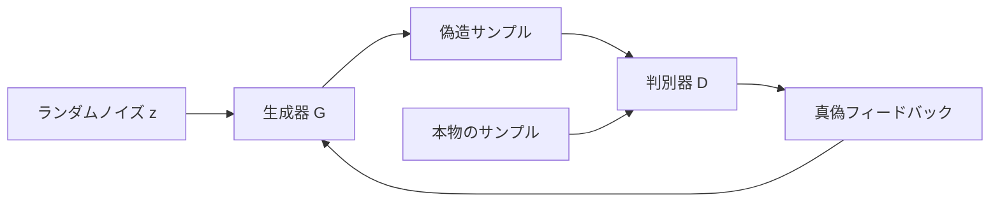

# GAN 基礎【選択】


:::tip 本節の位置づけ
GAN のいちばんおもしろいところは、次の2点です。

- 「ラベル」を学ぶのではない
- 「本物っぽいかどうか」を学ぶ

このため、生成タスクではとても魅力的です。  
ただし、学習のしかたが普通の教師あり学習と違うので、初学者には少しわかりにくく感じられます。

この節の目的は GAN を神秘化することではなく、とても具体的なゲームとして捉え直すことです。

> **生成器は判別器をだまそうとし、判別器は生成器を見破ろうとする。**
:::

## 学習目標

- 生成器と判別器がそれぞれ何を担当するのかを理解する
- 「対抗学習」がなぜ生成品質の向上を後押しするのかを理解する
- 実行できるサンプルを通して、最小限の GAN 学習の感覚をつかむ
- mode collapse と学習不安定がなぜよく起こるのかを理解する

---

## まず地図を作ろう

もし前の分類や回帰タスクから来たばかりなら、まずはこう考えるとわかりやすいです。

- これまでのモデルは主に「この入力を何に分類するか」を学んでいた
- GAN は「本物の分布にありそうなサンプルをどう作るか」を学ぶ

つまり GAN で大きく変わるのは「ネットワークがあること」ではなく、次の点です。

- 損失関数と学習の関係が、より動的になる
- モデルは分類精度だけを追うのではなく、真偽のゲームの中で生成品質を高めようとする

GAN を初めて学ぶときは、数式から入るより、まず動的なゲームとして見るのがいちばん理解しやすいです。



この節で最も大切なのは、損失関数を先に覚えることではなく、まず次の3つをはっきりさせることです。

- 生成器は何をしたいのか
- 判別器は何をしたいのか
- なぜ両者を同時に学習すると難しくなるのか

## 一、GAN はいったい何をしているのか？

### 1.1 生成器

入力：

- ランダムノイズ

出力：

- 1つの偽造サンプル

目的：

- そのサンプルを本物のデータ分布から来たように見せる

### 1.2 判別器

入力：

- 1つのサンプル

出力：

- そのサンプルが本物っぽいかどうか

目的：

- 本物のサンプルと偽造サンプルを見分ける

### 1.3 たとえ話

GAN は、偽札工場と偽札判定機の戦いに似ています。

- 偽札工場は、だんだん本物そっくりに作るようになる
- 偽札判定機も、だんだん見分けが上手くなる

この継続的な競争の中で、偽造サンプルの品質が上がっていきます。

### 1.4 GAN を最初に学ぶとき、まず何をつかむべきか？

まずつかむべきなのは、たくさんの対抗損失の式ではなく、この一文です。

> **GAN は最初から「正解」を教え込むのではなく、真偽の対抗の中で少しずつ本物の分布に近づく。**

この感覚が身につくと、次のような現象も理解しやすくなります。

- なぜ学習が不安定になりやすいのか
- なぜ判別器が強すぎるといけないのか
- なぜ生成サンプルは「それっぽく」なっても、途中で崩れることがあるのか


:::tip 図の読み方
この図を読むときは、GAN を2人が同時に学んでいる状態として考えてください。生成器は「より本物らしくなる」ことを学び、判別器は「偽物を見破る」ことを学びます。判別器が強すぎると、生成器は有効なフィードバックを得られません。生成器が1つのだまし方しか覚えないと、mode collapse が起こりやすくなります。
:::

---

## 二、なぜ GAN は「ピクセルを直接合わせる」より面白いのか？

それは、モデルに1画素ずつ画像をコピーさせるのではなく、  
次のことを学ばせるからです。

- どんなサンプルが全体として本物の分布により近いのか

つまり GAN は、次のようなものを学んでいると言えます。

- データ分布の「真偽の境界」

これが、GAN が後に画像生成で大きな影響を持った理由の1つです。

---

## 三、まずは最小限の GAN ゲームを動かしてみよう

以下の例では画像は生成せず、  
1次元の数値を使って本物の分布と生成分布をまねています。

本物データは、次のあたりに集まっていると仮定します。

- `2.0` 前後

生成器は最初はひどい出力をし、  
そのあと少しずつ本物の分布に近づいていきます。

```python
real_samples = [1.8, 2.0, 2.2, 1.9, 2.1]


def discriminator_score(x):
    # 本物の中心 2.0 に近いほど、本物らしい
    return max(0.0, 1.0 - abs(x - 2.0))


generator_output = -1.0

for step in range(8):
    score = discriminator_score(generator_output)
    print(
        f"step={step} generated={generator_output:.2f} "
        f"disc_score={score:.2f}"
    )

    # とても簡単な「更新」：判別器がより本物らしいと判断する方向へ動かす
    if generator_output < 2.0:
        generator_output += 0.5
    else:
        generator_output -= 0.2
```

### 3.1 この例でいちばん見てほしいことは？

この例が示しているのは、GAN の中心は正解を固定して当てることではなく、  
次のことだという点です。

- 生成器が「真偽のフィードバック」を見ながら調整していく

### 3.2 なぜ普通の分類学習とは感覚が違うのか？

それは、目的そのものが動くからです。  
判別器も変わるし、生成器も変わります。  
これが対抗学習が不安定になりやすい原因の1つです。

---

## 四、GAN はなぜよく学習不安定になるのか？

### 4.1 片方が強すぎる、弱すぎる

判別器が強すぎると：

- 生成器は有効な勾配を学べない

生成器が強すぎると：

- 判別器は真偽を見分けられない

### 4.2 目標そのものが変化する

普通の教師あり学習では、ラベルは動きません。  
GAN では、生成器と判別器が互いの学習環境を変えてしまいます。

### 4.3 mode collapse とは何か？

よくある失敗の1つは、次のようなものです。

- 生成器が、判別器をだますのに特に都合のいい1種類のサンプルを見つける
- その後、その少数のパターンだけを繰り返し出力する

これが：

- mode collapse

です。つまり、

- 見た目は「それっぽい」
- でも多様性が失われる

### 4.4 初学者がまず見るべき学習シグナルは？

実際に GAN を動かすなら、最初に見るべきなのは次の点です。

- 生成サンプルがだんだん本物らしくなっているか
- 判別器がすぐに強くなりすぎて、生成器を押さえ込んでいないか
- サンプルが同じようなものばかりになっていないか

つまり GAN では、損失値だけを見るのではなく、次のものも必ず見ます。

- 可視化したサンプル
- 多様性
- 2者の学習バランス

### 4.5 GAN の学習と普通の教師あり学習で、いちばん違う点は？

いちばん違うのは、次の点です。

- 学習環境そのものも動いている

普通の教師あり学習では：

- ラベルは動かない
- loss の基準は比較的安定している

GAN では：

- 判別器が変わる
- 生成器も変わる
- それぞれが相手の学習難易度を変えてしまう

だから GAN の不安定さは、偶然のバグではなく、この学習形式そのものが持つ自然な難しさなのです。

---

## 五、GAN はどんなときに学ぶとよいのか？

### 5.1 「生成モデルは再構成や尤度だけではない」と理解したいとき

GAN は、次の別の考え方を理解する助けになります。

- 対抗シグナルから分布を学ぶ方法もある

### 5.2 生成モデルの学習がなぜ難しいのかを見たいとき

GAN はとてもよい反例教材です。

- 学習不安定や mode collapse を、とても直感的に確認できます

### 5.3 ただし、今の生成タスクの出発点としては万能ではない

現在の多くのタスクでは、  
Diffusion Model のほうが安定していて、主流になっています。

### 5.4 それでもこの章で GAN を学ぶ理由は？

GAN は、「なぜ生成モデルの学習が難しいのか」を理解する入り口として、とても優れているからです。

GAN を学ぶ価値は、1つのモデルを覚えることだけではありません。  
次の3つの見方を身につけられることにあります。

- 生成はラベルの当て方を学ぶだけではない
- 生成学習の目標は動的に変わりうる
- サンプル品質と多様性は、どちらも見ないといけない

---

## 六、よくある誤解

### 6.1 誤解1：GAN は「画像を生成するモデル」そのもの

より本質的には、GAN は次の学習方法です。

- 対抗的な生成学習

### 6.2 誤解2：判別器は強ければ強いほどよい

違います。  
強すぎると、生成器が学べなくなります。

### 6.3 誤解3：生成サンプルがそれっぽければ十分

それだけでは不十分です。  
次も見る必要があります。

- 多様性
- 学習の安定性

## この先に進むなら、おすすめの順番

1. まず GAN と VAE の直感的な違いをはっきりさせる
2. そのあとで「潜在空間、リアルさ、安定性のどれを重視したいか」を考える
3. 最後に、より新しい生成モデルの流れを見る

この節でいちばん大事なのは、次の判断を持つことです。

> **GAN の核心は、生成器と判別器の対抗ゲームで本物のデータ分布に近づくことにある。強力だが、学習不安定と多様性低下のリスクも自然に伴う。**

この点がわかると、あとで VAE、Diffusion Model、そしてより現代的な生成手法を学ぶときに、それぞれの長所と短所を比較しやすくなります。

---

## まとめ

この節でいちばん大切なのは、今日すぐに高品質な画像生成モデルを訓練できるようになることではなく、次の判断を持つことです。

> **GAN の核心は対抗ゲームであり、生成学習がなぜ魅力的なのか、そしてなぜ学習が不安定になりやすいのかを理解する助けになる。**

## この節で特に持ち帰ってほしいこと

もし1文だけ覚えるなら、これを覚えてください。

> **GAN のいちばん大きな学習価値は、「生成できる」ことそのものより、生成モデルの学習がなぜ本質的にもっと動的で、もっと壊れやすいのかを初めてはっきり見せてくれることです。**

この節でしっかり押さえるべきなのは、次の3点です。

- 生成器と判別器の役割分担
- 対抗学習がなぜ生成品質を押し上げるのか
- 学習不安定と mode collapse がなぜよく起こるのか

---

## 練習

1. 例の本物の中心を `2.0` から `5.0` に変えて、生成器の軌跡がどう変わるか観察してください。
2. 自分の言葉で説明してみてください。なぜ GAN の学習目標は普通の教師あり学習より不安定になりやすいのでしょうか？
3. mode collapse は、なぜ「見た目はそれなりに生成できている」モデルを、実用上はまだ不十分にしてしまうのでしょうか？
4. 安定した学習が必要な生成プロジェクトを作るなら、GAN とより現代的な手法のどちらを優先しますか？ その理由は何ですか？
