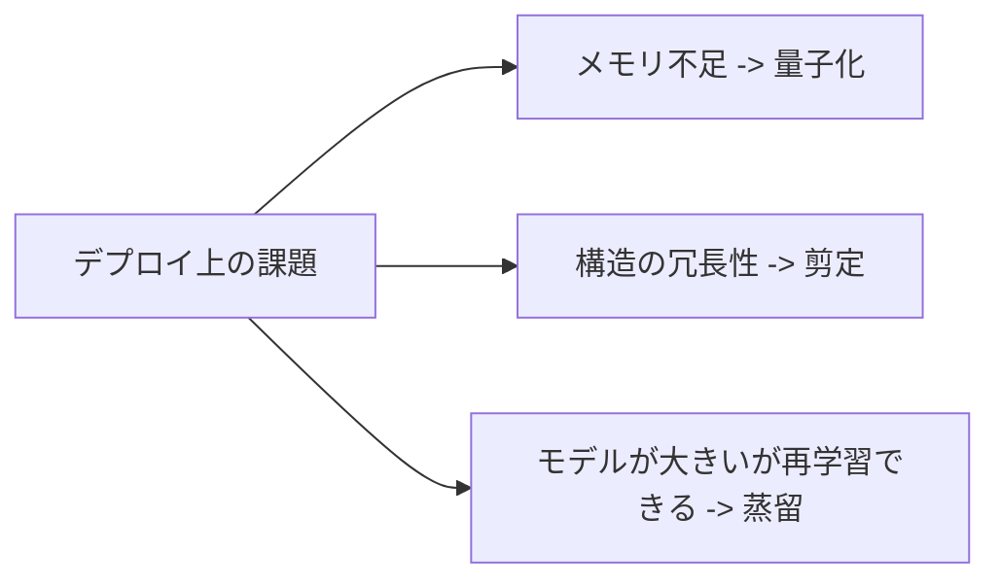
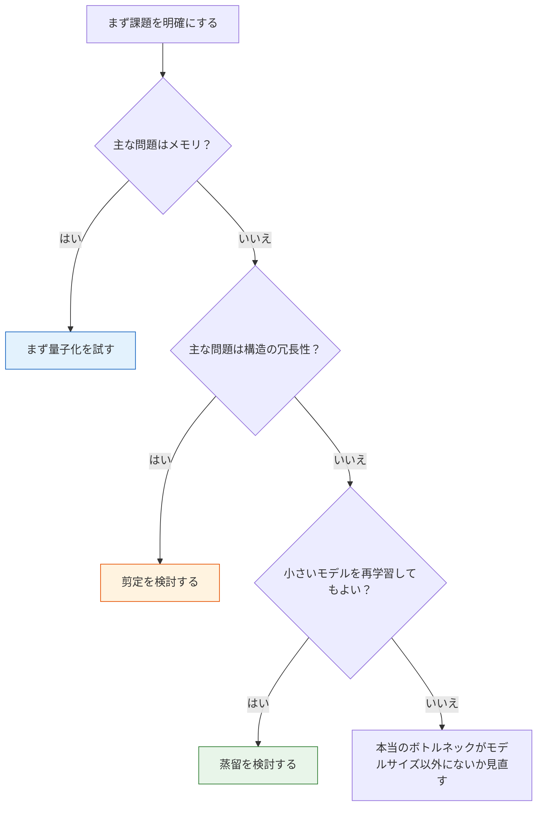

# 6.7.4 モデル圧縮【選択】

:::tip この節の位置づけ
モデル圧縮は、「より小さくする」ことだけを目指すものではありません。  
本番環境で、もっと具体的な問題を解決するためのものです。

- メモリが足りない
- 推論が遅い
- デバイスで動かない

この節で大事なのは、用語を覚えることではなく、実用的な見方を身につけることです。

> **圧縮では、ある程度の精度や柔軟性を犠牲にして、デプロイ上のメリットを得る。**
:::

## 学習目標

- 量子化、剪定、蒸留という3種類の圧縮手法の考え方を理解する
- なぜ圧縮は「ただ得をする」ものではないのかを理解する
- 実行できる例を通して量子化誤差の感覚を身につける
- デプロイ制約から圧縮の方法を選べるようになる

---

## まずは全体像をつかもう

モデル圧縮は、方法名から考えるよりも、デプロイの問題から逆算すると理解しやすいです。


:::tip 図の読み方
上から下へ読んでください。まずデプロイ上のボトルネックを見つけ、次に圧縮方法を選び、最後にサイズ・遅延・精度をもう一度測ります。圧縮してもタスクが動くなら、そのトレードオフには意味があります。
:::



この節でいちばん大事なのは、「まず課題を見る、それから方法を選ぶ」という考え方です。

## 一、モデル圧縮では何を交換しているのか？

### よくあるメリット

- メモリが小さくなる
- 遅延が小さくなる
- スループットが高くなる
- エッジデバイスに向いている

### よくあるデメリット

- 精度が下がる
- 工学的な複雑さが増える
- デバッグが難しくなる

### たとえ話

モデル圧縮は、出張の荷造りに似ています。  
軽いほうがいいのはもちろんですが、  
大事なものを全部捨ててはいけません。

---

## 二、よく使われる3つの圧縮ルート

### 量子化

高精度の数値を低精度表現にします。

### 剪定

重要度の低い重み、チャネル、構造を取り除きます。

### 蒸留

より小さいモデルに、より大きいモデルの振る舞いをまねさせます。

### 初学者向けの覚え方

3つがごちゃ混ぜになりやすいなら、まずはこう覚えるとよいです。

- **量子化**: 同じものを、より省スペースな材質に入れ替える
- **剪定**: 明らかに不要な枝葉を先に切る
- **蒸留**: 小さい生徒を再学習させて、先生のまねをさせる

どれも「圧縮」ですが、実際に手を入れる場所は違います。

- 量子化は主に数値表現を変える
- 剪定は主に構造の冗長性を減らす
- 蒸留は主に学習方法を変える

---

## 三、まずは最小の量子化誤差の例を見よう

```python
weights = [0.12, -1.87, 3.44, -0.03]


def fake_quantize(values, scale):
    return [round(v * scale) / scale for v in values]


def mae(a, b):
    return sum(abs(x - y) for x, y in zip(a, b)) / len(a)


q8_like = fake_quantize(weights, scale=16)
q4_like = fake_quantize(weights, scale=4)

print("original:", weights)
print("q8_like :", q8_like)
print("q4_like :", q4_like)
print("q8 mae  :", round(mae(weights, q8_like), 4))
print("q4 mae  :", round(mae(weights, q4_like), 4))
```

### この例から何がわかる？

強く圧縮するほど、ふつう誤差は大きくなります。  
つまり、量子化の本質は次ではありません。

- 圧縮できるかどうか

本質は次です。

- 圧縮したあと、業務で使えるかどうか

### これが本番デプロイと深く関係する理由

本番でよくある問題の1つは、

- モデルがデバイスに入るか

です。

量子化は、まず最初に思いつく解決策になりやすいです。

### 次に、小さな「モデルサイズ」の見積もり例を見よう

初学者が圧縮実験をするとき、いちばん困るのは量子化のやり方よりも、  
そもそも次がわからないことです。

- 圧縮前はどれくらい大きいのか
- 圧縮後はどれくらい節約できるのか

次の例では、実用上かなり大事なことだけをします。

- 「パラメータ数」と「精度ごとのおおよそのサイズ」を計算する

```python
param_count = 12_000_000  # 1200万パラメータの小さめのモデルを仮定


def size_mb(param_count, bits):
    return param_count * bits / 8 / 1024 / 1024


variants = [
    ("fp32", 32),
    ("fp16", 16),
    ("int8", 8),
    ("int4", 4),
]

for name, bits in variants:
    print(f"{name:>4} -> {size_mb(param_count, bits):.2f} MB")
```

この例でまず覚えるべきなのは、正確な数値そのものよりも、  
次の感覚です。

- パラメータ数を変えなくても
- **数値精度を下げるだけで、モデルサイズはかなり減る**

だからこそ、量子化はよく最初の選択肢になります。

---

## 四、量子化・剪定・蒸留は、いつ考えるべき？

### 量子化

向いているのは次のような場合です。

- まずはメモリ削減と高速化を素早く試したい

### 剪定

向いているのは次のような場合です。

- ネットワークに明らかな冗長性があるとわかっている

### 蒸留

向いているのは次のような場合です。

- より小さいモデルを再学習してもよい

### 初学者がそのまま使える選び方の表

| 状況 | まず優先して考えるもの |
|---|---|
| モデルが大きすぎるので、まずは素早く圧縮したい | 量子化 |
| ネットワークに明らかな冗長性がありそう | 剪定 |
| 小さいモデルを再学習して安定した効果を狙いたい | 蒸留 |

この表がいつも正しいとは限りませんが、最初の判断には十分です。

### 実際の工程に近い選択フローチャート



この図で身につけてほしい習慣は次です。

- 「どの圧縮法がいちばん流行っているか」を先に聞かない
- 「自分はどんなデプロイ問題を解きたいのか」を先に考える

---

## 五、いちばんハマりやすい落とし穴

### 誤解1: 圧縮すれば必ず速くなる

そうとは限りません。  
次の要素も関係します。

- ハードウェアの対応
- 推論エンジンの対応

### 誤解2: モデルサイズだけ見て、タスク指標を見ない

デプロイのメリットは、タスクとしてまだ使える場合にだけ意味があります。

### 誤解3: とりあえず先に圧縮する

より安定した順番は、たいてい次の通りです。

- まずデプロイ上の課題を明確にする
- それから圧縮戦略を選ぶ

---

## この節でいちばん持ち帰ってほしいこと

- 圧縮は決して「ただ得をする」ものではない
- 量子化、剪定、蒸留にはそれぞれ適した場面がある
- 本当の出発点は、方法の流行ではなくデプロイ制約である

## 初めて圧縮実験をするときの、より安全な順番

次の順番がおすすめです。

1. 本当のボトルネックがメモリ、遅延、スループットのどれかを確認する
2. 主にメモリなら、まず量子化を試す
3. 主にモデルの冗長性なら、剪定を考える
4. 再学習と長期運用ができるなら、蒸留を考える

このほうが、「圧縮手法を見つけたら片っ端から試す」より、実務に近いです。

## これをプロジェクトに入れるなら、何を見せるとよいか

圧縮実験を、本当に工程っぽいページとして見せたいなら、  
いちばん大事なのは次のようなものです。

- 「int8 量子化ができます」と見せること

ではなく、次の4つです。

1. 圧縮前後のモデルサイズ比較
2. 圧縮前後の遅延 / スループット比較
3. 圧縮前後の主要タスク指標の比較
4. 最終的にその圧縮方法を選んだ理由

こうすると、見る人に伝わるのは「小技を1つ試した」ではなく、  
次の能力です。

- デプロイ制約を踏まえてトレードオフを判断できる

---

## まとめ

この節でいちばん大事なのは、次の判断を身につけることです。

> **モデル圧縮は「小さいほどよい」のではなく、精度・工学的複雑さ・デプロイ上のメリットの間でバランスを取る作業である。**

この考え方ができるようになると、今後量子化や蒸留を見ても、単なる方法名だけでは終わりません。

## この節でいちばん持ち帰るべきこと

- モデル圧縮はまずデプロイの問題であり、テクニック自慢ではない
- 量子化、剪定、蒸留は、実際に手を入れる場所がまったく違う
- 初めて圧縮実験をするときは、「モデルサイズ / 遅延 / 指標」の3つを先に測るほうが、いきなり手法を試すより価値がある

## 練習

1. 例の `scale` を大きくしたり小さくしたりして、誤差の変化を観察してください。
2. 自分の言葉で説明してください。なぜ圧縮は決して「ただ得をする」ものではないのですか？
3. 考えてみてください。もし対象デバイスのメモリがとても小さいなら、まずどのルートを考えますか？
4. もしモデルサイズは十分小さいのに遅延がまだ高いなら、それでも圧縮を優先しますか？ なぜですか？
