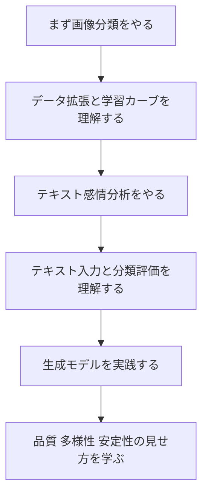

# 6.8.1 学習ガイド：この実践プロジェクトの章はどう学ぶべきか

この章では、もう概念を積み重ねるだけではなく、前までに学んだニューラルネットワーク、PyTorch、CNN、RNN、Transformer、生成モデル、そして学習テクニックを、実際にプロジェクトとして形にしていきます。

深層学習プロジェクトと従来の機械学習プロジェクトの大きな違いは、データ量、学習コスト、モデルの収束、過学習、GPU 環境、ハイパーパラメータ、結果の可視化といった問題に、より頻繁に向き合うことです。つまりこの章では、モデルを動かすだけでなく、学習の流れを管理し、モデルの結果を説明する力も身につけます。

## この章がコース全体でどこにあるか

深層学習プロジェクト章は、第 6 ステージの出口です。ここでは、深層学習の知識を実際のタスクに使えることを証明します。単に個々のモデル構造を理解しているだけでは足りません。

コース全体の流れから見ると、この章は大規模モデルの段階へ進むための重要な橋でもあります。ここで学ぶ学習の閉ループ、データ分割、loss カーブ、検証セット、エラー分析、実験記録は、この先で事前学習、ファインチューニング、大規模モデル評価を理解するときにも、そのまま役立ちます。

前半では、まずタスク、データ、学習方針を決めます。後半では、指標、カーブ、失敗サンプル、レポートを中心に、プロジェクトを振り返ります。

## この章で本当に解決したいこと

この章では、次の 5 つの問いに答えます。深層学習タスクのために、どうやってデータセットとデータローダーを準備するか。どうやって学習ループ、検証ループ、最良モデルの保存を設計するか。loss、accuracy、F1、サンプル出力、エラーケースから、どうやってモデルの性能を判断するか。過学習、アンダーフィット、クラス不均衡、学習の不安定さにどう対処するか。プロジェクトを、再現可能な Notebook、スクリプト、またはレポートとしてどう整理するか。

初心者が一番やりがちな失敗は、「コードが最後まで動くか」だけに注目してしまうことです。深層学習プロジェクトでは、次の点をもっと重視すべきです。学習は収束しているか、検証セットは改善しているか、エラーサンプルには規則性があるか、モデルが失敗したときの原因はデータなのか、モデルなのか、学習設定なのか。

:::info 大きなプロジェクト前のガイド練習
このプロジェクトの流れがまだ抽象的に感じる場合は、先に [6.8.5 実践ワークショップ：PyTorch 学習証拠パックを作る](./04-hands-on-dl-workshop.md) を実行してください。画像分類、感情分析、生成モデルに進む前に、完全に動くプロジェクト練習を 1 回行えます。
:::

## 初心者におすすめの学習順

まずは画像分類から始めるのがおすすめです。データ拡張、CNN、転移学習、学習カーブを理解するのに最適だからです。次にテキスト感情分析を行い、テキストデータ、token、embedding、系列モデル、分類評価をつなげます。最後に生成モデルの実践に進み、生成結果の品質、多様性、安定性、見せ方に注目します。

## この章を学ぶときに押さえるべき主線

この章の主線は、次のようにまとめられます。深層学習プロジェクトは、データ、モデル、学習、検証、エラー分析のサイクルです。

前半では、まずタスク、データ、学習方針を決めます。後半では、指標、カーブ、失敗サンプル、レポートを中心に、プロジェクトを振り返ります。

この流れが見えるようになると、深層学習プロジェクトでは最終指標だけを見せればよいわけではないと分かります。学習カーブ、検証カーブ、混同行列、エラーサンプル、可視化結果も、作品集ではとても重要な証拠です。

## 3 つのプロジェクトでそれぞれ何を練習するか

| プロジェクト | タスクの種類 | 本当に練習すること |
|---|---|---|
| 画像分類 | CNN プロジェクト | 学習から評価までの、画像タスクの一連の流れ |
| テキスト感情分析 | テキスト分類プロジェクト | ラベル設計、baseline、エラー分析、改善の道筋 |
| 生成モデル実践 | 生成プロジェクト | 品質、多様性、安定性、見せ方のフレームワーク |

## この章と後の段階の関係

深層学習プロジェクトは、大規模モデルがブラックボックスの魔法ではないことを理解する助けになります。後で事前学習、ファインチューニング、RAG の評価、Agent の評価を学ぶときも、ここで学ぶ学習記録、検証セット、エラー分析、再現可能な考え方を何度も使います。

この章が安定していないと、後でよくある問題が起きます。loss が下がっていても過学習かどうか分からない。検証セットとテストセットの違いが分からない。事前学習済みモデルを呼び出すだけで、失敗原因を判断できない。ファインチューニング時に baseline も評価方針もない。

## 初心者と上級学習者はどう読むか

初心者がこの章を初めて学ぶときは、まず主線と最小の動く例をつかみましょう。すべての細部を一度に理解する必要はありません。この章が何を解決するのか、入力と出力は何か、最小プロジェクトをどう動かすかを説明できれば、先へ進んで大丈夫です。

経験のある学習者は、この章を「抜け漏れ確認」と「エンジニアリング練習」として使えます。境界条件、失敗ケース、評価方法、コードの再現性、そして前後の章とのつながりに注目してください。読み終わったら、本章の内容を自分の作品 README や実験記録にまとめておくとよいです。

## 学習時間と難易度の目安

| 学び方 | おすすめの投入時間 | 目標 |
|---|---|---|
| ざっと読む | 20～30 分 | この章が何を解決するかを理解し、後でどこで使うかを把握する |
| 最小クリア | 1～2 時間 | 最小例を動かし、本章の小プロジェクトを完成させる |
| じっくり練習 | 半日～1 日 | エラー分析、比較実験、プロジェクト README の記録を追加する |

## 本章の自己チェック問題

| 自己チェック問題 | 合格基準 |
|---|---|
| この章は何を解決するか？ | コース全体の中での位置を一言で説明できる |
| 最小の入力と出力は何か？ | 例が何を入力として必要とし、どんな結果を出すか説明できる |
| よくある失敗点はどこか？ | 少なくとも 1 つ、エラー、性能低下、理解のずれの原因を挙げられる |
| 学んだあとに何を残せるか？ | 本章の成果をプロジェクト README、実験記録、作品集に書ける |

## 本章の小プロジェクトの出口

この章を学び終えたら、少なくとも 1 つ「再現可能な深層学習学習プロジェクト」を完成させることをおすすめします。プロジェクトには、データ準備、学習/検証分割、モデル構造、学習カーブ、評価指標、エラーケース、モデル保存、結果の見せ方を含めてください。

画像分類なら、予測が正しい例と間違った例をいくつか見せるとよいです。テキスト感情分析なら、誤判定したテキストとその理由候補を見せます。生成プロジェクトなら、異なるパラメータやバージョンでの生成結果の比較を見せるとよいです。

## デバッグ探偵事件

| 事件 | 内容 |
|---|---|
| 事件名 | Shape の巨獣が出現 |
| 現場 | 学習スクリプトで shape mismatch が出る、または loss が長時間下がらない。 |
| 捜査手順 | 各層の tensor shape を出力し、小さなデータで過学習テストを行って、学習ループが正しいか確認する。 |
| 結了証拠 | エラーログ、修正前後の shape 記録、学習カーブ。 |

プロジェクト練習では、成功スクリーンショットだけを残さないでください。少なくとも 1 つは本当の失敗サンプルを選び、「現象、手がかり、疑わしい原因、捜査手順、修正内容、回帰確認」の流れで `reports/failure_cases.md` に書きましょう。そうすると、プロジェクトがより本物のエンジニアリング成果に近づきます。

## プロジェクト成果物の基準

各総合プロジェクトは、コードを動かすだけでなく、同じ作品集基準で提出することをおすすめします。最小の提出物には、README 1 つ、再現可能な実行コマンド 1 つ、サンプルの入出力 1 組、重要なフローチャート 1 枚、1 回の失敗サンプル分析、そして次の改善計画を含めます。

| 成果物 | 最低要件 | 発展要件 |
|---|---|---|
| README | プロジェクトの目的、実行方法、依存関係、例を明記する | アーキテクチャ図、設計上の取捨選択、振り返りを追加する |
| サンプル入出力 | 少なくとも 1 つの完全なケースを残す | 成功、失敗、境界ケースを残す |
| 評価記録 | どの指標で効果を判断するかを書く | baseline、比較実験、エラー分析を加える |
| エンジニアリング記録 | 環境問題やインターフェース問題を 1 回記録する | ログ、コスト、所要時間、切り分け手順を記録する |
| 発表素材 | スクリーンショットまたは短い GIF で動作を示す | 説明可能な作品集ページにする |

プロジェクトで大切なのは、機能をたくさん詰め込むことではなく、次をきちんと説明できることです。何を解決したのか、システムはどう動くのか、効果はどう判断するのか、失敗したときはどう特定するのか、次の版ではどう直すのか。

## 合格基準

この章が終わるころには、基本的な PyTorch の学習フローを自分で書けること、学習セット・検証セット・テストセットの役割を説明できること、学習カーブから過学習やアンダーフィットを判断できること、モデルを保存・読み込みできること、エラー分析でモデルの限界を説明できることが目標です。

深層学習プロジェクトを再現可能な Notebook かスクリプトにまとめ、指標、カーブ、サンプルを使ってモデルの性能を説明できれば、深層学習段階の作品集出口基準に到達しています。

## バージョン別の進め方

| バージョン | 目標 | 提出の重点 |
|---|---|---|
| 基礎版 | 最小の閉ループを動かす | 入力できる、処理できる、出力できる、そしてサンプルを 1 組残す |
| 標準版 | 見せられるプロジェクトにする | 設定、ログ、エラー処理、README、スクリーンショットを追加する |
| チャレンジ版 | 作品集の品質に近づける | 評価、比較実験、失敗サンプル分析、次の道筋を追加する |

まずは基礎版を完成させましょう。最初から大きく完璧なものを狙わないでください。1 つバージョンを上げるごとに、「何の能力を追加したか、どう確認したか、まだ何が問題か」を README に書きましょう。
