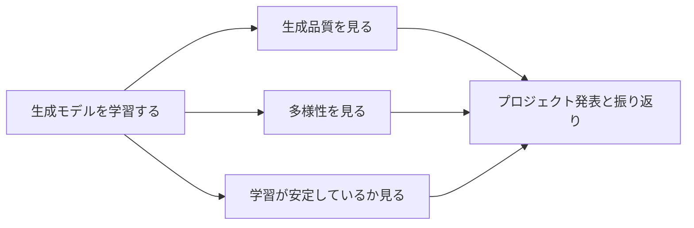
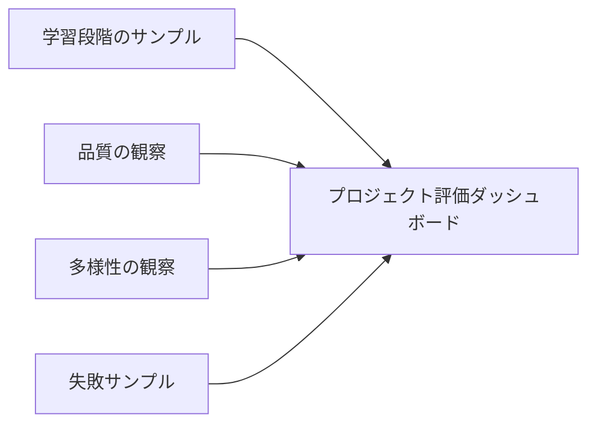

# プロジェクト：生成モデル実践【選択】

:::tip この節の位置づけ
生成プロジェクトと分類プロジェクトのいちばん大きな違いは、次の点です。

- 「正解ラベル」としてとても分かりやすいものがない

そのため、生成プロジェクトで本当に難しいのは、モデルを動かすことよりも、  
むしろ次の点です。

> **どうやって「ちゃんと生成できている」と判断するか。**

この節の重点は、生成プロジェクトの最も基本的な評価と発表の枠組みを、分かりやすく整理することです。
:::

## 学習目標

- 生成プロジェクトと分類プロジェクトの評価上の違いを理解する
- 最小限の生成プロジェクトの発表構成を設計できるようになる
- 「品質」と「多様性」の両方が重要な理由を理解する
- 生成プロジェクトの基本的な振り返りの枠組みを作る

---

## まず全体像をつかもう

生成プロジェクトで初心者がいちばん混乱しやすいのは、モデルは確かに動いているのに、「これって良い結果なの？」が分からないことです。



つまりこの節で本当に学ぶべきなのは、「どう生成するか」だけではなく、「どう判断して見せるか」です。

## 一、生成プロジェクトで最初に解決すべきことは？

最初に考えるべきなのは、

- どんな複雑なモデルを使うか

ではなく、

- 何を生成したいのか
- 生成結果をどう判断するのか

です。

### よくあるプロジェクトの形

- 顔画像やアバターの生成
- 小さな手書き数字の生成
- シンプルな輪郭図の生成

練習用としては、まず次のような題材を選ぶのがおすすめです。

- 目的がはっきりしている
- データを集めやすい
- 結果を目で見て判断しやすい

---

## 二、生成プロジェクトの最小構成

### 1. データ

- 学習サンプル

### 2. モデル

- GAN / VAE / より新しい生成モデル

### 3. サンプリングと可視化

- 定期的にサンプルを生成して変化を見る

### 4. 評価

- サンプル品質
- 多様性

### 5. 発表

- 学習時期ごとのサンプル比較
- 失敗パターンのまとめ

### 2.1 初学者向けの評価ダッシュボード

多くの初心者が初めて生成プロジェクトをやるとき、  
いちばんの問題は「学習できない」ことではなく、  
「何を見ればいいのか分からない」ことです。

まずは、最小限のダッシュボードを次の4列にまとめるとよいです。



この4列を継続して埋められれば、  
そのプロジェクトはもう単なる「画像をいくつか生成しただけ」ではありません。

## 三、おすすめの進め方

1. まず、非常に小さくて観察しやすいデータセットを選ぶ
2. 次に、品質・多様性・安定性のどれを重視するか決める
3. そのあとでモデルの方針を選ぶ
4. 最後に、どう見せて比較するかを決める

---

## 四、まずは最小プロジェクトの計画例を動かしてみよう

```python
from dataclasses import dataclass, field


@dataclass
class GenerativeProjectPlan:
    name: str
    data_source: str
    model_family: str
    evaluation_focus: list
    risks: list = field(default_factory=list)


plan = GenerativeProjectPlan(
    name="simple_digit_generator",
    data_source="small_grayscale_digits",
    model_family="VAE",
    evaluation_focus=["visual_quality", "diversity", "training_stability"],
    risks=["mode collapse", "ぼやけたサンプル", "潜在空間の不連続性"],
)

print(plan)
```

### 4.1 なぜこの段階が、いきなりコードを積み上げるより大事なのか？

生成プロジェクトでは、最初に次の3つをはっきりさせないと、

- データ
- モデルの方針
- 評価の重点

後から「画像は生成できたけれど、このプロジェクトの価値は何？」となりやすいからです。

---

## 五、生成プロジェクトの基本的な結果確認はどうする？

### 5.1 まず品質を見る

生成結果は、目標データに似ていますか？

### 5.2 次に多様性を見る

毎回ほとんど同じものばかり生成していませんか？

### 5.3 とても簡単な多様性チェックの例

```python
samples = [
    "digit_like_pattern_A",
    "digit_like_pattern_A",
    "digit_like_pattern_B",
    "digit_like_pattern_C",
]

diversity = len(set(samples)) / len(samples)
print("diversity score =", diversity)
```

この例はかなり単純ですが、  
次のことを教えてくれます。

- 「それっぽい」だけでは不十分
- 同じようなものばかり出ていないかも見る必要がある

### 5.4 「学習段階のサンプルダッシュボード」の例

実際のプロジェクトでは、とても使いやすい見せ方があります。

- いくつかの epoch を固定する
- 各 epoch ごとに少数のサンプルを保存する
- それらを横に並べて比較する

図を本当に描かなくても、  
まずは構造化されたダッシュボードを作るだけでも十分役に立ちます。

```python
checkpoints = [
    {"epoch": 1, "quality": 0.20, "diversity": 0.80, "note": "ほとんどノイズ"},
    {"epoch": 10, "quality": 0.45, "diversity": 0.72, "note": "輪郭が出始めた"},
    {"epoch": 30, "quality": 0.68, "diversity": 0.60, "note": "鮮明さは上がったが、似たものが増えてきた"},
    {"epoch": 60, "quality": 0.75, "diversity": 0.48, "note": "mode collapse の可能性"},
]

for row in checkpoints:
    print(row)
```

この例でまず覚えておきたいのは数値そのものではなく、  
次の点です。

- 品質と多様性は、だいたい一緒に見る必要がある
- 学習が進むほど、すべての指標が同時に良くなるとは限らない

---

## 六、いちばんよくある落とし穴

### 6.1 誤解1：いちばん見栄えの良い数枚だけを出す

本当に大事な発表では、次の両方を見せるべきです。

- 平均的なサンプル品質
- 失敗サンプル

### 6.2 誤解2：品質だけ見て、多様性を見ない

これでは mode collapse を見逃しやすくなります。

### 6.3 誤解3：最初から難しすぎるデータセットを選ぶ

練習用のプロジェクトでは、まず次のような小さなタスクが向いています。

- 見て分かりやすい
- 比較しやすい

---

## プロジェクト提出時に、できれば追加したい内容

- 学習段階ごとのサンプル比較
- 失敗サンプルの例
- 「品質 / 多様性 / 安定性」をどう優先したかの説明
- なぜこのモデルを選び、他のモデルを選ばなかったのかの理由

## 初心者がそのまま使える評価表

生成プロジェクトの振り返りの書き方が分からないとき、  
いちばん無難な出発点は、まずこんな表を作ることです。

| 観点 | 答えるべき質問 | 最小限の証拠 |
|---|---|---|
| 品質 | 生成結果は目標データに似ているか？ | 時期ごとのサンプル比較 |
| 多様性 | 毎回似たようなものばかり生成していないか？ | いくつかの異なるサンプル結果 |
| 安定性 | 学習が明らかに崩れたり、潰れたりしていないか？ | loss / サンプル傾向の説明 |
| 説明 | なぜこのモデル方針を選んだのか？ | 方針選択の理由を1段落で説明 |

この表は、初学者にとても向いています。  
なぜなら、「何を見せればいいのか」を先に整理できるからです。

## このプロジェクトをさらに良くするなら、何を足すべき？

優先して足す価値が高いのは、だいたい次の3つです。

1. 品質 / 多様性の対比を1ページで見せる
2. 異なるモデル方針の比較ページを作る
3. mode collapse やぼやけたサンプルの失敗事例を分析する

こうすると、このプロジェクトは「画像を生成した」だけでなく、  
「どう評価し、どう説明するか」まで含んだ内容になります。

## 十、作品集向けのおすすめ発表順

このプロジェクトをポートフォリオページにするなら、次の順番がおすすめです。

1. プロジェクトの目的とデータ範囲
2. モデル方針の選択
3. 学習段階ごとのサンプル
4. 品質 / 多様性の比較
5. 失敗事例と原因の判断
6. 次に改善する方向

こうすると、見る人に「数枚の画像」ではなく、  
生成プロジェクトの流れ全体が伝わります。

---

## まとめ

この節で最も大事なのは、生成プロジェクトを見るときの判断軸を作ることです。

> **生成モデルプロジェクトで本当に難しいのは、学習そのものだけではなく、品質・多様性・安定性を軸に、信頼できる評価と発表の枠組みを作ること。**

この枠組みができれば、作ったプロジェクトはもう「いくつか画像を生成した」だけではありません。


## バージョン別の進め方

| バージョン | 目的 | 提出の重点 |
|---|---|---|
| 基礎版 | 最小限の流れを通す | 入力できる、処理できる、出力できる。さらにサンプルを1組残す |
| 標準版 | 発表できる形にする | 設定、ログ、エラー処理、README、スクリーンショットを追加する |
| 挑戦版 | 作品集レベルに近づける | 評価、比較実験、失敗サンプル分析、次の方針を追加する |

まずは基礎版を完成させるのがおすすめです。最初から全部盛りを狙わないようにしましょう。  
1つ上のバージョンに進むたびに、「何が増えたか、どう確認したか、まだ何が課題か」を README に書くとよいです。

## 練習

1. 自分がやってみたい最小限の生成プロジェクトを考えて、データソースと評価の重点を書いてみましょう。
2. なぜ生成プロジェクトでは、見た目の良い結果だけを数枚見せるのでは不十分なのでしょうか？
3. どんなときに mode collapse をまず疑いますか？
4. 1つだけ指標を優先して見るなら、品質と多様性のどちらを先に見ますか？ その理由も考えてみましょう。
