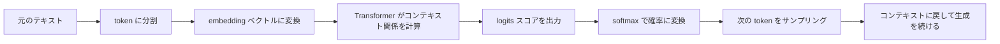

# 大モデルのコア概念

## 学習目標

この節を終えると、次のことができるようになります。

- token、コンテキストウィンドウ、next-token prediction の意味を理解する
- embedding、logits、temperature の直感を理解する
- ごく簡単な attention 計算の例を読める
- 事前学習、微調整、プロンプト駆動の違いを区別できる

---

## 一、大モデルは実際には何をしているのか？

### まずはお話から：テキストを自動補完する見習い

新人の編集者に文章校正を教える場面を考えてみましょう。  
最初から「知能とは何か」を教えるのではなく、毎日ひとつのことをやってもらいます。

> すでに書かれている内容を見て、次に来るいちばん自然な単語を予測する。

最初は短い文しか予測できません。  
でも、新聞、コード、Q&A、小説、マニュアルなどを大量に読んでいくうちに、だんだん次のようなことを覚えていきます。

- どんな表現が自然か
- どんな知識がよく一緒に出てくるか
- ある質問の後には、普通どんな手順が続くか

大モデルの学習の直感も、まずはこう理解できます。  
最初から明示的に「質問に答える」よう教えられるのではなく、膨大なテキストの中で何度も「コンテキストに基づいて次の token を予測する」練習をし、その結果として、理解・推論・文章生成のように見える能力が育っていきます。

いちばん誤解しにくい言い方をすると、こうです。

> **大規模言語モデルの本質は、「与えられたコンテキストから次の token を予測すること」です。**

とても素朴に聞こえますが、能力はここから生まれます。



この図で主な流れをつかんでください。  
大モデルは一度で「答えを出す」のではなく、この生成の流れを何度も繰り返しています。  
後で token、embedding、attention、temperature が出てきたときも、この流れに戻して考えると理解しやすくなります。


:::tip 図の見方
この図はループとして読むのがおすすめです。コンテキストがベクトルになり、Transformer が `logits` を出し、`softmax` で確率にしてから、temperature/top-p などのサンプリング戦略で次の token を選びます。大モデルの生成は一度で全文を書くのではなく、「次の token を予測する」を何度も繰り返す仕組みです。
:::

たとえば、次の文を見たら

> 「北京は中国の」

多くの人はこう続けるでしょう。

> 「首都」

モデルがやっていることも本質的には似ています。ただし、超大規模なコーパスの上でその予測を学んでいる、という違いがあります。

---

### 「次の token」を予測する小さな例

次の例はとても小さいですが、「コンテキスト -> logits -> 確率 -> token の選択」という流れをつないでいます。

```python
import numpy as np

context = "北京は中国の"
candidates = ["首都", "都市", "大学"]
logits = np.array([4.0, 2.0, 0.5])


def softmax(x):
    e = np.exp(x - x.max())
    return e / e.sum()


probs = softmax(logits)
best = candidates[np.argmax(probs)]

print("コンテキスト:", context)
for token, prob in zip(candidates, probs):
    print(f"候補 token={token}, 確率={prob:.3f}")
print("最も可能性の高い次の token:", best)
```

この例で本当に伝えたいのは、モデルは候補を「なんとなく」選んでいるのではなく、まず各 token にスコアを与え、そのスコアを確率分布に変えている、ということです。  
実際の大モデルでは候補 token の数はずっと多いですが、基本の流れは同じです。

---

## 二、Token：モデルが本当に見ているのは「文」ではなく、分割された単位

多くの初心者は、モデルがテキストを「文字」や「単語」で見ていると思いがちです。  
でも、実際はそうとは限りません。

より正確には、こうです。

> モデルが見ているのは token です。

token には次のようなものがあります。

- 1文字
- 1単語
- 単語の一部
- 記号

### おもちゃ版 tokenizer

```python
text = "AI fullstack course"

# ここでは最も簡単な空白分割だけをしています。実際の大モデルの tokenizer はもっと複雑です
tokens = text.split()

print("元の文:", text)
print("tokens:", tokens)
print("token 数:", len(tokens))
```

実際の大モデルは、たいていテキストをもっと細かく分けます。  
そのほうが、難しい単語や異なる言語を扱いやすいからです。

---

## 三、コンテキストウィンドウ：モデルが一度に「どこまで見られるか」

コンテキストウィンドウ（context window）は、モデルの「今の作業台」と考えることができます。

作業台が大きいほど：

- 一度に置ける情報が多い
- モデルが長い履歴を使いやすい

ただし、無限ではありません。  
そのため、長文処理や RAG では「コンテキストにどう詰め込むか」が重要になります。

たとえば、こんな感じです。

> あなたが机の上で問題を解くとき、机が広いほど参考資料をたくさん広げられる。


:::tip 図の見方
context window は「固定サイズの作業台」だと考えてください。システムプロンプト、ユーザーの質問、会話履歴、検索した資料、出力スペースが、すべて token の予算を取り合います。ウィンドウが大きくなるのは机が大きくなるのと同じで、何でも無制限に入れられるわけではありません。本当に大事なのは、いちばん役に立つ情報を入れることです。
:::

---

## 四、Embedding：token をまずベクトルに変える

モデルは token 文字列をそのまま食べられないので、まずベクトルに変換する必要があります。  
この過程は、まず次のように理解するとよいです。

> **各 token に高次元の座標を割り当てる。**

意味が近い token は、よい表現空間では互いに近くなります。

実際の embedding はとても複雑ですが、まずは「テキストをベクトルに変える」という考え方を、小さな例でつかんでみましょう。

```python
import numpy as np

embedding_table = {
    "cat": np.array([0.9, 0.1, 0.2]),
    "dog": np.array([0.85, 0.15, 0.25]),
    "car": np.array([0.1, 0.8, 0.3])
}

print("cat embedding:", embedding_table["cat"])
print("dog embedding:", embedding_table["dog"])
print("car embedding:", embedding_table["car"])
```

これはおもちゃの例にすぎませんが、すでに次のことが見えます。

- `cat` と `dog` は近い
- `car` は遠い

---

## 五、なぜモデルは「自己回帰」と呼ばれるのか？

モデルは、次のようにテキストを生成することが多いからです。

1. すでにあるコンテキストを見る
2. 次の token を予測する
3. その新しい token をコンテキストに追加する
4. また次の token を予測する

つまり、生成は少しずつ後ろへ伸びていきます。

言葉つなぎのゲームをしているようなものです。

- まず1つ単語を言う
- その前の話を見ながら、続きをつなぐ

---

## 六、logits、確率、temperature

モデルの内部で最初に出るのは、たいてい「最終確率」ではなく、`logits` と呼ばれるスコアの集まりです。

そのあと softmax を通して、確率分布になります。

### temperature サンプリングの実行例

```python
import numpy as np

tokens = ["北京", "上海", "広州"]
logits = np.array([3.0, 1.5, 0.5])

def softmax_with_temperature(logits, temperature=1.0):
    scaled = logits / temperature
    exp_values = np.exp(scaled - scaled.max())
    return exp_values / exp_values.sum()

for temp in [0.5, 1.0, 2.0]:
    probs = softmax_with_temperature(logits, temperature=temp)
    print(f"temperature={temp}")
    for token, prob in zip(tokens, probs):
        print(f"  {token}: {prob:.4f}")
```

### temperature はどう理解する？

- 温度が低い：より保守的で、最上位の選択肢に寄りやすい
- 温度が高い：より発散的で、次点の選択肢も試しやすい

たとえるなら：

- 低温は「とても慎重に答える」
- 高温は「より自由に発想する」

---

## 七、Attention：なぜこれがそんなに重要なのか？

attention の核になる直感は次のとおりです。

> 今の token は、表現を計算するときにすべての単語を平均して見る必要はなく、自分に関係のある単語をより強く見ることができる。

たとえば、次の文を見てください。

> 「小王は小李にボールを渡した。なぜなら彼はキャッチするのがとても上手だったからだ。」

この「彼」が誰を指すかを判断するには、文脈の関係を見る必要があります。  
attention は、まさにこうした「関連性の割り当て」を行っています。

### ごく簡単な attention の例

```python
import numpy as np

# 3つの token のベクトル表現があると仮定する
X = np.array([
    [1.0, 0.0],   # token1
    [0.0, 1.0],   # token2
    [1.0, 1.0]    # token3
])

# 説明のため、Q K V をそのまま X にする
Q = X
K = X
V = X

scores = Q @ K.T
scaled_scores = scores / np.sqrt(K.shape[1])

def softmax(row):
    e = np.exp(row - row.max())
    return e / e.sum()

attention_weights = np.apply_along_axis(softmax, 1, scaled_scores)
output = attention_weights @ V

print("attention スコア:\n", np.round(scaled_scores, 3))
print("attention 重み:\n", np.round(attention_weights, 3))
print("出力表現:\n", np.round(output, 3))
```

今の時点で式を完全に理解する必要はありません。  
まず大事なのは、次の直感です。

- まず「誰が誰に関係するか」を比べる
- その関連性に応じて重み付けしてまとめる

---

## 八、事前学習、微調整、プロンプトは、それぞれ何をしているのか？

### 1. 事前学習

大量のテキストで、言語の規則を学ばせます。

### 2. 微調整

特定のタスクや文体に合わせて、さらに学習させます。  
そうすることで、ある場面により適したモデルになります。

### 3. プロンプト（Prompting）

モデルのパラメータは変えず、入力のしかただけで、望む動きを引き出します。

たとえると、次のようになります。

| 方法 | たとえ |
|---|---|
| 事前学習 | 大量の本を読み通す |
| 微調整 | 配属前の専門研修 |
| Prompting | その場でわかりやすい指示を出す |

---

## 九、なぜ大モデルは「考えているように見える」のか？

モデルの規模、データ量、学習品質が十分に高いと、たくさんの複雑なパターンを学べるからです。

- 言語の規則
- 常識のつながり
- 指示への追従
- 複数ステップの生成構造

ただし、注意してください。

> モデルが「考えているように見える」ことと、人間の思考と同じであることは別です。

エンジニアとして本当に大事なのは、次の点です。

- 入出力の規則はどうなっているか
- いつ信頼できるか
- いつ間違えやすいか

---

## 十、自己チェック：次の説明は正しい？

この先の RAG や Agent を学ぶ前に、次の文が正しいか考えてみましょう。

| 説明 | 正しいか | 理由 |
|---|---|---|
| 大モデルの学習時の中心的な課題のひとつは、コンテキストに基づいて次の token を予測すること | 正しい | next-token prediction は LLM を理解する入口になる直感だから |
| token は必ず中国語の1文字、または英語の1単語そのままである | 正しくない | token は文字、単語、単語の断片、記号などになりうる |
| temperature が高いほど、答えは必ず賢くなる | 正しくない | 高温は発散しやすいだけで、正確さを保証しない |
| attention は関連性に応じた重み付けとして理解できる | 正しい | まず関連性を計算し、その重みで情報をまとめるから |

---

## 十一、初心者がよくやる誤解

### 1. 大モデルは「答えをそのまま記憶している」と思う

完全にはそうではありません。  
むしろ、大規模な言語分布とパターンを学んでいると考えるほうが近いです。

### 2. temperature が高いほど賢いと思う

違います。  
高温はより発散しやすいだけで、必ずしも正確ではありません。

### 3. attention の式を見た時点であきらめる

その必要はありません。  
まずは「関連性に応じた重み付け」という直感をつかみ、少しずつ式を見ていけば大丈夫です。

---

## まとめ

この節で最も大事なポイントは、次の4つです。

1. 大モデルは次の token を予測することで言語を学ぶ
2. token はまずベクトルになってからモデル計算に入る
3. attention によって、関連性に基づいてコンテキストを使える
4. 事前学習、微調整、Prompt は、それぞれ違うレベルの能力を支える

これを理解しておけば、この先の RAG、Agent、ツール呼び出しを見たときに、ただの「ブラックボックスの魔法」には見えなくなります。

---

## 練習

1. temperature サンプリングの例で `logits` を変えてみて、確率分布がどう変わるか見てみましょう。
2. attention の例の `X` を変えて、attention 重みがどう変わるか観察してみましょう。
3. 自分の言葉で説明してみましょう。なぜコンテキストウィンドウは RAG の効果に直接影響するのでしょうか？
