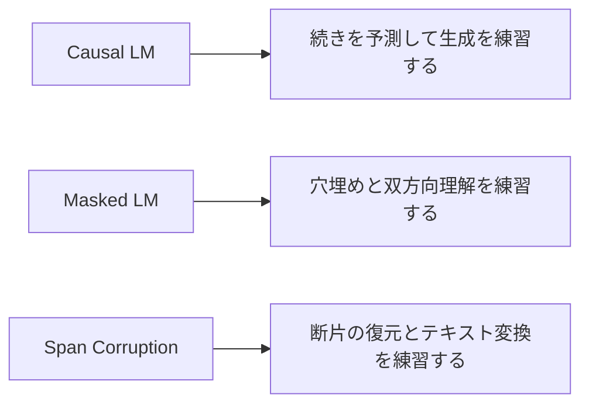

# 7.4.3 事前学習方法

:::tip この節の位置づけ
事前学習方法は、本質的にはとても根本的な問いに答えるものです。

> **学習時に、モデルは具体的に何をするよう求められているのか？**

同じ大量のテキストでも、学習目標が違えば、  
最終的に身につく能力もかなり変わります。

だからこそ、

- BERT は理解タスクへ
- GPT は生成タスクへ
- T5 は統一された text-to-text へ

向かっていきます。

この節でやるのは、これらの目的をきちんと分解して見ることです。
:::

## 学習目標

- さまざまな事前学習目標が、それぞれモデルにどんな能力を教えているのかを理解する
- Causal LM、Masked LM、Span Corruption の核心的な違いを区別する
- 1つのテキストが、どのように別々の学習サンプルへ変換されるかを、実行可能な例で理解する
- 「タスク目標と、その後の能力がなぜ強く結びつくのか」という直感を身につける

---

## まずは全体像をつかもう

事前学習方法は、「モデルが毎日何を練習しているか」で考えると理解しやすくなります。



この節で本当に知りたいのは、次の点です。

- 同じ事前学習なのに、なぜ最終的な能力の特徴が違うのか
- なぜ学習ラベルの作り方が、その後モデルが得意になることに直接影響するのか

---

## 一、なぜ事前学習目標でモデルの進む方向が決まるのか？

### それは、モデルが「学習中に何度も求められたこと」を優先して覚えるから

学習時にモデルが何度も求められるのが、

- 前文から後文を予測すること

であれば、当然そのモデルは次のことが得意になります。

- 続きの文章を書く
- 生成する

逆に学習時にモデルが何度も求められるのが、

- 左右の文脈から隠された token を復元すること

であれば、次のような能力を身につけやすくなります。

- 双方向の理解
- 意味の補完

つまり、事前学習目標は表面的なタスクではなく、  
モデル能力の「方向を決めるハンドル」のようなものです。

### 例えるなら、試験問題の形式が勉強の仕方を決める

モデルは学生のようなものだと考えられます。

- 毎日穴埋め問題を解けば、穴埋めが上手になる
- 毎日作文を書けば、続き書きが上手になる
- 毎日言い換えや要約を解けば、入力から出力への変換が上手になる

モデルも同じです。

### 初心者向けの、よりわかりやすい比喩

事前学習目標は、

- モデルが毎日どんな問題集を解くか

を決めている、と考えるとよいです。

もし毎日、

- 続き書きの問題

を解いていれば、最後には生成型の性質が強くなります。  
もし毎日、

- 穴埋め問題

を解いていれば、理解型の性質が強くなります。  
もし毎日、

- まとまった欠損部分を復元する問題

を解いていれば、入力から出力への対応を学びやすくなります。

---

## 二、最重要の3つの事前学習ルート

### Causal Language Modeling: 過去から未来を予測する

これは GPT 系で最も代表的な目標です。

形式はシンプルです。

- 前の token を入力する
- 次の token を予測する

この方法の良い点は、

- 学習目標と生成タスクが自然に一致している

ことです。

つまり、学習時にモデルは未来を見ることができず、  
推論時も未来を見ることができないため、  
両者のズレがありません。

### Masked Language Modeling: 文脈から空欄を埋める

これは BERT 系の代表的な目標です。

やり方は次のとおりです。

- 入力の一部 token を隠す
- 左右の文脈から、それを復元させる

この目標は双方向モデリングに非常に向いているので、  
特に次の用途に強くなります。

- 理解
- 表現学習
- 分類や抽出系のタスク

ただし、自由生成という意味では、Causal LM ほど自然ではありません。

### Span Corruption / Denoising: 1語ではなく、1区間を隠す

T5 / BART 系では、より一般化された denoising 目標がよく使われます。

- 1つの token だけを mask するのではなく
- 1つの span（連続した区間）をまとめて隠し
- その内容をモデルに復元させる

これは次のタスクにより近いです。

- 要約
- 言い換え
- 翻訳
- text-to-text 変換

---

## 三、同じ文章から3種類の学習サンプルを作ってみよう

このコードの目的はとてもはっきりしています。

- 同じ1つの文から
- Causal LM、Masked LM、Span Corruption の3種類の学習サンプルを作る

そうすると、

- 「目的が違う」とは実際に何が違うのか

が、とても直感的に見えてきます。

```python
tokens = "transformer models learn patterns from large text corpora".split()


def build_causal_example(tokens):
    inputs = tokens[:-1]
    labels = tokens[1:]
    return inputs, labels


def build_masked_example(tokens, mask_positions):
    masked = tokens[:]
    labels = {}
    for pos in mask_positions:
        labels[pos] = masked[pos]
        masked[pos] = "[MASK]"
    return masked, labels


def build_span_corruption(tokens, start, end):
    corrupted_input = tokens[:start] + ["<extra_id_0>"] + tokens[end:]
    target = ["<extra_id_0>"] + tokens[start:end] + ["<extra_id_1>"]
    return corrupted_input, target


causal_inputs, causal_labels = build_causal_example(tokens)
masked_inputs, masked_labels = build_masked_example(tokens, mask_positions=[2, 5])
span_inputs, span_target = build_span_corruption(tokens, start=2, end=5)

print("causal inputs :", causal_inputs)
print("causal labels :", causal_labels)
print()
print("masked inputs :", masked_inputs)
print("masked labels :", masked_labels)
print()
print("span inputs   :", span_inputs)
print("span target   :", span_target)
```

期待される出力：

```text
causal inputs : ['transformer', 'models', 'learn', 'patterns', 'from', 'large', 'text']
causal labels : ['models', 'learn', 'patterns', 'from', 'large', 'text', 'corpora']

masked inputs : ['transformer', 'models', '[MASK]', 'patterns', 'from', '[MASK]', 'text', 'corpora']
masked labels : {2: 'learn', 5: 'large'}

span inputs   : ['transformer', 'models', '<extra_id_0>', 'large', 'text', 'corpora']
span target   : ['<extra_id_0>', 'learn', 'patterns', 'from', '<extra_id_1>']
```

### このコードで最も注目すべき点は？

まず、次の3つを見てください。

1. 入力がどのように変形されているか
2. ラベルがモデルに何を学ばせているか
3. 同じ文がなぜまったく違う学習タスクになるのか

ここがわかると、  
なぜ GPT、BERT、T5 で最終的な能力の特徴が違うのかも理解しやすくなります。


:::tip 図の見方
この図では、同じ文が3種類の学習問題に変わる様子を比べています。Causal LM は「次の token を続けて予測する練習」、Masked LM は「左右の文脈から空欄を埋める練習」、Span Corruption は「欠けた部分を復元する練習」です。モデルが毎日どんな問題を解くかで、長期的に身につく能力の傾向が変わります。
:::

### なぜ Causal LM のラベルは1つ右にずれるのか？

それは、Causal LM がやっていることが、

- 前文を与えて、次の token を当てる

だからです。

したがって、学習データの作り方としては次の形が最も自然です。

- 入力: `x_1 ... x_{t-1}`
- ラベル: `x_2 ... x_t`

### なぜ Span Corruption はより「汎用的」と見なされやすいのか？

それは、単語1つの mask よりも、実際のテキスト変換に近いからです。  
モデルは単語を1つ埋めるだけではなく、  
欠けた区間全体を補う必要があります。

これにより、より自然に次の方向へ進みます。

- text-to-text

T5 の路線でこれが重要なのは、そのためです。

### 1つの文に対する3種類の学習目標の比較表

| 方法 | 入力の形 | ラベルの形 | 初学者がまず覚えやすいイメージ |
|---|---|---|---|
| Causal LM | 前文を見る | 次の token を予測する | 続き書きに近い |
| Masked LM | 中間を穴埋めする | 隠された token を復元する | 穴埋め問題に近い |
| Span Corruption | まとまった区間を消す | 区間全体を復元する | テキスト修復・言い換えに近い |

この表は初学者にとても有効です。  
なぜなら、次のものを同時に見比べられるからです。

- 名前
- 入力形式
- ラベル形式
- 最終的な能力の傾向

---

## 四、それぞれの目標は何が得意なのか？

### Causal LM: 生成、続き書き、対話

この目標は後続の生成タスクと非常に一致しているため、  
特に次の用途に向いています。

- チャット
- 文章作成
- コード補完
- 長文の続き書き

### Masked LM: 表現学習と理解

モデルが左右両方の文脈を見られるので、  
次の用途にとても向いています。

- 分類
- 検索用エンコーディング
- 意味類似度の照合
- 抽出系タスク

### Span Corruption: 入力から出力への変換

モデルに次のようなことを自然にやらせたいなら、

- 要約
- 言い換え
- 翻訳
- 質問応答の生成

こうした denoising 系や seq2seq 系の目標のほうが扱いやすいです。

### 初めてこの節を学ぶときの、いちばん安全な順番

おすすめの順番は次のとおりです。

1. まず略語を覚えようとしすぎない
2. 先に入力がどう変わるかを見る
3. 次にラベルが何を学ばせるかを見る
4. 最後に、その学習目標と後続タスクの関係を見る

この順番のほうが、いきなり

- CLM
- MLM
- span corruption

と丸暗記するより、ずっと理解しやすくなります。

---

## 五、事前学習目標は単独ではなく、アーキテクチャと結びついている

### なぜデコーダーのみには Causal LM がよく合うのか？

それは両者が完全に一致しているからです。

- デコーダーは過去しか見られない
- causal LM も過去しか見ないことを要求する

そのため、学習と生成が非常に自然につながります。

### なぜエンコーダーのみには Masked LM がよく合うのか？

encoder は双方向モデリングが得意だからです。  
文全体を見られるなら、  
次のような復元タスクにとても向いています。

- mask された位置の復元

### なぜエンコーダー-デコーダーには denoising 系がよく合うのか？

この構造は本質的に、

- 何かを入力する
- 別の何かを出力する

のに向いています。

そのため、span corruption、denoising、text-to-text の学習と相性がよいのです。

---

## 六、定番の目標以外にはどんな広がりがあるのか？

### Prefix LM: 一部は双方向、一部は因果的

方法によっては、入力前半は双方向に見られるようにしつつ、  
生成部分は因果制約を保つものがあります。

この種の目標は、次の両方を欲しいときに便利です。

- 文脈を読むこと
- そのまま続けて生成すること

### マルチモーダル事前学習: 入力はテキストだけではない

もし入力に次のようなものが含まれるなら、

- 画像
- 音声
- 動画

目標は次のような方向へ広がります。

- モダリティ間の整合
- 画像とテキストの生成
- マルチモーダル理解

形は複雑になりますが、核心は同じです。

- 学習目標が、モデルに何を優先して学ばせるかを決める

### 自己教師あり目標でも、完全に「偏りがない」わけではない

ラベルが自動生成されるとしても、  
目標関数そのものがモデルに特定の傾向を与えます。

たとえば、

- 生成寄り
- 理解寄り
- 構造復元寄り

などです。

つまり、事前学習目標自体が設計上の選択なのです。

---

## 七、よくある間違い

### 誤解1: 事前学習目標は前半の細かい設定にすぎず、後の fine-tuning ですべて解決できる

違います。  
事前学習目標は、モデルに長期的な能力の偏りを与えます。

### 誤解2: Masked LM は Causal LM より高級、またはその逆

どちらが上という関係ではありません。  
それぞれ別の方向に合わせた設計です。

### 誤解3: 名前だけ覚えて、ラベルの形を見ない

本当に理解するためには、次の3つを見る必要があります。

- 入力をどう組むか
- ラベルをどう作るか
- モデルに何を学ばせるか

## もしこれをノートや講義資料にするなら、何を見せるべきか

いちばん見せる価値が高いのは、次のようなものです。

- 略語を3つ並べるだけの一覧

よりも、

1. 同じ文が3種類の学習サンプルに変わる様子
2. 3つの方法の入力 / ラベルの比較
3. それぞれがどんな能力を学びやすいか
4. それが GPT / BERT / T5 とどう対応するか

こうした点を示すほうが、  
「方法名を覚えた」だけでなく、  
「学習目標が能力をどう形作るか」を理解していることが伝わります。

---

## 残す証拠

このページを終えたら、この証拠カードを残します。

```text
objective: causal LM, masked LM, or seq2seq objective
training_sample: input and target constructed from same text
architecture_fit: objective matched to encoder/decoder pattern
behavior_effect: what the objective teaches the model to do
limitation: pretraining objective is not the same as instruction following
```

## まとめ

この節で最も大事なのは、`CLM / MLM / Span Corruption` という略語を覚えることではなく、  
次の1本の線をつかむことです。

> **事前学習目標とは、モデルが毎日何を繰り返し練習するかを決めるものであり、モデルが最終的に得意になるのは、たいていその繰り返し練習した能力である。**

この考え方が身につくと、  
今後のアーキテクチャ選択、fine-tuning の方法、タスク移行も、ずっと理解しやすくなります。

---

## 練習問題

1. 例の文を自分の好きな文に変えて、3種類の学習サンプルをそれぞれ作ってみてください。
2. 自分の言葉で説明してみましょう: なぜ Causal LM は自由生成に向いているのですか？
3. なぜ Masked LM は「続き書き」ではなく「穴埋め問題」に近いと言えるのでしょうか？
4. 強い要約モデルを作りたいとしたら、どの種類の事前学習目標に寄せると思いますか？その理由も考えてみてください。
