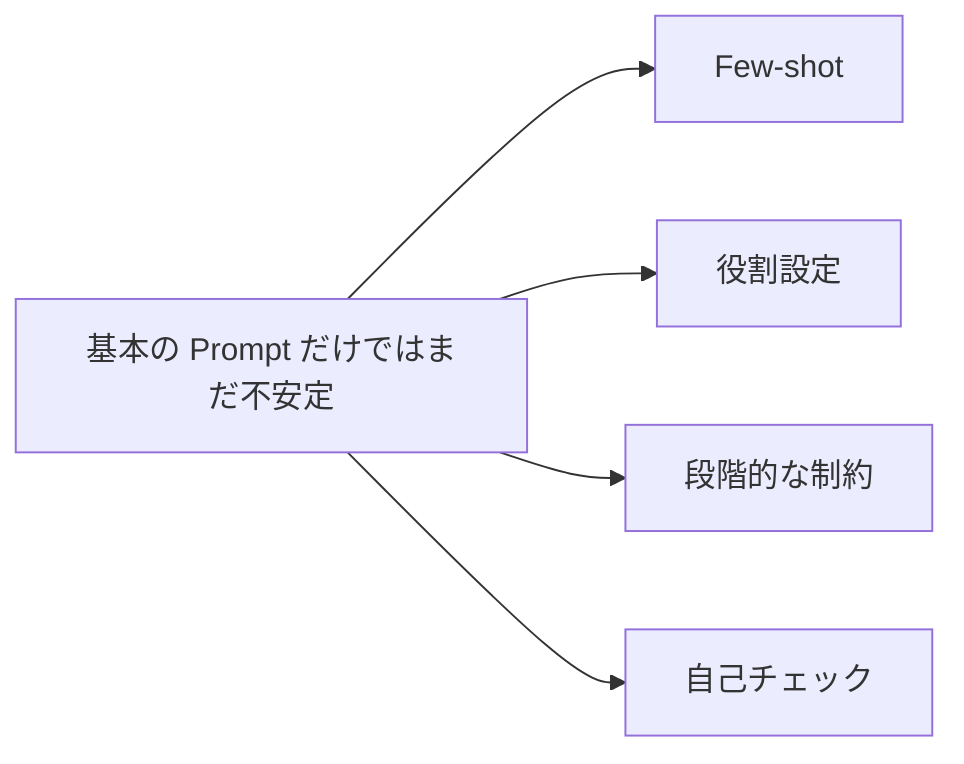

# 7.5.3 高度な Prompt 技巧

:::tip この節の位置づけ
Prompt の基礎を理解したら、次に自然に出てくる疑問は：

> **モデルをもっと安定させて、自分が望む結果に近づける方法はあるの？**

これが「高度な Prompt 技巧」の出番です。  
ただし、ここでいう「高度」とは「より派手」という意味ではなく、次のような意味です。

> **課題により合っている。**
:::

## 学習目標

- few-shot、役割設定、段階的な制約が、それぞれ何の問題を解決するのかを理解する
- いつ技巧を足す価値があるのか、いつ逆に Prompt を乱してしまうのかを判断できるようになる
- Prompt の改善は感覚ではなく実験に頼るべきだという意識を身につける
- よくある高度な技巧の本当の効果範囲を理解する

---

## まず全体像をつかもう

高度な Prompt 技巧を学ぶとき、初心者にとって一番よい理解のしかたは「見つけた技を何でも足す」ことではありません。まずは次の関係を整理しましょう。



この節で本当に解決したいのは、次の2点です。

- それぞれの技巧が、どんな問題を補っているのか
- いつ足すべきか、いつ足すと逆に Prompt が乱れるのか

### 初心者向けの、よりわかりやすい比喩

高度な Prompt 技巧は、次のように考えると理解しやすいです。

- 依頼書に、さらにガードレールや例を追加していく

基本の Prompt は：

- 仕事の内容をはっきり伝えること

高度な Prompt は、さらに：

- 例を追加する
- 出力の形を明確にする
- 条件を見落としていないか確認するよう促す

つまり「高度」とは、難しそうに見せることではなく、

- 失敗しやすい課題を、より安定して扱うこと

です。

## 一、なぜ「高度」な Prompt が必要なのか？

理由は、簡単な指示だけでは安定しない課題があるからです。

たとえば：

- ラベルの境界があいまい
- 出力フォーマットの要求が厳しい
- 仕事に複数段階のロジックがある
- 条件を見落としやすい

こうした場合は、より細かい誘導が必要になります。

ただし、最も大事な原則は今も同じです。

> **技巧が多ければよいのではなく、課題にどれだけ合っているかが大事。**

---

## 二、Few-shot：なぜ「例を見せる」とそんなに効くのか？

### どんな問題に向いている？

1つの定義だけでは説明しきれない課題では、few-shot がとても役立ちます。

たとえば：

- `fact` と `opinion`
- 情報抽出の項目形式
- ある固定された返答スタイル

### 最小限の few-shot の例

```python
few_shot_examples = [
    {"input": "北京は中国の首都です。", "output": "fact"},
    {"input": "この授業はとてもおもしろいです。", "output": "opinion"}
]

for ex in few_shot_examples:
    print(ex)
```

期待される出力：

```text
{'input': '北京は中国の首都です。', 'output': 'fact'}
{'input': 'この授業はとてもおもしろいです。', 'output': 'opinion'}
```

### 本当の役割は何？

これは単に「行数を増やす」ことではありません。

> **抽象的なルールを、真似できるお手本に変えること。**

境界があいまいな課題では、単なる定義よりも安定しやすいです。

### 初学者がまず覚えるとよい判断表

| 課題の様子 | まず試す価値が高い技巧 |
|---|---|
| ラベルの境界がとてもあいまい | few-shot |
| 出力のスタイルがいつも揃わない | 役割設定 or スタイル制約 |
| 課題に明確な複数ステップがある | 段階的な制約 |
| 条件漏れやフォーマットミスが多い | 自己チェック |

この表は初心者にとても向いています。なぜなら「技巧の一覧」を、次のような考え方に戻してくれるからです。

- どんな問題が起きたら、どの層を先に補うのか


:::tip 図の読み方
この図を読むときは、技巧を上から足していくのではなく、まず問題の種類を見てください。ラベルの境界があいまいなら few-shot、フォーマットが不安定なら構造制約、手順が複雑なら手順を明示的に分ける、条件漏れが多いなら自己チェックを加える、という考え方です。高度な Prompt の核心は「問題に合っていること」であって、「見た目が派手であること」ではありません。
:::

### 混同しやすい 4 つの用語

| 用語 | 意味 | いつ使うか |
|---|---|---|
| ゼロショット（Zero-shot） | 例を出さずに、タスクだけを直接渡す方法 | タスクが単純で、ラベル境界が明確なときにまず試す |
| 少数例提示（Few-shot） | 本番入力の前に、少数の入力と出力の例を見せる方法 | 定義だけでは足りず、モデルに判断例を真似してほしいとき |
| ロール提示 | モデルに特定の役割や文体で作業させる方法 | 口調、視点、専門的な境界を調整したいとき。タスク明確化の代わりにはならない |
| 自己チェック | 最終出力前に、制約を満たしているか確認させる方法 | フィールド漏れ、形式ミス、根拠のない事実が出やすいとき |

---

## 三、役割設定はいつ役に立つのか？

多くの Prompt には、次のような文があります。

- あなたは経験豊富な先生です
- あなたは法律アシスタントです
- あなたはコードレビュー担当です

### どんなときに本当に効果がある？

モデルに次のようなことを期待するときです。

- ある種のスタイルを使ってほしい
- ある種の作業モードに入ってほしい
- ある種の役割の境界を保ってほしい

このような場合、役割設定はとても役立ちます。

### でも、役割設定は魔法ではない

タスク自体があいまいなのに、次のように書くだけでは：

- あなたは世界最高の専門家です

結果が自動的に安定するとは限りません。

だから、次の判断がとても大切です。

> 役割設定は補助の層であって、タスク定義の代わりではない。 

### 「役割はタスク定義の代わりにならない」ことがわかる最小例

```python
bad_prompt = "あなたは世界最高の専門家です。この内容を処理してください。"
better_prompt = "あなたは授業の TA です。次の文章を 3 つの日本語の要点に要約してください。各要点は 20 字以内にしてください。"

print("bad_prompt   =", bad_prompt)
print("better_prompt=", better_prompt)
```

期待される出力：

```text
bad_prompt   = あなたは世界最高の専門家です。この内容を処理してください。
better_prompt= あなたは授業の TA です。次の文章を 3 つの日本語の要点に要約してください。各要点は 20 字以内にしてください。
```

この例は初心者にとても向いています。なぜなら次のことを思い出させてくれるからです。

- 役割設定は魔法の上乗せではない
- 本当に安定するかどうかは、タスク仕様がきちんと書けているかで決まる

---

## 四、段階的な制約がなぜ安定しやすいのか？

### 多くの課題は、もともと複数段階だから

たとえば：

1. まず事実を見つける
2. 次に判断する
3. 最後に構造化して出力する

これらを1文に全部詰め込むと、モデルが混乱しやすくなります。

### イメージ例

```text
以下の手順でタスクを完了してください:
1. まずテキストから重要な事実を抜き出す
2. 次に感情の傾向を判断する
3. 最後に JSON 形式で出力する
```

この書き方の核心は次のとおりです。

> タスクの内部構造を、明示的に書き出すこと。 

---

## 五、自己チェック（self-check）はなぜ出てくるのか？

### どんなときに特に意味がある？

モデルに次のようなミスをしてほしくないときです。

- 条件を落とす
- フォーマットを間違える
- 出力が制約と合わない

このような場合、最終出力の前にもう1段階チェックさせることができます。

### 最小のイメージ

```text
最終回答を出す前に、次の点を確認してください:
1. 重要な情報が抜けていないか
2. 出力フォーマットの条件を満たしているか
3. 元の文章にない事実を含めていないか
```

### この技巧の限界

ある程度は助けになりますが、万能薬ではありません。
特に向いているのは、次のような場面です。

- フォーマットに敏感
- 情報漏れに敏感

---

## 六、なぜ高度な技巧をむやみに重ねてはいけないのか？

技巧を1つ増やすたびに、次のものも増えます。

- Prompt の長さ
- 複雑さ
- デバッグの難しさ

だから、より成熟したやり方は「何でも足す」ことではなく、

- まず問題をはっきりさせて、必要な層だけを足すこと

です。

これは、Prompt エンジニアリングでとても大事な習慣です。

### 「段階的に技巧を足す」ための最小実験表

| 版 | 何を変えたか | いちばん観察すべき点 |
|---|---|---|
| v1 | タスク目標だけ | 出力がそれるかどうか |
| v2 | + 出力フォーマット | フォーマットが安定するか |
| v3 | + few-shot | 境界があいまいな課題が安定するか |
| v4 | + 自己チェック | 条件漏れが減るか |

この表は初心者に向いています。Prompt の改善を次のようなものに変えてくれるからです。

- 対照実験ができるプロセス

---

## 七、より安定した Prompt 改善の順番

「見つけた技巧を何でも足す」よりも、次の順番をおすすめします。

1. まずタスク目標をはっきり書く
2. 次に出力フォーマットをはっきり書く
3. それでも不安定なら、例を足す
4. それでも不安定なら、段階的な制約や自己チェックを加える

こうすると、次のことが判断しやすくなります。

- どの層の変更が本当に役立ったのか

## 初めて Prompt 改善をするときの、いちばん安定した戦略

毎回、技巧を1つだけ追加するのがおすすめです。たとえば：

1. まず出力フォーマットを変える
2. 次に 1〜2 個の few-shot を足す
3. それから段階的な制約を考える

役割設定、例、自己チェック、フォーマットを一度に全部重ねないでください。そうしないと、どの層が効いているのか分からなくなります。

---

## 八、よくある誤解

### Prompt は長いほど高度だと思う

長いだけで整理されていない Prompt は、むしろ悪化しやすいです。

### 何でも重ねて入れる

これでは、どの層が効いているのか分かりにくくなります。

### 感覚だけで調整して、小さな実験をしない

## 九、核心のポイント

- 高度な Prompt は「より派手」ではなく「より課題に合っている」こと
- few-shot、役割設定、段階的な制約、自己チェックにはそれぞれ境界がある
- いちばん安定した改善方法は、むやみに重ねることではなく、段階的に実験すること

Prompt の改善は、本質的には実験のプロセスでもあります。

## これをノートやプロジェクトにするなら、何を見せるとよいか

いちばん見せる価値があるのは、次のようなものです。

- 長くて複雑そうな Prompt の一覧

ではなく、次の4つです。

1. 元の Prompt
2. どの層の技巧を追加したか
3. それで出力がどう安定したか
4. 実はあまり役に立たなかった技巧は何か

こうすると、見る人に次のことが伝わりやすくなります。

- Prompt 改善の方法を理解している
- 単に技巧の名前を並べているだけではない

---

## 残す証拠

このページを終えたら、この証拠カードを残します。

```text
technique: few-shot, role, step constraint, self-check, or decomposition
fixed_cases: same test inputs before/after change
improvement: score or failure reduction
risk: overlong, conflicting, or overfit prompt
decision: keep only techniques that improve evidence
```

## まとめ

この節で最も大切なのは、いくつかの技巧名を覚えることではなく、次の点を理解することです。

> **高度な Prompt 技巧の本当の価値は、タスク定義、例示、制約、検証をより安定して行えるようにすることにある。**

Prompt を「より高度に見せる」ためではありません。

---

## 練習

1. 感情分類タスクのために、few-shot を含む Prompt を書いてみましょう。
2. 考えてみましょう：役割設定とタスク目標のどちらがより基礎的ですか？ なぜですか？
3. 自分の言葉で説明してください：「段階的な制約」が、あいまいな大きな指示よりも安定しやすいのはなぜですか？
4. なぜ、高度な Prompt 技巧で本当に大事なのは複雑さではなく、適合性だと言えるのでしょうか？

<details>
<summary>参考解答と解説</summary>

1. よい few-shot prompt は label set を定義し、少なくとも 2 つの labeled example を示し、新しい input も同じ format で分類させます。
2. task goal の方が基礎的です。role setting は tone や perspective を変えられますが、明確な objective、output contract、constraint の代わりにはなりません。
3. step-by-step constraint は、大きく曖昧な要求を確認可能な小さな decision に分けます。曖昧さが減り、failure の場所も見つけやすくなります。
4. advanced technique は failure mode に合ったときだけ有効です。role、example、reasoning instruction は多ければよいのではなく、task reliability を上げるために使います。

</details>
