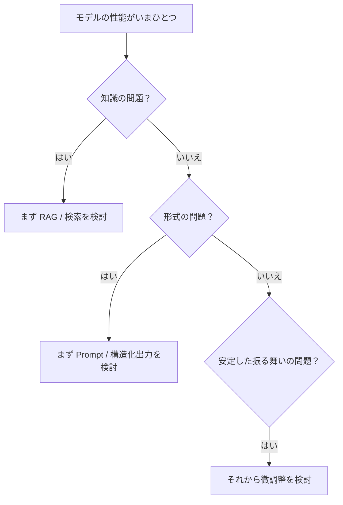
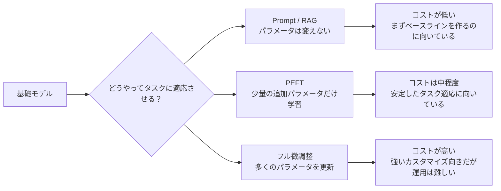

# 7.6.2 微調整の概要


:::tip この節の位置づけ
モデルのカスタマイズというと、多くの人が最初に思いつくのは：

- それを微調整する

ですが、実際の開発では、もっと大事な問いがあります。

> **この問題は、そもそも微調整で解決する価値があるのか？**

この節の核心は、「微調整」を万能ボタンのように持ち上げることではなく、判断の考え方をはっきりさせることです。
:::

## 学習目標

- 微調整が本当にどんな問題に向いているのかを理解する
- すべてのタスクで最初に微調整すべきではない理由を理解する
- フル微調整とパラメータ効率のよい微調整（PEFT）の基本的な考え方を区別する
- より実用的な微調整の判断感覚を身につける

---

## まずは全体像をつかもう

### まず、より実感しやすい場面を見てみよう

あなたが講座のQAアシスタントを作っているとします。公開後、次の3種類の問題が見つかりました。

- ある質問で答えが間違う。最新の講座ルールを知らないから
- 答えは合っているのに、出力形式がいつも安定しない
- 毎回、あなたのカスタマーサポートらしい口調から外れてしまい、ブランドの雰囲気に合わない

この3つは、どれも「モデルの性能が悪い」ように見えますが、解決方法は同じではありません。1つ目は知識の問題に近いので、まずは RAG を考えるのが自然です。2つ目は出力制約の問題に近いので、まずは Prompt か構造化出力を見直します。3つ目は長期的な振る舞いの調整に近いので、ここで初めて微調整に価値が出てきます。

だから、微調整を学ぶ前に、あわてて学習を始めるのではなく、まずは判断することを学びましょう。つまり、これは何の種類の問題なのかを見分けることです。

もしすでに事前学習と Prompt を学んでいるなら、この節は自然な続きです。

- これまでに、モデルの能力がどう作られるか、そしてパラメータを変えずにどう安定して呼び出すかを学んだ
- ここからは、Prompt だけでは足りず、本当にパラメータを変える必要があるのはいつかを考える

なので、微調整の概要で本当に大事なのは「学習できるかどうか」ではなく、次の点です。

- いつパラメータを変えるべきか
- パラメータを変える価値が本当にあるのか

微調整の概要を学ぶとき、新人にとって一番自然な順番は「まず学習する」ではなく、先に判断の分岐を確認することです。



この節が本当に解決したいのは、次の2つです。

- いつ微調整すべきか
- 微調整はどんな問題を解決できて、どんな問題は解決できないのか

## 一、微調整は何を解決するのか？

まずは、ざっくりこう理解できます。

> **基礎モデルを、より具体的なタスク、スタイル、または領域で、より安定して動かすようにすること。**

たとえば：

- ある固定の出力形式に、より強く従えるようにする
- ある業務の返信スタイルに、より合うようにする
- 特定の分野でよく出るタスク形式に、より適応させる

つまり微調整は、次のようなことをしていると考えられます。

- 能力の形を整える

単に、

- 知識を追加する

というだけではありません。

### 微調整を初めて学ぶとき、まず何をつかむべき？

最初に押さえるべきなのは、LoRA やフル微調整のような手法名ではなく、次の一文です。

> **微調整は、モデルに「知識を詰め込む」というより、モデルの振る舞いを形づくるものだ。**

この感覚がしっかりすると、後の判断がかなり楽になります。

- なぜ知識更新には RAG のほうが向いていることが多いのか
- なぜ形式の安定は、まず Prompt で改善することがあるのか
- なぜ長期的な振る舞いが安定しないときに、微調整を考える価値が出てくるのか

---

## 二、なぜすべての問題を最初に微調整で解決すべきではないのか？

多くの問題は、まず次を考えたほうがよいです。

- Prompt
- RAG
- ツール呼び出し

### 問題が「知識が新しくない」なら

自然な第一候補は、たいてい次のどちらかです。

- 検索
- RAG

### 問題が「出力形式が安定しない」なら

自然な第一候補は、たいてい次のどちらかです。

- Prompt の改善
- 構造化出力

### どんなときに微調整を優先して考える価値があるのか？

問題が次のようなものに近いときです。

- モデルの振る舞いが長期的に安定しない
- スタイルの要件が固定されている
- ある種のタスクが何度も出てきて、パターンも安定している

このとき、微調整の価値が高くなります。

まずは一言で覚えましょう。

> **これは知識の問題か、形式の問題か、それとも振る舞いの問題か。**

### 3種類の問題を見分ける表

| 問題の見え方 | どんな種類の問題に近いか | まず優先して考えるもの |
|---|---|---|
| モデルが会社の最新の返金ルールを知らない | 知識の問題 | RAG / 検索 / ナレッジベース更新 |
| 回答内容は合っているのに、JSON 形式がよく崩れる | 形式の問題 | Prompt / 構造化出力 / 検証と再試行 |
| モデルが固定の言い回しやタスクの雰囲気に長く合わない | 振る舞いの問題 | 微調整 / PEFT |
| ユーザーの質問に答える前にツールで確認が必要 | 行動の問題 | ツール呼び出し / Agent / ワークフロー |

この表はとても重要です。なぜなら、性能が悪いとすぐに微調整したくなる、というよくある失敗を防げるからです。実際のプロジェクトでは、パラメータを変えることで解決する問題ばかりではありません。


:::tip 図の読み方
この図は、原因から順に読むのがおすすめです。知識不足ならまず RAG、形式の不安定さならまず Prompt/構造化出力、ツールの流れの問題ならまず Agent/ワークフローを見ます。長期的な振る舞いやスタイルが安定しないときに、ようやく微調整や PEFT が候補になります。微調整は最初の反応ではなく、判断したあとに選ぶ手段です。
:::

---

## 三、フル微調整とパラメータ効率のよい微調整の違い

### フル微調整

直感的には、次のような意味です。

- モデルの大部分のパラメータを更新できる

メリット：

- 柔軟

デメリット：

- GPU メモリを多く使う
- コストが高い
- 学習が難しい

### パラメータ効率のよい微調整（PEFT）

直感的には、次のような意味です。

- モデル全体を大きく変えない
- 少量の追加パラメータだけを学習する

メリット：

- リソースを節約しやすい
- 再利用しやすい

だからこそ、実際のプロジェクトでは PEFT がますますよく使われています。

### 初めて PEFT を見るとき、何を先に覚えるべきか？

まず覚えるべきなのは、具体的なアルゴリズムの細部ではなく、次の点です。

- これは「リソースと運用コスト」の現実的な問題を解決するためのものだ

つまり、PEFT は流行っているから使うものではなく、

- モデル全体を大きく変えたくないときの、より現実的な適応方法

だと考えるとわかりやすいです。

---

## 四、適応方法のコストマップ



この図は、最初の方針選びのときの目安になります。右に行くほど変更は深くなり、コストも高くなります。そのぶん、安定したデータと明確な効果が必要になります。

---

## 五、最小パラメータ規模のイメージ

```python
params = {
    "full_finetune": 100_000_000,
    "peft": 5_000_000
}

for name, count in params.items():
    print(name, "trainable_params =", count)
```

期待される出力：

```text
full_finetune trainable_params = 100000000
peft trainable_params = 5000000
```

### このコードは何を伝えているのか？

正確な数を示しているわけではありません。伝えたいのは次のことです。

> 微調整方法の違いで、最初に効いてくる現実的なポイントは「どれだけのパラメータを変えるか」だ。

これはそのまま次のものに影響します。

- GPU メモリ
- 学習速度
- 保存コスト

---

## 六、どんなときに微調整は本当に価値があるのか？

### モデルに安定した振る舞いを身につけさせたいとき

たとえば：

- 特定の返信スタイル
- 特定のタスク形式
- 特定の領域の慣習

### 安定して継続的に使えるデータがあるとき

もしタスクデータが次のようなら：

- 量が十分ある
- 品質が高い
- パターンが比較的安定している

このとき、微調整は意味を持ちやすいです。

### どんなときはあまり向いていないのか？

要件がよく変わる場合や、知識が頻繁に更新される場合、  
多くの場面で微調整は第一候補ではありません。

---

## 七、微調整で最も過大評価されやすい点

### 誤解1：微調整はすべてを解決できると思うこと

そんなことはありません。  
多くの問題は、次のほうが向いています。

- 検索
- ワークフロー
- Prompt

### 誤解2：微調整すればモデルが「知識ベースを覚える」と思うこと

微調整は振る舞いを形づくるのに向いています。  
高速に更新される知識を入れる方法として、いつも最適とは限りません。

### 誤解3：学習さえすれば必ず強くなると思うこと

データの質が悪ければ、微調整でかえってモデルを壊してしまうこともあります。

---

## 八、とても実用的な判断の質問

微調整をするかどうか決める前に、次の質問をしてみましょう。

1. これは知識の問題か、それとも振る舞いの問題か？
2. このタスクの形は、長期的に安定して存在するか？
3. きれいで安定したデータがあるか？
4. 学習と運用のコストを本当に負担できるか？

この答えがはっきりすると、微調整の判断はかなり安定します。

### 初めてのプロジェクトで一番安定した進め方

実際にタスクを形にしたいなら、次の順番がおすすめです。

1. まず Prompt でベースラインを作る
2. 次に検索やワークフローで第2の ベースライン を作る
3. それでも振る舞いが長期的に安定しないなら、そこで微調整を考える

こうすると、最後に次のことを説明しやすくなります。

- 微調整が何を解決したのか
- それは本当に価値があったのか

---

## 残す証拠

このページを終えたら、この証拠カードを残します。

```text
problem_type: behavior adaptation, format, tone, or domain routine
not_for: missing facts that RAG should supply
cost_map: full fine-tune vs PEFT vs prompting
eval_baseline: pre-finetune behavior recorded
go_no_go: enough quality data and stable evaluation
```

## まとめ

この節で最も重要なのは、微調整をデフォルトの動作として考えるのではなく、次のように理解することです。

> **微調整は、「モデルの振る舞い」と「タスクへの適応」の問題に向いているのであって、あらゆる問題に向いているわけではない。**

この判断ができるようになると、次に LoRA、QLoRA、そして実践的な開発を学ぶときに、むやみに手を動かさなくなります。

## この節で持ち帰るべきこと

- 微調整はデフォルト動作ではなく、コストの高い適応手段
- まず知識の問題、形式の問題、振る舞いの問題を区別する
- タスクが長期的に安定し、データが信頼でき、効果がはっきりしているときに、微調整はより優先する価値がある

---

## 九、練習

1. あなたの実際のプロジェクトを1つ思い浮かべて、それが知識の問題か振る舞いの問題かを判断してみましょう。
2. 自分の言葉で説明してみましょう。なぜすべてのタスクで最初に微調整すべきではないのでしょうか？
3. 要件が頻繁に変わるなら、なぜ微調整は第一選択になりにくいのでしょうか？
4. なぜ「方法名」よりも「データ品質」のほうが、微調整の結果に大きく影響しやすいのでしょうか？
