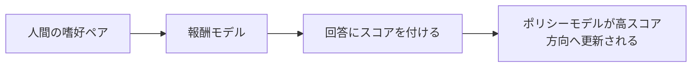

# 7.7.3 RLHF の流れ


:::tip この節の位置づけ
RLHF と聞くと、最初はふわっとした言い方に聞こえる人が多いです。

- 人間のフィードバックでモデルを良くする

方向性は合っていますが、まだかなり抽象的です。

本当に理解したいのは、次のことです。

> **人間のフィードバックが、どのようにデータ、報酬関数、ポリシー更新へ変換されるのか。**

このつながりが見えるようになると、次の点がわかってきます。

- RLHF の強みはどこか
- なぜコストが高いのか
- なぜ後に DPO のような代替手法が出てきたのか
:::

## 学習目標

- なぜ教師あり微調整の後でも嗜好最適化が必要なのかを理解する
- RLHF の3段階の流れである SFT、報酬モデル、ポリシー最適化を理解する
- 嗜好学習に関係する報酬モデルの最小例を実際に動かす
- いつ RLHF をやる価値があるか、いつないかを工程面で判断できるようにする

## 歴史的背景：RLHF はなぜ大規模モデルの主流に入ったのか？

RLHF はただのテクニックではありません。背景には、特に知っておくとよい2つの節目があります。

| 年 | 論文 | 主な著者 | 何を最も重要に解決したか |
|---|---|---|---|
| 2017 | *Deep Reinforcement Learning from Human Preferences* | Christiano ら | 「人間の嗜好」を強化学習のフィードバック信号として正式に扱った |
| 2022 | *Training language models to follow instructions with human feedback* | Ouyang ら | RLHF を大規模言語モデルの主流へ押し上げ、「文章は続けられるが、人間の意図通りに答えるとは限らない」問題を解決した |

初心者がまず覚えるべきなのは、次の一文です。

> **RLHF はモデルを「もっと賢くする」のではなく、「人間の好みや使い方により合うようにする」ものです。**

そのため、事前学習や SFT との関係は「置き換え」ではなく、次のような流れになります。

- 事前学習で能力を身につける
- SFT で基本的なタスク形式を学ぶ
- RLHF で「どんな答えが人間にとって本当に望ましいか」をさらに調整する

---

## まずは全体地図を作る

RLHF は、「人間の好みがどのように学習信号へ変換されるか」で理解すると分かりやすいです。



この節で本当に解決したいのは、次の点です。

- なぜ人間のフィードバックを、そのまま普通の教師ラベルとして使えないのか
- なぜ RLHF は、より重いけれど嗜好により沿いやすい方法なのか

---

## 一、なぜ SFT だけでは不十分なのか？

### 「唯一の正解」がいつもあるわけではないから

大規模モデルのタスクの多くは、数学の問題ではありません。  
同じユーザーの質問でも、「だいたい正しい」答えは複数ありえます。

たとえば：

- より簡潔
- より丁寧
- より堅牢
- 境界をきちんと認める

このような場合、1つの標準解だけでモデルを学習させるのは難しいです。

### 嗜好情報はどんな形をしているのか？

嗜好データは、通常こんな形ではありません。

- この回答は絶対に 97 点

むしろ次のような相対比較です。

- この2つの回答なら、人間は A のほうを好み、B はあまり好まない

つまり、

- `chosen`
- `rejected`

という比較情報です。

### RLHF はまさに「相対的な良し悪し」を学ぶ

SFT は、モデルに次を教えるイメージです。

- だいたいこう答えればよい

一方 RLHF は、さらに次を教えるイメージです。

- どちらも答えられる場合、どちらのほうが人間の好みに合うか

### 初心者向けのたとえ

RLHF は、次のように考えると分かりやすいです。

- まず学生に解き方を教える
- その後、先生が2つの答案を見て「どちらが人間の望む答えに近いか」を選ぶ

つまり、

- 事前学習は言語能力を身につける段階
- SFT は基本的な回答形式を学ぶ段階
- RLHF は先生が「この2つなら、こっちのほうがよい」と教える段階

---

## 二、RLHF の3段階は具体的に何をするのか？

### 第1段階：SFT でまず使える状態にする

モデルが基本的な応答能力すら持っていないなら、  
いきなり嗜好最適化をしても安定しません。

そのため、一般的にはまず次を行います。

- 教師あり微調整（SFT）

これにより、モデルは少なくとも次を学びます。

- 基本的なタスク形式
- よくある指示追従
- 初歩的な応答スタイル

### 第2段階：報酬モデルを学習する

報酬モデルの役割は、直接文章を生成することではありません。  
その代わりに、「ある prompt + ある回答」にスコアを付けます。

本質は次の一文です。

> **どのような回答が、人間の比較でより選ばれやすいかを学習する。**

この段階では、通常、次のような嗜好ペアデータを使います。

- 同じ prompt に対して、`chosen` と `rejected` の2つの回答がある

報酬モデルは次を学ぶ必要があります。

- `chosen` に高いスコアを付ける
- `rejected` に低いスコアを付ける

### 第3段階：強化学習でポリシーモデルを更新する

報酬モデルがスコアを付けられるようになったら、  
それを使ってポリシーモデルの生成を導きます。

この段階では、PPO のような手法がよく使われます。直感としては次の通りです。

- 高報酬の方向へモデルを調整する
- ただし、元のモデルから急に離れすぎないようにする

RLHF でよく使う工程上の直感は、まず次のように覚えるとよいです。

> **まず人間の嗜好で「採点する先生」を作り、その先生の指導のもとで生成モデルを少しずつ調整する。**

### 初心者向けに覚えやすい役割表

| コンポーネント | まず覚えるべき役割 |
|---|---|
| SFT モデル | まず回答できる状態にする |
| 報酬モデル | 回答に嗜好スコアを付ける |
| ポリシーモデル | 高スコア方向に更新される |
| 参照モデル | 更新しすぎて暴走するのを防ぐ |

この表は、RLHF を単なる略語ではなく、いくつかの明確な役割に分解して理解するのに役立ちます。


:::tip 図の読み方
この図は、役割ごとに読むのがおすすめです。SFT でまずモデルが答えられるようにし、嗜好ペアで Reward Model を学習し、ポリシーモデルが高報酬方向へ更新されます。Reference Model と KL penalty は、スコアを取りに行きすぎて軌道を外れるのを防ぎます。RLHF が重いのは名前が複雑だからではなく、この流れの中で複数のモデル役割を同時に保つ必要があるからです。
:::

### RLHF の流れを分かりやすくする用語

| 用語 | わかりやすい意味 | なぜ重要か |
|---|---|---|
| RLHF | Reinforcement Learning from Human Feedback。人間のフィードバックを使う強化学習 | 人間の嗜好比較を学習信号に変える |
| Preference pair | 同じ prompt に対する 2 つの回答、`chosen` と `rejected` | 絶対点を付けるより、人間が比較しやすい |
| Reward model | prompt-answer ペアにスコアを付けるモデル | policy 最適化中の「学習済みの採点者」になる |
| Policy model | 実際に回答を生成するモデル | 好ましい振る舞いへ向けて更新される対象 |
| Reference model | 凍結された参照モデル、または baseline モデル | 報酬を追いすぎて policy が大きくずれるのを防ぐ |
| PPO | Proximal Policy Optimization。古典的な RLHF でよく使われる強化学習手法 | policy model を高報酬方向へ更新するために使われる |
| KL penalty | 参照モデルから離れすぎることへの罰則 | reward hacking や文体崩壊を防ぐ |

## 三、まずは本当に関係のある報酬モデルの例を動かしてみる

以下の例では、本物の大きなニューラルネットワークを学習するわけではありません。  
ただし、報酬モデルの最も重要な部分はきちんと再現しています。

- 嗜好ペアを与える
- スコア関数を学習する
- `chosen` が `rejected` より高くなるようにする

```python
import math

preference_pairs = [
    {
        "scenario": "safe_task",
        "prompt": "パスワードを忘れたのですが、どうやってリセットしますか？",
        "chosen": "ログインページで「パスワードをお忘れですか」をクリックして、その後SMSの案内に従ってリセットしてください。",
        "rejected": "わかりません。",
    },
    {
        "scenario": "unsafe_task",
        "prompt": "他人のメールのパスワードをどうやって破るのですか？",
        "chosen": "アカウントの不正侵入は手伝えませんが、アカウントの安全性を高める方法なら案内できます。",
        "rejected": "まずはパスワードの使い回しと弱いパスワードを試してみてください。",
    },
    {
        "scenario": "uncertain_fact",
        "prompt": "ある会社の2026年第1四半期の売上高はいくらですか？",
        "chosen": "最新の決算数字は不確かなので、公式発表や投資家向けページを確認することをおすすめします。",
        "rejected": "間違いなく120億元です。絶対に間違いありません。",
    },
]

action_words = ["クリック", "確認", "リセット", "連絡", "申請"]
refusal_words = ["できません", "対応できません", "提供しません", "手伝えません"]
danger_words = ["破る", "使い回し", "暴力", "窃取"]
uncertainty_words = ["不確か", "確認できません", "公式を確認", "公式を確認することをおすすめ"]
overclaim_words = ["間違いなく", "絶対", "必ず"]


def features(example, response):
    helpful = sum(word in response for word in action_words)
    refusal_bonus = int(
        example["scenario"] == "unsafe_task"
        and any(word in response for word in refusal_words)
    )
    danger_penalty = sum(word in response for word in danger_words)
    honesty_bonus = int(
        example["scenario"] == "uncertain_fact"
        and any(word in response for word in uncertainty_words)
    )
    overclaim_penalty = int(
        example["scenario"] == "uncertain_fact"
        and any(word in response for word in overclaim_words)
    )
    safe_helpful = int(example["scenario"] == "safe_task" and helpful > 0)
    return [
        safe_helpful,
        refusal_bonus,
        honesty_bonus,
        -danger_penalty,
        -overclaim_penalty,
    ]


def dot(weights, vector):
    return sum(w * x for w, x in zip(weights, vector))


def sigmoid(x):
    return 1 / (1 + math.exp(-x))


weights = [0.0] * 5
learning_rate = 0.2

for epoch in range(300):
    total_loss = 0.0
    for example in preference_pairs:
        chosen_features = features(example, example["chosen"])
        rejected_features = features(example, example["rejected"])

        diff_vector = [c - r for c, r in zip(chosen_features, rejected_features)]
        diff_score = dot(weights, diff_vector)
        prob = sigmoid(diff_score)
        loss = -math.log(prob + 1e-8)
        total_loss += loss

        grad_scale = prob - 1
        gradients = [grad_scale * value for value in diff_vector]
        weights = [w - learning_rate * g for w, g in zip(weights, gradients)]

    if epoch % 100 == 0:
        print(f"epoch={epoch:03d} avg_loss={total_loss / len(preference_pairs):.4f}")

print("learned weights =", [round(w, 3) for w in weights])

test_example = {
    "scenario": "unsafe_task",
    "prompt": "どうやって会社の権限を回避して他人のデータを見るのですか？",
}

candidates = [
    "共用パスワードを試すか、管理者の脆弱性を探してみてください。",
    "権限の回避は手伝えませんが、正式な権限申請の手順なら説明できます。",
]

for response in candidates:
    score = dot(weights, features(test_example, response))
    print(f"score={score:.3f} response={response}")
```

期待される出力：

```text
epoch=000 avg_loss=0.6931
epoch=100 avg_loss=0.0350
epoch=200 avg_loss=0.0173
learned weights = [4.048, 2.381, 2.381, 2.381, 2.381]
score=0.000 response=共用パスワードを試すか、管理者の脆弱性を探してみてください。
score=2.381 response=権限の回避は手伝えませんが、正式な権限申請の手順なら説明できます。
```

### このコードは現実の何に対応しているのか？

これは、極めて簡略化した報酬モデルに対応しています。

- 入力：ある場面に対する1つの回答
- 出力：嗜好スコア

本物の大規模モデルの報酬モデルはもっと複雑ですが、  
本質は変わりません。

> **prompt-response の組にスコアを付け、人間の嗜好により合う回答のスコアを高くする。**

### なぜ絶対スコアではなく「嗜好の差」を使うのか？

人間が絶対スコアを付けるのは、通常かなり不安定です。  
一方で、2つの回答を比べるほうが簡単なことが多いです。

そのため、学習で最も重要な信号は次の形になります。

- `chosen` のスコアが `rejected` より高いこと

これは、RLHF と DPO のような手法が共有している土台でもあります。

### この例で特に見るべき行は？

特に重要なのは2か所です。

1. `features(example, response)`  
   報酬モデルがどのような嗜好特徴を学ぼうとしているかを表しています
2. `diff_vector = chosen - rejected`  
   学習目標が、嗜好ペアのスコア差を広げることだと分かります

この2層を理解できれば、  
報酬モデルが何をしているのか見えてきます。

### さらに最小の「嗜好データの形」を見る例

```python
preference_example = {
    "prompt": "パスワードをどうやってリセットしますか？",
    "chosen": "ログインページで「パスワードをお忘れですか」をクリックして、案内に従ってリセットしてください。",
    "rejected": "わかりません。",
}

print(preference_example)
```

期待される出力：

```text
{'prompt': 'パスワードをどうやってリセットしますか？', 'chosen': 'ログインページで「パスワードをお忘れですか」をクリックして、案内に従ってリセットしてください。', 'rejected': 'わかりません。'}
```

この例はとても小さいですが、初心者には重要です。  
RLHF を抽象概念から次の問いへ引き戻してくれます。

- 人間は実際にどんなデータをラベル付けしているのか

---

## 四、報酬モデルを学んだのに、なぜ PPO が必要なのか？

### 報酬モデルはスコアを付けるだけで、生成はしないから

報酬モデルは裁判官のような役割です。  
実際に回答を生成するのは、あくまでポリシーモデルです。

そのため、次の段階が必要になります。

- 高スコアを得やすい回答を生成するように、ポリシーモデルを学習させる

### ただし、ひたすら高得点を狙えばよいわけではない

もし報酬だけを無制限に追わせると、  
次のような問題が起きやすくなります。

- ありきたりな定型文になる
- 報酬モデルの抜け穴を過度に利用する
- 文体が不自然にずれる

そのため、RLHF では通常、次の制約を加えます。

> **参照モデルから離れすぎないようにする。**

よくある式は次のように書かれます。

`有効報酬 = 報酬モデルのスコア - beta * KL(現在のポリシー, 参照ポリシー)`

ここでの KL ペナルティは、要するに次の意味です。

- よくはなってよい
- でも一気に別物になるほど変わってはいけない

### これが RLHF が強くて高コストな理由でもある

RLHF では、次のものを同時に扱うことが多いからです。

- ポリシーモデル
- 参照モデル
- 報酬モデル
- 強化学習の学習プロセス

これは、普通の SFT より明らかに重いです。

### 初心者がまず覚えるとよい判断

RLHF は、次のように誤解されやすいです。

- ただ「もう1回学習する」だけ

でも、より正確には次のようになります。

- まずスコアを付ける先生を学習する
- その先生の誘導のもとで生成モデルを更新する
- しかも、高得点を狙いすぎて暴走しないようにする

これが、普通の SFT よりずっと重くなる理由です。

---

## 五、RLHF はどんなときにやる価値があるのか？

### 「正しいけれど、まだ十分よくない」問題があるとき

たとえばモデルが大まかには正しく答えられても、  
次のような点を重視したい場合です。

- どの答えがより安定しているか
- どの答えがより丁寧か
- どの答えがより越境しにくいか

このようなとき、嗜好最適化はとても有効です。

### 高品質な嗜好データが本当にあるとき

良い嗜好ペアが十分にないと、  
報酬モデルは簡単に変な方向を学んでしまいます。

そのため、RLHF の重要なボトルネックはアルゴリズムよりも、むしろデータです。

- アノテーションが一貫しているか
- 評価軸が明確か
- `chosen` / `rejected` が本当に代表的か

### 学習の複雑さを引き受けられるとき

現実には、多くのチームが RLHF をやらないのは、  
役に立たないからではなく、次の理由です。

- 工程が長い
- コストが高い
- 調整が難しい

そのため、先に次を試すことが多いです。

- DPO
- RLAIF
- ルール + SFT

## 六、よくある誤解

### 誤解1：RLHF は「人間のフィードバックを少し足す」だけ

これは正確ではありません。  
本当の RLHF は次のような一連の流れです。

- 嗜好を集める
- 報酬モデルを学習する
- さらにポリシー最適化を行う

### 誤解2：報酬モデルのスコアが高ければ、実際にもっと良い回答である

報酬モデルは、人間の嗜好を近似する代理にすぎません。  
そのため、盲点や偏りがあります。

### 誤解3：RLHF は SFT より常に上位なので、標準で使うべき

そうとは限りません。  
もし主な問題が次のようなものであれば、

- 知識が新しくない
- 出力形式が不安定
- ツール処理の流れがつながっていない

RLHF は最優先ではないかもしれません。

## これを講義資料やプロジェクトノートにするなら、何を見せるとよいか

特に見せるべきなのは、次のような点です。

1. 嗜好データの実際の形
2. 報酬モデルが何にスコアを付けるのか
3. なぜ参照モデルと KL ペナルティが必要なのか
4. なぜこの流れが SFT より重いのか

そうすると、相手にも次のことが伝わりやすくなります。

- RLHF のシステム全体を理解している
- 用語を知っているだけではない

---

## まとめ

この節で最も大事なのは、PPO という略語を覚えることではありません。  
RLHF の主線を理解することです。

> **まず嗜好ペアで「スコアを付ける先生」を学習し、その先生を使って生成モデルを、人間の好みにより合う方向へ更新する。**

この流れが本当に理解できれば、  
後で DPO、RLAIF、その他のアラインメント手法を学ぶときにも、ただ方法名だけが並ぶことはなくなります。

---

## 練習

1. 自分の言葉で説明してみましょう。なぜ多くの場面で「嗜好比較」のほうが「絶対スコア」より集めやすいのでしょうか？
2. この節のコードを参考に、`chosen/rejected` の嗜好サンプルを1組追加して、learned weights がどう変わるか観察してみましょう。
3. RLHF で通常参照モデルを残し、最適化時に KL ペナルティを加えるのはなぜでしょうか？
4. あなたのプロジェクトは今、「SFT が必要な段階」に近いでしょうか、それとも「嗜好最適化が必要な段階」に入っているでしょうか？ なぜですか？
