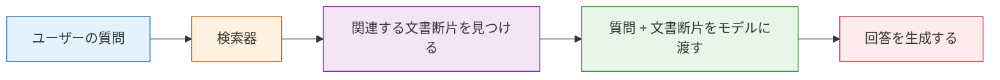
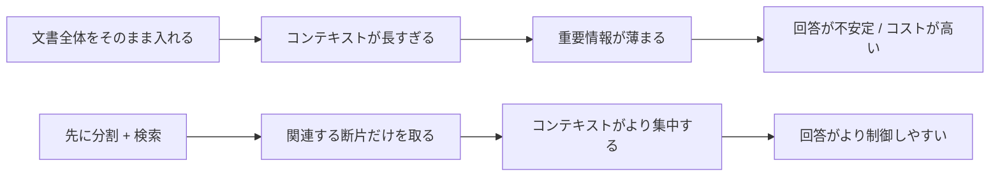

# 8.1.2 RAG 基礎


:::tip この節の位置づけ
RAG は次のように誤解されやすいです：

- ベクトルDBをつなげばそれでよい

でも、本当はもっとこういうものです：

- まず資料を調べてから、どう答えるかを決める仕組み

なので、この節でいちばん大事なのはコンポーネント名を覚えることではなく、まず次の判断軸を持つことです：

> **RAG の本質は「モジュールを1つ増やすこと」ではなく、「知識を正しく処理経路に接続すること」。**
:::

## 学習目標

この節を終えると、次のことができるようになります。

- 大規模モデルのパラメータ記憶だけでは不十分な理由を理解する
- RAG の標準的なワークフローを説明できる
- 最小構成の検索拡張サンプルを実行できる
- RAG が向いている場面、向いていない場面を理解する

---

## 初学者はまず把握 / 上級者はさらに理解

初心者なら、この節ではまず1つの文だけ押さえてください。RAG はモデルに「もっと覚えさせる」仕組みではなく、回答の前に適切な資料を先に調べる仕組みです。まずは「問題 -> 検索 -> 断片 -> コンテキストに結合 -> 回答生成」という流れを理解しましょう。

すでに大規模モデルアプリを作ったことがあるなら、さらに次の点に注目できます：分割戦略、検索の再現率、リランキング、メタデータ、引用元、検索ログ、失敗例の分析です。RAG プロジェクトの成熟度は、こうした実装の細部に表れます。

---

## まずは全体図をつかむ

### まずは物語で理解する：閉じた試験と、開いて調べる試験

同級生に「この講座は何日以内なら返金できますか？」と聞いたと想像してください。もし規約を見ずに印象だけで答えると、話は流暢でも正確とは限りません。より確実なのは、まず講座の規約を開いて返金条件を確認し、そのうえで答える方法です。

RAG は、この習慣をシステム化するものです。モデルは引き続き、質問を理解し、言葉を組み立てる役割を担いますが、大事な事実は先に知識ベースから調べてきます。そうすることで、回答はより早く、制御しやすく、追跡しやすくなります。

もし Prompt とファインチューニングの考え方を学び終えたところなら、この節は次のように捉えるとよいです。

- Prompt は「タスクをどう表現するか」を解決する
- ファインチューニングは「振る舞いをどう形作るか」に近い
- RAG は「知識が新しくない / 十分でないときに、どう先に調べてから答えるか」を解決する

つまり、この節で本当に重要なのは「また新しい用語が出てきた」ということではなく、次の点です。

- 大規模モデルシステムの中で、外部知識を接続する役割を担っている

### 初学者向けの、よりわかりやすい比喩

RAG は次のように考えるとわかりやすいです。

- とても賢い人が、質問に答える前にまずマニュアルを読む

マニュアルを読まないと、その人は次のようになりがちです。

- 印象で答える
- 返答は流暢でも、必ずしも正確ではない

RAG があると、システムは次のようになります。

- まず証拠を探す
- その証拠に基づいて答える


この図は、この章で何度も出てくる主線です。質問、検索、証拠確認、出典付き回答、という流れです。

## なぜ RAG が必要なのか？

大規模モデルは「たくさんの本を読んだ人」にたとえられます。  
でも、たくさん読んでいても、次の3つの問題に出会います。

1. 情報が新しすぎて、学習時には存在していない
2. 情報が専門的すぎて、モデルの記憶が頼りない
3. 回答が、あなた自身のプライベート文書に厳密に基づいている必要がある

このときに必要なのが RAG です。

> **先に資料を調べて、それから答える。**

たとえるなら：

- 純粋なモデルの回答：閉じた試験
- RAG の回答：開いた試験

### RAG を学び始めたら、まず何をつかむべきか？

最初に押さえるべきなのはベクトルDBではありません。この一文です。

> **RAG の本質は「モデルを賢くすること」ではなく、「答えを更新可能な資料の上にまず載せること」。**

この考え方が安定すると、その後に出てくる

- 分割
- 検索
- リランキング
- コンテキスト結合

が、すべてどの主線を支えているのか自然に見えてきます。

---

## RAG の標準フロー



分解すると、次の流れです。

1. 文書を先に小さなチャンクに分ける
2. ユーザーが質問したら、知識ベースから関連チャンクを検索する
3. それらのチャンクをコンテキストとしてモデルに渡す
4. モデルがコンテキストに基づいて回答を生成する

### なぜこの流れは最後の生成だけ見ていてはだめなのか？

なぜなら、RAG の問題は前段で起きていることが多いからです。

- 文書の分け方がよくない
- 検索の再現率が低い
- リランキングがうまくできていない
- コンテキストの結合方法が適切でない

だから RAG の本質は「生成前に文字数を増やすこと」ではなく、

- 正しい資料が、正しいタイミングでモデルのコンテキストに入るようにすること

です。

### 初学者がまず覚えるとよい、よくある不具合の切り分け表

| 現象 | まず疑うべき場所 |
|---|---|
| まったく違う回答になる | 関連チャンクの検索失敗 |
| 回答は半分合っていて半分違う | 文書断片が不完全、または分割がよくない |
| 文書はあるのに答えられない | 検索スコア、並び順、またはコンテキスト結合に問題 |
| 証拠はあるのに要約を間違える | 生成段階で証拠を正しく使えていない |

この表はとても大事です。初学者が遠回りするのをかなり減らせます。

- RAG に問題が起きたとき、すぐに「全部モデルのせい」と決めつけないこと


:::tip 図の見方
図を左から順に見て、次の3点を確認してください。正しい資料が検索可能なチャンクになっているか、top-k に入っているか、最終的な context に入っているか。この3層すべてに問題がないときに初めて、生成モデル自体を疑います。
:::

---

## 最小構成で動くミニ RAG

コードがそのまま動くように、ここではベクトルDBを使わず、いちばん簡単なキーワード重複で「検索」を再現します。

```python
import re
from collections import Counter

documents = [
    {
        "id": 1,
        "title": "返金ポリシー",
        "content": "講座購入後 7 日以内で、学習進捗が 20% 未満なら、返金を申請できます。"
    },
    {
        "id": 2,
        "title": "修了証の説明",
        "content": "必修項目をすべて完了し、修了テストに合格すると、講座修了証を受け取れます。"
    },
    {
        "id": 3,
        "title": "学習方法",
        "content": "この講座は段階的に学習できます。まず Python、データ分析、機械学習の基礎を終えることをおすすめします。"
    }
]

def tokenize(text):
    return re.findall(r"[\w\u4e00-\u9fff\u3040-\u30ff]+", text.lower())

def overlap_score(query, doc_text):
    query_tokens = tokenize(query)
    doc_tokens = tokenize(doc_text)
    query_count = Counter(query_tokens)
    doc_count = Counter(doc_tokens)
    return sum(min(query_count[t], doc_count[t]) for t in query_count)

def retrieve(query, documents, top_k=2):
    scored = []
    for doc in documents:
        score = overlap_score(query, doc["content"] + " " + doc["title"])
        scored.append((score, doc))
    scored.sort(key=lambda x: x[0], reverse=True)
    return [doc for score, doc in scored[:top_k] if score > 0]

def answer_with_rag(query):
    hits = retrieve(query, documents, top_k=2)
    if not hits:
        return "知識ベースに十分関連する情報が見つかりませんでした。"

    context = "\\n".join([f"- {doc['title']}：{doc['content']}" for doc in hits])
    return f"知識ベースの検索結果に基づくと：\\n{context}\\n\\n回答：上の条項を優先して参照してください。"

query = "講座は何日以内なら返金できますか？"
print(answer_with_rag(query))
```

この例は簡略化されていますが、RAG の構造はすでに完全に表しています。

### さらに最小の「検索ログ」例

```python
query = "講座は何日以内なら返金できますか？"
hits = retrieve(query, documents, top_k=2)

for doc in hits:
    print({"query": query, "hit_title": doc["title"], "content": doc["content"]})
```

このログは初心者にとても役立ちます。なぜなら、まず次の大事な問いに答えられるからです。

- システムは実際に何を見つけたのか

RAG の多くの問題は、このログを見るだけで半分くらい切り分けられます。

---

## RAG は何を本当に改善するのか？

RAG が主に改善するのは次の3つです。

### 即時性

資料はいつでも更新でき、大規模モデルを再学習しなくてよいです。

### 制御しやすさ

回答はあなたが指定した知識ベースに基づき、モデルが自由に発想しすぎません。

### 追跡可能性

「どの文書断片を参考にしたのか」をユーザーに見せられます。

これは特に企業シーンで重要です。

### なぜこの3点は「モデルのパラメータが大きいかどうか」より、実務価値に近いのか？

なぜなら、これらはすべてシステムの実用性に直接つながるからです。

- 即時性は知識更新の効率を左右する
- 制御しやすさは、回答が業務の範囲から外れないかを左右する
- 追跡可能性は、システムが信頼できて監査可能かを左右する

### 初めて RAG プロジェクトを作るときの、いちばん堅実な順番

より安全なのは、普通は次の順番です。

1. まず知識範囲を絞る
2. いちばん単純な検索ベースラインを作る
3. 検索ログを理解できるようにする
4. そのあとでモデル生成をつなぐ
5. 最後にリランキングや、より複雑な戦略を追加する

こうすると、最初から複雑なベクトルDBや reranker を追うより、説明可能なシステムを作りやすいです。

---

## RAG は「何でも幻覚しなくなる」わけではない

これはとてもよくある誤解です。

RAG は幻覚を減らせますが、完全には消せません。  
次のような場所で、まだ問題が起きます。

- 検索が間違っている
- 検索が不十分
- 文書の分割がよくない
- モデルが証拠を受け取っても、要約を間違える

つまり、RAG は万能薬ではなく、「回答に根拠を持たせやすくする」ための実装方法です。

---

## RAG が特に向いている場面

### とても向いている

- 企業ナレッジベースの Q&A
- ポリシー / 規則 / FAQ の検索
- 製品ドキュメントに基づくカスタマーサポート
- コードベース / ドキュメントベースの検索 Q&A

### あまり向いていない

- 完全に自由な創作タスク
- そもそも知識ベースが存在しない場面
- 正確な数値計算が必要だが、元の文書自体が不安定な場面

---

## RAG とファインチューニングの関係

多くの初学者は、これらを混同しがちです。

### RAG

- モデルのパラメータは変えない
- 「外部資料をコンテキストに注入する」ことで動く

### ファインチューニング

- モデルのパラメータを変更する
- モデルに、ある種類のスタイルや能力を長期的に覚えさせる

たとえば：

- RAG：試験に資料を持ち込む
- ファインチューニング：試験前に長く訓練する

両者は排他的ではなく、多くのシステムでは両方を組み合わせます。

---

## もう少し「プロダクト」っぽい小さな例

上のミニ RAG を少しだけ「講座アシスタント」らしくしてみましょう。

```python
questions = [
    "修了証はどうやってもらえますか？",
    "学習の順番はどう組めばいいですか？",
    "返金できますか？"
]

for q in questions:
    print("=" * 50)
    print("ユーザーの質問:", q)
    print(answer_with_rag(q))
```

これは、多くの AI Q&A 製品の最小プロトタイプです。

---

## 目標が「ナレッジベース駆動の教材生成アシスタント」なら、この節で何を一番重視すべきか？

この種のプロジェクトでは、RAG で重要なのは「それっぽいテキストをいくつか見つけること」ではありません。  
次のようなものを見つけることです。

- 関連する知識ポイント
- 関連する例題
- 関連する練習問題
- そして、それぞれがどの資料のどのページから来たか

つまり、知識チャンクは単なる

- 1つの文章

であるより、少なくとも次のフィールドを持っているほうがよいです。

```python
courseware_chunk = {
    "topic": "割引の応用問題",
    "content_type": "example",
    "source_type": "docx",
    "page_or_slide": 3,
    "text": "商品価格が 100 元のとき、2 割引後の価格はいくらですか？",
}

print(courseware_chunk)
```

これは、その後に次のことをできるかどうかに直接影響します。

- テーマに応じて例題を検索する
- 概念、例題、練習を分けて整理する
- 最終的な Word に出典説明を残す

## RAG では内部資料と外部資料をどう役割分担させるべきか？

システムが内部知識ベースも外部資料も検索するなら、  
いちばん堅実な基本原則は次の通りです。

| 資料の種類 | 主に担当すること |
|---|---|
| 内部資料 | 主な知識点、例題、企業内または講座内のルール |
| 外部資料 | 新しい問題形式、背景補足、最新の公開情報 |

つまり、この種のプロジェクトでは、RAG の重要な判断は次の一文に集約されます。

> **内部資料が主骨格、外部資料が空白を補う。**

この線引きが曖昧だと、システムは簡単に次のようになります。

- 内部文書に標準の書き方があるのに、最後は外部の内容に引っ張られてしまう

## 初学者によくある誤解

### RAG の核心は「ベクトルDBを呼び出すこと」だと思う

違います。  
RAG の核心は：**正しい資料を、正しいタイミングでモデルのコンテキストに入れること**です。

### 検索と生成は完全に分けて考えられると思う

できません。  
検索品質が、そのまま生成品質に影響します。

### 文書をそのまま全部入れればよいと思う

実際の効果は、分割、クリーニング、メタデータ、検索戦略に大きく左右されます。

## これをプロジェクトにしたら、何を見せるとよいか

作品集として RAG を出すなら、いちばん見せる価値が高いのは通常、次のようなものです。

- 「ベクトルDBをつなげました」という事実

ではなく、

1. ユーザーの質問
2. システムが命中した文書断片
3. 最終回答
4. 典型的な失敗例
5. 失敗の原因が検索なのか、分割なのか、生成なのか

こうすると、見る人は次のことを理解しやすくなります。

- あなたが理解しているのは完全な RAG の流れだ
- 単にいくつかのコンポーネント名を知っているだけではない

## よくある間違い：文書全体をそのまま prompt に入れる

初めて RAG を作る人は、こんなふうに考えがちです。モデルに資料が必要なら、文書を丸ごと prompt に入れればよいのでは、と。

でも、これはたいてい次の問題を起こします。コンテキストウィンドウを無駄に消費し、重要情報が埋もれ、モデルが焦点を合わせにくくなり、長文になるほどコストも上がります。RAG の価値は「文字数を増やすこと」ではなく、「より関連性の高い断片を、より適切な場所に置くこと」です。



この失敗例はぜひ覚えておいてください。RAG は「長い prompt のテクニック」ではなく、資料選択と証拠整理の仕組みです。

---

## RAG プロジェクトの納品物テンプレート

RAG をポートフォリオ作品として作るなら、少なくとも次のものを出せるとよいです。

| 納品物 | 説明 |
|---|---|
| 知識ベースのサンプル | 元文書、分割結果、メタデータ項目を見せる |
| 検索ログ | ユーザーの質問がどの断片に命中したか、スコアはいくつかを見せる |
| 回答と引用 | 最終回答が、どのソース断片にさかのぼれるかを示す |
| 失敗例の分析 | 少なくとも 3 件の失敗例を挙げ、検索、分割、生成のどこが問題か説明する |
| 改善記録 | baseline、分割改善、リランキング追加後で、結果がどう変わったか比較する |

これを見れば、他の人はあなたが単に「ベクトルDBをつないだ」のではなく、完全な流れを理解しているとわかります。

---

## この節の学習サイクル

この節を学び終えたら、次の表で自分をチェックしてみてください。

| レベル | できるようになること |
|---|---|
| 直感 | RAG が「開いた試験」のようなものだと説明できる |
| コード | 最小の検索拡張サンプルを実行し、検索ログを出力できる |
| 工学 | 分割の問題、検索の問題、生成の問題を切り分けられる |
| プロジェクト | 引用、失敗例分析、改善記録つきの RAG デモを設計できる |

---

## RAG 最小閉ループ確認表

初めて RAG を作るときは、いきなりフレームワークの完全性を追うのではなく、次の5ステップを自分の目で見て説明できることを先に確認してください。

| ステップ | 最小成果物 | 失敗した場合にまず疑うこと |
|---|---|---|
| 資料を準備する | タイトル付きの文書断片が少なくとも 3 件ある | 知識範囲が不明確、文書品質が低い |
| 断片を検索する | 命中したタイトル、内容、スコアを表示できる | query、分割、検索戦略 |
| コンテキストを結合する | 最終的にモデルへ渡す context を確認できる | top-k、context が長すぎる、順序が乱れている |
| 回答を生成する | 回答が context に明確に基づいている | prompt の制約不足、証拠不足 |
| ログを記録する | query、hits、answer を保存する | 失敗を振り返れない |

この表の意味は、RAG プロジェクトは最終回答だけを見せるものではない、ということです。  
「システムは実際に何を調べたのか」「なぜそう答えたのか」「失敗したとき、どの層に問題があるのか」を見せられる必要があります。

## RAG の最小デバッグ出力

本物の LLM をつなぐ前に、まずデバッグ出力を作るのがおすすめです。最終回答がまだ簡単でも、検索の流れを出力できれば、その後の改善で手がかりになります。

```python
def debug_rag(query):
    hits = retrieve(query, documents, top_k=2)
    print("ユーザーの質問:", query)
    print("命中した文書:")
    for idx, doc in enumerate(hits, start=1):
        print(f"{idx}. {doc['title']} -> {doc['content']}")

    if not hits:
        print("回答: 知識ベースに十分関連する情報が見つかりませんでした。")
        return

    context = "\n".join([doc["content"] for doc in hits])
    print("最終コンテキスト:", context)
    print("回答: 上の命中文書に基づいて答えを組み立て、出典を残してください。")

debug_rag("講座は何日以内なら返金できますか？")
```

この関数は最終製品のコードではなく、デバッグ用のツールです。実際のプロジェクトでは、少なくともログに次のフィールドを残すべきです：`query`、`retrieved_chunks`、`scores`、`context_length`、`answer`、`source_refs`。

## 典型的な失敗例の分析

| 失敗の現象 | 考えられる原因 | 次にやること |
|---|---|---|
| 知識ベースに答えがあるのに命中しない | chunk が大きすぎる、キーワードが一致しない、embedding が適していない | top-k を出力し、query と chunk の文面を確認する |
| 正しい文書には命中したが、答えから重要条件が抜ける | chunk が不完全、context の順序が不自然、prompt の制約が弱い | overlap を増やす、context packing を調整する、条件を引用するよう指示する |
| 答えは出典を示しているが、出典が結論を支えていない | 生成段階の幻覚、引用の結合ミス | citation check を行い、文ごとに証拠を照合する |
| 複数文書が互いに矛盾して、回答が混乱する | バージョン、日付、出典の優先順位がない | メタデータフィルタと出典優先ルールを追加する |

これらの失敗例は、プロジェクトの README や実験記録に書いておくとよいです。RAG プロジェクトの価値は「正しく答えられること」だけではなく、「なぜ間違えたのかを説明できること」にもあります。


> **RAG の本質は、モデルが質問に答える前にまず資料を調べるようにすること。**

これはモデルの代わりではなく、モデルに「外部記憶」と「更新可能な知識」を補うものです。

次の節では続けて、  
これらの資料をどうクリーニングし、分割し、ベクトル化するかを見ていきます。

---

## この節でいちばん持ち帰るべきこと

- RAG はモデルを置き換えるものではなく、外部知識の流れを補うもの
- 本当の難しさは「モデルを呼ぶこと」ではなく、「資料が正しく入っているか」にある
- この先のナレッジベース、企業 Q&A、アシスタントシステムは、すべてこの主線の上に成り立つ

---

## 練習

1. `documents` にさらに2件追加して、新しい質問を試してください。
2. `retrieve()` の `top_k` を変更して、回答コンテキストがどう変わるか観察してください。
3. 考えてみましょう。文書には「14 日以内なら返金可能」と書いてあるのに、モデルが「7 日」と答えた場合、どの段階で問題が起きた可能性がありますか？
