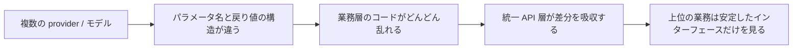

# 統一 API インターフェース

:::tip この節の位置づけ
システムが1つのモデルだけでなくなると、すぐに問題が表れてきます。

- provider ごとにパラメータ名が違う
- 戻り値の構造が違う
- エラー処理が違う

このとき本当に価値があるのは、「もう1つモデルをつなぐこと」ではなく、次のことです。

> **まずモデル呼び出しの入口を統一すること。**
:::

## 学習目標

- なぜマルチモデルシステムに統一 API 層が必要なのかを理解する
- 統一 API インターフェースが、実務上どこを楽にするのかを理解する
- 最小限の provider 抽象化の例を読めるようになる
- 統一 API は「すべてのモデルが完全に同じになる」ことではないと理解する

---

## まずは全体像をつかもう

ローカルモデルの実行や推論サービスを学んでいるなら、この節は自然な続きです。

- これまでに、モデルがどのように読み込まれ、サービス化されるかを学びました
- この節では、システムが複数のモデル / 複数の provider を受けるようになったとき、上位の業務コードをどう散らからせないかを考えます

なので、統一 API の節で本当に大事なのは「ただもう1枚ラッパーをかぶせること」ではなく、次の点です。

- マルチモデルシステムに安定した入口層を作ること

初心者にとって、統一 API は「もう1枚ラッパーをかぶせること」と捉えるより、まず次の図でイメージすると分かりやすいです。



この節が本当に解決したいのは、次のようなことです。

- なぜマルチモデルシステムには、自然と抽象化の層が必要になるのか
- なぜ業務コードが provider ごとの差分をあちこちで知ってはいけないのか

### 初心者向けの、よりよいたとえ

統一 API は次のように考えると理解しやすいです。

- いろいろなブランドのプラグに使う、共通の変換アダプター

この変換アダプターがなければ、  
上位の業務コードは次のようになってしまいます。

- ここでは A 社向けの対応
- そこでは B 社向けの対応
- 別の場所ではローカルモデル向けの対応

最終的にシステムはどんどん分裂していきます。  
統一 API の一番大きな価値は、こうした差分を1つの層に集めることです。

## 一、なぜ統一 API が重要になるのか？

### 1.1 モデルが1つだけなら、まだ目立たない

プロジェクトにモデルが1つしかないなら、シンプルな client だけでも十分なことが多いです。

### 1.2 ひとたびマルチモデル / マルチ provider になると

次のような問題に直面します。

- A モデルは `messages` を使う
- B モデルは `prompt` を使う
- あるものは `content` を返す
- 別のものは `output_text` を返す
- token の集計項目も違う

こうなると、業務コードは一気に分かりにくくなります。

なので、統一 API の核心は、まず次のように覚えるとよいです。

> **provider の違いを1つの層に閉じ込め、業務層があちこちでその差分を知る必要をなくすこと。**

### 1.3 最初に学ぶとき、何をつかむべきか？

最初に押さえるべきなのは、「どれだけ美しい抽象化か」ではなく、次の一文です。

> **統一 API の核心は、モデル差分を切り離し、業務層が安定したインターフェースだけに触れられるようにすること。**

この感覚がつかめると、あとで見る次のようなものも自然に理解できます。

- provider アダプタ
- ルーティング
- fallback
- 統一ログ

それらが、なぜこの層に載るのかも分かりやすくなります。

---

## 二、統一 API のよくある目的は何か？

通常、少なくとも次のものが含まれます。

- リクエスト構造の統一
- レスポンス構造の統一
- エラー処理の統一
- ログと trace の統一

### 2.1 最小限の統一リクエスト構造

```python
request = {
    "provider": "demo_provider",
    "model": "demo-chat-model",
    "query": "返金ポリシーは何ですか？"
}

print(request)
```

### 2.2 最小限の統一レスポンス構造

```python
response = {
    "provider": "demo_provider",
    "model": "demo-chat-model",
    "answer": "コース購入後7日以内かつ学習進捗が20%未満であれば返金できます。",
    "usage": {
        "prompt_tokens": 24,
        "completion_tokens": 18
    }
}

print(response)
```

こうしておくと、次の利点があります。

- 上位の業務ロジックが、1つの安定した構造だけを見ればよい

### 2.3 初学者がまず覚えるのに向いている統一表

| 層 | この層でまず統一したいもの |
|---|---|
| リクエスト | query / model / provider / パラメータ形式 |
| レスポンス | answer / usage / error |
| ログ | trace_id / provider / latency / token |
| エラー | error_code / message / retryable |

この表は初心者に向いています。  
「統一 API」という抽象的な言葉を、見える対象のまとまりに戻してくれるからです。


:::tip 図の読み方
統一 API 層はモデルのゲートウェイのようなものです。上位の業務は統一されたリクエストだけを送り、ゲートウェイ内部で provider の適合、モデルルーティング、fallback、usage 集計、統一エラー構造を処理します。
:::

---

## 三、最小限の provider 抽象化の例

```python
class ProviderA:
    def chat(self, query, model):
        return {
            "text": f"A-provider reply: {query}",
            "tokens": 30
        }

class ProviderB:
    def generate(self, prompt, model_name):
        return {
            "output_text": f"B-provider reply: {prompt}",
            "usage": {"total_tokens": 28}
        }
```

この2つを業務コードから直接それぞれ呼ぶようにすると、コードはどんどんバラバラになります。

---

## 四、統一アダプタ層は何をしているのか？

### 4.1 異なる provider を同じ構造に翻訳する

```python
class UnifiedClient:
    def __init__(self):
        self.providers = {
            "provider_a": ProviderA(),
            "provider_b": ProviderB()
        }

    def chat(self, provider, query, model):
        if provider == "provider_a":
            raw = self.providers[provider].chat(query=query, model=model)
            return {
                "provider": provider,
                "model": model,
                "answer": raw["text"],
                "usage": {"total_tokens": raw["tokens"]}
            }

        if provider == "provider_b":
            raw = self.providers[provider].generate(prompt=query, model_name=model)
            return {
                "provider": provider,
                "model": model,
                "answer": raw["output_text"],
                "usage": raw["usage"]
            }

        return {"error": "unknown_provider"}

client = UnifiedClient()
print(client.chat("provider_a", "返金ポリシーは何ですか？", "demo-1"))
print(client.chat("provider_b", "返金ポリシーは何ですか？", "demo-2"))
```

### 4.2 このコードで本当に大事なのは文法ではなく、層の分け方

ここで伝えたいのは、次のことです。

- provider ごとの差分は、できるだけ統一アダプタ層に閉じ込める
- 上位の業務コードは、できるだけ統一インターフェースだけを見る

これが、「統一 API」の実務上いちばん大きな価値です。

### 4.3 なぜこの層はログ・統計・ルーティングを担うのに向いているのか？

この層は、すべてのリクエストが通る入口に位置しているからです。  
そのため、次のような機能を置くのにとても向いています。

- token / コストの集計
- trace とログ
- provider fallback
- モデルルーティング

### 4.4 最小限の「統一エラー構造」の例を見てみよう

```python
def normalize_error(provider, error_type, message):
    return {
        "provider": provider,
        "ok": False,
        "error": {
            "type": error_type,
            "message": message,
            "retryable": error_type in {"timeout", "rate_limit"},
        },
    }


print(normalize_error("provider_a", "timeout", "request timed out"))
```

この例は初心者にとても役立ちます。  
なぜなら、次のことに気づけるからです。

- 実は、保守が難しいのは成功レスポンスだけではない
- provider ごとにエラーの出方が違っても、上位に同じ契約を返す必要がある

---

## 五、なぜ統一 API は「すべてのモデルが完全に同じ」という意味ではないのか？

これは、とても誤解されやすい点です。

統一 API の目的は、すべてのモデルに違いがないふりをすることではありません。  
目的は次の通りです。

> **共通部分を抜き出し、違いを限られた境界の中に収めること。**

たとえば、異なるモデルには今でも次のような差があります。

- コンテキスト長
- ツール呼び出しの対応可否
- マルチモーダル能力
- 出力形式の制約能力

つまり、統一 API は次のようなものです。

- 入口を統一する
- 能力まで統一するわけではない

---

## 六、なぜ routing がこの層に自然に現れるのか？

統一 API 層ができると、次の疑問が自然に出てきます。

- どの種類のリクエストを、どのモデルに送るべきか？
- 安いモデルで十分か？
- リスクの高いリクエストは、より強いモデルに回すべきか？

### 6.1 シンプルなルーティング例

```python
def route_model(query):
    if "要約" in query or "書き換え" in query:
        return "provider_a", "cheap-model"
    return "provider_b", "strong-model"

for q in ["この文章を要約して", "返金ポリシーは何ですか？"]:
    print(q, "->", route_model(q))
```

統一 API 層は、このような「モデルルーティングの入口」としてとても適しています。

---

## 七、統一 API 層のよくある実務上のメリット

### 7.1 モデル切り替えがしやすい

各業務モジュールを1つずつ変更しなくてよくなります。

### 7.2 ログ収集とコスト集計がしやすい

すべてのリクエストが同じ入口を通るからです。

### 7.3 グレーリリースや fallback がしやすい

たとえば次のような運用です。

- メインモデルが失敗したら、予備モデルに切り替える
- 特定のリクエストだけ安いモデルに回す

これらは、統一入口があるととてもやりやすくなります。

### 7.4 初学者がまず覚えるのに向いた選択表

| システムで起きること | 統一 API 層でまず整えるとよいもの |
|---|---|
| provider が増えていく | リクエスト / レスポンスの統一 |
| ログが読みにくくなる | trace と統一ログ |
| コストの把握が難しい | usage の統一 |
| モデル切り替えがつらい | routing と fallback |

この表は初心者に向いています。  
「なぜ統一 API が必要なのか」を、実際の現場の悩みと直接つなげてくれるからです。

## 初心者が最初にマルチモデルシステムを作るときの、いちばん安定した順番

より安定しやすい順番は、通常次の通りです。

1. まずリクエスト構造を統一する
2. 次にレスポンス構造を統一する
3. その後でエラーとログを統一する
4. 最後にモデルルーティングを考える

こうすると、最初から複雑な routing を作るより、インターフェース層が安定しやすくなります。

## 九、よくある誤解

### 9.1 統一 API を作れば、すべてのモデル差が消えると思う

消えません。  
違いは残ります。  
ただし、その違いをより扱いやすく整理するのです。

### 9.2 早すぎる段階で、重すぎる設計をしてしまう

プロジェクトに provider が1つしかないなら、過剰な抽象化はかえって負担になります。

### 9.3 入出力だけ統一して、エラー構造とログを統一しない

これだと、あとで障害対応がやはりつらくなります。

---

## まとめ

この節で最も大事なのは、`UnifiedClient` を書くことではなく、次を理解することです。

> **統一 API 層の核心は、複数 provider の差分を限られた境界に収め、上位の業務が安定した契約に触れられるようにすること。**

この土台ができると、マルチモデル routing、fallback、コスト最適化のような実務的な機能も、ずっと作りやすくなります。

## この節で持ち帰るべきこと

- 統一 API は、コードの書き方ではなく、実務上のレイヤリング
- 価値は、違いを1つの層に圧縮すること
- 複数モデル・複数 provider が出てきたら、この層はほぼ自然に必要になる

## これをプロジェクトやシステム設計として見せるなら、何を見せるとよいか

本当に見せる価値があるのは、たいてい次のようなものです。

- 統一前と統一後で、呼び出しがどう変わるか
- リクエスト / レスポンス / エラー構造がどう収束していくか
- routing と fallback が、なぜこの層に自然に載るのか
- この層が、コスト集計とログ管理にどう役立つのか

こうすると、見る人にも次のことが伝わりやすくなります。

- 単にクラスを包んだのではなく、入口層のシステム価値を理解している
- ということです

---

## 練習

1. `UnifiedClient` に、さらに統一エラー構造を追加してみましょう。
2. どうして統一 API は「能力の統一」ではなく「入口の統一」だと言えるのでしょうか？
3. システムがまだ1つのモデルしか使っていないなら、なぜ重い統一抽象化を早く作りすぎないほうがよいのでしょうか？
4. 自分の言葉で説明してみましょう。なぜ統一 API 層は、モデルルーティングと fallback を受け持つのに向いているのでしょうか？
