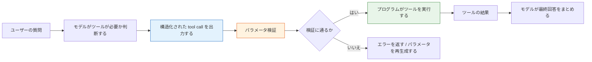

# Function Calling 入門


:::tip この節の位置づけ
多くの初心者が初めて LLM アプリを作るとき、モデルを「万能なテキスト生成器」だと思いがちです。  
でも、実用的なシステムへ進んでいくと、すぐにこう気づきます。

> **モデルは話せるだけでなく、タスクを実行可能な操作に変換できる必要がある。**

これが Function Calling が解決する問題です。
:::

## 学習目標

- 自然言語の出力だけでは、なぜ安定してツールを呼び出しにくいのかを理解する
- 関数 schema、パラメータ、呼び出し結果という 3 つの核心概念を理解する
- 最小限の関数呼び出しの一連の流れを読み取れるようになる
- Function Calling がどのような場面に最も向いているかを知る

---

## 初心者はまず押さえる / 上級者はあとで理解する

もしあなたが初心者なら、この節ではまず 1 つのことを押さえてください。Function Calling は、モデルに本当にコードを実行させるものではありません。まず構造化された「呼び出し意図」を出力させ、その後でプログラムがそれを検査・実行・結果返却します。

すでに LLM アプリを作ったことがあるなら、次の点をさらに意識するとよいでしょう。ツール schema は十分に明確か、パラメータ検証は完全か、ツール失敗時にどう再試行またはフォールバックするか、呼び出しログはデバッグや評価に十分使えるか。

---

## 一、なぜ純テキスト出力だけでは足りないのか？

### 1.1 よくある不安定なやり方

たとえば、ユーザーがこう聞いたとします。

> 「北京の今日の気温は？」

モデルに 1 文で返させます。

> 「`get_weather(city='Beijing')` を呼び出すのがおすすめです」

一見使えそうに見えますが、実はかなり脆いです。

- フォーマットが安定しない
- パラメータ名を間違える可能性がある
- 都市名が「北京」になったり「Beijing」になったりする
- さらに説明文を大量に付け足すこともある

### 1.2 本当の問題は何か？

問題は、モデルがタスクを理解できないことではありません。むしろ、

> **自然言語は自由すぎて、安定したプログラムインターフェースには向かない。**

という点にあります。

プログラムが好むのは次のようなものです。

- 固定されたフィールド
- 明確なパラメータ
- 検証可能な構造

ここに Function Calling の価値があります。

---

## 二、Function Calling とは何か？

### 2.1 一言で理解する

> **Function Calling = モデルに自由文ではなく、構造化されたツール呼び出しを出力させること。**

通常、含まれるのは次の 2 つです。

- どのツールを呼ぶか
- どんなパラメータを渡すか

たとえば、こんな形です。

```json
{
  "name": "get_weather",
  "arguments": {
    "city": "Beijing"
  }
}
```

### 2.2 自由文より何が優れているのか？

プログラムインターフェースに近いからです。雑談文ではありません。

プログラムはこの構造を受け取ったら、次のようなことができます。

- フィールドを検証する
- 自動で実行する
- 失敗時に再試行する
- ログを残す

つまり、Function Calling はモデルとプログラムの間に橋を架けるものです。

---

## 三、まず最小の一連の流れを見てみよう

### 3.1 2 つのツールを定義する

```python
import ast
import operator

OPS = {
    ast.Add: operator.add,
    ast.Sub: operator.sub,
    ast.Mult: operator.mul,
    ast.Div: operator.truediv,
}


def safe_calculate(expression):
    def visit(node):
        if isinstance(node, ast.Expression):
            return visit(node.body)
        if isinstance(node, ast.Constant) and isinstance(node.value, (int, float)):
            return node.value
        if isinstance(node, ast.BinOp) and type(node.op) in OPS:
            return OPS[type(node.op)](visit(node.left), visit(node.right))
        if isinstance(node, ast.UnaryOp) and isinstance(node.op, ast.USub):
            return -visit(node.operand)
        raise ValueError("unsupported_expression")

    return visit(ast.parse(expression, mode="eval"))


def get_weather(city):
    data = {
        "Beijing": {"temperature": 22, "condition": "sunny"},
        "Shanghai": {"temperature": 25, "condition": "cloudy"}
    }
    return data.get(city, {"error": "city_not_found"})

def calculate(expression):
    return {"result": safe_calculate(expression)}
```

### 3.2 「モデルの出力」を表す呼び出し構造を定義する

```python
tool_call = {
    "name": "get_weather",
    "arguments": {
        "city": "Beijing"
    }
}

print(tool_call)
```

### 3.3 この呼び出しを実際に実行する

```python
def dispatch(call):
    if call["name"] == "get_weather":
        return get_weather(**call["arguments"])
    if call["name"] == "calculate":
        return calculate(**call["arguments"])
    return {"error": "unknown_tool"}

tool_call = {
    "name": "get_weather",
    "arguments": {"city": "Beijing"}
}

result = dispatch(tool_call)
print(result)
```

これが関数呼び出しの最小閉ループです。

1. タスクを識別する
2. 構造化された呼び出しを出力する
3. プログラムが実行する
4. 結果を受け取る

---

## 四、Schema とは何か？

### 4.1 Schema は「ツールの説明書」と考えればよい

モデルが正しくツールを呼び出すには、次の情報が必要です。

- ツール名
- 各パラメータ名
- パラメータの型
- 必須かどうか

これが schema の役割です。

### 4.2 シンプルな schema の例

```python
weather_schema = {
    "name": "get_weather",
    "description": "指定した都市の天気を取得する",
    "parameters": {
        "city": {
            "type": "string",
            "description": "都市の英語名。例: Beijing"
        }
    },
    "required": ["city"]
}

print(weather_schema)
```

schema は「見た目を整えるための文」ではありません。モデルとプログラムにこう伝えています。

> このツールは、このように呼び出せる。

---

## 五、なぜパラメータ検証が重要なのか？

### 5.1 モデルがいつも正しいパラメータを返すとは限らない

モデルがツールの選択を正しくできても、次のようなミスは起こりえます。

- フィールドが抜ける
- 型が違う
- パラメータ値が無効

たとえば、

```python
bad_call = {
    "name": "get_weather",
    "arguments": {"city_name": "Beijing"}
}
```

もしプログラムが検証しなければ、実行時にそのまま落ちてしまいます。

### 5.2 最小の検証例

```python
def validate_weather_call(call):
    if call.get("name") != "get_weather":
        return False, "wrong_tool"

    args = call.get("arguments", {})
    if "city" not in args:
        return False, "missing_city"
    if not isinstance(args["city"], str):
        return False, "city_must_be_string"

    return True, "ok"

good_call = {"name": "get_weather", "arguments": {"city": "Beijing"}}
bad_call = {"name": "get_weather", "arguments": {"city_name": "Beijing"}}

print(validate_weather_call(good_call))
print(validate_weather_call(bad_call))
```

---

## 六、より完全な例：天気と計算機

### 6.1 まず「モデルがどのツールを呼ぶか」をまねる

ここでは本物の大規模モデルは使いません。まずは学習用のルール関数を書き、「ツール呼び出しの構造」を見やすくします。

```python
def mock_llm_tool_selector(user_query):
    if "天气" in user_query:
        city = "Beijing" if "北京" in user_query else "Shanghai"
        return {
            "name": "get_weather",
            "arguments": {"city": city}
        }

    if "计算" in user_query:
        expression = user_query.replace("计算", "").strip()
        return {
            "name": "calculate",
            "arguments": {"expression": expression}
        }

    return None
```

### 6.2 次に実行器をつなぐ

```python
import ast
import operator

OPS = {
    ast.Add: operator.add,
    ast.Sub: operator.sub,
    ast.Mult: operator.mul,
    ast.Div: operator.truediv,
}


def safe_calculate(expression):
    def visit(node):
        if isinstance(node, ast.Expression):
            return visit(node.body)
        if isinstance(node, ast.Constant) and isinstance(node.value, (int, float)):
            return node.value
        if isinstance(node, ast.BinOp) and type(node.op) in OPS:
            return OPS[type(node.op)](visit(node.left), visit(node.right))
        if isinstance(node, ast.UnaryOp) and isinstance(node.op, ast.USub):
            return -visit(node.operand)
        raise ValueError("unsupported_expression")

    return visit(ast.parse(expression, mode="eval"))


def get_weather(city):
    data = {
        "Beijing": {"temperature": 22, "condition": "sunny"},
        "Shanghai": {"temperature": 25, "condition": "cloudy"}
    }
    return data.get(city, {"error": "city_not_found"})

def calculate(expression):
    return {"result": safe_calculate(expression)}

def dispatch(call):
    if call["name"] == "get_weather":
        return get_weather(**call["arguments"])
    if call["name"] == "calculate":
        return calculate(**call["arguments"])
    return {"error": "unknown_tool"}

queries = [
    "北京今天天気はどうですか",
    "計算 3 * (4 + 5)"
]

for q in queries:
    call = mock_llm_tool_selector(q)
    result = dispatch(call)
    print("ユーザーの質問:", q)
    print("ツール呼び出し:", call)
    print("実行結果:", result)
    print("-" * 40)
```

この例は、実際のシステムの骨組みにかなり近いです。

---

## 七、Function Calling はどんなタスクに向いているのか？

### 7.1 特に向いているもの

- 天気の取得
- ナレッジベース検索
- データベース検索
- 数学計算
- 検索 API の呼び出し
- チケット起票

つまり、

> **モデルは「何をするか」を決め、プログラムが実際に実行する。**

### 7.2 あまり向いていないもの

タスクの本質が次のような場合です。

- 文章を書く
- 自由な生成を行う
- ただの雑談をする

このような場合は、必ずしも Function Calling が必要とは限りません。

---

## 八、知識ベース駆動の教材生成アシスタントを作るなら、最小ツールセットはどうあるべきか？

この種のプロジェクトを初めて作るとき、最初から何十個ものツールを用意する必要はありません。  
より安定した最小ツールセットは、通常たった 4 つで十分です。

1. `retrieve_internal_docs(topic)`  
   社内ナレッジベースを検索する

2. `retrieve_external_docs(topic)`  
   外部資料を補う

3. `build_courseware_schema(materials)`  
   資料を固定構造に整理する

4. `export_word(schema)`  
   テンプレートを当てて Word に出力する

まずはこう考えるとよいです。

- モデルが直接 Word を書くわけではない
- モデルは「次にどの工程を呼ぶか」を決めている

小さなツール定義の例は、次のように書けます。

```python
tools = [
    {
        "name": "retrieve_internal_docs",
        "description": "テーマに基づいて社内ナレッジベース資料を検索する",
        "parameters": {"topic": {"type": "string"}},
    },
    {
        "name": "export_word",
        "description": "構造化された教材内容を Word 文書として出力する",
        "parameters": {"title": {"type": "string"}, "sections": {"type": "array"}},
    },
]

print(tools)
```

## 九、最もよくある実装上の問題

### 9.1 ツールの選択を間違える

本当はナレッジベースを検索すべきなのに、計算機を呼んでしまう例です。

### 9.2 パラメータが安定しない

たとえば次のように揺れます。

- `city`
- `city_name`
- `location`

モデルは混ぜて使ってしまうことがあります。

### 9.3 ツール実行の失敗

ツール呼び出しの構造が正しくても、次のような失敗は起こります。

- API タイムアウト
- パラメータが不正
- 都市が存在しない

つまり、

> Function Calling は「モデルがツールを呼べるようになれば終わり」ではありません。その後ろに、必ず実装上の安全網が必要です。

---

## 十、初心者がよくやってしまうミス

### 10.1 Function Calling を「モデルが直接コードを実行するもの」と思う

違います。  
モデルは構造化された呼び出し意図を出力するだけで、実際に実行するのはあなたのプログラムです。

### 10.2 ツール schema があいまいすぎる

ツール説明が不十分で、パラメータ定義も不明確だと、モデルは誤った呼び出しをしやすくなります。

### 10.3 パラメータ検証をしない

本番環境に入ると、これは非常に危険な習慣です。

---

## まとめを見る前に：Function Calling の工程ループ



このループはとても重要です。なぜなら、Function Calling の難しさは「モデルが関数名を言えるかどうか」ではなく、モデル、schema、検証、実行器、エラー処理がそろって安定したシステムになるかどうかにあるからです。


:::tip 図の見方
モデルの役割は tool call を提案するところまでです。検証、実行、フォールバックはプログラムの役割です。図を見るときは、schema、arguments validation、dispatcher、retry/error handling の 4 つの関門を重点的に見てください。
:::

## この節の学習ループ

| レベル | できるようになること |
|---|---|
| 直感 | 自由文がなぜそのままプログラムインターフェースに向かないか説明できる |
| コード | 最小の tool call、dispatch、パラメータ検証関数を書ける |
| 工学 | schema、検証、エラー処理、ログがそれぞれ何を担当するか説明できる |
| 次のステップとのつながり | Function Calling が Agent のツール呼び出しの前提になる理由を理解できる |

---

## まとめ

この節でいちばん大事なのは、`name` と `arguments` の 2 つのフィールドを覚えることではありません。本質は次の一点です。

> **Function Calling は、モデルの自然言語理解能力を、プログラムの構造化された実行能力につなぐ仕組みである。**

この点を理解できると、次に Agent、ツール戦略、複数ツールの協調を学ぶときに、かなりスムーズになります。

---

## 練習

1. この節の例に `search_docs(keyword)` という新しいツールを追加してみましょう。
2. `calculate` のパラメータ検証関数を書いて、危険な式を防いでみましょう。
3. もしモデルが「北京の天気」を何度も `calculate` に誤ルーティングするなら、まず prompt、schema、実行器のどれを直しますか？
4. 自分の言葉で説明してみましょう。Function Calling は、なぜ「モデルにコマンド文を直接返させる」より安定しているのでしょうか？
