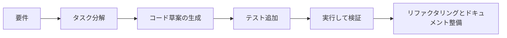

# 8.3.7 大規模モデルによるプログラミング支援

:::tip この節の位置づけ
AI 支援コーディングは「モデルに全部のコードを書かせる」ことではありません。モデルを開発フローに組み込み、コードの理解、草案の生成、テスト追加、バグ調査、リファクタリング提案を手伝ってもらうものです。本当に大事なのは、それをどう検証するかです。
:::

## 学習目標

- 大規模モデルがどのようなプログラミング作業の支援に向いているかを知る
- より分かりやすいコード生成・デバッグ用 Prompt を書けるようになる
- テスト、diff、コードレビューが今でも必須な理由を理解する
- AI を使った開発の過程を README や開発ログに記録できるようになる

---

## AI 支援コーディングは何に向いているか



大規模モデルは、ひな形コードの生成、見慣れない API の説明、関数の書き換え、テストケースの生成、エラーログの要約、リファクタリング方針の提案が得意です。一方で、コードが必ず正しいことを保証するのは苦手ですし、プロジェクトの文脈、暗黙の制約、本番環境のリスクを必ず理解しているとは限りません。


:::tip 図の見方
モデルは「最終決定者」ではなく「下書き生成器」と考えましょう。AI が書いたコードは、少なくとも要件の制約、diff、テスト、実データでの確認、人によるレビューを通してから、プロジェクトに入れるのが安全です。
:::

## コードを書く前にまず制約を言い直させる

いきなり「RAG システムを作って」と言うより、入力、出力、依存関係、境界条件、合格基準を伝える方がずっと良いです。

```text
Markdown テキストを入力として受け取り、見出しごとに分割した chunk の一覧を出力する Python 関数を書いてください。
要件:
1. 見出しの階層を保持すること;
2. 各 chunk は 800 文字以内にすること;
3. 外部ライブラリは使わないこと;
4. 3 つのテストケースを示すこと。
```

このような Prompt は、曖昧な要求よりずっと安定します。モデルが「何をもって完成とするか」を理解できるからです。

## 生成したコードは必ず検証する

AI がコードを生成したら、少なくとも次の 3 つを行いましょう。diff を読む、テストを実行する、実データのサンプルを走らせる。見た目が正しそうだからといって、そのままマージしてはいけません。

```bash
python -m pytest
python demo.py
```

プロジェクトにテストがない場合は、まずモデルに最小限のテストを追加してもらいましょう。テストは、正常入力、境界入力、エラー入力をカバーすべきです。

## 実践：AI が生成した Markdown 分割関数を検証する

次のスクリプトは、実行できる小さな一連の流れです。モデルに制約を与え、草案を受け取り、その草案をテストで検証します。`ai_chunker_demo.py` として保存し、`python ai_chunker_demo.py` を実行します。

```python
import unittest


def split_markdown_by_heading(markdown, max_chars=800):
    chunks = []
    current = []

    def flush():
        if not current:
            return
        text = "\n".join(current).strip()
        if not text:
            return
        if len(text) > max_chars:
            raise ValueError("chunk_too_large")
        chunks.append(text)

    for line in markdown.splitlines():
        if line.startswith("#") and current:
            flush()
            current = [line]
        else:
            current.append(line)

    flush()
    return chunks


class SplitMarkdownTests(unittest.TestCase):
    def test_raises_when_chunk_too_large(self):
        with self.assertRaises(ValueError):
            split_markdown_by_heading("# タイトル\n" + "a" * 20, max_chars=10)

    def test_preserves_headings(self):
        chunks = split_markdown_by_heading("# 返金\nポリシー本文")
        self.assertEqual(chunks[0], "# 返金\nポリシー本文")

    def test_splits_by_headings(self):
        text = "# 返金\nポリシー本文\n## 詳細\n追加内容"
        chunks = split_markdown_by_heading(text)
        self.assertEqual(len(chunks), 2)
        self.assertTrue(chunks[1].startswith("## 詳細"))


if __name__ == "__main__":
    unittest.main(verbosity=2)
```

想定出力：

```text
test_preserves_headings (__main__.SplitMarkdownTests.test_preserves_headings) ... ok
test_raises_when_chunk_too_large (__main__.SplitMarkdownTests.test_raises_when_chunk_too_large) ... ok
test_splits_by_headings (__main__.SplitMarkdownTests.test_splits_by_headings) ... ok

----------------------------------------------------------------------
Ran 3 tests in ...

OK
```

身につけたい習慣はこれです。モデルは関数の草案を作れますが、その草案が合格かどうかを決めるのはテストです。実プロジェクトでは、バグや抜けていた要件を見つけるたびにテストを 1 つ追加します。

## デバッグでは十分な文脈を与える

デバッグ用 Prompt には、エラーログ、関連コード、期待する動作、実際の動作、すでに試したことを含めるのが理想です。エラーメッセージを一行だけ貼っても、モデルは推測するしかありません。

```text
以下にエラー、関数コード、テスト入力があります。まず最も可能性の高い原因を判断し、その後で最小限の修正を提案してください。ファイル全体は書き直さないでください。
```

「最小限の修正」を求めるのはとても重要です。そうすることで、元のコードが分かりやすいのに、モデルが別のスタイルに大きく書き換えてしまうのを防げます。

## AI コードレビューのチェックリスト

| チェック項目 | 質問 |
|---|---|
| 正しさ | 要件と境界条件を満たしているか |
| 安全性 | パス、権限、秘密情報、外部入力を適切に扱っているか |
| 保守性 | 命名、構造、重複コードは妥当か |
| 依存関係 | 不必要な新しいライブラリを追加していないか |
| テスト | 動作を示す実行可能なテストがあるか |

## 作品集に記録するとよい内容

プロジェクトで AI 支援コーディングを使ったなら、次のような内容を記録するとよいです。モデルに与えた重要な Prompt、初回出力の問題点、どのようにテストして修正したか、最終コードと初版の違い。これらは単に「AI を使いました」と書くより、エンジニアリング力をよく示せます。

## よくある誤解

1 つ目の誤解は、AI の出力を権威ある正解だと思い込むことです。2 つ目は、プロジェクトの文脈を与えず、既存のアーキテクチャと合わないコードを生成させてしまうことです。3 つ目は、diff を見ずに「動くから OK」としてしまうことです。4 つ目は、モデルに一度に多くのファイルを変更させて、問題の特定を難しくしてしまうことです。

## 練習

1. 既存の関数について、モデルに 3 つの pytest テストを生成させ、境界条件をカバーしているかを手で確認する。
2. モデルにエラーログを渡し、最小限の修正だけを行うように依頼する。
3. 「曖昧な Prompt」と「合格基準付き Prompt」で、コード品質の違いを比較する。
4. AI を使ってプロジェクトを進めたが、検証も行ったことを説明する README を書く。

## 合格基準

この節を学び終えたら、AI を開発者の代わりではなく開発アシスタントとして扱えるようになり、制約と合格基準を含むプログラミング Prompt を書けるようになり、テストとコードレビューで出力を検証できるようになり、AI との協働プロセスを振り返れる形で開発記録に残せるようになっているはずです。
