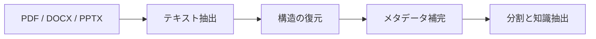

# 8.3.8 ドキュメント解析と知識抽出

:::tip この節の位置づけ
多くのナレッジベース系プロジェクトで、最初にやりがちなミスは次の2つです。

- 先にベクトル化を考える
- 先に Q&A の作り方を考える

でも、文書が正しく解析されていなければ、その後の検索も生成も一緒に崩れてしまいます。

だからこの節で最も大事なのは、最初にベクトルデータベースを説明することではなく、まず次の判断基準を持つことです。

> **文書はまず「理解できる」「分割できる」「追跡できる」知識オブジェクトに解析される必要がある。**
:::

## 学習目標

- PDF / Word / PPT をなぜ単なるプレーンテキストだけでは扱えないのかを理解する
- スキャン版 PDF や画像ページでなぜ OCR が必要になるのかを理解する
- 文書を「本文 + 階層 + メタデータ + 例題」のような構造に分ける方法を学ぶ
- 最小構成の文書解析と知識抽出の流れを理解する

---

## まず全体像をつかもう

文書解析は、「ファイル -> 構造 -> 知識ブロック」として理解すると分かりやすいです。



この節で本当に解決したいのは次のことです。

- なぜナレッジベースプロジェクトは「ファイル内容を抜き出して終わり」ではないのか
- なぜ見出しの階層、ページ番号、章、例題が後の検索品質に影響するのか

## なぜ文書解析は思ったより難しいのか？

理由は、ファイル形式ごとの問題がまったく違うからです。

- `PDF` は「見た目のレイアウト結果」だけを持つことがあり、段落順が自然に安定しているとは限らない
- `DOCX` は構造が比較的はっきりしていますが、スタイルや見出し階層が統一されていないことがある
- `PPTX` は断片的な要点が多く、連続した文章のようには扱えない
- スキャン版 PDF では、そもそも本文テキストを直接取り出せないことがある

つまり、実用的なナレッジベースでは、まず次のことを確認する必要があります。

1. テキストは抽出できたか？
2. 順番は正しいか？
3. 見出し、ページ番号、章は残っているか？
4. どれが例題、定義、本文、注釈なのか？

## 初心者向けの分かりやすい比喩

文書解析は、こう考えるとイメージしやすいです。

- 大量の資料を、見返しやすいカードボックスに整理する作業

もし紙を全部そのまま箱からばらまくと、  
あとで見つけることはできますが、かなり混乱します。  
より安定した方法は、最初に次のように整理することです。

- テーマ
- 章
- 見出し
- 例題
- 出典

こうしておけば、後でシステムが「このテーマの例題を探して」と聞かれたときに、ちゃんと探しやすくなります。

## ファイルタイプごとのよくある問題

| ファイルタイプ | よくある問題 |
|---|---|
| PDF | 順序が崩れる、ヘッダー・フッターが本文に混ざる、2カラムレイアウトが乱れる |
| Word | 見出し階層が統一されていない、表と本文が混ざる |
| PPT | 1ページあたりの情報は少ないが断片的で、「ページ」の概念を残す必要がある |
| スキャン版 PDF / 画像ページ | OCR が必要で、誤字や順序ミスが起きやすい |

この表は初心者にとても大事です。  
なぜなら、次のことを思い出させてくれるからです。

- 文書処理は「1つのパーサーですべて解決」ではない


:::tip 図の見方
ファイルがシステムに入ったら、まずルーティングします。テキスト PDF、スキャン PDF、DOCX、PPTX では問題が違うからです。実際に保存する前に、本文順、見出し階層、ページ番号、内容タイプを復元する必要があります。単に長いプレーンテキストを抜き出すだけではありません。
:::

## 最小構成の文書解析ワークフローの例

以下の例は、実際のサードパーティライブラリに依存しません。  
ただし、「文書タイプごとに解析ルートを分ける」という考え方を先に分かりやすく示します。

```python
from pathlib import Path


def route_parser(filename):
    suffix = Path(filename).suffix.lower()
    if suffix == ".pdf":
        return "pdf_text_or_ocr"
    if suffix == ".docx":
        return "word_parser"
    if suffix == ".pptx":
        return "ppt_parser"
    return "unsupported"


files = [
    "lesson_1.pdf",
    "chapter_2.docx",
    "course_outline.pptx",
]

for file in files:
    print(file, "->", route_parser(file))
```

想定出力：

```text
lesson_1.pdf -> pdf_text_or_ocr
chapter_2.docx -> word_parser
course_outline.pptx -> ppt_parser
```

この例でいちばん大事なのは、

- まず「ルーティング」があると意識すること

つまり、ファイルがシステムに入ったら、いきなり1つの関数に全部入れるのではなく、  
まず次を判断します。

- これはどのファイルか
- どの解析パスを通すべきか

## 実際のシステムに近い知識ブロックはどう見えるか？

本当にナレッジベースに入れるべきものは、ただの

- 生テキスト

ではなく、次のような形です。

```python
chunks = [
    {
        "doc_id": "word_001",
        "source_type": "docx",
        "section_title": "応用問題：割引計算",
        "page_or_slide": 3,
        "content": "お店が 100 元の商品を 8 折にしたら、いくらになりますか？",
        "content_type": "example",
    },
    {
        "doc_id": "ppt_002",
        "source_type": "pptx",
        "section_title": "知識ポイントのまとめ",
        "page_or_slide": 8,
        "content": "割引 = 元の価格 × 割引率。",
        "content_type": "concept",
    },
]

for chunk in chunks:
    print(chunk)
```

想定出力：

```text
{'doc_id': 'word_001', 'source_type': 'docx', 'section_title': '応用問題：割引計算', 'page_or_slide': 3, 'content': 'お店が 100 元の商品を 8 折にしたら、いくらになりますか？', 'content_type': 'example'}
{'doc_id': 'ppt_002', 'source_type': 'pptx', 'section_title': '知識ポイントのまとめ', 'page_or_slide': 8, 'content': '割引 = 元の価格 × 割引率。', 'content_type': 'concept'}
```

この例は初心者に特に向いています。なぜなら、

- 本当に価値があるのは「文字だけを取ること」ではない
- 文字を、出典・章・ページ・内容タイプと一緒に戻すことが大事

と分かるからです。

## 実際のプロジェクトに近い解析結果の schema

初めてこの種のシステムを作るときに抜けやすいのは、次の3つです。

- 文書レベルのメタデータ
- 章レベルの構造
- 知識ブロックレベルの内容

より安定した方法は、解析結果を次の3層に分けることです。

| 層 | 最低限残すもの |
|---|---|
| 文書層 | `doc_id / ファイル名 / ソースタイプ / 作成日時 / 教科` |
| 章層 | `section_id / タイトル / 章パス / ページ範囲` |
| 知識ブロック層 | `chunk_id / テキスト / 内容タイプ / 元ページ / 例題かどうか` |

こう考えると分かりやすいです。

- 文書層は本の表紙カードのようなもの
- 章層は目次
- 知識ブロック層は、実際に検索や生成に使うカード

以下の最小構造は、初心者がまず写して作るのに向いています。

```python
parsed_doc = {
    "doc_id": "math_pdf_001",
    "source_type": "pdf",
    "title": "割引応用問題の集中練習",
    "subject": "数学",
    "sections": [
        {
            "section_id": "s1",
            "section_title": "割引の基本概念",
            "page_range": [1, 2],
            "chunks": [
                {
                    "chunk_id": "c1",
                    "content_type": "concept",
                    "page_or_slide": 1,
                    "text": "割引 = 元の価格 × 割引率",
                },
                {
                    "chunk_id": "c2",
                    "content_type": "example",
                    "page_or_slide": 2,
                    "text": "商品の元の価格が 100 元で、8 折にしたらいくらになりますか？",
                },
            ],
        }
    ],
}

print(parsed_doc["sections"][0]["chunks"][1]["text"])
```

想定出力：

```text
商品の元の価格が 100 元で、8 折にしたらいくらになりますか？
```

この schema の意味は、「見た目をきれいにすること」ではありません。  
大事なのは次の点です。

- 後で検索するときに絞り込みできる
- 後で教材を生成するときに、どこが概念でどこが例題か分かる
- 後で引用元をたどるときに、どのページから来たか分かる

## なぜ「内容タイプ」がとても重要なのか？

あなたのプロジェクトは普通の Q&A ではなく、  
次のことをしたいからです。

- テーマ別に資料を探す
- 関連する例題を探す
- それを決まった形式で Word 教材にする

このとき、システムが次の違いを分けられると、かなり安定します。

- `concept`
- `example`
- `exercise`
- `definition`

後で教材生成をするときに、とても扱いやすくなります。

## 最小の「例題抽出」例

あなたのプロジェクトでは、1つの文がどのページにあるか分かるだけでは足りません。  
できるだけ次の区別も必要です。

- これは例題か
- これは練習問題か
- これは定義や公式か

最初から複雑なモデルを使わなくても大丈夫です。  
まずは最小のルール版で、全体の流れを作るのがよいです。

```python
def guess_content_type(text):
    if "例" in text or "解：" in text:
        return "example"
    if "練習" in text or "思考題" in text:
        return "exercise"
    if "定義" in text or "公式" in text:
        return "concept"
    return "paragraph"


samples = [
    "例1：商品原価が 100 元で、8 折にしたらいくらになりますか？",
    "練習：服の元の価格が 80 元で、7 折にしたらいくらになりますか？",
    "公式：割引 = 元の価格 × 割引率",
]

for sample in samples:
    print(guess_content_type(sample), "->", sample)
```

想定出力：

```text
example -> 例1：商品原価が 100 元で、8 折にしたらいくらになりますか？
exercise -> 練習：服の元の価格が 80 元で、7 折にしたらいくらになりますか？
concept -> 公式：割引 = 元の価格 × 割引率
```

この最小ルール版は完璧ではありませんが、  
初心者にとってはとても大事です。

- 「例題抽出」は魔法ではない
- 本質的には、文書内容の分類をしているだけ

## 実践：模擬ページを知識ブロックに変換する

ここでは、ルーティング、章の検出、メタデータ、内容タイプ判定を 1 つの小さなパイプラインにつなぎます。まだ模擬ページのテキストですが、出力の形は embedding 前に保存したい構造にかなり近いです。

```python
def guess_content_type(text):
    if "例" in text or "解：" in text:
        return "example"
    if "練習" in text or "思考題" in text:
        return "exercise"
    if "定義" in text or "公式" in text:
        return "concept"
    return "paragraph"


def build_chunks(doc_id, source_type, pages):
    chunks = []
    section_title = "無題の章"

    for page_no, lines in pages:
        for line in lines:
            line = line.strip()
            if not line:
                continue
            if line.startswith("#"):
                section_title = line.lstrip("#").strip()
                continue

            chunks.append({
                "chunk_id": f"{doc_id}_c{len(chunks) + 1}",
                "doc_id": doc_id,
                "source_type": source_type,
                "section_title": section_title,
                "page_or_slide": page_no,
                "content": line,
                "content_type": guess_content_type(line),
            })

    return chunks


pages = [
    (1, ["# 割引の基本概念", "公式：割引 = 元の価格 × 割引率"]),
    (2, ["例1：商品の元の価格が 100 元で、8 折にしたらいくらになりますか？"]),
]

for chunk in build_chunks("math_doc_001", "docx", pages):
    print(chunk)
```

想定出力：

```text
{'chunk_id': 'math_doc_001_c1', 'doc_id': 'math_doc_001', 'source_type': 'docx', 'section_title': '割引の基本概念', 'page_or_slide': 1, 'content': '公式：割引 = 元の価格 × 割引率', 'content_type': 'concept'}
{'chunk_id': 'math_doc_001_c2', 'doc_id': 'math_doc_001', 'source_type': 'docx', 'section_title': '割引の基本概念', 'page_or_slide': 2, 'content': '例1：商品の元の価格が 100 元で、8 折にしたらいくらになりますか？', 'content_type': 'example'}
```


:::tip 図の見方
見出し行は出力行ではなく、状態更新として読みます。つまり `section_title` だけを更新します。chunk になるのは公式行と例題行で、それぞれが同じ文書メタデータを持って後続の検索に渡されます。
:::

これが最小限に役立つ投入ループです。各 chunk が内容、構造、出典、ページ、タイプを持つようになると、検索と教材生成はかなり作りやすくなります。

## スキャン文書でなぜ OCR が必要になるのか？

スキャン版 PDF や画像ページは、そもそも文字ファイルではなく、

- 文字が画像のように見えている

からです。

そのため、最初に必要なのは

- OCR で文字認識すること

です。  
その後で、次の処理に進みます。

- 構造の復元
- 見出し階層の識別
- 例題の抽出

スキャンされた教材、スクリーンショット、写真資料をたくさん扱うなら、このステップは非常に重要です。

関連する内容は以下も参照してください。
- [10.5.4 OCR 文字認識](../../ch10-computer-vision/ch05-advanced/03-ocr.md)

## 最初に作るときの、いちばん安全な範囲設定

初回開発で失敗しやすい理由は、技術が難しすぎるからではなく、  
最初にサポート範囲を広げすぎるからです。

より安全な最小版は、たいてい次の順番です。

1. まずテキスト型 `DOCX` のみ対応
2. 次にテキスト型 `PDF` を対応
3. 次に `PPTX` を対応
4. 最後にスキャン文書の OCR を追加

この順番の利点は、

- 先に構造と schema を安定させられる
- 最初から OCR の認識問題に足を取られない

ことです。

## 初心者がそのまま使える解析チェックリスト

初めてナレッジベース用の文書解析を作るとき、  
いちばん安定したチェックリストは次のとおりです。

1. 文字は漏れなく抽出できているか？
2. 見出しと本文の順番は正しいか？
3. 章の階層は保たれているか？
4. ページ番号 / スライド番号は残っているか？
5. 本文と例題を区別できるか？
6. スキャン文書に OCR の誤字はないか？

この6項目は、「先にベクトルデータベースを入れる」ことより優先度が高いです。

## これをプロジェクトとして見せるなら、何を見せるべきか？

見せる価値が高いのは、たいてい次のようなものです。

- 「PDF / Word / PPT に対応しています」という説明だけ

ではなく、次の3点です。

1. 元の文書がどんな見た目だったか
2. 解析後の構造化知識ブロックがどうなったか
3. 例題がどのように識別されたか
4. OCR や構造復元でどこが失敗しやすいか

こうすると、見る人に次のことが伝わりやすくなります。

- あなたは知識投入の流れを理解している
- 単に「ファイルを読む」だけではない

## まとめ

- 文書解析の本当の目的は、「ファイルを構造化された知識オブジェクトに変えること」
- schema 設計によって、後の検索・引用・教材生成が安定するかどうかが決まる
- 最初は `DOCX / テキスト PDF / 例題抽出のルール版` を先に動かし、その後で拡張するほうが現実的

## この節で一番持ち帰ってほしいこと

- 文書解析は文字を抜き出して終わりではなく、構造と出典を復元する必要がある
- 本当に価値のある知識ブロックには、見出し、ページ番号、内容タイプなどのメタデータを付けるべき
- あなたのナレッジベースが大量の PDF / Word / PPT / スキャン文書から来るなら、この工程は全体の流れの中でも特に重要な入口の1つです
