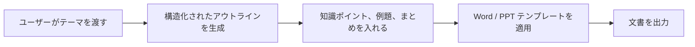

# テンプレート化文書生成（Word / PPT）


:::tip この節の位置づけ
多くの初心者が「Word / 予習資料を生成する」とき、最もやりがちなのは、モデルにそのまま長い本文を出力させて、  
その結果が自然に次のようになっていることを期待することです。

- 章の順番
- 形式の要件
- 例題の位置
- 予習資料らしい見た目

これはたいてい安定しません。

より安定したやり方は、通常こうです。

> **まずモデルに構造化された内容を出力させてから、その構造をテンプレートに流し込む。**
:::

## 学習目標

- なぜ文書生成は「構造 -> テンプレート -> 出力」の流れがよいのかを理解する
- Word / PPT 生成と通常のチャット出力の違いを理解する
- 最小限のテンプレート入力フローを読めるようになる
- 「文書のレイアウトより先に構造化出力を考える」という実装の感覚を身につける

---

## まず全体像をつかもう

テンプレート化文書生成は、「テーマ -> アウトライン -> コンテンツブロック -> テンプレート出力」という順で考えると理解しやすいです。



この節で本当に解決したいのは、次の点です。

- なぜモデルにそのまま「自由に Word を1本書かせる」のがよくないのか
- なぜ固定テンプレートのほうが生成結果を安定させやすいのか

## 一、なぜテンプレート化がそんなに重要なのか？

あなたの目標は、単なる Q&A ではなく、  
次のような成果物を納品することです。

- 予習資料のような文書

つまりシステムは、答えが合っているだけでは足りず、  
さらに次の条件も満たす必要があります。

- 構造が安定している
- 章立てが固定されている
- 見出しの階層が固定されている
- 例題とまとめの位置が適切である

## 二、初心者向けのわかりやすい例え

文書生成は、こんな流れだと考えるとよいです。

- まずアウトラインを書く
- 次に内容を埋める
- 最後にレイアウトする

最初から本文を丸ごと書かせると、  
次のような問題が起きやすくなります。

- 構造が崩れる
- 内容が重複する
- 例題が不自然な位置に入る

そのため、より安定するのは次のやり方です。

- 先に骨組みを決める
- その後で中身を埋める

## 三、最小の構造化された課件オブジェクトの例

```python
courseware = {
    "title": "割引の文章題の解説",
    "target_audience": "小学校高学年",
    "sections": [
        {
            "heading": "一、知識ポイントの確認",
            "content_type": "concept",
            "items": ["割引 = 定価 × 割引率"],
        },
        {
            "heading": "二、例題の解説",
            "content_type": "example",
            "items": ["商品の定価が 100 円で、2割引にしたときの価格はいくらですか？"],
        },
        {
            "heading": "三、授業内演習",
            "content_type": "exercise",
            "items": ["1着 80 円の服を 3割引にしたら、いくらですか？"],
        },
    ],
}

print(courseware)
```

この例でいちばん大事なのは、次の点です。

- まず「何を、どんな構造で生成するか」をはっきりさせること

つまり、モデルは最終的な `.docx` を直接出力するのではなく、  
まず構造化された内容オブジェクトを出力すべきです。

## 四、実際のプロジェクトにより近い課件 schema

目標が「決まった形式の Word 課件を生成する」ことであれば、  
最小のオブジェクトにさらに2層ほど足すのがおすすめです。

- ページ単位または章単位の順番
- テンプレート字段へのマッピング

より安定した課件 schema には、少なくとも次の項目があるとよいです。

| フィールド | 用途 |
|---|---|
| `title` | 文書タイトル |
| `audience` | 対象者 |
| `teaching_goal` | 教学目標 |
| `sections` | 本文構造 |
| `source_refs` | 参照元 |
| `template_version` | どのテンプレートを使うか |

この表は初心者に特に向いています。というのも、次の点を意識しやすくなるからです。

- あなたが生成しているのは「長文」ではない
- あなたが生成しているのは「テンプレートが安定して扱えるデータオブジェクト」である

## 五、最小のテンプレート入力の例

以下の例では、本物の `python-docx` は使わず、  
いちばんシンプルな文字列テンプレートで流れを説明します。

```python
template = """# {title}

対象者：{target_audience}

{body}
"""


def render_body(sections):
    blocks = []
    for section in sections:
        blocks.append(section["heading"])
        for item in section["items"]:
            blocks.append(f"- {item}")
        blocks.append("")
    return "\\n".join(blocks)


result = template.format(
    title=courseware["title"],
    target_audience=courseware["target_audience"],
    body=render_body(courseware["sections"]),
)

print(result)
```

この例は初心者にとても向いています。というのも、次の点が見えやすいからです。

- テンプレート化の核心はライブラリではない
- 「先に構造を作り、それをテンプレートに当てる」ことが本質である

## 六、テンプレート字段はどう設計するべきか？

この種のシステムを初めて作るときは、テンプレート字段を明示的に書き出すのがおすすめです。

| テンプレート字段 | 対応する内容 |
|---|---|
| `{title}` | 課件タイトル |
| `{target_audience}` | 対象者 |
| `{teaching_goal}` | 教学目標 |
| `{concept_block}` | 知識ポイントの確認 |
| `{example_block}` | 例題の解説 |
| `{exercise_block}` | 授業内演習 |
| `{source_block}` | 参照元の説明 |

このやり方のよい点は次のとおりです。

- モデルが何を出力すればよいか理解しやすい
- テンプレートの描画層が何を埋めればよいか明確になる
- あとで改修するときも、どの層に問題があるか分かりやすい

## 七、Word / PPT では実際に何を追加で処理するのか？

実際の開発では、本文だけでなく、次のようなものも扱います。

- タイトルのスタイル
- 段落の階層
- 番号付きリスト
- 表
- 画像のプレースホルダー
- ヘッダー・フッター
- スライドのレイアウト

つまり、テンプレート化文書生成は実は2層の問題です。

1. コンテンツの構造
2. 文書のレイアウト

## 八、最小の「構造オブジェクト -> テンプレート字段」変換例

```python
def to_template_payload(courseware):
    blocks = {"concept": [], "example": [], "exercise": []}
    for section in courseware["sections"]:
        blocks[section["content_type"]].extend(section["items"])

    return {
        "title": courseware["title"],
        "target_audience": courseware["target_audience"],
        "teaching_goal": "割引の基本計算方法を理解する",
        "concept_block": "\n".join(f"- {x}" for x in blocks["concept"]),
        "example_block": "\n".join(f"- {x}" for x in blocks["example"]),
        "exercise_block": "\n".join(f"- {x}" for x in blocks["exercise"]),
        "source_block": "参照元：内部ナレッジベース + 外部資料の補足",
    }


payload = to_template_payload(courseware)
print(payload)
```

この小さな例で、初心者が特に気をつけたいのは次の点です。

- 構造オブジェクトとテンプレートオブジェクトは同じとは限らない
- その間に「字段整理」の層があることが多い


:::tip 図の読み方
モデルに直接「Word を書かせる」のではありません。まず courseware schema を出力し、次に template payload に整理し、最後に docx/pptx の描画層へ渡します。こうすると、形式エラーと内容エラーを切り分けて調べやすくなります。
:::

## 九、なぜこの層は Prompt / 结构化出力と強く関係するのか？

通常はモデルにまず次のようなものを出力させます。

- JSON
- アウトライン
- 見出しの一覧
- 各節の知識ポイント / 例題 / 練習問題

つまり、自由作文のような長文をそのまま出させるわけではありません。

この部分に最も関係が深い既存の章は次のとおりです。
- [Prompt 基礎](../../ch07-llm-principles/ch05-prompt/01-prompt-basics.md)
- [構造化出力](../../ch07-llm-principles/ch05-prompt/03-structured-output.md)

## 十、最初にこのモジュールを作るときの、いちばん安定した範囲

最初は、次のように範囲を絞るのが最も安定です。

1. まず `Word` のみを生成する
2. まず 1 種類のテンプレートだけをサポートする
3. まず画像の自動配置は入れない
4. まず複雑なスタイル切り替えはしない

こうすると、次のことを先に証明しやすくなります。

- 構造オブジェクトが安定している
- テンプレート字段が安定している
- 出力パイプラインが安定している

## 十一、初心者がそのまま真似できる生成順序

この種のシステムを初めて作るときは、次の順序がより安定です。

1. まず課件の構造を定義する
2. 次に構造化された JSON / アウトラインを生成する
3. それから知識ポイントと例題を埋める
4. 最後に Word / PPT を出力する

こうすると、最初から `.docx` を直接生成するよりも、ずっと安定します。

## 十二、実際の開発ではどんなライブラリを使うのか？

この部分は、現時点のこのコースではまだ具体的なライブラリ使用まで詳しく扱っていません。  
ただし、プロジェクトでは高い確率で次のライブラリに触れることになります。

- `python-docx`
- `docxtpl`
- `python-pptx`

そのため、この節は次のように捉えるとよいです。

- まず考え方を整理する
- 具体的なライブラリは公式ドキュメントで確認する

## 十三、これをプロジェクトとして見せるなら、何を示すとよいか？

本当に見せる価値が高いのは、次のようなものです。

- 「Word を出力できます」という事実そのものではない

むしろ、次の4点です。

1. 構造化された内容オブジェクトがどうなっているか
2. テンプレートがどうなっているか
3. 最終的な Word / PPT と構造がどう対応しているか
4. どの形式要件が安定して制御できるか

こうすると、見る人にも次のことが伝わりやすくなります。

- あなたが理解しているのはテンプレート化生成である
- 単に「モデルに長文を書かせている」わけではない

## まとめ

- テンプレート化文書生成で最も重要なのは、まず安定した schema を定義し、その次にテンプレート字段を定義すること
- 「構造オブジェクト -> 字段整理 -> テンプレート描画」の3層を分けると、システムはかなり安定する
- 初めて作るときは、Word の単一テンプレート出力をまず通すほうが、Word と PPT を同時に作るより安定しやすい

## この節でいちばん持ち帰ってほしいこと

- 文書生成で最も安定しやすい流れは、通常「構造化出力 -> テンプレート描画 -> 文書出力」である
- 先に構造を決めてから内容を埋めるほうが、モデルに自由に1本の課件を書かせるよりずっと安定する
- Word / 課件を生成するのが目的なら、この層はプロジェクト成否を左右する重要なポイントである
