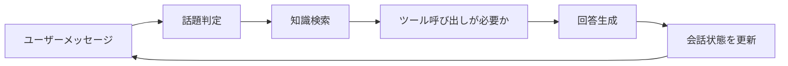

# 8.5.4 プロジェクト：スマートQ&Aアシスタント

:::tip この節の位置づけ
この節は「企業知識ベースQ&A」によく似ていますが、目標はもう一歩先です。  
企業知識ベースはどちらかというと「資料を探して答える」ことに寄っていますが、スマートQ&Aアシスタントは、実際にユーザーと協力するシステムに近いです。

- マルチターン対話ができる
- 文脈を覚えられる
- 必要なときにツールを呼び出せる

そのため、この節は単なる単発Q&Aデモというより、**プロダクトのたたき台**に近い内容です。
:::

## 学習目標

- スマートQ&Aアシスタントと普通のQ&A関数の違いを理解する
- 検索、状態、ツール呼び出しを1つの流れにまとめる方法を学ぶ
- このプロジェクトで最も重要な評価軸を定義できるようになる
- 作品集に載せやすい、プロダクトっぽい形にまとめる方法を学ぶ

---

## スマートQ&Aアシスタントは普通のQ&Aより何が多いのか？

### 「1回聞いて、1回答える」だけではない

本当にアシスタントらしさが出るのは、たいてい次のような点です。

1. 直前のやり取りを覚えている
2. 必要なときに追加で聞き返す
3. いつ知識ベースを引くか、いつツールを使うかを知っている

### 分かりやすい練習題材

たとえば、次のような題材があります。

> **講座プラットフォームのアシスタントを作り、返金、証明書、学習進捗に関する質問に答える。**

この題材はとても向いています。なぜなら、最初から次の要素を含んでいるからです。

- 知識ベース
- ユーザー状態
- マルチターン文脈

---

## 作品レベルのプロジェクトの最小閉ループはどんな形か？

1. 会話履歴を管理する
2. 今の話題を判定する
3. 関連する知識を検索する
4. 必要ならツールを呼び出してユーザー状態を確認する
5. 文脈を理解した回答を返す

この5つをきちんと作れれば、かなりプロダクトらしくなります。

### 実際のプロダクトに近い閉ループ図



この図はとても重要です。なぜなら、次のことを思い出させてくれるからです。

- アシスタントは1回答えるだけではない
- 1ターンずつ対話しながら、状態と行動を更新し続ける


:::tip 図の読み方
マルチターンアシスタントの trace では、少なくとも4つを見るとよいです。session に何が残っているか、検索で何がヒットしたか、ツールが呼ばれたか、回答後に状態がどう更新されたか、です。これで、ただの FAQ ではないことを示せます。
:::

## おすすめの進め方

初心者なら、次の順番がいちばん安定しています。

1. まず単発の知識Q&Aを作る
2. 次に会話状態を追加する
3. 次にツール呼び出しを追加する
4. 最後にマルチターン評価と失敗例の提示をする

こうすると、「アシスタントらしさ」がどこで生まれるのかをはっきり確認できます。

### 初心者向けの全体イメージ

スマートQ&Aアシスタントは、次のように考えると分かりやすいです。

- 資料を調べられて、聞き返しもでき、システム状態も見られるカスタマーサポート

FAQページとの大きな違いは、次の点です。

- 回答が長いことではない

本当の違いは、次の点です。

- 文脈に応じて、会話を続けられること

---

## まずはより完成度の高い最小アシスタントを動かしてみよう

次の例では、以下を行います。

1. session を管理する
2. 知識ベースを検索する
3. 返金の質問では学習進捗ツールを呼ぶ
4. 文脈に応じて最終回答を生成する

```python
kb = [
    {"key": "返金", "text": "返金ポリシー：購入後 7 日以内で、学習進捗が 20% 未満なら返金できます。"},
    {"key": "証明書", "text": "証明書ポリシー：すべてのプロジェクトを完了し、テストに合格すると証明書を受け取れます。"},
]


def retrieve(query):
    if "返金" in query:
        return kb[0], 0.92
    if "証明書" in query:
        return kb[1], 0.88
    return None, 0.0


def get_user_progress(user_id):
    progress_db = {
        1: 0.15,
        2: 0.30,
    }
    return progress_db.get(user_id, None)


def new_session():
    return {
        "history": [],
        "topic": None,
        "user_id": None,
        "last_retrieved_doc": None,
        "last_tool_call": None,
    }


def assistant_reply(session, user_message, user_id=None):
    if user_id is not None:
        session["user_id"] = user_id

    session["history"].append({"role": "user", "content": user_message})

    if "返金できます" in user_message and session["topic"] == "返金" and session["user_id"] is not None:
        session["last_tool_call"] = {"name": "get_user_progress", "user_id": session["user_id"]}
        progress = get_user_progress(session["user_id"])
        if progress is None:
            answer = "現在、あなたの学習進捗情報が見つかりません。アカウントの状態を確認してください。"
        else:
            answer = (
                f"システムでは、あなたの学習進捗は約 {int(progress * 100)}% です。"
                + (" 現在は返金可能です。" if progress < 0.2 else " 現在は返金条件を満たしていません。")
            )

    elif "返金" in user_message:
        session["topic"] = "返金"
        doc, score = retrieve("返金")
        session["last_retrieved_doc"] = doc
        session["last_tool_call"] = None
        answer = f"{doc['text']} 学習進捗を教えてくれれば、条件を満たしているかどうかを続けて確認できます。"

    elif "証明書" in user_message:
        session["topic"] = "証明書"
        doc, score = retrieve("証明書")
        session["last_retrieved_doc"] = doc
        session["last_tool_call"] = None
        answer = doc["text"]

    else:
        session["last_tool_call"] = None
        answer = "今は、返金、証明書、学習進捗に関する問題をお手伝いできます。"

    session["history"].append({"role": "assistant", "content": answer})
    return answer


session = new_session()
print(assistant_reply(session, "返金ポリシーは何ですか？", user_id=2))
print(assistant_reply(session, "では、まだ返金できますか？"))
print("last_tool_call:", session["last_tool_call"])
print("topic:", session["topic"])
```

期待される出力：

```text
返金ポリシー：購入後 7 日以内で、学習進捗が 20% 未満なら返金できます。 学習進捗を教えてくれれば、条件を満たしているかどうかを続けて確認できます。
システムでは、あなたの学習進捗は約 30% です。 現在は返金条件を満たしていません。
last_tool_call: {'name': 'get_user_progress', 'user_id': 2}
topic: 返金
```


### この例のいちばん大きな価値は何か？

これは単に「Q&A」をしているのではなく、次の点を表しています。

- 会話状態
- 検索とツールの役割分担
- マルチターン文脈が回答にどう効くか

これは、単発FAQマッチよりもずっと、実際のアシスタントに近いです。

### なぜ `session` は答えそのものより見る価値があるのか？

`session` こそが、システムを継続的に協力させるための鍵だからです。  
状態がなければ、アシスタントらしさはほとんど出ません。

### もう1つの最小「状態スナップショット」例

```python
snapshot = {
    "topic": session["topic"],
    "user_id": session["user_id"],
    "last_retrieved_doc": session["last_retrieved_doc"],
    "last_tool_call": session["last_tool_call"],
}

print(snapshot)
```

期待される出力：

```text
{'topic': '返金', 'user_id': 2, 'last_retrieved_doc': {'key': '返金', 'text': '返金ポリシー：購入後 7 日以内で、学習進捗が 20% 未満なら返金できます。'}, 'last_tool_call': {'name': 'get_user_progress', 'user_id': 2}}
```

この例は初心者にとても向いています。なぜなら、アシスタントシステムが本当に持つべきものは、「会話の全文そのもの」ではなく、いくつかの重要な状態だと分かるからです。

---

## このプロジェクトはどう評価すべきか？

### 単発の正答率だけでは不十分

少なくとも、次も見る必要があります。

- マルチターンの文脈が一貫しているか
- ツール呼び出しが適切か
- 情報が足りないときに、勝手に推測していないか

### 最小の評価ケース表

```python
eval_cases = [
    {
        "turns": ["返金ポリシーは何ですか？", "では、まだ返金できますか？"],
        "user_id": 1,
        "expected_keywords": ["15%", "返金可能"],
    },
    {
        "turns": ["証明書はどうやって取れますか？"],
        "user_id": None,
        "expected_keywords": ["テストに合格", "証明書"],
    },
]

for case in eval_cases:
    session = new_session()
    last_answer = ""
    for turn in case["turns"]:
        last_answer = assistant_reply(session, turn, case["user_id"])
    print({
        "turns": case["turns"],
        "last_answer": last_answer,
        "expected_hit": all(keyword in last_answer for keyword in case["expected_keywords"]),
    })
```

期待される出力：

```text
{'turns': ['返金ポリシーは何ですか？', 'では、まだ返金できますか？'], 'last_answer': 'システムでは、あなたの学習進捗は約 15% です。 現在は返金可能です。', 'expected_hit': True}
{'turns': ['証明書はどうやって取れますか？'], 'last_answer': '証明書ポリシー：すべてのプロジェクトを完了し、テストに合格すると証明書を受け取れます。', 'expected_hit': True}
```

### なぜマルチターン評価が特に重要なのか？

この種のプロジェクトの見せ場は、そもそも単発ではありません。  
いちばん壊れやすいのは、次のような場面です。

- 2回目の会話で文脈を忘れてしまう

### 初心者がまず覚えるとよい評価表

| かたまり | 何を見るか |
|---|---|
| 単発の回答が合っているか | 知識回答能力 |
| マルチターン文脈をつなげられているか | 状態管理能力 |
| ツール呼び出しが適切か | システム判断能力 |
| 情報不足のときに聞き返せるか | アシスタントとしての協力能力 |

この表は初心者にとても役立ちます。なぜなら、「アシスタントらしさ」をいくつかの具体的なチェック項目に分解できるからです。

---

## どうやってこのプロジェクトを作品レベルのページにするか？

### 1つの完全な対話 トレース を見せる

たとえば、次の流れです。

1. ユーザーの質問
2. 検索でヒットした文書
3. ツールを呼んだかどうか
4. 最終回答

### 特に見せる価値がある失敗例

たとえば、次のようなケースです。

- ユーザーの情報が足りないとき、システムが勝手に推測しないか
- ツールで状態が見つからないとき、システムが正直に止まれるか

### かなり評価されやすいポイント

次の2本の流れを、フロー図として見せることです。

- 知識回答
- ユーザー状態への回答

---

## 残す証拠

このページを終えたら、この証拠カードを残します。

```text
project_goal: user task and business boundary
baseline: simplest prompt/RAG/app version first
evaluation: fixed cases, retrieval evidence, answer quality, and citation check
failure_log: at least one failed case with likely cause
成果物：README、実行コマンド、スクリーンショット/ログ、次の一手
```

## よくある落とし穴

### 単発Q&Aだけで終わる

これでは「アシスタント感」がなかなか出ません。

### ツールの境界がない

すべての質問をモデルの推測に頼ると、だんだん不安定になります。

### 文脈の一貫性チェックをしない

多くのプロジェクトの問題は、2ターン目や3ターン目に出ます。

## これを作品集にするなら、何をいちばん強調すべきか

いちばん強調すべきなのは、たいてい次のような点です。

- 「会話できること」ではない

強調すべきなのは、次の5つです。

1. 完全なマルチターン対話 トレース
2. どのターンで検索が走ったか
3. どのターンでツール呼び出しが起きたか
4. session 状態がどう変化したか
5. どの場面で聞き返すか、どの場面で止まるか

こうすると、見る人は次のことを感じやすくなります。

- これは継続的に協力するシステムだ
- 単なるマルチターンチャットデモではない

---

## プロジェクト提出時にあるとよいもの

- システムの流れ図
- 完全なマルチターン対話 トレース
- ツール呼び出しの成功例 / 失敗例
- 「聞き返すべき場面 / 止まるべき場面」の例
- 今後どう拡張するかの説明

---

## まとめ

この節でいちばん大事なのは、プロダクトとしての判断軸を持つことです。

> **スマートQ&Aアシスタントが本当にプロジェクトらしくなるのは、人間っぽく答えることではなく、検索・状態・ツール呼び出しを1本の継続的な協力フローとして組み立てられるかどうかです。**

この流れがきちんと説明できれば、十分に実際のAIプロダクトらしくなります。


## バージョンアップのおすすめ方針

| バージョン | 目標 | 重点的に出すもの |
|---|---|---|
| 基礎版 | 最小の閉ループを動かす | 入力、処理、出力ができて、例が1組以上あること |
| 標準版 | 見せられるプロジェクトにする | 設定、ログ、エラー処理、README、スクリーンショットを追加する |
| 応用版 | 作品集の質に近づける | 評価、比較実験、失敗サンプル分析、今後の方針を追加する |

最初は基礎版を完成させるのがおすすめです。最初から全部を盛り込もうとしないでください。1段階進めるごとに、「何が増えたか」「どう確かめたか」「まだ何が問題か」を README に書きましょう。

## 練習

1. サンプルに `学習順序` という話題を追加して、3種類の質問を処理できるようにしてみましょう。
2. 考えてみましょう。なぜスマートアシスタントは FAQ よりも状態管理が必要なのでしょうか？
3. ツールでユーザー状態が見つからないとき、システムとしていちばん安全な返答は何でしょうか？
4. このプロジェクトを作品集にするなら、いちばん見せる価値がある対話はどの部分でしょうか？
