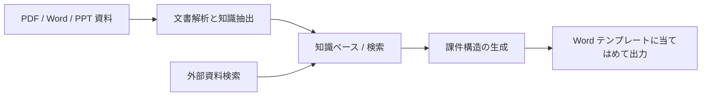
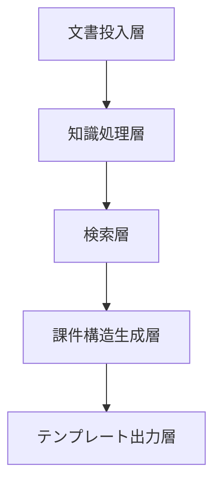

# プロジェクト：知識ベース駆動の課件生成アシスタント


:::tip この節の位置づけ
このプロジェクトは、普通の知識ベースQAより一歩進んだ内容です。  
単に質問に答えるだけではなく、実際に次のものを出力します。

- フォーマット要件に合った Word の課件

そのため、次のようなシステム能力をまとめて鍛えるのにとても向いています。

- 文書解析
- 知識検索
- 例題抽出
- 構造化出力
- テンプレート化した文書生成
:::

## 学習目標

- 「テーマ -> 資料検索 -> 例題抽出 -> 課件生成」を一つの流れとして組み立てられるようになる
- 知識ベース駆動の課件システムの最小プロジェクト範囲を定義できるようになる
- 内部知識ベースと外部資料補完を分けて設計できるようになる
- このプロジェクトを、製品らしさのある作品レベルのシステムにできるようになる

## 初学者向けの用語ブリッジ

このプロジェクトは、文書処理、検索、生成、出力をまたぐため、先に用語を整理しておくと進めやすくなります。

| 用語 | 初学者向けの意味 | このプロジェクトでの役割 |
|---|---|---|
| `ingestion` | ファイルをシステムに取り込み、処理できる状態にすること | PDF / Word / PPT 資料がここからパイプラインに入る |
| `example extraction` | 文書から例題、練習、定義、公式を見つけること | 課件には普通の段落だけでなく、例題が必要 |
| `schema` | 課件出力の形を決める安定したデータ構造 | 検索、生成、テンプレート出力を同じ形にそろえる |
| `template rendering` | 構造化内容を Word や PPT テンプレートに流し込むこと | 内容生成と文書レイアウトを分離する |
| `source_refs` | 各セクションや項目の出典情報 | 最終的な Word 下書きで内容の出どころを示せる |
| `internal vs external materials` | 内部資料は信頼できる教材資産、外部資料は補足 | 外部情報が授業の主構成を上書きしないようにする |

重要な判断は、モデルに直接「Word ファイルを書かせる」ことではありません。モデルには安定した構造化課件オブジェクト作りを手伝わせ、それをテンプレート層で確実に描画します。

---

## まず全体地図を作ろう

このプロジェクトは、「知識の投入 -> 検索 -> 構造化生成 -> テンプレート出力」として理解すると最も分かりやすいです。



つまり、このプロジェクトが本当に解決したいのは次のことです。

- ユーザーがテーマを1つ入力しただけで、システムが自動で資料を探し、例題を拾い、テンプレートに沿って書き出すこと

## 一、プロジェクト題目をどう絞る？

最も安定した出発点は、たいてい次のようなものです。

> **「知識ベース駆動の数学課件アシスタント」を作る。ユーザーがテーマを入力すると、システムが知識点、例題、練習問題を含む Word の初稿を自動生成する。**

この範囲がちょうどよい理由は次の通りです。

- テーマがはっきりしている
- 資料の形がはっきりしている
- 例題と知識点の両方を文書から抽出しやすい
- Word 出力というゴールが明確

最初から次のように広げるのはおすすめしません。

- 全教科対応
- PPT + Word + 原稿 + 音声合成まで自動生成

こうすると、プロジェクトの主軸がぼやけやすくなります。

## 二、新人向けの理解しやすい比喩

このシステムは次のように考えると分かりやすいです。

- 先に資料を読み、次に提案の骨組みを整理し、最後に課件の下書きを作ってくれる授業準備アシスタント

つまり、いきなり空から文章を作るのではなく、次の順番で動きます。

1. まず内部資料を調べる
2. 必要なら外部資料で補う
3. その資料から知識点と例題を選ぶ
4. 最後に決まった形式で課件にまとめる

この比喩はとても重要です。新人がこのプロジェクトを、

- 「モデルに Word を直接書かせるもの」

と勘違いするのを防げるからです。

## 三、最小システムの閉ループはどうなる？

1. 文書を知識ベースに入れる
2. 本文、見出し、例題を解析する
3. ユーザーがテーマを入力する
4. システムが内部の知識ブロックを検索する
5. 必要に応じて外部資料を補う
6. 構造化された課件オブジェクトを生成する
7. テンプレートを使って Word に出力する

この7ステップがきちんと回れば、その時点でかなり製品らしいプロジェクトになります。

## 四、まずは最小のワークフロー例を動かそう

```python
knowledge_base = [
    {"topic": "割引の文章題", "content_type": "concept", "text": "割引 = 元の価格 × 割引率"},
    {"topic": "割引の文章題", "content_type": "example", "text": "商品の元の価格が100元で、8割引の後の価格はいくらですか？"},
    {"topic": "割引の文章題", "content_type": "exercise", "text": "1着80元の服を7割引にしたらいくらになりますか？"},
]


def retrieve_internal(topic):
    return [item for item in knowledge_base if item["topic"] == topic]


def retrieve_external(topic):
    # ここでは最小限のシミュレーションだけ行う
    return [{"topic": topic, "content_type": "note", "text": f"外部資料の補足：{topic} に関するよくある指導上の誤解。"}]


def build_courseware(topic):
    internal = retrieve_internal(topic)
    external = retrieve_external(topic)
    all_items = internal + external
    return {
        "title": topic,
        "concepts": [x["text"] for x in all_items if x["content_type"] == "concept"],
        "examples": [x["text"] for x in all_items if x["content_type"] == "example"],
        "exercises": [x["text"] for x in all_items if x["content_type"] == "exercise"],
        "notes": [x["text"] for x in all_items if x["content_type"] == "note"],
    }


print(build_courseware("割引の文章題"))
```

### 4.1 この例で一番大事な価値は何？

この例が示しているのは、このシステムの本当の価値は単に

- 検索すること

ではなく、検索した内容を次のように再構成することだという点です。

- 課件に必要な欄の形にまとめ直すこと

## 五、実際のプロジェクトに近いシステム層の分け方

新人がこの種のプロジェクトを作るとき、いちばんやりがちなのは「知識ベース、検索、生成、出力」を全部混ぜてしまうことです。

より安定した方法は、最初から層を分けることです。



簡単に言うと、次のように考えればOKです。

- 投入層：資料を読み込む
- 処理層：資料を知識ブロックに変える
- 検索層：関連する材料を探す
- 生成層：材料を課件の構造に組み直す
- 出力層：構造を Word にする

## 六、このプロジェクトで必要な能力は何？

システム層ごとに見ると、中心となる能力は次の通りです。

### 6.1 文書解析

- PDF / DOCX / PPTX の読み取り
- スキャン画像の OCR
- 見出し階層と例題の認識

対応する講座：
- [文書解析と知識抽出](../ch03-app-dev/07-document-parsing.md)
- [文書処理](../ch01-rag/02-document-processing.md)
- [OCR 文字認識](../../ch10-computer-vision/ch05-advanced/03-ocr.md)

### 6.2 知識ベースと検索

- 分割
- メタデータ
- テーマ検索
- 例題の再呼び出し

対応する講座：
- [RAG 基礎](../ch01-rag/01-rag-basics.md)
- [ベクトルデータベース](../ch01-rag/03-vector-databases.md)
- [検索戦略](../ch01-rag/04-retrieval-strategies.md)

### 6.3 構造化出力とテンプレート生成

- まずアウトラインを生成する
- 次に知識点 / 例題 / 練習問題を生成する
- その後テンプレートを当てはめて Word に出力する

対応する講座：
- [Prompt 基礎](../../ch07-llm-principles/ch05-prompt/01-prompt-basics.md)
- [構造化出力](../../ch07-llm-principles/ch05-prompt/03-structured-output.md)
- [テンプレート化した文書生成（Word / PPT）](../ch03-app-dev/08-template-doc-generation.md)

### 6.4 ツール呼び出しとワークフロー

- 内部知識ベース検索
- 外部資料補完
- テンプレート描画
- ファイル出力

対応する講座：
- [関数呼び出しの実践](../ch03-app-dev/03-function-calling.md)
- [対話システムとマルチターン管理](../ch03-app-dev/05-dialog-system.md)
- [Plan-and-Execute](../../ch09-agent/ch02-reasoning/04-plan-and-execute.md)

## 七、定型フォーマットの課件に必要な最小 schema は何か？

このプロジェクトで最初にしっかり決めるべきなのは、モデル名ではなく、  
「課件がどんな形をしているか」です。

最小 schema は、まず次のように決めておくとよいです。

```python
courseware_schema = {
    "title": "テーマ名",
    "audience": "対象者",
    "teaching_goal": ["目標1", "目標2"],
    "sections": [
        {"type": "concept", "heading": "知識点の復習", "items": []},
        {"type": "example", "heading": "例題の解説", "items": []},
        {"type": "exercise", "heading": "授業中の練習", "items": []},
    ],
    "source_refs": [
        {"doc_id": "word_001", "page_or_slide": 3}
    ],
}
```

この schema がとても重要なのは、次の3つを同じ安定したオブジェクトに結びつけられるからです。

- 検索
- 生成
- テンプレート出力

## 八、内部資料と外部資料、どちらを優先する？

このプロジェクトには、とても大事な現実的な問題があります。

- 内部知識ベースにすでに成熟した資料があるかもしれない
- 外部資料は補助であり、主役にしてはいけない

そのため、新人向けのデフォルト戦略としては、次のようにするのが適切です。

| 場面 | デフォルトの優先順位 |
|---|---|
| テーマの知識点 | まず内部資料 |
| 定番の例題 | まず内部資料 |
| 最新の政策/ニュース/新しい出題形式 | その後で外部資料を補う |
| 内部資料の不足が明らかな場合 | 外部資料で補足説明 |

このルールは、次の一文で覚えておくとよいです。

> **内部資料が主骨格を決め、外部資料が空白を埋める。**

## 九、実際の製品らしい最小ワークフローの骨組み

```python
def generate_courseware(topic):
    parsed_docs = load_parsed_documents()
    internal_hits = retrieve_internal(parsed_docs, topic)
    external_hits = retrieve_external(topic)
    selected = merge_and_rank(internal_hits, external_hits)
    structured = build_courseware_schema(topic, selected)
    return export_word(structured)
```

この骨組みの価値は「コードがどれだけ高度か」ではなく、  
頭の中に次の5つの動作をはっきり持てることにあります。

1. 内部知識を読む
2. 外部補足を調べる
3. 統合して並べ替える
4. 固定 schema を作る
5. 文書を出力する


:::tip 図の読み方
この図は生産ラインとして読むのがポイントです。資料の投入、知識ブロックへの解析、テーマと内容タイプによる検索、courseware schema の生成、そして Word の描画までつながっています。途中の産物が残っていない層があると、その後の原因追跡がとても難しくなります。
:::

## 十、このプロジェクトはどう評価すればよい？

最初に見るべきなのは「見た目がそれっぽいか」ではなく、次の点です。

1. 検索内容が正しいか
2. 例題の抽出が正しいか
3. 構造がテンプレートに合っているか
4. 引用や出典をたどれるか

評価は、まず次のように分けられます。

| 観点 | 何を見ているか |
|---|---|
| 検索品質 | テーマ資料と例題を正しく見つけられているか |
| 構造の正しさ | 見出し、知識点、例題、練習問題が正しい位置にあるか |
| 出典の追跡可能性 | 各内容を文書の出典まで遡れるか |
| テンプレート適合度 | 最終的な Word がフォーマット規約に合っているか |

## 十一、新人がそのまま真似しやすい進め方

最初にこのプロジェクトを作るなら、安定しやすい順番はたいてい次の通りです。

1. まず内部知識ベースだけを作る
2. 外部資料はまだ入れない
3. まず構造化 JSON を生成する
4. その JSON を Word テンプレートに流し込む
5. 最後に外部検索、ツールのオーケストレーション、より複雑な Agent ロジックを追加する

こうすると、最初から「完全自動の授業準備 Agent」を作ろうとするより、ずっと安定して進められます。

## 十二、最初に作るときにハマりやすい落とし穴

この種のプロジェクトで、最初にありがちな失敗は次の通りです。

1. いきなりモデルに自由に全文を書かせる
2. 内部資料と外部資料の優先順位を分けない
3. 出典を保存せず、後から追跡できない
4. 固定 schema がなく、テンプレート描画層が壊れやすい
5. 生成結果が悪いときに、検索が悪いのかテンプレートが悪いのか分からない

そのため、より安定した開発の考え方は次の通りです。

- まず流れを分解する
- 各層を個別に検証する
- 最後にそれらをつなげる

## 十三、作品集として見せるなら、何を出すとよい？

作品集で一番見せる価値があるのは、通常は次のようなものです。

- 「Word を生成できます」
  
ではなく、

1. 元の資料がどういう形か
2. 解析後の知識ブロックがどうなっているか
3. ユーザーがテーマを入れた後、どんな内容が検索されたか
4. 最終的な課件構造がどう組み上がったか
5. Word テンプレート出力後の結果がどうなったか

こうすると、見る人には次のことが伝わりやすくなります。

- 単にモデルに文章を書かせたのではなく、知識駆動のコンテンツ生成システムを作ったのだと分かる

## 版本ルートのおすすめ

| バージョン | 目標 | 仕上げるポイント |
|---|---|---|
| 基礎版 | 最小閉ループを通す | 入力・処理・出力を実現し、サンプルを1組残す |
| 標準版 | 見せられるプロジェクトにする | 設定、ログ、エラーハンドリング、README、スクリーンショットを追加する |
| 挑戦版 | 作品集レベルに近づける | 評価、比較実験、失敗サンプル分析、次の展開方針を追加する |

まずは基礎版を完成させるのがおすすめです。最初から何でも入れようとしないでください。バージョンを1つ上げるたびに、「何が新しくできたか、どう検証したか、まだ何が課題か」を README に書き足しましょう。

## まとめ

- このプロジェクトの核心は、「文書知識 -> 構造化された課件 -> テンプレート出力」という完全な流れです
- schema と出典戦略は、最初にどのモデルを選ぶかより大事なことが多いです
- 最初は内部資料版のワークフローを安定させてから、外部資料や Agent 化を足すほうが現実的です

## この節で持ち帰るべきこと

- このプロジェクトで最も重要なのは「文書の出力」ではなく、「文書知識 -> 構造化された課件」という全体の連鎖です
- 文書解析、RAG、構造化出力、テンプレート描画のどれか1つでも欠けると、システムは安定しません
- このようなシステムを作りたいなら、まずワークフロー版を安定させ、その後で Agent 化を考えるほうが現実的です
