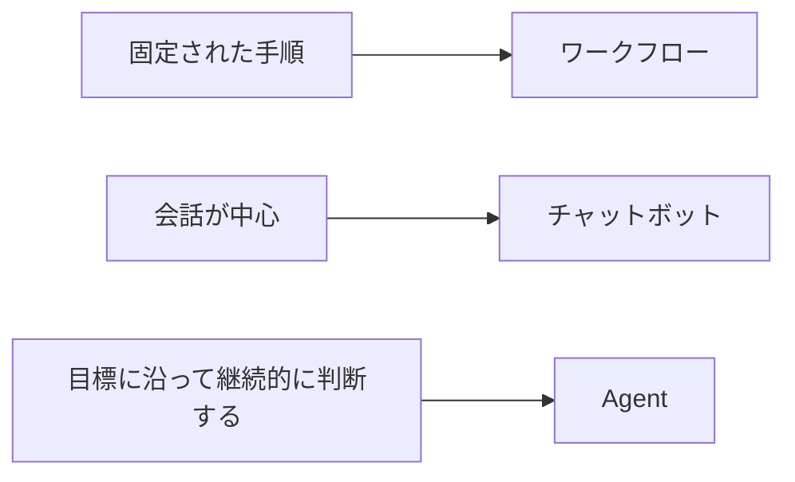
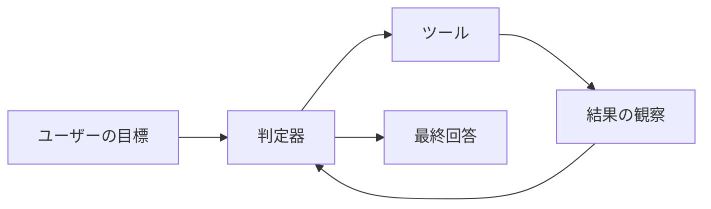
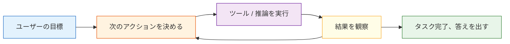

# 9.1.2 AI Agentとは何か


:::tip この節の位置づけ
Agent は、初心者が次のように誤解しやすいです：

- もっと会話が得意なモデル

でも、より実態に近い理解は次の通りです：

- 目標を中心に「判断 -> 行動 -> 観察 -> 再判断」を繰り返すシステム

なので、この節で最初に大事なのは、Agent を神格化することではなく、次のものと分けて考えることです：

- ワークフロー
- チャットボット
- 単発の関数呼び出し

この 3 種類のシステム境界を、まずははっきり分けましょう。
:::

## 学習目標

この節が終わると、あなたは次のことができるようになります：

- ワークフロー、チャットボット、Agent の違いを説明できる
- Agent の最小構成要素を理解できる
- ツール呼び出し付きのミニ Agent 例を実行できる
- Agent がなぜ「prompt を貼るだけ」ではないのか分かる

---

## この節は、前の大規模モデルアプリの流れとどうつながるのか

第 8 B ステージまで学んだなら、この節は次のように理解するとよいです：

- これまでに「モデル + 知識 + ツール + アプリ」のシステムを作れるようになっている
- この節からは、「いつそのシステムが Agent に進化し、固定ワークフローではなくなるのか」を考える

つまり、この節で本当に大事なのは定義文そのものではなく、次の点です：

- まず Agent とワークフロー、チャットシステム、関数呼び出しシステムを分けること

### 初心者に向いている全体のたとえ

この 3 種類のシステムは、次のようにイメージできます：

- ワークフロー：決まった地下鉄の路線
- チャットボット：受付窓口
- Agent：次に何をするか自分で決めるアシスタント

このアシスタントはもちろん会話もします。  
でも、本当に重要なのは「会話がうまいこと」ではなく、次の点です：

- 目標のために一連の動作を組み立てられるか

## まず Agent を神格化しない

初めて Agent を聞くと、「自律的に考えてタスクを実行する AI 社員」のように感じる人が多いです。

この説明は間違いではありませんが、少し大げさになりがちです。

より安定した理解は次の通りです：

> **Agent = 目標、状態、ツールに基づいて、段階的にタスクを完了するシステム。**

通常は、次のような能力を持ちます：

- 目標を受け取る
- 手順を分解する
- ツールを呼び出す
- 結果を見て次の行動を決める
- 必要ならタスクを終了する

### はじめて Agent を学ぶとき、まず何をつかむべき？

最初につかむべきなのは「自律」という言葉ではなく、次の一文です：

> **Agent の本質は「話すこと」ではなく、目標に沿って一連の動作を組み立てること。**

この感覚が固まると、あとで出てくる

- planning
- ツール
- メモリ
- Multi-Agent

が、なぜ存在するのか自然に見えてきます。

---

## ワークフロー、チャットボット、Agent の違いは？

### ワークフロー（Workflow）

各ステップはあらかじめ決められています：

1. ユーザーが質問する
2. データベースを調べる
3. Prompt を組み立てる
4. 答えを返す

これは固定されたライン作業のようなものです。

### チャットボット（Chatbot）

重点は「会話」です。  
必ずしも自分からタスクを分解したり、外部ツールを使ったりするとは限りません。

### システムとしての Agent

重点は「目標を達成するために、動的に行動を選ぶこと」です。

たとえば Agent は次のように動くかもしれません：

1. まずユーザーの意図を判断する
2. 次に天気を調べるのか、ドキュメントを見るのか、計算するのかを決める
3. 結果を受け取ったら、もう一度出力を組み立てる

### なぜこの 3 つの概念を最初に分ける必要があるのか？

見た目はどれも「モデルにつないだだけ」に見えても、実際の工程はまったく違うからです：

- ワークフローは固定ルートに近い
- チャットボットは会話 UI に近い
- Agent は目標駆動の実行システムに近い

最初にこの境界を分けないと、あとで次のような誤解が起きやすいです：

- ツールが増えたら Agent だと思う
- 状態があれば Agent だと思う
- 会話できれば Agent だと思う

### 初学者がまず覚えやすいシステム境界図



この図はとても重要です。なぜなら、初心者がまずつかむべきなのは、

- Agent は「より賢いチャット欄」ではない
- つまり、システムの制御方法が変わる

という点だからです。


:::tip 図の読み方
この図を見るときは、誰がより「賢い」かではなく、制御権がどこにあるかを見てください。ワークフローは経路があらかじめプログラムに固定されており、チャットボットは主に返答を担当し、Agent は目標に沿って何度も次の動作を決めます。
:::

---

## Agent の最小構成要素

Agent は、まず 4 つに分けて考えられます：

| コンポーネント | 役割 |
|---|---|
| 目標 | 今回何を達成したいか |
| モデル / 判定器 | 次に何をするか |
| ツール | どんな外部機能を呼び出せるか |
| 状態 / メモリ | 現在どこまで進んだか |

### この 4 つを最初に見るとき、まず覚えるべき一文は？

まずは次の一文を覚えるとよいです：

> **Agent = 目標 + 判断 + ツール + 状態。**

この後の 9 AI Agent と智能体システムの多くの章は、実はこの 4 つを展開しているだけです。

たとえるなら：

> Agent は、仕事をする実習生のようなものです。目標があり、ツール箱があり、作業記録があり、自分で次の一手を決めます。

### さらに最小の「候補アクション」例を見る

```python
def choose_action(query):
    if "天気" in query:
        return "use_weather_tool"
    if "返金" in query or "証明書" in query:
        return "use_docs_tool"
    if "計算" in query:
        return "use_calculator"
    return "reply_directly"


for query in ["北京の天気はどうですか", "返金ルールは何ですか", "7 * 8 を計算"]:
    print(query, "->", choose_action(query))
```

期待される出力：

```text
北京の天気はどうですか -> use_weather_tool
返金ルールは何ですか -> use_docs_tool
7 * 8 を計算 -> use_calculator
```

この例は初心者にとても向いています。なぜなら、次の核心動作が見えるからです：

- Agent は先に答えるのではなく
- まず次に何をするかを決める

### 初学者がまず覚えやすいシステム境界図



この図は特に重要です。Agent の本質は、

- ただ 1 文を出力することではない
- 「目標 -> 行動 -> 観察」の閉ループに入ること

だと教えてくれるからです。


:::tip 図の読み方
この図は時間の流れで見ると分かりやすいです。目標がシステムに入ると、Agent は各ラウンドで action、observation、state 更新を残します。あとで Agent をデバッグするときに見るのは最終回答だけではなく、この再現可能な軌跡です。
:::

---

## 大規模モデルに依存しないミニ Agent

原理を分かりやすくするために、まずは本物の大規模モデルを使わず、「ルール版 Agent」を書いてみます。

```python
import ast
import operator

OPS = {
    ast.Add: operator.add,
    ast.Sub: operator.sub,
    ast.Mult: operator.mul,
    ast.Div: operator.truediv,
}


def safe_calculate(expression):
    def visit(node):
        if isinstance(node, ast.Expression):
            return visit(node.body)
        if isinstance(node, ast.Constant) and isinstance(node.value, (int, float)):
            return node.value
        if isinstance(node, ast.BinOp) and type(node.op) in OPS:
            return OPS[type(node.op)](visit(node.left), visit(node.right))
        if isinstance(node, ast.UnaryOp) and isinstance(node.op, ast.USub):
            return -visit(node.operand)
        raise ValueError("unsupported_expression")

    return visit(ast.parse(expression, mode="eval"))


def tool_weather(city):
    fake_weather = {
        "北京": "晴れ、22 度",
        "上海": "くもり、25 度",
        "深圳": "小雨、28 度"
    }
    return fake_weather.get(city, "その都市の天気データはまだありません")

def tool_calculate(expression):
    return str(safe_calculate(expression))

def tool_search_docs(keyword):
    docs = {
        "返金": "講座購入後 7 日以内かつ学習進捗が 20% 未満であれば返金を申請できます。",
        "証明書": "すべての必修項目を完了し、修了テストに合格すると証明書を取得できます。"
    }
    for k, v in docs.items():
        if k in keyword:
            return v
    return "関連するドキュメントが見つかりませんでした。"

def simple_agent(user_query):
    steps = []

    if "天気" in user_query:
        city = "北京" if "北京" in user_query else "上海" if "上海" in user_query else "深圳"
        steps.append(f"天気の問い合わせを検出、weather ツールを呼び出す準備、都市={city}")
        result = tool_weather(city)
        steps.append(f"ツールの返り値：{result}")
        final_answer = f"{city}の現在の天気：{result}"

    elif "返金" in user_query or "証明書" in user_query:
        steps.append("知識検索の問い合わせを検出、docs ツールを呼び出す準備")
        result = tool_search_docs(user_query)
        steps.append(f"ツールの返り値：{result}")
        final_answer = result

    elif "計算" in user_query:
        expression = user_query.replace("計算", "").strip()
        steps.append(f"計算タスクを検出、calculator ツールを呼び出す準備、式={expression}")
        result = tool_calculate(expression)
        steps.append(f"ツールの返り値：{result}")
        final_answer = f"計算結果は：{result}"

    else:
        steps.append("ツールにマッチしないため、デフォルト応答を返す")
        final_answer = "今のところ、どのツールを呼び出すべきか分かりません。"

    return steps, final_answer

query = "計算 23 * 7"
steps, answer = simple_agent(query)

print("ユーザーの質問:", query)
print("実行手順:")
for step in steps:
    print("-", step)
print("最終回答:", answer)
```

期待される出力：

```text
ユーザーの質問: 計算 23 * 7
実行手順:
- 計算タスクを検出、calculator ツールを呼び出す準備、式=23 * 7
- ツールの返り値：161
最終回答: 計算結果は：161
```

この例はシンプルですが、すでに Agent の核心が入っています：

- タスクを認識する
- ツールを選ぶ
- 結果を受け取る
- 出力を組み立てる

---

## Agent と「関数呼び出し」はどういう関係？

Agent は Function Calling / Tool Calling をよく使いますが、両者は完全に同じではありません。

### 関数呼び出し

重点は：モデルが構造化された引数を出力して、正しくツールを呼び出せるか。

### Agent と関数呼び出しの境界

重点は：モデルやシステムが目標に沿って、動的に次のことを決められるかです：

- いつツールを呼ぶか
- どのツールを呼ぶか
- 何回呼ぶか
- 呼んだあと次に何をするか

つまり、次のように覚えられます：

> ツール呼び出しは Agent のよくある能力だが、Agent ＝ ツール呼び出し ではない。

### なぜ初心者はここで混同しやすいのか？

多くの初期 Demo は次の流れに見えるからです：

- 意図を認識する
- 1 つのツールを呼ぶ
- 結果を返す

でも本当の Agent は、さらに次を気にします：

- いつ呼ぶか
- どれを呼ぶか
- 呼んだあと次に何をするか
- さらに繰り返す必要があるか

## なぜ Agent は普通の Q&A システムより難しいのか？

「行動」が一段増えるからです。

普通の Q&A システムは、より次のようなものです：

- 入力を見る
- 答えを生成する

Agent は、次のようなものです：

- 入力を見る
- 計画する
- 実際にやってみる
- 結果を観察する
- そして次の一手を決める

そのため、難しさも増えます：

- エラーが複数ステップで積み重なる
- ツール呼び出しが失敗することがある
- コストと遅延が高くなりやすい
- 安全リスクも大きくなる

---

## Agent らしいループ思考

実際の Agent システムは、だいたい次のような形です：



だからこそ Agent では次の点が特に重要になります：

- planning
- 観察
- フィードバック
- 反復

### このループで最初に理解すべきなのは、図よりも「閉ループ」

つまり、Agent の本質は単発の出力ではなく、次の流れです：

- 目標を見る
- 行動する
- 結果を観察する
- 次の一手を決める

これが、普通の Q&A システムとの最も本質的な違いの 1 つです。

### はじめて Agent プロジェクトを作るときの、安定した順番

一般的に、より安全な順番は次の通りです：

1. まず単発のツール呼び出しを作る
2. システムにアクション選択をさせる
3. 観察結果を見て次の判断をする
4. 最後に、より複雑な planning とメモリを入れる

こうすると、最初から「完全自律 Agent」を追うより、実際に制御しやすいシステムを作りやすくなります。

## それをプロジェクトやノートとして見せるなら、何を見せるべき？

見せる価値が高いのは、たいてい次のような動画ではありません：

- 「ツールを呼び出せます」とだけ見せるデモ動画

それよりも次の 5 つです：

1. ユーザーの目標
2. Agent が選んだアクション
3. なぜそのアクションを選んだのか
4. ツールが何を返したか
5. Agent が結果をどう使って次に進んだか

こうすると、見る人は次の点を理解しやすくなります：

- あなたが理解しているのは行動の閉ループであること
- 単にモデルとツールをつないだだけではないこと

---

## どんなタスクが Agent に向いている？

### 比較的向いている

- 多段階のタスク
- 外部ツールが必要なタスク
- 中間結果に応じて戦略を変える必要があるタスク

たとえば：

- リサーチアシスタント
- 自動レポート作成
- データ分析アシスタント
- コード修復アシスタント

### あまり向いていない

- 1 回で答えられる簡単な FAQ
- 完全に固定された手順のタスク
- 安定性が非常に重要で、自由な動作を許せない場面

多くの場面では、**Agent よりワークフローの方が合っている**こともあります。

---

## 初心者がよくやる誤解

### 「会話できる」なら Agent だと思う

違います。  
チャットボットは、自分で段階的に行動するとは限りません。

### Agent は必ずワークフローより上位だと思う

そうとは限りません。  
シンプルで安定したタスクでは、ワークフローの方が安くて信頼できることがあります。

### ツール呼び出しを追加すればすべて解決すると考える

ツールが増え、手順が増えるほど、デバッグと安全管理は難しくなります。

---

## システムが Agent かどうかを判断するチェックリスト

多くの初心者は、「チャットボット、RAG アプリ、ツール呼び出しアプリ」を全部 Agent と呼びがちです。より安定したやり方は、まず次の表で確認することです。

| 質問 | 答えが「はい」の場合 | より近いもの |
|---|---|---|
| 手順は完全に固定されているか？ | 毎回同じ流れで進む | ワークフロー |
| 主な目的は連続対話か？ | 文脈を理解して返答することが中心 | チャットボット |
| ただ 1 回だけツールを呼ぶのか？ | ユーザーの質問ごとに対応する関数を 1 つ呼ぶ | ツール呼び出しアプリ |
| 中間結果に応じて次の行動を決めるか？ | ツール結果が後続の動作に影響する | Agent |
| 明確な停止条件と実行記録があるか？ | なぜ続けるか、なぜ終えるか分かる | より制御しやすい Agent に近い |

まずは次の判断を覚えておくとよいです：システムに「結果を観察してから次の一手を決める」動きがないなら、それはまだワークフローかツール呼び出しアプリであることが多く、急いで Agent と呼ぶ必要はありません。

## 最初の Agent プロジェクトはどう作ると安定する？

初めて Agent を作るときは、いきなり「完全自動の複雑なアシスタント」を作るのはおすすめしません。より安定した進め方は次の通りです：

| バージョン | 目的 | 合格基準 |
|---|---|---|
| v0.1 単発ツール | ユーザーの質問に応じて 1 つのツールを選べる | tool_call、引数、ツール結果を出力できる |
| v0.2 多段実行 | 2〜3 ステップのタスクを完了できる | 各ステップに trace があり、無限ループしない |
| v0.3 失敗復旧 | ツール失敗時に説明し、代替案を試せる | エラーログとフォールバック回答がある |
| v0.4 人手確認 | リスクの高い操作の前に確認が必要 | 読み取り専用ツールと書き込みツールを区別できる |
| v0.5 プロジェクト展示 | README、例、失敗サンプル、安全境界がある | Agent がなぜそのように動くか説明できる |

この進め方は、「見た目が派手な自律性」よりも、「制御できる行動の閉ループ」に重点を置く助けになります。

## Agent 実行 Trace テンプレート

Agent プロジェクトで最も見せる価値があるのは実行過程です。毎回の実行で、少なくとも次の項目を記録することをおすすめします：

| フィールド | 例 | 役割 |
|---|---|---|
| `goal` | 今週の学習計画を立てて | ユーザーの目標 |
| `step` | 1 | 何ステップ目か |
| `thought_type` | plan / tool / observe / final | 現在の段階 |
| `action` | search_course_docs | 実行した動作 |
| `arguments` | `{topic: "RAG"}` | ツールの引数 |
| `observation` | 関連章を 3 件見つけた | ツールや環境の返り値 |
| `next_decision` | 計画生成を続ける | なぜ続けるか、なぜ止めるか |

最小の trace は次のように書けます：

```text
goal: RAG 学習計画を作る
step 1: action=search_course_docs, arguments={topic: RAG}
observation: RAG 基礎、文書処理、検索戦略の 3 章を見つけた
step 2: action=build_plan, arguments={days: 3}
observation: 3 日分の計画を生成した
final: 学習計画を返し、どの章を参照したかを説明する
```

trace がないと、Agent が失敗したときに原因を特定しにくくなります。目標の理解ミスなのか、ツールの選択ミスなのか、引数のミスなのか、ツール返却の異常なのか、それとも停止条件の書き忘れなのかが分かりにくいからです。

## Agent がやるべきではないこと

Agent の能力が高くなるほど、境界も必要になります。特に学習初期は、すべてを Agent に自律実行させるのが正解ではないことを覚えておきましょう。

| Agent に自律実行させない方がよいこと | より安定した方法 |
|---|---|
| ファイル削除、コードのコミット、メッセージ送信、注文や支払い | 必ず人間が確認する |
| ホワイトリスト制限のない任意コードの実行 | ツール権限と実行環境を制限する |
| 成功するまで無限に試行する | 最大ステップ数、最大コスト、タイムアウトを設定する |
| 証拠が足りないのに結論を作る | 「分からない」と言えるようにする |
| 現在の事実をメモリだけで上書きする | まず現在状態を読み取ってから行動する |

この表は Agent を弱くするためではなく、より信頼できるシステムにするためのものです。本当に実用的な Agent で大事なのは、「たくさん自分でできるか」ではなく、「いつ止まるべきか、いつ人に聞くべきか、いつやってはいけないか」を理解していることです。

---

## 残す証拠

このページを終えたら、この evidence card を残します。

```text
agent_boundary: how this differs from chatbot or fixed workflow
goal_state_action: goal, current state, next action, observation
architecture_parts: planner, tools, memory, guardrails, evaluator
failure_check: over-autonomy, vague goal, missing state, or no trace
next_action: build the smallest traceable single-agent loop
```

## まとめ

この節で最も大事な一文は次の通りです：

> **Agent は「話せるモデル」ではなく、「目標に沿って行動できるシステム」です。**

その価値は、単に答えることではなく、タスクを完了することにあります。  
次の章では、推論、ツール、メモリ、Multi-Agent、デプロイと安全性をさらに掘り下げます。

## この節で持ち帰るべきこと

- Agent の本質は対話ではなく、行動の閉ループ
- ワークフロー、チャットシステム、関数呼び出し、Agent はまず境界を分けて考える
- 9 AI Agent と智能体システムの今後のモジュールは、実はすべて「目標 + 判断 + ツール + 状態」を展開している

---

## 練習

1. `simple_agent()` に「講座スケジュールを調べる」ツールを追加してみましょう。
2. Agent が「先にドキュメントを調べてから計算する」2 段階タスクに対応できるようにしてみましょう。
3. もしツールがエラー情報を返したら、Agent はどう処理するとより安全でしょうか？
