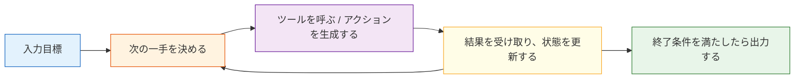

# 9.1.5 Agent システムアーキテクチャ


## 学習目標

この節を終えると、次のことができるようになります。

- Agent システムによくある主要コンポーネントを説明できる
- 単一 Agent アーキテクチャの基本的な実行ループを理解できる
- 状態とツール登録を持つミニアーキテクチャの例を動かせる
- 実際のシステムに観測性とガードレールが欠かせない理由を理解できる

---

## Agent は「1つのモデル」だけではない

### 最初にありがちな誤解：Agent は大規模言語モデル + Prompt だけだと思ってしまう

実際に使える Agent システムには、通常、少なくとも次の要素も必要です。

- ツール層
- 状態管理
- 実行ループ
- エラー処理
- 安全制限

モデルはとても重要ですが、システム全体の一部にすぎません。  
大きな脳のような役割を持ちますが、それだけで全体が成り立つわけではありません。

### Agent は小さなオペレーティングシステムのようなものと考えるとよい

中には次のようなものがあります。

- 意思決定の中心
- ツールボックス
- メモ帳
- 実行記録
- 安全ルール

だからこそ、Agent がエンジニアリング段階に入ると、単に「prompt を書く」だけではなくなります。

---

## よくある主要コンポーネント

### 意思決定器

役割は次のとおりです。

- 今のタスクをどう分解するか決める
- 次に何をするか決める
- ツールを呼ぶ必要があるか判断する

シンプルなシステムでは、この部分を LLM が直接担当することがあります。  
より強い制御が必要な場面では、ルール + LLM の組み合わせになることもあります。

### ツール層

ここが Agent が行動できるようにする重要な部分です。

ツールには、たとえば次のようなものがあります。

- 検索
- データベース問い合わせ
- API 呼び出し
- ファイルの読み書き
- 計算機

ツールがなければ、多くの Agent は実際には「話せる」だけで、「実行」はできません。

---

## 状態、記憶、コンテキスト

### 状態：今のタスクがどこまで進んだか

状態には通常、次のような情報を記録します。

- ユーザーの目標
- 実行済みステップ
- 中間結果
- 失敗時の再試行回数

これは「長期記憶」とは別物です。  
どちらかというと、今のタスクの作業スペースのようなものです。

### 記憶：回をまたいで何を保持するか

記憶は、より次のような内容に関係します。

- ユーザーの好み
- 過去のプロジェクト
- 長期的なコンテキスト

多くの基本的な Agent は、最初から複雑な記憶を必要とするわけではありません。  
しかし、状態はほぼ必ず必要になります。

---

## 標準的な実行ループ

### 最小ループ：感知、決定、行動、観察



### このループがなぜ重要なのか？

Agent の本質は、「1回だけ回答する」ことではありません。  
むしろ、

> 中間結果に応じて、動きを何度も調整する

ことにあります。

これが、普通のチャットボットとの根本的な違いの1つです。


:::tip 読み方のヒント
この図は「Agent を作るときの解剖図」だと思って見てください。意思決定器が次の一手を決め、ツール層が行動を担当し、記憶と状態が文脈を記録し、ガードレールが何をしてよいかを決め、観測性が各ステップを追跡できるようにします。
:::

---

## 小さく動くアーキテクチャの例

次の例では、明示的に以下を定義します。

- ツール登録表
- 状態
- 意思決定ロジック
- 実行ループ

```python
import ast
import operator

OPS = {
    ast.Add: operator.add,
    ast.Sub: operator.sub,
    ast.Mult: operator.mul,
    ast.Div: operator.truediv,
}


def safe_calculate(expression):
    def visit(node):
        if isinstance(node, ast.Expression):
            return visit(node.body)
        if isinstance(node, ast.Constant) and isinstance(node.value, (int, float)):
            return node.value
        if isinstance(node, ast.BinOp) and type(node.op) in OPS:
            return OPS[type(node.op)](visit(node.left), visit(node.right))
        if isinstance(node, ast.UnaryOp) and isinstance(node.op, ast.USub):
            return -visit(node.operand)
        raise ValueError("unsupported_expression")

    return visit(ast.parse(expression, mode="eval"))


def tool_weather(city):
    data = {"北京": "晴れ 22 度", "上海": "くもり 25 度"}
    return data.get(city, "この都市の天気はまだありません")

def tool_calc(expression):
    return str(safe_calculate(expression))

TOOLS = {
    "weather": tool_weather,
    "calc": tool_calc
}

def decide_next_action(state):
    query = state["query"]
    if state["done"]:
        return None

    if "天気" in query and not state["steps"]:
        city = "北京" if "北京" in query else "上海"
        return {"tool": "weather", "args": city}

    if "計算" in query and not state["steps"]:
        expression = query.replace("計算", "").strip()
        return {"tool": "calc", "args": expression}

    return {"tool": None, "args": None}

def run_agent(query):
    state = {
        "query": query,
        "steps": [],
        "observations": [],
        "done": False
    }

    while not state["done"]:
        action = decide_next_action(state)
        if action is None or action["tool"] is None:
            state["done"] = True
            break

        tool_name = action["tool"]
        args = action["args"]
        result = TOOLS[tool_name](args)

        state["steps"].append(action)
        state["observations"].append(result)
        state["done"] = True

    if state["observations"]:
        return state, state["observations"][-1]
    return state, "実行できるアクションがありません"

state, answer = run_agent("計算 23 * 8")
print("状態:", state)
print("最終回答:", answer)
```

期待される出力：

```text
状態: {'query': '計算 23 * 8', 'steps': [{'tool': 'calc', 'args': '23 * 8'}], 'observations': ['184'], 'done': True}
最終回答: 184
```

この例はとても小さいですが、Agent アーキテクチャの核心はすでに含まれています。

---

## Guardrails：なぜガードレールは必須なのか？

### Agent は実際に行動するから

行動するということは、リスクがあるということです。

たとえば、次のような問題が起こりえます。

- 間違ったツールを呼ぶ
- 同じ処理を何度も実行する
- 権限を超えてアクセスする
- データを誤って削除する

そのため、実際のシステムでは、次のようなガードレールがよく使われます。

- ツールのホワイトリスト
- 引数の検証
- 最大ステップ数の制限
- 人間による確認ポイント

### とても簡単なガードレールの例

```python
import ast
import operator

OPS = {
    ast.Add: operator.add,
    ast.Sub: operator.sub,
    ast.Mult: operator.mul,
    ast.Div: operator.truediv,
}


def safe_calculate(expression):
    def visit(node):
        if isinstance(node, ast.Expression):
            return visit(node.body)
        if isinstance(node, ast.Constant) and isinstance(node.value, (int, float)):
            return node.value
        if isinstance(node, ast.BinOp) and type(node.op) in OPS:
            return OPS[type(node.op)](visit(node.left), visit(node.right))
        if isinstance(node, ast.UnaryOp) and isinstance(node.op, ast.USub):
            return -visit(node.operand)
        raise ValueError("unsupported_expression")

    return visit(ast.parse(expression, mode="eval"))


def safe_eval(expression):
    allowed_chars = set("0123456789+-*/(). ")
    if not set(expression) <= allowed_chars:
        return "式に許可されていない文字が含まれています"
    return str(safe_calculate(expression))

print(safe_eval("3 * (4 + 5)"))
print(safe_eval("__import__('os').system('rm -rf /')"))
```

期待される出力：

```text
27
式に許可されていない文字が含まれています
```

ガードレールの大事な考え方は、「システムを絶対に間違えなくする」ことではありません。  
むしろ、間違いの範囲を小さくすることです。

---

## Observability：なぜ Agent の動きを見えるようにするのか？

### 多段階システムは見えにくいとデバッグしにくいから

少なくとも次のことが見えるとよいです。

- 各ステップで何を決めたか
- どのツールを呼んだか
- ツールが何を返したか
- なぜ終了したか

### 最小限の観測情報には通常次のものが含まれる

- 入力
- action
- observation
- 最終出力
- 時間コスト

多くの Agent プロジェクトが最後につまずくのは、モデルが弱いからではなく、システムのどこが間違っているのか見えないからです。

---

## 単一 Agent と複数 Agent

### まずは単一 Agent を安定させるのが基本

多くのシステムでは、まず単一 Agent をしっかり作るべきです。

- デバッグしやすい
- 収束しやすい
- アーキテクチャがわかりやすい

### 多数 Agent はデフォルトの上位互換ではない

複数 Agent は、タスクが本当に分業に向いているときだけ検討する価値があります。

たとえば次のような役割分担です。

- 計画 Agent
- 実行 Agent
- レビュー Agent

タスクがそれほど複雑でなければ、複数 Agent はかえって調整コストを増やします。

---

## 初学者がやりがちな誤解

### まず多 Agent にしてから、単一 Agent を考える

これはたいてい、デバッグ難易度を一気に上げてしまいます。

### 状態と記憶を同じものとして扱う

状態は今のタスク寄り、記憶はタスクをまたいだ蓄積寄りです。

### ログと再現機構がない

一度システムが壊れると、推測するしかなくなります。

---

## 残す証拠

このページを終えたら、この証拠カードを残します。

```text
agent_boundary: how this differs from chatbot or fixed workflow
goal_state_action: goal, current state, next action, observation
architecture_parts: planner, tools, memory, guardrails, evaluator
failure_check: over-autonomy, vague goal, missing state, or no trace
next_action: build the smallest traceable single-agent loop
```

## まとめ

この節で最も大事なのは次の理解です。

> Agent アーキテクチャの核心は、「ツールを呼べるか」だけではなく、意思決定、実行、状態、ガードレール、観測を、安定したループとして組み立てられるかどうかにある。

だからこそ、本当の Agent 開発は、モデルの問題でもあり、システム設計の問題でもあります。

---

## 練習

1. ミニ Agent に `docs_search` ツールを追加してみましょう。
2. `run_agent()` に「最大ステップ数」の制限を追加してみましょう。
3. 考えてみましょう。ツールがよくタイムアウトする場合、アーキテクチャ面ではどのような仕組みを追加すべきでしょうか。
