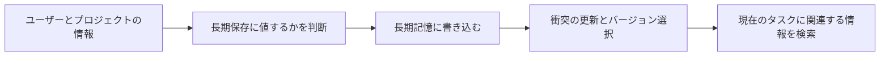

# 9.4.4 長期記憶

:::tip この節の位置づけ
短期記憶が解決するのは、次のようなことです：

- 今回のタスクで何が起きているか

長期記憶が解決するのは、次のようなことです：

- このユーザー、このプロジェクト、このシステムが、より長い時間軸でどういう状態か

多くの Agent は最初、長期記憶を次のように考えがちです：

- 重要な情報を保存しておく

でも、実際に実装しようとすると、すぐに問題はこう変わります：

> **どの情報が本当に長期保存に値するのか。古い情報と新しい情報が矛盾したら、どちらを信じるべきか？**
:::

## 学習目標

- 長期記憶と短期記憶の役割の境界を理解する
- ユーザーの好み、安定した背景、一時的な事実の3種類を区別できるようになる
- 長期記憶の書き込み、更新、衝突処理、読み出しの基本戦略を理解する
- 実行可能なサンプルを通して、最小限の長期記憶ストアの使い方を身につける

---

## まず地図を作ろう

長期記憶は、「何を保存するか -> どう更新するか -> どう取り出すか」という流れで考えると理解しやすいです。



この節で本当に知りたいのは、次の2点です：

- 長期記憶はなぜ「少し多めに保存する」だけではないのか
- なぜ書き込み戦略と読み出し戦略の両方が重要なのか

---

## どんな情報が長期記憶に向いているのか？

### 将来また使う可能性が高い

長期記憶で最も大事なのは「見た目が重要そうか」ではなく、  
次の点です：

- 将来、再利用する価値があるか

たとえば：

- ユーザーの好み：簡潔な回答が好き
- ユーザーの背景：初学者である
- プロジェクトの背景：現在は返金アシスタントを作っている

こうした情報は、何度も会話をまたいで役立つ可能性があります。

### 一時的な変化ではなく、比較的安定している

たとえば：

- 「今日は気分がよくない」  
  これは短期的な文脈に近い
- 「長期的には表でまとめるのが好き」  
  これは長期的な特徴に近い

短期的な揺れまで長期記憶に入れてしまうと、  
システムはすぐにノイズをたくさん覚えてしまいます。

### たとえで考える

長期記憶は「チャット履歴のバックアップ箱」ではなく、  
「ユーザープロファイル」や「プロジェクトプロファイル」に近いです。

プロファイルが重視するのは：

- 安定性
- 再利用しやすさ
- バージョン感

### 初学者によりわかりやすいたとえ

長期記憶は次のように考えるとよいです：

- ユーザーとプロジェクトの「カード」を管理する

そのカードに書くべきなのは：

- 将来も何度も使う情報

逆に、書くべきでないのは：

- 今回の会話でたまたま出た感情の揺れ
- その場で何気なく言った一度きりの要望

このたとえはとても重要です。最初から長期記憶を「無限のチャットログ」にしてしまうのを防げるからです。

---

## 長期記憶に入ることが多い3種類の情報

### ユーザーの好み

たとえば：

- 簡潔なのが好き
- 日本語が好き
- 出力には表をつけたい

### 安定した背景情報

たとえば：

- ユーザーの役割は運営担当
- ユーザーは RAG プロジェクトを進めている
- 所属チームでは主に Python を使っている

### 長期的なタスク背景

たとえば：

- 今週は返金モジュールの改善が重点
- 現在のプロジェクトで何を成功とするか

こうした情報は「直近3件のメッセージ」のように短命ではなく、  
また、状況ごとの一回限りの出来事を記録するエピソード記憶とも少し違います。

---

## 長期記憶で一番難しいのは「保存」ではなく「更新」

### 新しい情報が古い情報を覆すことがあるから

たとえば、以前の記録にこうあったとします：

- ユーザーは詳しい説明が好き

その後、ユーザーが何度もこう言ったら：

- これからはできるだけ簡潔にしてほしい

このとき、システムは単純に2つを同時に残すだけではいけません。  
読み出し時に矛盾してしまうからです。

### そのため、長期記憶には通常次のような要素が必要です：

- タイムスタンプ
- 信頼度
- 更新戦略

よく使われる戦略は次のとおりです：

- 新しい記録で古い記録を上書きする
- 新旧を両方残し、信頼度の高い方を優先する
- 履歴は保持し、読み出し時に最新のものを選ぶ

### なぜ「信頼度」が大事なのか？

ユーザーの何気ない一言を、ずっと固定して記憶すべきとは限らないからです。  
たとえば：

- 「今回は表を使わなくていい」

これは必ずしも次を意味しません：

- 「今後は永遠に表を使わないで」

だから長期記憶にはできれば次の情報を持たせるとよいです：

- 観測回数
- 明確さ
- 信頼度

### 初学者が最初に覚えるとよい書き込み判断表

| 情報の種類 | 短期向きか長期向きか |
|---|---|
| 今回は少し簡潔にしてほしい | どちらかというと短期 |
| ユーザーは長期的に日本語が好き | どちらかというと長期 |
| 現在のプロジェクトは返金アシスタント | どちらかというと長期的なタスク背景 |
| 今日は気分がよくない | どちらかというと短期 |

この表は初心者にとても役立ちます。  
まず次の最も混乱しやすい問いに答えやすくなるからです：

- 何を長期記憶に入れるべきか


:::tip 図の見方
長期記憶は「永久保存のチャットログ」ではありません。図を見るときは write policy、confidence、version、retrieval に注目してください。先に保存する価値があるかを判断し、それから新旧の衝突を処理し、最後に現在のタスクに関連する事実を取り出します。
:::

---

## まずは最小限の長期記憶ストアを動かしてみよう

このサンプルでは次の4つを行います：

1. 長期記憶に書き込む
2. 既存の記憶を更新する
3. 信頼度と時刻で並べて読み出す
4. ユーザーごとに記憶を分ける

```python
from dataclasses import dataclass


@dataclass
class LongTermFact:
    user_id: str
    key: str
    value: str
    confidence: float
    updated_at: int


class LongTermMemoryStore:
    def __init__(self):
        self.items = []
        self.clock = 0

    def _tick(self):
        self.clock += 1
        return self.clock

    def upsert(self, user_id, key, value, confidence=0.6):
        now = self._tick()

        for item in self.items:
            if item.user_id == user_id and item.key == key:
                # 新しい値の信頼度が高ければ、古い値を上書きする
                if confidence >= item.confidence:
                    item.value = value
                    item.confidence = confidence
                    item.updated_at = now
                return item

        fact = LongTermFact(
            user_id=user_id,
            key=key,
            value=value,
            confidence=confidence,
            updated_at=now,
        )
        self.items.append(fact)
        return fact

    def get_profile(self, user_id):
        records = [item for item in self.items if item.user_id == user_id]
        records.sort(key=lambda x: (x.confidence, x.updated_at), reverse=True)
        return {item.key: item.value for item in records}


store = LongTermMemoryStore()
store.upsert("u_001", "response_style", "detailed", confidence=0.4)
store.upsert("u_001", "response_style", "concise", confidence=0.9)
store.upsert("u_001", "language", "ja", confidence=0.8)
store.upsert("u_002", "response_style", "table", confidence=0.7)

print("u_001 profile:", store.get_profile("u_001"))
print("u_002 profile:", store.get_profile("u_002"))
```

期待される出力：

```text
u_001 profile: {'response_style': 'concise', 'language': 'ja'}
u_002 profile: {'response_style': 'table'}
```

### この例で一番注目すべき点は？

「保存できるか」ではなく、次の点です：

- 同じ key は更新される
- 信頼度の高い情報が古い値を上書きする
- 読み出しはユーザー単位で profile としてまとめる

これは「文字列をただ list に append する」より、かなり本物の長期記憶に近いです。

### なぜここで `key-value` を使うのが自然なのか？

長期記憶には、もともと profile 型の情報が多いからです：

- `response_style`
- `language`
- `project_name`

こうした情報は、プレーンテキストの段落よりも、キーと値の形のほうが扱いやすいです。

### どんなときにこの形式は向かないのか？

情報が物語や体験談のような形なら、  
そのほうが向いているのは：

- エピソード記憶

であって、単純な key-value ではありません。

### さらに最小の「書き込み判断」の例を見る

```python
facts = [
    {"text": "以後はできるだけ日本語で", "stability": "high", "target": "long_term"},
    {"text": "今回は少し短めに", "stability": "low", "target": "short_term"},
]

for fact in facts:
    print(fact)
```

期待される出力：

```text
{'text': '以後はできるだけ日本語で', 'stability': 'high', 'target': 'long_term'}
{'text': '今回は少し短めに', 'stability': 'low', 'target': 'short_term'}
```

この例はとても小さいですが、初学者がまず次の習慣を身につけるのに役立ちます：

- 記憶に書き込む前に、この情報は長期か短期かを先に考える

---

## 長期記憶はどう読み出せば「多すぎて乱れる」ことを防げるのか？

### 読み出し時に全部をコンテキストへ入れない

長期記憶にたくさん保存されていても、  
現在の質問に全部関係あるとは限りません。

よりよい方法は：

- まずユーザーで絞る
- 次に key やテーマで絞る
- 最後に今いちばん関連する数件だけを取り出す

### テーマで絞る最小例

```python
def select_relevant_profile(profile, query):
    selected = {}
    if "回答" in query or "スタイル" in query:
        if "response_style" in profile:
            selected["response_style"] = profile["response_style"]
    if "日本語" in query or "言語" in query:
        if "language" in profile:
            selected["language"] = profile["language"]
    return selected


profile = store.get_profile("u_001")
print(select_relevant_profile(profile, "これからは回答スタイルを統一して"))
```

期待される出力：

```text
{'response_style': 'concise'}
```

これは、長期記憶の有効性が  
読み出し戦略にも依存することを示しています。

### 最初に長期記憶システムを作るときの、いちばん堅い順番

一般に、次の順番が安定です：

1. まず最も安定したユーザーの好みだけを保存する
2. まずはシンプルな key-value profile にする
3. 衝突時の更新ルールをはっきり決める
4. そのあとで、より複雑な読み出しや検索戦略を足す

こうすると、最初から「大きくて全部入りの記憶システム」を作るより、ずっと安定します。

---

## もし目標が「知識ベース駆動の教材生成アシスタント」なら、どんな情報を長期記憶に入れるべきか？

このタイプのプロジェクトでよくあるミスは：

- 毎回の教材テーマをそのまま長期記憶に入れてしまう

でも実際には、多くのテーマは一回限りのタスクであり、  
長期保存には向きません。

より長期記憶に向いているのは、次のような安定した好みです：

| 情報 | 長期向きか短期向きか |
|---|---|
| ユーザーが長期的に Word 出力を好む | 長期 |
| ユーザーが長期的に授業解説スタイルを好む | 長期 |
| 今回は「割引の文章題」の教材を作る | 短期 |
| 今回は練習問題が3問だけ必要 | どちらかというと短期 |
| ユーザーが長期的に「小学校高学年」向けに授業準備をしている | 長期または半長期 |

これを一言でまとめると、次のようになります：

> **長期記憶には好みと安定した背景を入れ、短期状態には今回のタスクの詳細を入れる。**

### より実際のプロジェクトらしい長期 profile の例

```python
profile = {
    "preferred_doc_format": "word",
    "preferred_style": "授業向けの解説",
    "preferred_language": "ja",
    "default_audience": "小学校高学年",
    "prefer_source_refs": True,
}

print(profile)
```

期待される出力：

```text
{'preferred_doc_format': 'word', 'preferred_style': '授業向けの解説', 'preferred_language': 'ja', 'default_audience': '小学校高学年', 'prefer_source_refs': True}
```

この例で初学者が特に注目すべきなのは、次の点です：

- 長期記憶は「今回何を書くか」を覚えるためのものではない
- システムが「普段どう書くのが好まれるか」を覚えるためのもの

---

## 長期記憶で特にハマりやすい落とし穴

### 罠1：一度言ったら永久に保存してしまう

これだと、たまたまの好みが永遠に固定されてしまいます。

### 罠2：長期記憶と短期記憶を分けない

その結果：

- 現在の会話情報と長期プロファイルがごちゃ混ぜになる

システムはどんどん扱いづらくなります。

### 罠3：書き込みだけして、更新と衝突処理をしない

衝突を処理しないと、長期記憶はやがて矛盾だらけになります。

## もしこれをプロジェクトやシステム設計として見せるなら、何を強調すべきか

本当に見せる価値があるのは、次のような点です：

- 「たくさん過去情報を保存した」こと
- ではなく、

1. どの情報が長期記憶に入るのか
2. 衝突する情報をどう更新するのか
3. 現在のタスクではどの関連プロファイルだけを取り出すのか
4. なぜこの戦略でシステムが保存しすぎて乱れないのか

これが伝わると、相手にも次のことが伝わりやすくなります：

- あなたは単なるメッセージ倉庫ではなく、長期プロファイルシステムを理解している

---

## 残す証拠

このページを終えたら、この evidence card を残します。

```text
memory_type: short-term, long-term, episodic, or procedural
write_rule: when memory is created or updated
retrieve_rule: query, relevance, recency, and permission check
failure_check: stale memory, privacy leak, contradiction, or over-retrieval
cleanup_action: summarize, merge, expire, delete, or ask for confirmation
```

## まとめ

この節で最も大事なのは、長期記憶を「もっと多く保存する仕組み」として理解することではありません。  
本質は次のとおりです：

> **長期記憶とは、時間とともに更新される安定したプロファイルを Agent に作ることであり、履歴メッセージをため込むことではない。**

「安定」「再利用可能」「更新可能」という3つのキーワードを押さえておけば、  
あとで長期プロファイルシステムを設計するときに、方向を間違えにくくなります。

---

## 練習

1. サンプルに `source` フィールドを追加して、「ユーザーが明示した情報」と「システムが推測した情報」を区別し、書き込み戦略で差をつけてみましょう。
2. `今回は少し簡潔に` が、なぜそのまま長期的な好みとして保存するのに向かないのか考えてみましょう。
3. ユーザーの好みが頻繁に変わる場合、上書き、バージョン保持、信頼度の減衰のどれを使いますか？ その理由は何ですか？
4. 長期記憶と短期記憶をどう組み合わせれば、現在の回答に役立つでしょうか。
