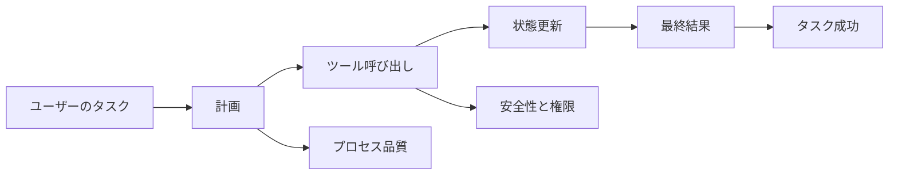

# Agent 評価方法

:::tip この節の位置づけ
Agent の評価は、最終回答がそれっぽいかどうかだけでは不十分です。Agent は計画を立て、ツールを呼び出し、状態を変えるシステムなので、評価では結果・プロセス・安全性・コストを同時に見る必要があります。
:::

## 学習目標

- Agent 評価と通常の LLM 評価の違いを理解する
- タスク成功率、ツール呼び出し、プロセス品質の指標を設計できるようになる
- 評価用のリプレイサンプルを構築する方法を知る
- 評価結果を次の Prompt、ツール、フロー改善に活かせるようになる

---

## 一、なぜ Agent の評価はより複雑なのか

普通の QA システムは主に答えが正しいかを見るだけですが、Agent は答えを得るまでに何をしたかも見なければなりません。最終的には正解でも、途中で使うべきでないツールを呼んだり、確認を飛ばしたり、コストが高すぎたりすれば、よいシステムとは言えません。



## 二、4層の評価フレームワーク

| レベル | 重要な問い | 指標の例 |
|---|---|---|
| 結果層 | ユーザーの目標は達成できたか | タスク成功率、人的評価、完了度 |
| プロセス層 | 実行経路は妥当か | ステップ数、再試行回数、ループ率、計画品質 |
| ツール層 | ツールは正しく使えたか | ツール選択精度、パラメータエラー率、ツール失敗率 |
| 安全層 | 権限逸脱や暴走はないか | 高リスク確認率、拒否精度、ロールバック適用率 |

実際のプロジェクトでは、最初から全部の指標を完璧にしようとしないでください。まずはタスク成功率、ツール失敗率、人的介入率、平均コストから始めるだけでも、多くの問題を見つけられます。


:::tip 図の見方
この図は、Agent の評価を結果・プロセス・ツール・安全性の 4 層に分けています。初学者はまずこれを最小限の scorecard として使うと、「最終回答がそれっぽいか」だけを見る状態を避けられます。
:::

## 三、評価タスクセットを作る

Agent の評価セットは、理想的な例を少し並べるのではなく、実際のタスクから作るべきです。各サンプルには、ユーザー要求、期待結果、許可されたツール、禁止動作、成功基準、リスクレベルを含めるのがおすすめです。

```json
{
  "task_id": "rag_review_001",
  "user_request": "RAG の復習を手伝って",
  "allowed_tools": ["search_docs", "write_plan"],
  "forbidden_actions": ["delete_file", "send_message"],
  "success_criteria": ["RAG の基礎をカバーしている", "評価方法を含む", "コース文書を引用している"],
  "risk_level": "low"
}
```

## 四、人的評価シート

初期段階で最も実用的なのは人的評価です。1〜5 点で、タスク完了度、プロセスの妥当性、ツール使用、安全境界、表現のわかりやすさを評価できます。

| 観点 | 1 点 | 5 点 |
|---|---|---|
| タスク完了 | 目標から外れている | 目標を完全に満たしている |
| ツール使用 | 選択ミスまたは使い忘れ | ツール選択もパラメータも妥当 |
| プロセス制御 | ループ、冗長、説明不能 | 手順が明確で追跡できる |
| 安全境界 | 権限逸脱または未確認 | 高リスク操作に確認と縮退がある |
| コスト効率 | 明らかに無駄が多い | ステップ数と token が妥当 |

## 五、評価結果を使ってシステムを改善する

評価の目的は点数をつけることではなく、改善につなげることです。ツール選択ミスが多いなら、まずツール説明とルーティング戦略を見直します。計画がよく不完全になるなら、まず Planning Prompt や状態表現を改善します。コストが高すぎるなら、ループ呼び出しやコンテキストが長すぎないか確認します。安全上の問題が多いなら、権限、確認、拒否の戦略を追加します。

## よくある誤解

1つ目の誤解は、成功例だけを測ることです。2つ目の誤解は、最終回答だけを見て実行軌跡を見ないことです。3つ目の誤解は、固定された評価セットがなく、毎回なんとなく判断してしまうことです。4つ目の誤解は、モデル評価とシステム評価を混同し、ツール、状態、権限、コストを見落とすことです。

## 練習

1. 「学習計画 Agent」のために 10 件の評価タスクを設計する。
2. 各タスクに allowed_tools、forbidden_actions、success_criteria を書く。
3. 1〜5 点の採点表で Agent の出力を 1 回評価する。
4. 評価結果をもとに、3 つのシステム改善案を書く。

## 合格基準

この節を学び終えたら、最小限の Agent 評価セットを設計でき、結果層・プロセス層・ツール層・安全層の指標を区別でき、さらに評価で見つけた課題を Prompt、ツール、フロー、権限設計の改善につなげられるようになっているはずです。
