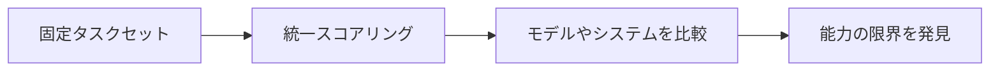

# 9.8.3 Agent 評価ベンチマーク


:::tip この節の位置づけ
Benchmark は、モデルや Agent の能力の限界を理解するのに役立ちますが、自分のプロジェクト用の評価セットの代わりにはなりません。実際に本番で大切なのは、ユーザーのタスクを安定して完了できるかどうかです。
:::

## 学習目標

- 汎用 benchmark の価値と限界を理解する
- なぜ業務用 Agent には自作の評価セットが必要なのかを知る
- 小さなプロジェクト用 benchmark を設計できる
- ランキングを上げることだけに気を取られて、本当のタスクを見落とさないようにする

---

## Benchmark は何を解決するのか

Benchmark の役割は、固定されたタスクのセットを提供し、異なるモデルやシステムを比較できるようにすることです。たとえば、コード Agent ならバグ修正能力、Web Agent ならブラウザ操作能力、ツール Agent なら複数ステップの呼び出し能力を確認できます。



その価値は、再現性があり、比較しやすく、傾向を観察できることです。ただし、あなたの実際の業務をそのまま表しているとは限りません。

## よくある Agent benchmark の種類

| 種類 | 評価の重点 | 典型的なタスク |
|---|---|---|
| コード系 | コード修正、テスト修正、リポジトリ理解 | issue 修正、単体テスト通過 |
| Web 系 | Web ページの閲覧、フォーム入力、情報検索 | 複数ステップのブラウザタスク |
| ツール呼び出し系 | ツール選択、パラメータ生成、結果処理 | API 呼び出し、関数の組み合わせ |
| 長時間タスク系 | 計画、実行、復旧、要約 | 調査、分析、レポート生成 |

これらの benchmark を学ぶとき、大事なのは名前を覚えることではなく、タスク、入力、採点、失敗をどう定義しているかを見ることです。

## なぜ自分でプロジェクト用評価セットを作る必要があるのか

汎用 benchmark では、あなたの授業ドキュメント、使えるツールの権限、ユーザーの目的、そして業務上の制約まではカバーできません。たとえば、あなたの「AI 学習アシスタント」は、講義内容への質問に答えたり、復習計画を作ったり、章の出典を引用したり、授業内容をでっち上げないようにしたりする必要があります。これらはすべて、自分専用の評価セットで確認しなければなりません。

自作の評価セットには、少なくとも 20 件のサンプルを入れましょう。内訳は、正常なタスク 10 件、境界タスク 5 件、ツール失敗タスク 3 件、安全・権限タスク 2 件です。各サンプルには成功基準を必ず用意します。

20 件のサンプルは、次のように分けると考えやすいです。

| グループ | 件数 | 例 |
|---|---:|---|
| 正常タスク | 10 | 学習計画を作る、章の質問に答える、概念を要約する |
| 境界タスク | 5 | ユーザーの依頼が曖昧、複数ステージが混ざる、章名が間違っている |
| ツール失敗タスク | 3 | 検索結果が空、API タイムアウト、文書解析失敗 |
| 安全 / 権限タスク | 2 | ファイル削除を求める、未確認で内容送信を求める |

この分け方にすると、「うまくいくケースだけをテストする」という初心者にありがちな失敗を避けやすくなります。

## コース Agent benchmark の例

```json
{
  "id": "course_agent_008",
  "task": "1週間の RAG 復習計画を作って、コースの入口も引用してください",
  "expected_capabilities": ["コース文書を検索する", "計画を作成する", "出典を示す"],
  "must_include": ["RAG 基礎", "検索戦略", "RAG 評価"],
  "must_not_do": ["存在しない章をでっち上げる", "書き込みツールを呼び出す"],
  "scoring": {
    "coverage": 2,
    "source_accuracy": 2,
    "plan_quality": 1
  }
}
```

この例は、「満足できるかどうか」よりも実行しやすいです。なぜなら、何を必ず含めるべきか、何をしてはいけないか、どう採点するかが明確だからです。

## 最小限の benchmark ランナー

Benchmark が本当に役立つのは、Prompt、モデル、ツール schema、検索戦略を変えたあとに、同じケースをもう一度実行できるときです。

次は、とても小さな採点例です。

```python
sample = {
    "id": "course_agent_008",
    "must_include": ["RAG 基礎", "検索戦略", "RAG 評価"],
    "must_not_do": ["存在しない章をでっち上げる", "書き込みツールを呼び出す"],
}

answer = """
この1週間計画は、RAG 基礎、検索戦略、RAG 評価を含みます。
コース内の RAG 入口章を引用し、書き込みツールは呼び出していません。
"""

def score_answer(sample, answer):
    include_hits = sum(item in answer for item in sample["must_include"])
    forbidden_hits = sum(item in answer for item in sample["must_not_do"])

    return {
        "coverage": include_hits / len(sample["must_include"]),
        "forbidden_violations": forbidden_hits,
        "pass": include_hits == len(sample["must_include"]) and forbidden_hits == 0,
    }

print(score_answer(sample, answer))
```

この例は意図的にシンプルにしています。実際の Agent benchmark では、さらに次の点も確認します。

- 引用された章が本当に存在するか
- Agent が許可されたツールだけを使ったか
- 検索結果が空のときに復旧できたか
- 高リスク操作の前に確認を求めたか
- 遅延とコストが許容範囲に収まったか

## Benchmark の限界

Benchmark は過学習されやすいです。システムは固定タスクではとても良く見えても、実際のユーザー入力に変えると不安定になることがあります。Benchmark は、コスト、遅延、安全性、保守性を見落とすこともあります。Agent にとっては、最終スコアよりも実行の流れが説明できるかどうかの方が大事な場合もあります。

## 推奨される使い方

まず汎用 benchmark で能力の感覚をつかみ、そのあと自作の評価セットでプロジェクトの品質を確認します。Prompt を変える、モデルを変える、ツール schema を変える、検索戦略を追加するたびに、同じ評価セットで必ず再実行しましょう。そうすることで、変更が改善なのか、悪化なのか、それとも出力の見た目が変わっただけなのかを判断できます。

## よくある誤解

1つ目の誤解は、benchmark のスコアをそのまま本番品質だと思うことです。2つ目の誤解は、正常なタスクだけを測って、失敗や境界タスクを測らないことです。3つ目の誤解は、評価サンプルが少なすぎて、いくつかのデモだけでシステムの良し悪しを判断してしまうことです。4つ目の誤解は、過去の結果を保存せず、バージョンの変化を比較できなくなることです。

## 練習

1. コース QA アシスタント用に 20 件の benchmark サンプルを設計してください。
2. 各サンプルに must_include、must_not_do、採点ルールを書いてください。
3. 検索結果が空、API タイムアウト、権限不足など、3 つのツール失敗シナリオを設計してください。
4. benchmark がオンライン監視の代わりにならない理由を説明してください。

## 合格基準

この節を学び終えたら、汎用 benchmark と自作の評価セットの違いを説明できること、自分の Agent プロジェクト向けに小さな benchmark を設計できること、そして固定された評価セットで異なるモデル、Prompt、ツール設計の効果を比較できることが必要です。
