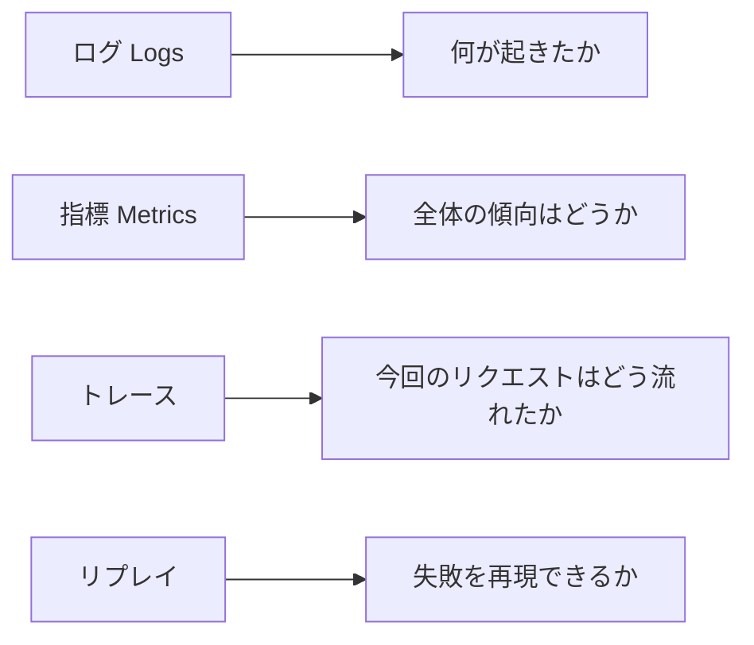
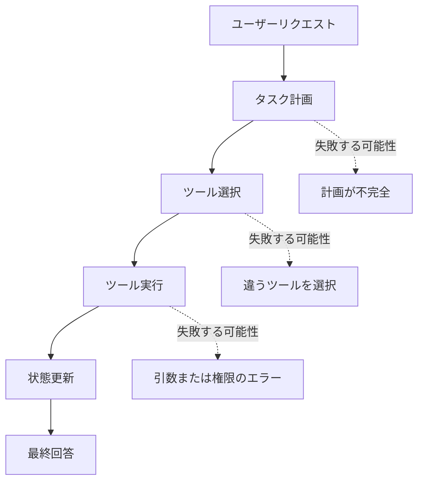

# 9.8.6 Agent の可観測性

:::tip この節の位置づけ
Agent システムに可観測性がないと、多くの問題は「なんとなく変だけど、どの段階がおかしいのかわからない」状態になります。この節の核心は、システム内部の流れを見えるようにし、特定でき、再現できるようにすることです。
:::

## 学習目標

- ログ、指標、トレース、リプレイがそれぞれ何を解決するのか理解する
- なぜ Agent は普通のAPIよりも軌跡レベルの観測が必要なのかを知る
- 最小限の Agent トレーススキーマ を設計できる
- 観測データを使ってツール呼び出し、検索、計画、コストの問題を特定できる

---

## まずは全体マップを作る



普通のAPIなら、たいていはリクエストが成功したか失敗したか、どれくらい時間がかかったか、エラーコードは何かが分かれば十分です。Agent は違います。1回のリクエストの中に、複数回の推論、複数回の検索、複数のツール、状態変更、そして人手による確認が入ることがあります。最終回答だけを保存しても、なぜ答えを間違えたのか、なぜ違うツールを呼んだのか、なぜコストが急に上がったのかをほとんど説明できません。

## なぜ Agent は特に可観測性が必要なのか

Agent の失敗は、1か所だけの失敗ではなく、連鎖的な失敗であることがよくあります。たとえばユーザーが「RAG の復習資料を整理して」と聞いたとします。システムはまずタスクを分解し、次にコース文書を検索し、それから計画を作り、最後にファイル操作ツールを呼ぶかもしれません。最終結果がよくなかった場合、原因はタスク分解の失敗かもしれないし、検索の失敗かもしれないし、ツール引数のミスかもしれないし、コンテキストの欠落かもしれません。あるいは最後の生成時に、モデルが出典を無視した可能性もあります。



だから Agent の可観測性の目的は、「ログをたくさん出すこと」ではありません。1つのタスクの実行軌跡を再構成できるようにすることです。

## 最も重要な4種類の観測対象

ログは「何が起きたか」に答えます。たとえば検索を開始した、ツールを呼んだ、ツールがエラーになった、などです。指標は「全体の傾向はどうか」に答えます。たとえば平均処理時間、成功率、token コスト、ツール失敗率などです。追跡記録は「今回のリクエストは全体としてどう流れたか」に答えます。たとえば各ステップの入力、出力、状態変化です。再現用記録は「失敗を再現できるか」に答えます。つまり、もう一度実行したり、手動で分析したりできるだけの文脈を残すことです。

| 種類 | 注目点 | 典型的なフィールド |
|---|---|---|
| ログ（Logs） | 単一イベント | timestamp、level、event、message |
| 指標（メトリクス） | 集約された傾向 | success_rate、レイテンシ_ms、cost、tool_error_rate |
| 追跡記録 | リクエストの流れ | request_id、ステップ_id、node、input、output、status |
| 再現記録 | 失敗の再現 | 元の入力、検索結果、ツールの返答、モデル設定、最終出力 |

## 最小限の トレース スキーマ

最初に Agent の可観測性を作るとき、いきなり複雑なプラットフォームを導入する必要はありません。まずは、各リクエストに構造化された軌跡を残せるようにしましょう。

```python
from dataclasses import dataclass, asdict


@dataclass
class TraceStep:
    request_id: str
    step_id: int
    node: str
    input_summary: str
    output_summary: str
    status: str
    latency_ms: int
    cost_tokens: int = 0


def run_agent(query):
    request_id = "req_rag_review_001"
    trace = []

    plan = "まずコース文書を検索して、それから復習計画を作る"
    trace.append(TraceStep(request_id, 1, "planner", query, plan, "ok", 0))

    docs = ["RAG には分割、ベクトル化、検索、生成、引用チェックが含まれる"]
    trace.append(TraceStep(request_id, 2, "retriever", "RAG の復習", str(docs), "ok", 0))

    answer = "おすすめの復習順は、基礎概念 -> 検索最適化 -> 評価セット -> プロジェクト振り返り です。"
    trace.append(TraceStep(request_id, 3, "generator", str(docs), answer, "ok", 0, cost_tokens=120))

    return answer, [asdict(step) for step in trace]


answer, trace = run_agent("RAG の段階的な復習準備を手伝って")
print(answer)
for step in trace:
    print(step)
```

実行結果の例：

```text
おすすめの復習順は、基礎概念 -> 検索最適化 -> 評価セット -> プロジェクト振り返り です。
{'request_id': 'req_rag_review_001', 'step_id': 1, 'node': 'planner', 'input_summary': 'RAG の段階的な復習準備を手伝って', 'output_summary': 'まずコース文書を検索して、それから復習計画を作る', 'status': 'ok', 'latency_ms': 0, 'cost_tokens': 0}
{'request_id': 'req_rag_review_001', 'step_id': 2, 'node': 'retriever', 'input_summary': 'RAG の復習', 'output_summary': "['RAG には分割、ベクトル化、検索、生成、引用チェックが含まれる']", 'status': 'ok', 'latency_ms': 0, 'cost_tokens': 0}
{'request_id': 'req_rag_review_001', 'step_id': 3, 'node': 'generator', 'input_summary': "['RAG には分割、ベクトル化、検索、生成、引用チェックが含まれる']", 'output_summary': 'おすすめの復習順は、基礎概念 -> 検索最適化 -> 評価セット -> プロジェクト振り返り です。', 'status': 'ok', 'latency_ms': 0, 'cost_tokens': 120}
```


この例で大事なのは、コードが複雑なことではありません。各ステップを検査できるオブジェクトにしていることです。今後 LangGraph、LlamaIndex、CrewAI を使う場合でも、自分で関数を書く場合でも、土台には同じような軌跡が残っているべきです。

## 問題を調べるときは トレース をどう見るか

Agent の出力品質が低いとき、すぐに Prompt を直さないでください。より安定した調査順は、まず計画が正しいかを見る、次に検索やツールの結果が正しいかを見る、次にモデルがそれらを正しく使ったかを見る、最後に最終表現を見る、という順番です。

| 現象 | まず見る場所 | 考えられる原因 |
|---|---|---|
| 話題がそれる | プランナー / 検索担当 | タスク理解の誤り、検索 クエリ の誤り |
| 出典を作ってしまう | 検索担当 / 生成器 | 文書に当たっていない、生成時に検索結果を参照していない |
| ツールが実行されない | ツール選択 / ツール呼び出し | ツール説明が不明確、権限不足、引数 スキーマ の誤り |
| コストが急に増える | 指標 / トレース | ループ呼び出し、コンテキストが長すぎる、再試行が多すぎる |
| たまに失敗する | 再現サンプル | 入力の境界条件、外部サービスの揺れ、状態の永続化不足 |

## まず記録すべきフィールド

もし最小版から始めるなら、少なくとも次の項目は残すのがおすすめです。request_id、user_query、plan、selected_tools、tool_inputs、tool_outputs、retrieved_docs、final_answer、latency_ms、token_usage、status、error_message。これらがあれば、たいていのデバッグ要件をカバーできます。

高リスクな Agent では、human_approval、permission_scope、rollback_action、audit_log も記録すべきです。メッセージ送信、ファイル変更、データ削除、支払い、メール送信のような動作は、最終結果だけを残してはいけません。

## 既存ツールとの関係

実際のプロジェクトでは、LangSmith、OpenTelemetry、Arize Phoenix、Helicone、またはクラウドベンダーのログシステムを使って観測データを管理できます。このコースでは特定のツールに縛られませんが、これらのツールが共通して解決しているのは同じ問題です。つまり、モデル呼び出し、検索、ツール、状態、コストを、検索可能な実行軌跡としてつなぐことです。

さらに大事なのは、ツールを可観測性のすべてだと思わないことです。プラットフォームを使っていても、イベント名がバラバラだったり、フィールドが不足していたり、request_id が全体を通してつながっていなかったりすると、問題の切り分けはやはり難しくなります。

## 残す証拠

このページを終えたら、この証拠カードを残します。

```text
eval_cases: fixed tasks and expected safe behavior
scorecard: task success, tool correctness, trace quality, safety
guardrail: policy, permission, validation, or human confirmation
failure_check: unsafe tool use, prompt injection, hidden state, or unobserved action
next_action: add case, guardrail, log, rollback, or refusal path
```

## よくある誤解

1つ目の誤解は、最終回答だけを記録すれば十分だと思うことです。最終回答は結果しか示さず、過程は示しません。2つ目の誤解は、自然言語のログだけを出して構造化フィールドを残さないことです。これだと後で集計や絞り込みがしにくくなります。3つ目の誤解は、エラー時だけ記録すればよいと思うことです。成功例も同じくらい重要です。成功と失敗の流れを比較する必要があるからです。4つ目の誤解は、コスト指標を持たないことです。これだとシステムは動いても、長期的には続けられません。

## AI アプリ共通の観測フィールド

この節では Agent が中心ですが、前の LLM、API、Prompt、RAG、ツール呼び出しもすべて観測が必要です。より良い方法は、すべての AI アプリで共通の request_id を使い、レイヤーごとに記録することです。

| レイヤー | 必須フィールド | 何を調べるためか |
|---|---|---|
| LLM 呼び出し層 | model、prompt_version、input_preview、output_preview、tokens、レイテンシ、error | モデル出力、コスト、遅延、形式のずれ |
| Prompt 層 | prompt_version、スキーマ_version、parse_status、validation_error | 構造化出力が安定しているか |
| RAG 層 | クエリ、rewritten_クエリ、top_k、scores、source_ids、コンテキスト_length | 正しい資料を取れているか、コンテキスト が適切か |
| Agent 層 | goal、ステップ、action、arguments、observation、next_decision | なぜその行動を選んだのか、なぜ続けるのか止めるのか |
| ツール層 | tool_name、permission_scope、arguments、result_status、retry_count | ツール選択が正しいか、引数が正しいか、失敗したか |
| 安全層 | risk_level、human_approval、blocked_reason、rollback_action | 高リスクな動作が確認・監査されているか |

この表は、すべての AI プロジェクトのログ設計の出発点として使えます。あとで問題が起きてからログを足そうとしないでください。request_id と構造化フィールドがないと、後から1回の失敗をつなぎ直すのがとても難しくなります。


:::tip 図の読み方
この図を見るときは、request_id を1本の線として捉えてください。1回のユーザーリクエストは、プランナー、検索担当、ツール、LLM、安全層など複数の span を通ります。流れをつなげて見られて初めて、推測ではなく実際の流れで問題を特定できます。
:::

## 1回のリクエストにおけるクロスレイヤー トレース の例

以下は「学習アシスタント」のクロスレイヤー trace です。RAG、LLM、Agent のツール層をまたいでいます。

```json
{
  "request_id": "req_001",
  "user_query": "RAG の3日間復習計画を作って",
  "rag": {
    "query": "RAG 3日間復習計画",
    "top_k": 3,
    "source_ids": ["rag-basics", "retrieval-strategies", "rag-evaluation"],
    "context_length": 820
  },
  "llm": {
    "model": "demo-chat-model",
    "prompt_version": "study_plan_v2",
    "prompt_tokens": 520,
    "completion_tokens": 180,
    "latency_ms": 1200,
    "parse_status": "ok"
  },
  "agent": {
    "steps": [
      {"step": 1, "action": "retrieve_course_docs", "status": "ok"},
      {"step": 2, "action": "build_study_plan", "status": "ok"}
    ],
    "final_status": "ok"
  }
}
```

この例で特に大事なのは、全部のログを1つの文字列に混ぜていないことです。レイヤーごとに記録しているので、答えがよくないときに、RAG が正しい資料を取れていないのか、Prompt の制約が弱いのか、LLM の出力が不安定なのか、Agent の手順に問題があるのかを切り分けられます。

## 観測データを作品集にどう載せるか

作品集では、生ログを全部見せる必要はありません。ただし、ログをどう使ってシステムを改善したかは示すべきです。

| README の項目 | 見せられる内容 |
|---|---|
| デバッグログの例 | 1回の成功リクエストと1回の失敗リクエストの トレース 要約 |
| 指標ダッシュボード | 平均遅延、失敗率、token コスト、検索ヒット率 |
| 失敗の原因分析 | 失敗サンプルを LLM、RAG、Agent、ツール、安全層に対応づける |
| 改善記録 | 変更前後の指標の変化とコスト |
| 安全監査 | 高リスク動作をどう確認し、拒否し、記録したか |

これがあると、プロジェクトはより成熟して見えます。機能を作れるだけでなく、それを観測し、評価し、説明し、継続的に改善できることが伝わるからです。

## 最小ログファイル設計

まだ専門的な観測プラットフォームを入れていないなら、まずは JSONL ファイルで記録するとよいです。1行ごとに1つのイベント、または1つの trace を書きます。

```text
logs/
├── llm_calls.jsonl
├── retrieval_logs.jsonl
├── agent_traces.jsonl
├── tool_calls.jsonl
└── safety_audit.jsonl
```

各ファイルには request_id を必ず入れてください。そうすると、同じ request_id を使って、1回のユーザーリクエストをモデル呼び出し、検索、ツール実行、安全確認まで一気につなげられます。

期待される結果：request_id で LLM、検索、tool、safety のログをつなげ、失敗がどの層で起きたかを trace から説明できる状態です。

---

## 練習

1. 上の トレース 例に `error_message` と `retry_count` のフィールドを追加してください。
2. RAG Agent の トレース スキーマ を設計し、少なくとも検索 クエリ、ヒットした文書、引用チェック結果を含めてください。
3. 以前書いた LLM の例を1つ選び、request_id と レイテンシ_ms を追加してください。
4. 考えてみましょう。もし Agent がファイルを削除できるなら、トレース にはどんな安全フィールドを追加で記録する必要がありますか？

## 合格基準

この節を学び終えたら、ログ、指標、trace、replay の違いを説明でき、最小限の Agent trace schema を書けて、trace を見てエラーが計画、検索、ツール、生成のどこで起きたか判断でき、可観測性を自分の Agent プロジェクトの README に書き込めるようになっているはずです。

<details>
<summary>参考解答と解説</summary>

1. step が失敗したら `error_message` を追加し、同じ logical step を再試行するたびに `retry_count` を増やします。この 2 つは console log だけでなく trace row に残します。
2. RAG Agent trace には request_id、retrieval_query、filters、matched_doc_ids、scores、selected_context、citation_check、generation_status、latency_ms、refusal / fallback reason を入れます。
3. LLM call では開始時に `request_id` を付け、実際の model request の前後で `latency_ms` を記録します。logs、metrics、traces、evaluation notes で同じ id を使います。
4. Agent が file deletion できるなら、target path、permission scope、dry-run result、human approval、backup/checkpoint id、deletion result、rollback status、許可/拒否した policy を記録します。

</details>
