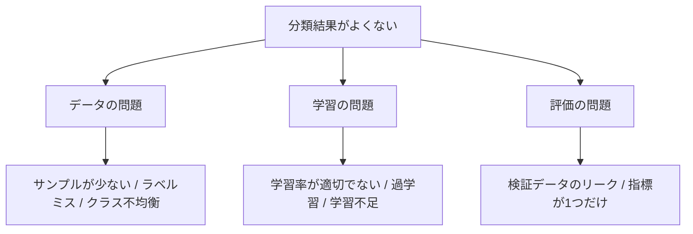

# 画像分類の学習テクニック

:::tip この節の位置づけ
画像分類のプロジェクトは、モデルを変えればすぐにうまくいくわけではありません。多くの場合、実際に結果を左右するのは学習の細かい部分です。たとえば、データ拡張が適切か、学習率が安定しているか、検証用データが信頼できるか、エラーサンプルを分析しているか、などです。
:::

## 学習目標

- 学習が収束しない、過学習する、学習不足になる、といったよくある原因を判断できる
- 学習率、batch size、データ拡張、正則化の役割を理解する
- クラス不均衡やデータリークが分類結果にどう影響するかを知る
- エラーサンプルの分析を次の改善につなげられる

---

## まずは学習問題の全体図を見る



## 一、学習率は最初に確認するつまみ

学習率が大きすぎると、loss が上下に振れたり、発散したりすることがあります。逆に学習率が小さすぎると、学習がとても遅くなり、モデルが何も学べていないように見えます。初心者のうちは、まずよくあるデフォルト値から始めて、学習曲線を観察するとよいです。

```python
optimizer = torch.optim.Adam(model.parameters(), lr=1e-3)
scheduler = torch.optim.lr_scheduler.StepLR(optimizer, step_size=5, gamma=0.1)
```

学習 loss も検証 loss も高い場合は、学習不足か学習率が合っていない可能性があります。学習 loss が低いのに検証 loss が高い場合は、たいてい過学習か、データ分割に問題があります。

## 二、データ拡張は実際の場面に合わせる

データ拡張は、多ければ多いほどよいわけではありません。現実世界で起こりうる変化をうまく再現することが大切です。猫と犬の分類なら左右反転は使えますが、数字認識で 180 度回転を自由に行うと意味が変わることがあります。医療画像でも、撮影のルールに合わない拡張は避けるべきです。

```python
from torchvision import transforms

train_tfms = transforms.Compose([
    transforms.RandomResizedCrop(224),
    transforms.RandomHorizontalFlip(),
    transforms.ColorJitter(brightness=0.2, contrast=0.2),
    transforms.ToTensor(),
])
```

拡張の基本原則は、学習用データだけに拡張を使い、検証用データにはランダム拡張を使わないことです。また、拡張後もラベルの意味が保たれている必要があります。さらに、拡張した画像は数枚でもよいので、手で確認すると安心です。

## 三、過学習と学習不足の見分け方

| 現象 | 可能な原因 | 優先して行う対応 |
|---|---|---|
| 学習も検証も悪い | モデルが弱い、学習不足、学習率の問題 | 学習回数を増やす、学習率を調整する、backbone を変える |
| 学習は良いが検証が悪い | 過学習、データ不足、拡張不足 | 拡張を強くする、正則化、早期終了、データ追加 |
| 学習が大きく揺れる | batch が小さすぎる、学習率が大きい | 学習率を下げる、batch を増やす、データを確認する |
| 検証スコアが異常に高い | データリーク | 重複画像や、同じ対象が両方の集合に入っていないか確認する |


:::tip 図の見方
この図は、学習の問題を「データ」「学習」「評価」の3つに分けています。分類結果がよくないときは、すぐにモデルを変えるのではなく、まず loss 曲線、検証データのリーク、クラス不均衡、エラーサンプルを確認しましょう。
:::

## 四、クラス不均衡は混同行列で見る

クラス不均衡があると、accuracy は簡単にだまされます。たとえば、95% の画像が正常サンプルなら、モデルがすべて正常と予測するだけで 95% の accuracy が出ます。しかし、そのモデルは異常をまったく識別できません。

```python
from sklearn.metrics import classification_report, confusion_matrix

print(classification_report(y_true, y_pred))
print(confusion_matrix(y_true, y_pred))
```

クラス不均衡への対策としては、再サンプリング、class weight、focal loss、少数クラスのデータ追加などが考えられます。どの方法を選ぶかは、少数クラスのサンプルがどれだけ信頼できるかによって変わります。

## 五、エラーサンプルの分析

学習のたびに、少なくとも 20 個のエラーサンプルを確認しましょう。それらをいくつかの種類に分けます。たとえば、ラベルミス、画像品質が悪い、クラスの境界があいまい、モデルが見ている場所がずれている、学習データに似たサンプルが少なすぎる、などです。エラーサンプルの分析は、むやみにモデルを変えるよりも、次の改善につながります。

## 六、最小限の学習記録テンプレート

README や実験記録には、次の項目を残しておくとよいです。データセットのバージョン、学習/検証の分け方、モデル構造、入力サイズ、拡張方法、学習率、batch size、epoch、最良の指標、混同行列、エラーサンプルの画像、次の予定です。

## よくある誤解

1つ目の誤解は、accuracy だけを見てクラスごとの指標を見ないことです。2つ目の誤解は、検証用データにもランダム拡張を使ってしまうことです。3つ目の誤解は、同じ対象や同じ動画フレームが学習と検証の両方に入ってしまい、リークが起きることです。4つ目の誤解は、結果が悪いとすぐにモデルを変えてしまい、先にデータや学習曲線を確認しないことです。

## 練習

1. 小さな分類モデルを学習させ、train loss と val loss の曲線を描いてみましょう。
2. 同じモデルに対して、弱い拡張と強い拡張をそれぞれ使い、検証結果を比較しましょう。
3. 混同行列を出力して、もっとも混同しやすい 2 つのクラスを見つけましょう。
4. エラーサンプルを 10 枚整理し、それぞれに「原因の候補」を 1 文ずつ書きましょう。

## 合格基準

この節を学んだ後は、学習曲線からよくある問題を判断できること、適切なデータ拡張を設計できること、混同行列でクラスの問題を分析できること、そしてエラーサンプル分析を画像分類プロジェクトの README に書けることが目標です。
